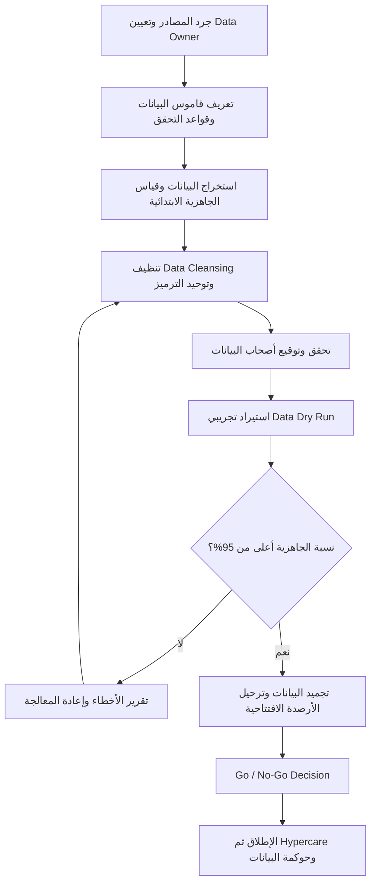

# البيانات الأساسية (Master Data)

> [!info] تعريف مختصر
> البيانات الأساسية (Master Data) هي البيانات المرجعية الثابتة نسبيًّا التي تعتمد عليها كل المعاملات في النظام: العملاء، الأصناف، الموردون، شجرة الحسابات، الموظفون، الفروع، ووحدات القياس. لا تصف حدثًا وقع، بل تصف **الكيانات** التي تقع عليها الأحداث. وهي — عمليًّا — أخطر مسار في مشاريع `ERP`، إذ تُنسَب نسبة كبيرة من مشاكل الإطلاق (تُقدَّر في الممارسة بنحو 70%) إلى جودة البيانات لا إلى النظام نفسه.

## الشرح العلمي والاحترافي
- **التمييز الثلاثي الذي يجب ألّا يختلط أبدًا**:
  - **البيانات الأساسية (`Master Data`)**: كيانات مستقرّة تُستخدم مرارًا — "العميل: مؤسسة النخبة التجارية"، "الصنف: كابل شبكة CAT6 بطول 3م"، "الحساب: 4101 مبيعات محلية". تتغيّر ببطء وتُعمَّر لسنوات.
  - **بيانات المعاملات (`Transactional Data`)**: أحداث لها تاريخ ومبلغ وطرف — فاتورة مبيعات، أمر شراء، سند صرف، حركة مخزون. تُنشأ يوميًّا بكثافة وتشير دائمًا إلى بيانات أساسية. **كل معاملة خاطئة تقريبًا يمكن تتبّعها إلى بيان أساسي خاطئ**: صنف بوحدة قياس غلط ينتج عنه مخزون غلط، فتكلفة غلط، فربحية غلط.
  - **الأرصدة الافتتاحية (`Opening Balances`)**: لقطة رقمية لحظة الانتقال — رصيد كل حساب، وكمّية كل صنف في كل مستودع، وأعمار الذمم. ليست بيانات أساسية ولا معاملات جارية، بل **نتيجة إغلاق** تُرحَّل مرّة واحدة، وتحتاج مطابقة (`Reconciliation`) مع النظام القديم بالريال والوحدة. الخلط الشائع: اعتبار الأرصدة الافتتاحية جزءًا من "ترحيل البيانات" العام، فتُنقَل قبل اكتمال الإغلاق المحاسبي فتُصبح بلا قيمة.
- **لماذا هي أخطر مسار في مشاريع `ERP`**: النظام يعمل بمنطق صارم لا يتسامح مع الغموض الذي كان `Excel` يبتلعه بصمت. اسم عميل مكتوب بثلاث صيغ لم يكن مشكلة في جدول يدوي، لكنه في `ERP` ينتج ثلاثة حسابات ذمم، وثلاثة أرصدة، وثلاثة كشوف حساب متضاربة. كذلك البيانات هي المسار الوحيد الذي **لا يستطيع فريق التنفيذ إنجازه نيابة عن العميل**، لأن أحدًا خارج المؤسسة لا يعرف أن "العميل 3345" و"مؤسسة النخبة" هما الجهة نفسها.
- **المشاكل النمطية المتكرّرة**:
  - **تكرار العميل بأسماء مختلفة** ("النخبة التجارية"، "مؤسسة النخبة"، "Al-Nokhba Est.") فتتشتّت الذمم ويستحيل تقييم الائتمان.
  - **أصناف بلا وحدات قياس** أو بوحدات متضاربة (كرتون/حبّة/علبة) دون معامل تحويل، فتنهار حسابات المخزون والتكلفة.
  - **حقول إلزامية فارغة**: عميل بلا رقم ضريبي، صنف بلا تصنيف محاسبي، مورّد بلا شروط سداد — كلّها توقف الترحيل أو تُنتج قيودًا معلّقة.
  - **ترميز غير موحّد بين الفروع**: الفرع الشمالي يرمّز الصنف `EL-2201` والجنوبي `2201EL`، فيستحيل تجميع تقرير موحّد.
  - **بيانات ميّتة**: عملاء لم يتعاملوا منذ 6 سنوات، وأصناف متوقّفة، تُنقل بلا فائدة فتضخّم النظام وتُبطئ البحث.
  - **حقول محشوّة بمعلومات خارج غرضها** (`Field Abuse`): كتابة رقم الجوال داخل خانة العنوان، وهي أشدّ أنواع الفوضى مقاومة للتنظيف الآلي.
- **دورة العمل على البيانات الأساسية** (`Data Migration Cycle`):
  1. **الاستخراج** (`Extraction`) من النظام القديم وملفات `Excel` والمصادر الظليلة (جداول شخصية لدى الموظفين).
  2. **التنظيف** (`Data Cleansing`): إزالة التكرار، وحذف الميّت، وملء الناقص، وتصحيح المتناقض.
  3. **توحيد الترميز** (`Standardization`): بنية ترميز واحدة للأصناف والعملاء، ووحدات قياس معياريّة بمعاملات تحويل، وشجرة حسابات موحّدة.
  4. **التحقق مع أصحاب البيانات** (`Validation`): مالك كل مجال يوقّع على صحّة بياناته — لا يُقبَل تحقّق بالمراسلة الجماعية.
  5. **الاستيراد التجريبي** ([[Data Dry Run]]): تحميل فعلي في بيئة اختبار، وقياس نسبة السجلات المرفوضة وأسباب الرفض، ثم التكرار.
  6. **قياس نسبة الجاهزية** (`Data Readiness %`) لكل مجال بهدف **> 95%** قبل الإطلاق، مع تعريف مكتوب لما تعنيه "الجاهزية" (اكتمال الحقول الإلزامية + خلوّ من التكرار + اجتياز قواعد التحقق).
- **الملكية (`Data Ownership`)**: لكل مجال بيانات **مالك مُسمّى** (`Data Owner`) — مدير الائتمان يملك بيانات العملاء، مدير المستودع يملك الأصناف، المدير المالي يملك شجرة الحسابات. المبدأ الحاسم: **التنظيف مسؤولية العميل، والدعم الفنّي والأدوات والقوالب وقواعد التحقق مسؤوليتك**. أي فريق تنفيذ يقبل تحمّل التنظيف نيابة عن العميل يشتري لنفسه مسؤولية أخطاء لا يملك معرفتها. ويجب أن يكون هذا التقسيم مكتوبًا في العقد و[[RACI]] لا مفهومًا ضمنًا.
- **الارتباط بقرار الإطلاق**: جاهزية البيانات معيار صريح ضمن [[Go or No-Go Decision]] وليست بندًا "سنلحقه بعد الإطلاق". نظام يعمل ببيانات فاسدة أسوأ من نظام لم يُطلَق، لأنه ينتج تقارير خاطئة يثق بها الناس. ويُوصى بإدراج مخاطر البيانات صراحةً في [[RAID Log]] منذ الأسبوع الأول، لا في الشهر الأخير.
- **مفهوم [[Single Source of Truth]]**: الهدف النهائي أن يكون لكل كيان سجلّ واحد معتمد يشير إليه الجميع، ومنه يستمدّ كل تقرير أرقامه. وهذا يستمرّ بعد الإطلاق عبر **حوكمة البيانات**: من يحقّ له إنشاء عميل جديد؟ ومن يعتمده؟ — وإلا عادت الفوضى خلال أشهر.

## أين ومتى يُستخدم
- **مبكّرًا جدًّا في مشاريع `ERP`**: يجب أن يبدأ مسار البيانات مع مرحلة التحليل لا بعد اكتمال التهيئة. تأجيله إلى الربع الأخير هو السبب الأكثر تكرارًا لتأجيل الإطلاق.
- **عند دمج الشركات أو توحيد الفروع**: توحيد شجرة الحسابات وترميز الأصناف شرط لأي تقرير موحّد.
- **في مشاريع التقارير وذكاء الأعمال (`BI`)**: لوحات القياس لا تُصلح بيانات فاسدة، بل تضخّمها وتمنحها مظهرًا موثوقًا.
- **عند تصميم النموذج البياني** ([[ERD]]): تعريف الكيانات الأساسية وعلاقاتها هو نقطة الالتقاء بين تصميم قاعدة البيانات وواقع بيانات العميل.
- **في التوثيق التقني**: قواعد الترميز وقواميس البيانات تُدار كشيفرة ضمن نهج [[Docs as Code]] لتبقى نسخة واحدة محدَّثة.
- **بعد الإطلاق مباشرة**: خلال [[Hypercare]]، أغلب البلاغات المصنَّفة "عطل في النظام" تكون في الحقيقة بيانات ناقصة أو خاطئة.

## مثال وسيناريو تطبيقي
> [!example] شركة تجارية بـ 4 فروع تنتقل إلى `ERP`. الاستخراج الأوّلي أعطى: 12,400 سجلّ عميل، و31,700 صنف، و860 مورّدًا.
> **نتيجة التحليل الأوّلي**: 3,100 عميل مكرّر (25%)، و4,700 عميل بلا أي معاملة منذ 5 سنوات؛ 6,900 صنف بلا وحدة قياس أو بمعامل تحويل مفقود (22%)؛ 1,450 صنفًا بلا تصنيف محاسبي؛ وترميزان مختلفان للصنف نفسه بين الفرعين الشمالي والجنوبي. نسبة الجاهزية المبدئية: **العملاء 61%، الأصناف 54%، الموردون 78%**.
> **العمل المنفَّذ خلال 7 أسابيع**: دمج المكرّرات بقاعدة مطابقة (الرقم الضريبي أولًا، ثم الاسم المُطبَّع + الجوال)؛ أرشفة 4,700 عميل خامل بدل حذفهم؛ فرض وحدة قياس أساسية لكل صنف مع معاملات تحويل موثّقة؛ توحيد الترميز على بنية واحدة (فئة–فئة فرعية–تسلسل) مع جدول تحويل من الرموز القديمة؛ وتوقيع مالكي البيانات الثلاثة على العيّنات.
> **[[Data Dry Run]] الأول**: رُفض 18% من السجلات (حقول إلزامية فارغة أساسًا). بعد المعالجة، **الجولة الثانية**: نسبة الرفض 3.4%. **الجولة الثالثة**: 0.9%، ونسب الجاهزية: العملاء 97%، الأصناف 96%، الموردون 99%.
> **الأثر على قرار الإطلاق**: عُرضت الأرقام على [[Steering Committee]] كمعيار صريح في [[Go or No-Go Decision]] ("لا إطلاق تحت 95% في أي مجال"). ولأن المعيار تحقّق، تمّ الإطلاق في موعده، وانخفضت بلاغات [[Hypercare]] المتعلّقة بالبيانات إلى 11% من إجمالي البلاغات بدل المعدّل المعتاد الذي يتجاوز 50% في المشاريع المشابهة.

## خطوات أو مخطّط
1. **جرد المصادر**: النظام القديم + ملفات `Excel` + الجداول الظليلة لدى الموظفين، مع تحديد المصدر المعتمد لكل مجال.
2. **تعيين `Data Owner` لكل مجال** بالاسم، وتوثيقه في [[RACI]].
3. **تعريف قاموس البيانات وقواعد التحقق**: الحقول الإلزامية، الصيغ المقبولة، قواعد الترميز، معاملات التحويل.
4. **الاستخراج وقياس خطّ الأساس** ([[Baseline]]): نسبة الجاهزية الابتدائية لكل مجال بالأرقام.
5. **التنظيف والتوحيد** بمسؤولية العميل وبقوالب وأدوات تحقّق تقدّمها أنت.
6. **التحقق والتوقيع**: مراجعة عيّنات مع مالك كل مجال وتوقيع رسمي على النتيجة.
7. **[[Data Dry Run]] متكرّر** (3 جولات على الأقل) مع تقرير أخطاء بعد كل جولة.
8. **قياس نسبة الجاهزية أسبوعيًّا** وعرضها في تقرير الحالة، بهدف > 95%.
9. **ترحيل الأرصدة الافتتاحية** بعد الإغلاق المحاسبي، ومطابقتها بالريال مع النظام القديم.
10. **تثبيت حوكمة البيانات بعد الإطلاق**: من يُنشئ، من يعتمد، ومراجعة دورية للتكرار.

## ⚠️ مفاهيم خاطئة شائعة
> [!warning]
> - **"ترحيل البيانات مهمّة تقنية ننجزها في أسبوع قبل الإطلاق"**: الترحيل تقني، أمّا التنظيف فقرار عمل يستغرق أسابيع ويحتاج معرفة لا يملكها إلا موظفو العميل.
> - **"ننقل كل شيء احتياطًا"**: نقل 6 سنوات من البيانات الميّتة يضخّم النظام ويُبطئه ويخلق ضجيجًا دائمًا. الأصل: أرشفة ما لا يُستخدم، لا ترحيله.
> - **الخلط بين الأرصدة الافتتاحية والبيانات الأساسية**: الأولى نتيجة إغلاق محاسبي بتوقيت محدّد، والثانية كيانات دائمة. اختلاطهما يُنتج أرصدة لا تطابق النظام القديم.
> - **"النظام سيصحّح البيانات"**: النظام يفرض قواعد ويرفض المخالف، لكنه لا يعرف أي السجلّين هو العميل الحقيقي. القرار بشري دائمًا.
> - **"جودة البيانات مشكلة تُحلّ مرّة واحدة"**: بلا حوكمة بعد الإطلاق، يعود التكرار خلال 6–12 شهرًا. الجودة حالة تُصان لا حدث يُنجَز.
> - **"نسبة جاهزية 90% كافية"**: 10% من 30,000 صنف = 3,000 صنف معطوب يظهر أثره يوميًّا في المخزون والتكلفة.

## ❌ ممارسات خاطئة في المشاريع
> [!failure]
> - **تأجيل مسار البيانات إلى نهاية المشروع**: يبدأ العمل الجادّ قبل الإطلاق بأسابيع فتتكشّف الفوضى في أسوأ توقيت. **الحل**: بدء الاستخراج والتحليل الأوّلي في مرحلة التحليل، وإدراج نسبة الجاهزية كمؤشّر أسبوعي منذ الشهر الأول.
> - **تحمّل فريق التنفيذ مسؤولية التنظيف نيابة عن العميل**: يتحوّل المورّد إلى مُتَّهم بأي خطأ في بيانات لا يعرف واقعها. **الحل**: نصّ عقدي وRACI صريح — التنظيف على العميل، والأدوات وقواعد التحقق والدعم عليك، مع محاضر توقيع لكل مجال.
> - **غياب مالك بيانات مُسمّى**: تُرسَل الملفات إلى "قسم المبيعات" فلا يردّ أحد، ويستمرّ الانتظار أسابيع. **الحل**: مالك واحد بالاسم لكل مجال، ملتزم بمهلة محدّدة، ويُصعَّد تأخّره إلى [[Sponsor]].
> - **الاكتفاء بجولة استيراد تجريبي واحدة**: الجولة الأولى تكشف المشاكل ولا تحلّها، والانتقال المباشر للإطلاق بعدها مقامرة. **الحل**: ثلاث جولات على الأقل، مع تقرير أخطاء مصنَّف بعد كل جولة واتجاه تحسّن مُثبَت.
> - **عدم تجميد البيانات قبل النقل النهائي** (`Data Freeze`): يستمرّ الإدخال في النظام القديم أثناء الترحيل فتفقد الأرصدة تطابقها. **الحل**: نافذة تجميد معلنة ومتّفق عليها مع الأقسام، ومطابقة نهائية بعد النقل.
> - **قياس التقدّم بعدد السجلات المنقولة لا بجودتها**: "نقلنا 31,700 صنف" لا تعني شيئًا إن كان ربعها بلا وحدة قياس. **الحل**: قياس نسبة الجاهزية وفق قواعد تحقق مكتوبة، وعرضها مفصّلة لكل مجال.
> - **الإطلاق رغم انخفاض جاهزية البيانات بحجّة "نُصلحها لاحقًا"**: تتضاعف الكلفة لأن الأخطاء تتوالد في المعاملات الجديدة. **الحل**: جعل عتبة الجاهزية (> 95%) معيارًا مُلزِمًا في [[Go or No-Go Decision]] معتمدًا من لجنة التوجيه مسبقًا.
> - **إهمال حوكمة البيانات بعد الإطلاق**: يُسمح لكل مستخدم بإنشاء عميل أو صنف دون اعتماد. **الحل**: مسار اعتماد لإنشاء السجلات الأساسية، وتقرير تكرار دوري شهري ضمن مسؤوليات `Data Owner`.

## 🔗 مصطلحات ومفاهيم ذات صلة
[[Data Dry Run]] | [[Single Source of Truth]] | [[Go or No-Go Decision]] | [[Hypercare]] | [[RAID Log]] | [[ERD]] | [[Docs as Code]] | [[Baseline]]
