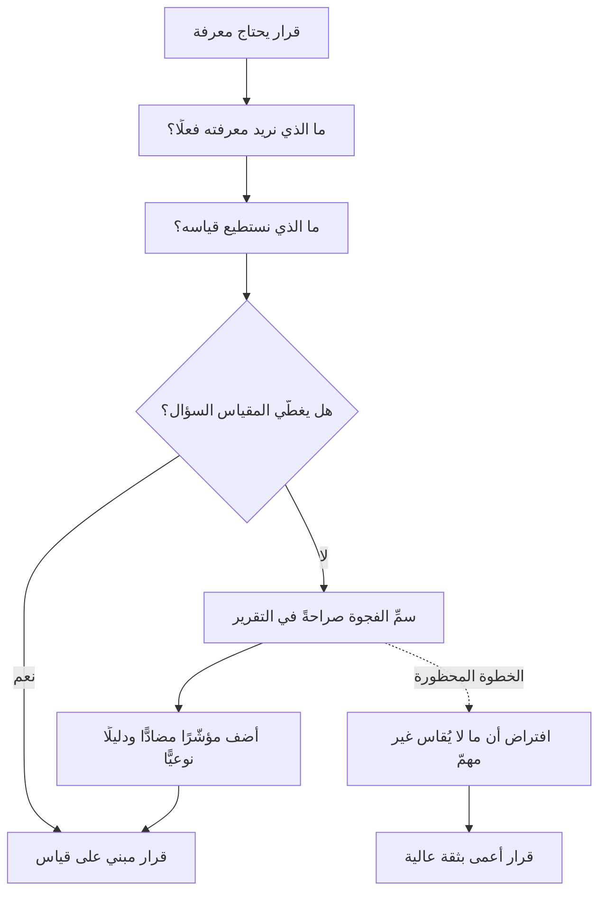

# المغالطة الكمّية (McNamara Fallacy)

> [!info] تعريف مختصر
> **المغالطة الكمّية** أن يُتّخذ القرار بناءً على ما يُقاس بسهولة وحده، ثم يُهمَل ما يصعب قياسه، ثم يُفترض أنّ ما لا يُقاس ليس مهمًّا، ثم يُنتهى إلى أنّه لا وجود له أصلًا. وهي ليست خطأً في الحساب بل **انزلاقًا في أربع خطوات**، كلٌّ منها معقولة وحدها والمجموع كارثة. وسمّيت بهذا الاسم لارتباطها بنمط قرارٍ اعتمد على مؤشّر كمّيّ واحد بوصفه دليل التقدّم، بينما كان ما يقرّر النتيجة فعلًا خارج ذلك المؤشّر كلّه.

## الشرح العلمي والاحترافي

- **الخطوات الأربع**، وهي صياغة عالم الاجتماع **دانيال يانكيلوفيتش** سنة 1972، ثم نشرها **تشارلز هاندي** في *The Empty Raincoat* (1994)، وشاع اقترانها باسم روبرت ماكنمارا وزير الدفاع الأمريكي لأن نمط القرار في حرب فيتنام صار مثالها المتداول:
  1. **قِس ما يسهل قياسه.** وهذه خطوة سليمة نافعة.
  2. **أهمِل ما يصعب قياسه، أو أعطِه قيمة اعتباطية.** وهنا يبدأ الانزلاق.
  3. **افترض أن ما يصعب قياسه ليس مهمًّا.** وهذا انتقال من نقص في الأداة إلى حكم على الواقع.
  4. **قل إن ما لا يُقاس غير موجود.** وهذا العمى التامّ.
- **ما يميّزها عن ضعف القياس العادي:** أن الخطوة الثالثة تحديدًا **تقلب الاستدلال**. فالمنطق السليم أن نقص الأداة يوجب حذرًا أشدّ؛ والمغالطة تجعل نقص الأداة دليلًا على انتفاء الشيء. ولهذا تُصنَّف مغالطة لا مجرّد قصور.
- **لماذا تُصيب المنظّمات الجادّة أكثر من المتراخية؟** لأنها من ثمار الانضباط لا الإهمال: المنظّمة التي تطلب أرقامًا في كل قرار تُهيّئ الشرط الذي تنمو فيه، إذ يُقصى من الطاولة كل من لا يملك رقمًا — ولو كان ما يحمله هو الحقيقة الحاسمة. **وأشدّ ما يُقصى بهذه المغالطة: الجودة، والثقة، والدَّين التقني، وأثر القرار على الناس.**
- **علاقتها بالمقاييس الوسيطة (Proxy Metrics):** أكثر ما نقيسه في المشاريع وسيط عن الشيء المقصود لا الشيء نفسه؛ عدد التذاكر المغلقة وسيط عن التقدّم، وتغطية الاختبارات وسيطة عن الجودة. والمغالطة أن يُنسى أنه وسيط فيُدار الوسيط بدل الأصل — وهنا تلتقي بـ[[Goodhart's Law|قانون غودهارت]]: ذاك يقول إن المقياس يفسد حين يصير هدفًا، وهذه تقول إن **ما لا مقياس له يختفي من القرار أصلًا**. فهما وجها الخلل نفسه: أحدهما يُفسد المقيس، والآخر يُلغي غير المقيس.
- **حدّها المهمّ:** ليست دعوة إلى ترك القياس ولا إلى ترجيح الحدس. القياس أنفع أدوات الإدارة، والمغالطة ليست فيه بل في **جعل حدوده حدودًا للواقع**. والعلاج ليس أقلّ قياسًا بل **تسمية ما لم يُقَس صراحةً** وإبقاؤه على الطاولة.

## أين ومتى يُستخدم

- عند تصميم لوحات المقاييس وتقارير الحالة: أيّ الأمور المهمّة لا يظهر في هذه اللوحة، ولماذا؟
- في قرارات المفاضلة بين الخيارات، حين يُرجَّح خيار لأن له رقمًا ويُستبعَد آخر لأنه يصعب تقديره.
- عند تقييم مبادرات الجودة والدَّين التقني وتحسين تجربة المطوّر، فهي أكثر ما يسقط من الميزانية لغياب رقم مباشر.
- في تقييم المورّدين والعروض، حيث يغلب السعر — وهو الرقم الوحيد المؤكّد — على ما لا يُسعَّر: الالتزام، وجودة التوثيق، وسهولة الخروج من العقد.
- في مراجعة أي مؤشّر صار هدفًا بذاته، بوصفها العدسة المكمّلة لـ[[Goodhart's Law|قانون غودهارت]].

## مثال وسيناريو تطبيقي

> [!example] سيناريو ملموس
> جهة قرّرت أن تقيس أداء فرق التطوير الداخلية بمؤشّر واحد واضح: **عدد الطلبات المغلقة شهريًّا**. والمؤشّر متاح آليًّا من نظام التذاكر، ولا يحتاج جهدًا ولا تفسيرًا، فصار محور التقارير الشهرية كلّها.
> ارتفع الرقم في ستّة أشهر بنسبة ملموسة، وأُعلن التحسّن. وفي الوقت نفسه كانت أمور ثلاثة تسوء بلا أن تظهر في أي تقرير: نسبة الطلبات التي يُعاد فتحها بعد إغلاقها، وزمن انتظار المستفيد من فتح الطلب إلى حلّه فعليًّا، وتراكم إصلاحات بنيوية يؤجّلها الجميع لأنها **لا تُغلق تذكرة**.
> ثم وقع انقطاع في خدمة أساسية استمرّ يومًا كاملًا، وكان سببه إحدى تلك الإصلاحات المؤجّلة. وعند المراجعة، لم يكن أحد قد أخطأ بمقياسه: كل فريق حسّن ما يُقاس به.
> **والعلاج لم يكن إلغاء المؤشّر**، بل إضافة ثلاثة إلى جانبه — نسبة إعادة الفتح، وزمن الانتظار من منظور المستفيد، وحصّة ثابتة معلنة من طاقة الفريق للعمل البنيوي — مع بند دائم في التقرير عنوانه **«ما لم نقسه هذا الربع»**، يُكتب فيه ما يعرفه الفريق ولا يملك له رقمًا.

## خطوات أو مخطّط

1. **اكتب سؤال القرار قبل اختيار المقياس**: ما الذي نريد أن نعرفه؟ ثم اسأل: ما الذي نقيسه فعلًا، وما نسبته من السؤال؟
2. **سمّ ما لا يُقاس صراحةً**: اجعل لكل تقرير بندًا ثابتًا لِما هو مهمّ ولا رقم له. **فالتسمية وحدها تمنع الخطوة الثالثة من المغالطة.**
3. **أضف [[Counter Metric|مؤشّرًا مضادًّا]] لكل مؤشّر رئيسي**: مع السرعة جودةٌ، ومع عدد الإغلاقات نسبةُ إعادة الفتح.
4. **افحص الوساطة**: هل هذا المقياس هو الشيء المقصود أم وسيط عنه؟ وما الفجوة بينهما؟
5. **اقبل الدليل النوعي دليلًا**: ملاحظات المستخدمين، ومقابلات الفريق، وسجلّ الحوادث — واعرضها إلى جانب الأرقام لا بعدها اعتذارًا.
6. **راجع اللوحة دوريًّا بسؤال معكوس**: لو كان الخلل القادم آتيًا من جهة لا تظهر في هذه اللوحة، فمن أين سيأتي؟

## ⚠️ مفاهيم خاطئة شائعة

> [!warning]
> - **الظنّ أنها دعوة إلى ترك القياس**: بالعكس؛ علاجها **قياس أوسع وأصدق**، مع تصريح بحدوده. ومن ترك القياس بحجّتها وقع في خطأ أكبر: قرار بلا دليل أصلًا.
> - **الخلط بينها وبين [[Vanity Metrics|مقاييس الغرور]]**: مقاييس الغرور أرقام تُجمَّل الصورة وتُقاس فعلًا؛ وهذه مغالطة في **ما استُبعد** من الصورة لغياب رقمه. فتلك عن رداءة المقيس، وهذه عن غياب غير المقيس.
> - **الظنّ أنها خطأ المتراخين**: هي أشدّ وقوعًا في المنظّمات المنضبطة التي تشترط رقمًا لكل قرار، لأن الاشتراط نفسه هو ما يُقصي غير المقيس.
> - **الظنّ أن حلّها اختراع مقياس لكل شيء**: قياس ما لا يقبل القياس بمؤشّر ضعيف يُنتج رقمًا مضلّلًا يزيد الثقة ولا يزيد المعرفة — وهو أسوأ من الاعتراف بغياب الرقم.
> - **الظنّ أنها مرادفة لـ[[Goodhart's Law|قانون غودهارت]]**: غودهارت عن **فساد المقياس حين يصير هدفًا**، وهذه عن **اختفاء ما لا مقياس له**. وقد يقعان معًا وقد يقع أحدهما وحده.

## ❌ ممارسات خاطئة في المشاريع

> [!failure]
> - **بناء تقرير الحالة على ما يستخرجه النظام آليًّا فقط**: يُنتج تقريرًا دقيقًا وناقصًا، ويحذف كل ما لا يمرّ عبر أداة. **التجنّب:** بند ثابت لكل تقرير عنوانه «ما لا يظهر في الأرقام».
> - **رفض مبادرات الجودة والدَّين التقني لتعذّر حساب عائدها**: يؤجَّل ما لا رقم له حتى يقع الانهيار، ثم يُدفع ثمنه مرّة واحدة. **التجنّب:** خصّص حصّة ثابتة معلنة من الطاقة لهذا العمل بدل مقارنته بميزات لها أرقام.
> - **ترجيح العرض الأرخص لأن السعر هو المعطى الوحيد الأكيد**: تُهمَل كلفة التشغيل وسهولة الخروج وجودة التوثيق، وهي غالبًا أضعاف الفرق في السعر. **التجنّب:** [[TCO|التكلفة الكلية للملكية]] مع معايير مرجّحة معلنة قبل فتح العروض.
> - **إسقاط ملاحظات المستخدمين النوعية لأنها «انطباعات»**: عشر مقابلات متطابقة دليل أقوى من مؤشّر رضا عائم، وإسقاطها يحذف أوّل إشارة إلى المشكلة. **التجنّب:** اعرض الشواهد النوعية بندًا مستقلًّا في المراجعة، لا حاشيةً على الأرقام.
> - **تقييم الأفراد بما يُستخرَج من الأدوات وحده**: يُهمِل الإرشاد والمراجعة وحلّ الخلافات ورفع مستوى الآخرين — وهي أثمن ما يفعله الأقدم في الفريق ولا يترك أثرًا في أي عدّاد. **التجنّب:** اجعل هذه الأعمال بندًا صريحًا في التقييم يُشهَد له بالأمثلة لا بالأرقام.

## 🔗 مصطلحات ومفاهيم ذات صلة

[[Goodhart's Law]] | [[Vanity Metrics]] | [[Counter Metric]] | [[Correlation vs Causation]] | [[Data Informed vs Data Driven]] | [[Leading and Lagging Indicators]] | [[Technical Debt]] | [[TCO]] | [[22 - Outputs and Outcomes]] | [[KPI]]
