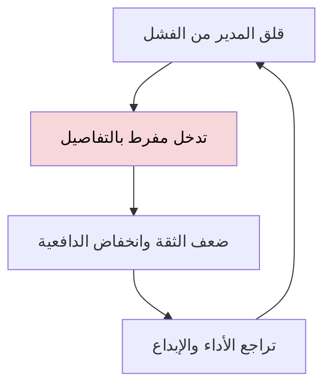

# الإدارة التفصيلية (Micromanagement)
> [!info] تعريف مختصر
> الإدارة التفصيلية هي أسلوب إدارة يتدخل فيه المدير بتفاصيل عمل الفريق بشكل مفرط، فيراقب كل خطوة ويتحكم في كل قرار صغير، مما يقلّص استقلالية الأعضاء ويُضعف ثقتهم بأنفسهم.

## الشرح العلمي والاحترافي
تنشأ الإدارة التفصيلية غالباً من قلق المدير حيال المخاطر أو رغبته في السيطرة على النتائج، أو من عدم ثقته بقدرات فريقه. لكنها تأتي بنتائج عكسية موثّقة في أبحاث الإدارة: تنخفض الدافعية الداخلية، ويقل الإبداع، ويزداد معدل دوران الموظفين (Turnover)، لأن الموظفين يشعرون بأنهم منفّذون لا مساهمون.

كيف تظهر عملياً:
- مطالبة الفريق بتقارير تفصيلية متكررة عن كل مهمة صغيرة.
- إعادة كتابة عمل الأعضاء دون تفويض حقيقي أو نقاش.
- حضور كل اجتماع فرعي والتدخل في كل قرار تقني بسيط.
- عدم تفويض السلطة (Empowerment) حتى للقرارات منخفضة المخاطر.
- التركيز على "كيف" ينجز العمل بدل التركيز على "ماذا" يجب إنجازه.

لماذا يهم في إدارة المشاريع: تتناقض الإدارة التفصيلية جذرياً مع مبادئ الفرق ذاتية التنظيم (Self-Organizing Team) التي تقوم عليها منهجيات رشيقة (Agile)، وتُضعف الأمان النفسي (Psychological Safety) لأن الأعضاء يخافون من اتخاذ أي قرار دون موافقة مسبقة.

## أين ومتى يُستخدم
هذا المصطلح لا يوصف كأسلوب "يُستخدم" بل كخطأ إداري يجب تجنّبه أو تشخيصه، خصوصاً في:
- الفرق الرشيقة (Agile) التي تعتمد على استقلالية القرار اليومي.
- مراحل انتقال المدير من دور تنفيذي مباشر إلى دور قيادة خادمة (Servant Leadership).
- الفرق الموزّعة أو العاملة عن بُعد حيث يزيد القلق الإداري أحياناً بسبب غياب الرؤية المباشرة.

## مثال وسيناريو تطبيقي
> [!example] عيّنت شركة مديراً تقنياً جديداً اسمه عمر لفريق من 7 مطورين. بدل الثقة بخبرتهم، طلب عمر تقريراً كل ساعتين عن التقدّم، وأصرّ على مراجعة كل سطر كود بنفسه قبل الدمج، حتى للتعديلات البسيطة. خلال شهرين، انخفضت سرعة الفريق (Velocity) بنسبة 40%، واستقال اثنان من كبار المطورين بسبب "غياب الثقة". بعد تدخل الإدارة العليا، تلقى عمر تدريباً على القيادة الخادمة (Servant Leadership)، وبدأ بتفويض قرارات المراجعة البرمجية للفريق نفسه، مع الاكتفاء بمتابعة أسبوعية عبر لوحة المهام (Task Boards). خلال شهر، عادت السرعة إلى معدلها الطبيعي.

## خطوات أو مخطّط
خطوات للتعافي من الإدارة التفصيلية:
1. الاعتراف بالسلوك ومصدره (غالباً القلق لا سوء النية).
2. الانتقال من مراقبة "كيف" إلى مراقبة "ماذا" و"متى" فقط.
3. تفويض القرارات التقنية والتشغيلية اليومية للفريق (Empowerment).
4. الاعتماد على أدوات شفافة (لوحة مهام، تقرير حالة أسبوعي) بدل التدخل اليومي المباشر.
5. بناء الثقة تدريجياً عبر تفويض مهام أكبر مع متابعة أقل تكراراً.

## ⚠️ مفاهيم خاطئة شائعة
> [!warning]
> - ليست كل متابعة دقيقة إدارة تفصيلية؛ المتابعة عبر مقاييس شفافة (مثل لوحة كانبان) أمر صحي ومختلف عن التدخل المباشر في كل قرار.
> - لا علاقة لها بحجم الخبرة؛ حتى المدير الخبير جداً قد يقع في الإدارة التفصيلية إن لم يفوّض.
> - ليست حلاً مؤقتاً مقبولاً "في المشاريع الحرجة فقط"؛ فالمشاريع عالية المخاطر تحتاج تواصلاً أكثر لا سيطرة أكثر.

## ❌ ممارسات خاطئة في المشاريع
> [!failure]
> - مطالبة الفريق بتحديثات لحظية عبر رسائل متكررة بدل الاعتماد على أداة شفافة موحدة — الحل: استخدام لوحة مهام (Task Boards) مرئية يراجعها الجميع دون إزعاج يومي.
> - رفض تفويض أي قرار مهما كان صغيراً دون موافقة المدير — الحل: تحديد حدود واضحة (مثل قيمة مالية أو مستوى مخاطرة) لما يحتاج تصعيداً فعلاً.
> - معاقبة الأخطاء الصغيرة بشدة، مما يدفع الفريق للتردد أو إخفاء المشكلات — الحل: بناء أمان نفسي (Psychological Safety) يشجع الشفافية بدل الخوف.

## 🔗 مصطلحات ومفاهيم ذات صلة
[[Theory X and Y]] | [[Command and Control]] | [[One-on-One]] | [[Skip-Level Meeting]] | [[Servant Leadership]] | [[Self-Organizing Team]] | [[Psychological Safety]] | [[Empowerment]] | [[Team Working Agreement]] | [[06 - Scrum Master]] | [[Leadership at Every Level]] | [[Chain of Command]]
