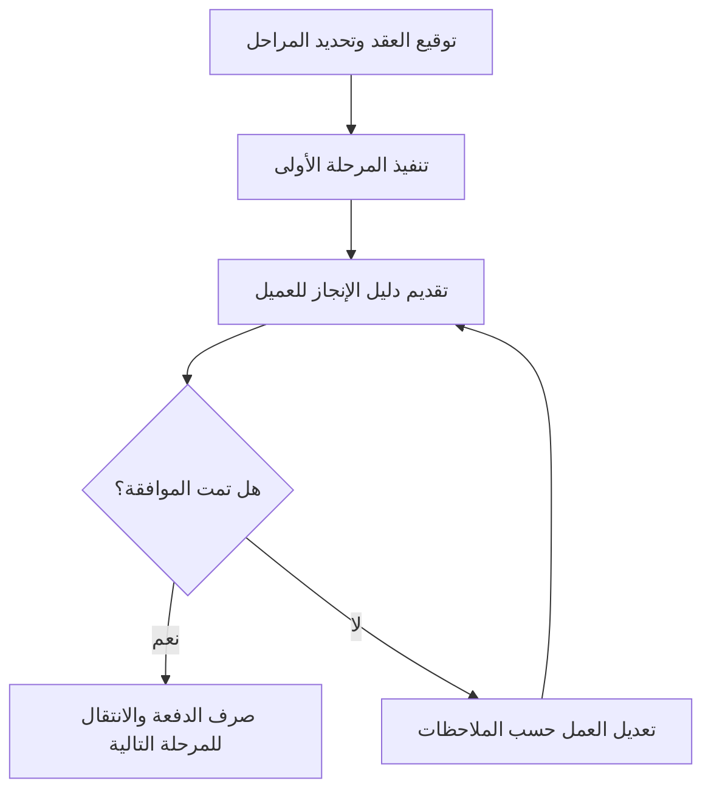

# الدفعة المرتبطة بمرحلة (Milestone-based Payment)
> [!info] تعريف مختصر
> الدفعة المرتبطة بمرحلة هي أسلوب تعاقدي يُدفع فيه للمورد أو الفريق مبلغ محدد عند اكتمال مرحلة فاصلة (Milestone) معينة والتحقق منها، بدلًا من الدفع الشهري الثابت أو الدفعة الواحدة عند النهاية.

## الشرح العلمي والاحترافي
- بدلًا من دفع المبلغ الكامل دفعة واحدة أو حسب الساعات، يُقسَّم المبلغ الإجمالي للعقد على مراحل فاصلة محددة مسبقًا، ويُدفع كل جزء عند إثبات اكتمال المرحلة المقابلة له.
- يتطلب هذا الأسلوب تحديد معايير قبول واضحة (acceptance criteria) لكل مرحلة، وغالبًا موافقة رسمية (Sign-off) من العميل قبل صرف الدفعة.
- يوازن هذا الأسلوب المخاطر بين الطرفين: العميل لا يدفع كامل المبلغ مقدمًا، والمورد يحصل على تدفق نقدي منتظم مرتبط بتقدم فعلي بدلًا من انتظار نهاية المشروع بالكامل.
- يُستخدم غالبًا في العقود ذات السعر الثابت (Fixed Price) أو العقود مع الموردين الخارجيين والمستقلين (freelancers) والوكالات (agencies).
- يرتبط بشكل وثيق بمفهوم الدفعة المجزأة (Split Payment)، لكنه يحدد آلية التقسيم تحديدًا بناءً على الإنجاز الفعلي لا الجدول الزمني فقط.

## أين ومتى يُستخدم
- يُستخدم بكثرة في عقود تطوير البرمجيات الخارجية بين الشركات والوكالات، وفي العقود مع المستقلين على منصات العمل الحر.
- مناسب للمشاريع متوسطة وطويلة المدى حيث يريد العميل ربط الدفع بنتائج ملموسة لتقليل مخاطر الدفع مقابل عمل غير منجز.
- يُستخدم أيضًا في مشاريع البناء والتصنيع، وليس حصرًا في البرمجيات.

## مثال وسيناريو تطبيقي
> [!example]
> وكالة "بكسل" توقّع عقدًا بقيمة 40,000 دولار مع عميل لبناء منصة تعليمية إلكترونية، ويُقسَّم المبلغ على أربع دفعات مرتبطة بمراحل:
> الدفعة الأولى (20%، أي 8,000 دولار) عند اعتماد التصميم (Milestone: اعتماد التصميم).
> الدفعة الثانية (30%) عند تسليم نسخة أولية قابلة للاستخدام (MVP).
> الدفعة الثالثة (30%) عند اجتياز اختبار القبول (UAT) من العميل.
> الدفعة الرابعة (20%) عند الإطلاق الرسمي وتوقيع الاستلام النهائي (Sign-off).
> عند وصول الفريق لمرحلة MVP، يرسل مدير المشروع تقريرًا موثقًا بالإنجاز مع رابط للنسخة التجريبية، ويطلب من العميل توقيع الموافقة قبل إصدار الفاتورة الخاصة بالدفعة الثانية.

## خطوات أو مخطّط
1. تحديد المراحل الفاصلة الرئيسية للمشروع مع العميل قبل توقيع العقد.
2. تحديد نسبة أو مبلغ الدفعة لكل مرحلة ومعايير القبول الخاصة بها.
3. تنفيذ العمل حتى الوصول للمرحلة.
4. تقديم دليل الإنجاز وطلب المراجعة والموافقة من العميل.
5. إصدار الفاتورة وصرف الدفعة بعد التوقيع.
6. الانتقال للمرحلة التالية.

## ⚠️ مفاهيم خاطئة شائعة
> [!warning]
> - الاعتقاد أن الدفعة المرتبطة بمرحلة تعني الدفع حسب الوقت المنقضي فقط؛ في الواقع هي مرتبطة بإنجاز فعلي وموثق، لا بمرور الزمن.
> - الخلط بينها وبين الدفعة المجزأة العادية (Split Payment) التي قد تكون مرتبطة بتواريخ فقط دون معايير إنجاز واضحة.
> - الاعتقاد أن نسب الدفعات يجب أن تكون متساوية دائمًا؛ في الواقع تُحدَّد حسب حجم العمل الفعلي في كل مرحلة.

## ❌ ممارسات خاطئة في المشاريع
> [!failure]
> - تحديد مراحل غامضة بدون معايير قبول واضحة، مما يسبب خلافات حول استحقاق الدفعة. الحل: كتابة معايير قبول محددة وقابلة للقياس لكل مرحلة في العقد.
> - ربط جميع الدفعات بنهاية المشروع فقط، مما يرهق التدفق النقدي للفريق المنفذ. الحل: توزيع الدفعات على مراحل متوسطة منطقية بدل تركيزها في النهاية.
> - عدم توثيق موافقات العميل كتابيًا عند كل مرحلة، مما يصعّب المطالبة بالدفعة لاحقًا عند وجود خلاف. الحل: طلب توقيع أو موافقة كتابية رسمية (Sign-off) قبل إصدار كل فاتورة.

## 🔗 مصطلحات ومفاهيم ذات صلة
[[Milestone]] | [[Split Payment]] | [[Sign-off]] | [[SOW]] | [[Baseline]] | [[Go or No-Go Decision]] | [[UAT]] | [[MVP]]
