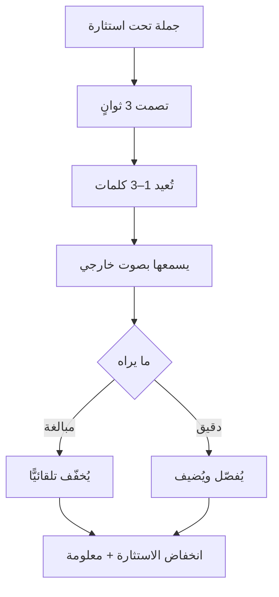

# المرآة (Mirroring)
> [!info] تعريف مختصر
> المرآة هي إعادة كلمة واحدة إلى ثلاث كلمات ممّا قاله الطرف الآخر — إمّا الأخيرة وإمّا الأهمّ — بنبرة مستوية ثم صمت؛ فتُؤدّي وظيفة سؤال «لماذا» بلا حمولته الاتّهامية، وتدفعه إلى التوسّع طوعًا.

## الشرح العلمي والاحترافي
أصل التقنية علاجي: طوّرها **كارل روجرز (Carl Rogers)** في العلاج المتمركز حول العميل (1951) باسم **الإنصات الانعكاسي (Reflective Listening)** لإيصال التقدير غير المشروط. وحوّلها **كريس فوس** إلى أداة تفاوضية بتغيير الغرض والطول:

| | روجرز (علاجي) | فوس (تفاوضي) |
|---|---|---|
| الغرض | أن يشعر بأنّه مسموع | **استخراج معلومة** لقرار |
| الطول | إعادة صياغة كاملة | **1–3 كلمات فقط** |
| من يملك التوجيه | العميل | **أنت** — تختار أيّ كلمات تُعيد |

والاختصار إلى ثلاث كلمات هو ما يُحوّلها من إنصات إلى **استقصاء**: حين تُعيد كلّ ما قاله لا تُوجّه شيئًا؛ وحين تُعيد ثلاث كلمات بعينها فأنت تختار أيّ خيط يُسحَب.

**وثلاث آليات تُفسّر أثرها:** ① **الاستماع الذاتي** — الكلام المُنتَج تحت استثارة يمرّ بمعالجة تقييمية أقلّ، وإعادته من فم آخر تُدخله عبر القناة السمعية فيُعالَج بوصفه مُدخَلًا لا مُخرَجًا؛ ② **إشارة الإنصات** — تكرار كلماته أوضح دليل على أنّك سمعت؛ ③ **الفراغ المُوجَّه** — تفتح موضوعًا محدّدًا ثم تصمت، فيملأ الفراغ في ذلك الموضع تحديدًا. والفرق عن الصمت المجرّد أنّ الصمت يُولّد ضغطًا و**المرآة تُوجّهه**.

**والميكانيكا أربع:** 1–3 كلمات · **ثلاث ثوانٍ** من صمته قبل أن تُمرئ · الجسد والعينان معها · والصمت بعدها.

## أين ومتى يُستخدم
- **حين لا تملك قرينة** تبني عليها [[Labeling|تسمية]] — المرآة لا تفترض شيئًا فهي أرخص خطأً.
- مع رقم أو مدّة أو تعميم قاطع تحتاج إلى تفكيكه («ثلاثة أيّام؟» · «كلّ الكود؟»).
- في سلسلة للوصول إلى السبب الجذري — وهي **الأسباب الخمسة بلا نطق «لماذا»**.
- مع من يُزعجه أن يُوصَف شعوره ويقرؤه تطفّلًا.

## مثال وسيناريو تطبيقي
> [!example] مطوّر يدخل قائلًا: «لا بدّ أن نُغيّر قاعدة البيانات.» — وهو مشروع شهور. بدل الجدال أو الموافقة، ثلاث مرايا متتابعة: «نُغيّر قاعدة البيانات؟» *(صمت)* ← «الاستعلامات بطيئة ولا نستطيع مواصلة العمل هكذا» ← «لا تستطيعون مواصلة العمل؟» *(صمت)* ← «كلّ مرّة نُضيف ميزة نقضي يومًا في ضبط الأداء» ← «يومًا في كلّ ميزة؟» *(صمت)* ← «تقريبًا — خصوصًا في وحدة التقارير، هي التي تُبطئ كلّ شيء.» **بدأنا من مشروع شهور وانتهينا إلى مشكلة أيّام، بثلاث مرايا وبلا سؤال واحد.**

## خطوات أو مخطّط
1. انتظر أن يصمت **ثلاث ثوانٍ** — أطول من فجوة التناوب الطبيعية في الحوار، فتُقرأ إنصاتًا لا انتظارًا لدورك.
2. اختر **الكلمة القابلة للقياس**: رقمًا · تعميمًا («كلّ»، «دائمًا») · حكمًا غير مفسَّر («ضخم»، «انتحار تقني»).
3. أعِدها حرفيًّا — **والتعديل الوحيد المسموح** تحويل ضمير الانقسام إلى جمع: «فريقك» ← «فريقنا».
4. بنبرة مستوية أو نازلة، ووضعية هادئة، ودهشة خفيفة على الوجه.
5. **اصمت.**
6. توقّف عن السلسلة عند أوّل معلومة قابلة للتنفيذ، وانتقل إلى [[Calibrated Questions|سؤال معايَر]] أو بند إجرائي.

## ⚠️ مفاهيم خاطئة شائعة
> [!warning]
> - **«أسهل من التسمية» وصف مضلّل.** أسهل **تحضيرًا** (لا تحتاج تخمين دافع)، وأصعب **تنفيذًا** بكثير لأنّ نجاحها كلّه في النبرة والتوقيت.
> - **ليست بديلًا عن [[Labeling|التسمية]] بل مُكمّلة لها** — المرآة تحتاج كلامًا لإعادته، فلا تعمل على الصامت والمنسحب.
> - **ليست ترديدًا أو تقليدًا.** إعادة كاملة لجملته تلخيص، وإعادة نبرته محاكاة ساخرة؛ والمطلوب ثلاث كلمات بنبرتك أنت.

## ❌ ممارسات خاطئة في المشاريع
> [!failure]
> - **الانقلاب إلى سخرية** — الكلمات نفسها بنبرة صاعدة حادّة أو حاجب مرفوع تتحوّل إلى استهزاء بشخص مُستثار أصلًا، وهو تصعيد يصعب التراجع عنه. الحل: **من كان غاضبًا هو نفسه فلا يُمرئ** — النبرة تصعد تلقائيًّا؛ استخدم تسمية أو صمتًا.
> - **الإفراط** — ثلاث مرايا مع الشخص نفسه في اجتماع واحد تتجاوز عتبة الملاحظة، فيقول «لماذا تُكرّر كلامي؟». الحل: مرآة أو مرآتان كحدّ أقصى؛ والسلسلة الثلاثية لحوار ثنائي لا لاجتماع فيه شهود.
> - **المرآة كتابةً** — ثلاث من ميكانيكاتها الأربع (التوقيت والجسد والصمت) لا وجود لها في النصّ. اقرأ بنفسك ردًّا نصّه «كلّ إصداراتنا متأخّرة؟» لتعرف كيف يُقرأ.
> - **المرآة على ما آلمك لا على ما تريد أن يُفصّله** — إعادة «لا تفهمون شيئًا» تُصعّد؛ وإعادة «كودكم كارثة» تُنتج تحديدًا للموضع.

## 🔗 مصطلحات ومفاهيم ذات صلة
[[Labeling]] | [[Tactical Silence]] | [[Calibrated Questions]] | [[Root Cause Analysis]] | [[Active Listening]] | [[Tactical Empathy]] | [[Accusation Audit]] | [[Amygdala Hijack]]

> [!tip] 💡 إثراء عملي — كورس لعبة العقل
> الميكانيكا الأربع، والانقلاب إلى سخرية، وسبع حالات محلولة: [[05 - المرآة وضغط الفراغ]].
