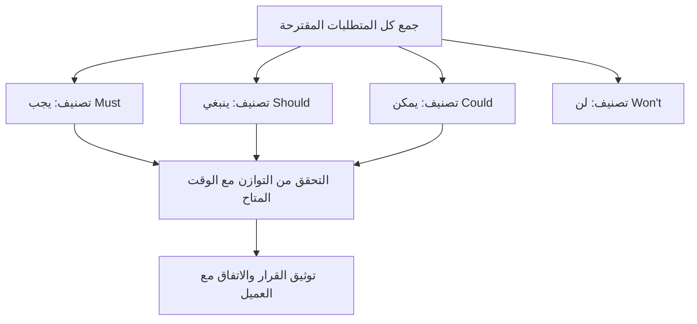

# ترتيب الأولويات موسكو (MoSCoW Prioritization)
> [!info] تعريف مختصر
> موسكو (MoSCoW) هي تقنية لترتيب أولويات متطلبات المشروع بتصنيفها إلى أربع فئات: يجب (Must have)، ينبغي (Should have)، يمكن (Could have)، ولن (Won't have)، لمساعدة الفريق على التركيز على الأهم عند محدودية الوقت أو الموارد.

## الشرح العلمي والاحترافي
- الاسم "MoSCoW" هو اختصار مكوّن من الحروف الأولى للكلمات الإنجليزية الأربع، مع إضافة حرفين "o" فقط لتسهيل نطقه ككلمة واحدة:
  - **Must have (يجب)**: متطلبات أساسية لا يمكن إطلاق المنتج بدونها؛ فشل تحقيقها يعني فشل المشروع بأكمله.
  - **Should have (ينبغي)**: متطلبات مهمة وذات قيمة عالية، لكن المشروع يمكن أن ينجح تقنيًا بدونها مؤقتًا إذا لزم الأمر.
  - **Could have (يمكن)**: متطلبات مرغوبة (Nice to have) تُضيف قيمة لكنها ليست ضرورية؛ أول ما يُستبعد عند ضيق الوقت.
  - **Won't have (لن)**: متطلبات تم الاتفاق صراحة على استبعادها من هذه المرحلة أو الإصدار الحالي، مع توضيح أنها قد تُدرس لاحقًا.
- الهدف الأساسي هو خلق حوار صريح بين أصحاب المصلحة (Stakeholders) والفريق حول ما هو "ضروري فعلًا" مقابل ما هو "مرغوب فقط"، لأن الجميع يميل لتصنيف كل شيء كـ"Must have" دون هذا الإطار.
- قاعدة شائعة (ليست ثابتة): لا يجب أن تتجاوز فئة "Must have" نسبة 60% من إجمالي الجهد المتاح في الإصدار، لضمان وجود مساحة مرنة للتكيف.
- يرتبط ارتباطًا وثيقًا بمفهوم [[MVP]] لأن عناصر "Must have" غالبًا ما تُشكّل جوهر المنتج الأدنى القابل للتطبيق.

## أين ومتى يُستخدم
- في مرحلة تخطيط الإصدار (Release Planning) أو عند بناء [[Scope Statement]] لتحديد ما سيُسلَّم فعليًا.
- في ورش [[Backlog Refinement]] لترتيب عناصر الـ Backlog قبل بدء السبرنت.
- عند التفاوض مع العميل حول نطاق ثابت بوقت وميزانية محدودين (كما في مشاريع العقود ذات السعر الثابت).
- في حالات ضغط الوقت (Time-boxed Projects) حيث يجب معرفة ما يمكن التضحية به دون المساس بجوهر المنتج.

## مثال وسيناريو تطبيقي
> [!example] فريق تطوير تطبيق حجز مواعيد طبية "صحّتي" لديه 6 أسابيع فقط قبل الإطلاق التجريبي. جمع مدير المنتج قائمة من 20 ميزة مقترحة وصنّفها مع الفريق كالتالي:
> - **Must have**: تسجيل الدخول، حجز موعد، إشعار تذكير بالموعد (3 ميزات لا يعمل التطبيق بدونها).
> - **Should have**: تقييم الطبيب بعد الزيارة، البحث حسب التخصص (مهمة لكن يمكن تأجيلها أسبوعين).
> - **Could have**: الدفع الإلكتروني داخل التطبيق، الوضع الليلي (Dark Mode).
> - **Won't have**: الدردشة المباشرة مع الطبيب (تم الاتفاق صراحة على تأجيلها لإصدار لاحق لتعقيدها التقني).
> - بهذا التصنيف، ركّز الفريق الأسابيع الستة على الثلاث ميزات الأساسية أولًا، وأطلق نسخة تجريبية ناجحة بدلًا من محاولة إنجاز 20 ميزة والفشل في تسليم أي منها بجودة كافية.

## خطوات أو مخطّط
1. جمع كل المتطلبات المقترحة من أصحاب المصلحة في قائمة واحدة.
2. عقد ورشة عمل مع الفريق والعميل لتصنيف كل عنصر ضمن الفئات الأربع.
3. مناقشة أي خلاف حول التصنيف (خصوصًا الحدود بين Must وShould).
4. التحقق من أن فئة Must have لا تستهلك كل الوقت والموارد المتاحة.
5. توثيق فئة Won't have بوضوح لتفادي سوء الفهم لاحقًا مع العميل.
6. مراجعة التصنيف دوريًا مع تطور فهم المشروع.

## ⚠️ مفاهيم خاطئة شائعة
> [!warning]
> - الاعتقاد أن "Won't have" تعني رفضًا نهائيًا للميزة؛ الصحيح أنها استبعاد من النطاق الحالي فقط، وقد تُدرس لاحقًا.
> - تصنيف كل شيء تقريبًا كـ"Must have" بدافع الخوف من فقدان أي ميزة، مما يُفرغ الأداة من فائدتها الحقيقية في الترتيب.
> - الخلط بين موسكو وبين تقدير الحجم أو التعقيد؛ فموسكو تتعلق بالأولوية فقط، وليست بديلًا عن [[Relative Estimation]] أو نقاط القصة.

## ❌ ممارسات خاطئة في المشاريع
> [!failure]
> - تصنيف المتطلبات دون إشراك العميل أو صاحب المنتج، فيأتي لاحقًا برأي مختلف تمامًا حول ما هو "ضروري".
> - عدم إعادة تقييم التصنيف عند تغيّر الظروف (مثل تقصير الجدول الزمني)، فتبقى قائمة "يجب" غير واقعية لحجم الوقت المتاح.
> - استخدام موسكو مرة واحدة في بداية المشروع فقط دون تكرارها في كل إصدار جديد، رغم أن الأولويات تتغيّر مع الوقت.

## 🔗 مصطلحات ومفاهيم ذات صلة
[[MVP]] | [[Scope Statement]] | [[Out of Scope]] | [[Backlog Refinement]] | [[Sprint Goal]] | [[Stakeholder Map]] | [[Relative Estimation]] | [[Feature Freeze]] | [[13 - Backlog]] | [[15 - Roadmap]]
