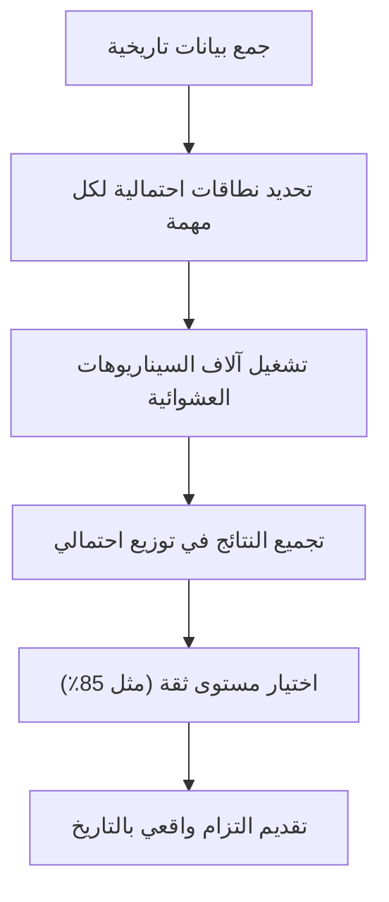

# محاكاة مونت كارلو (Monte Carlo Simulation)
> [!info] تعريف مختصر
> محاكاة مونت كارلو (Monte Carlo Simulation) هي أسلوب إحصائي يُجري آلاف التجارب العشوائية بناءً على بيانات تاريخية، للتنبؤ باحتمالية إنجاز المشروع في وقت معين أو بتكلفة معينة، بدلًا من الاعتماد على تقدير رقم واحد ثابت.

## الشرح العلمي والاحترافي
- بدلًا من قول "المشروع سينتهي في 30 يومًا" (وهو رقم واحد قد يكون خاطئًا تمامًا)، تُدخل المحاكاة نطاقات من الاحتمالات: مثلًا "مدة كل مهمة قد تتراوح بين X وY أيام حسب توزيع احتمالي معين".
- يقوم البرنامج بتشغيل آلاف (أو عشرات الآلاف) من "السيناريوهات الافتراضية" للمشروع، وفي كل سيناريو يسحب بشكل عشوائي مدة مختلفة لكل مهمة ضمن النطاق المحدد، ثم يحسب تاريخ الانتهاء الكلي لذلك السيناريو.
- بعد تشغيل كل السيناريوهات، يُنتج توزيعًا احتماليًا (Probability Distribution) يوضّح مثلًا: "هناك احتمال 50% أن ينتهي المشروع بحلول 15 مارس، واحتمال 85% أن ينتهي بحلول 30 مارس".
- يعتمد الأسلوب على مفهوم [[Little's Law]] والبيانات التاريخية الفعلية لسرعة الفريق ([[Throughput]] و[[Cycle Time]])، بدلًا من التقديرات الشخصية المتفائلة.
- يُستخدم أيضًا لتحليل المخاطر المالية: تقدير احتمالية تجاوز الميزانية بنسبة معينة، وهو أداة أساسية مرتبطة بـ [[EVM]] وإدارة المخاطر الكمية.
- الفائدة الأساسية: يحوّل التخطيط من "وعد بتاريخ واحد" إلى "نطاق ثقة" يمكن اتخاذ قرارات إدارية بناءً عليه (مثل: هل نلتزم بتاريخ يعطي 50% فرصة نجاح أم 85%؟).

## أين ومتى يُستخدم
- في تخطيط المشاريع الكبيرة والمعقدة ذات عدم اليقين العالي، خصوصًا في Waterfall وفي [[Scrum-ban]] القائم على البيانات.
- عند التنبؤ بتاريخ تسليم Sprint أو Release بناءً على بيانات [[Throughput]] التاريخية للفريق.
- في تحليل المخاطر المالية للمشروع، لتقدير احتمالية تجاوز الميزانية المخصصة.
- عند الحاجة لتقديم التزام واقعي للعميل أو الإدارة العليا بدلًا من تاريخ تفاؤلي غير مبني على بيانات.
- غالبًا ما تُستخدم أدوات مثل Jira مع إضافات تحليلية، أو جداول بيانات مخصصة، لتشغيل هذه المحاكاة تلقائيًا من بيانات السبرنتات السابقة.

## مثال وسيناريو تطبيقي
> [!example] فريق تطوير تطبيق "دفعة" للمحفظة الرقمية أراد معرفة متى سينتهي الـ Backlog المتبقي (40 عنصر عمل). بدلًا من التخمين، جمع مدير المشروع بيانات آخر 6 سبرنتات: كان الفريق ينجز أحيانًا 5 عناصر في السبرنت، وأحيانًا 9، بمتوسط 7.
> - شغّلت أداة المحاكاة 10,000 سيناريو، كل مرة تسحب عشوائيًا عدد عناصر مُنجزة لكل سبرنت مستقبلي بناءً على التوزيع التاريخي الفعلي (5 إلى 9).
> - النتيجة: احتمال 50% أن ينتهي الـ Backlog خلال 6 سبرنتات، واحتمال 90% أن ينتهي خلال 8 سبرنتات.
> - قدّم مدير المشروع للعميل التزامًا بـ 8 سبرنتات (بثقة 90%) بدلًا من رقم متفائل بـ 6 سبرنتات فقط، فتجنّب الفريق الوعد بموعد غير واقعي.

## خطوات أو مخطّط
1. جمع بيانات تاريخية حقيقية (سرعة الفريق، مدة المهام السابقة، تباين التقديرات).
2. تحديد نطاق احتمالي واقعي لكل متغير (أفضل حالة، أسوأ حالة، الأكثر شيوعًا).
3. تشغيل آلاف السيناريوهات العشوائية باستخدام أداة أو برنامج محاكاة.
4. تجميع النتائج في توزيع احتمالي لتاريخ الانتهاء أو التكلفة.
5. اختيار مستوى الثقة المناسب (مثل 85%) لاتخاذ القرار أو تقديم الالتزام للعميل.
6. تحديث المحاكاة دوريًا مع تراكم بيانات جديدة من المشروع الفعلي.

## ⚠️ مفاهيم خاطئة شائعة
> [!warning]
> - الاعتقاد أن المحاكاة تعطي "تاريخًا واحدًا مؤكدًا"؛ في الواقع هي تعطي احتمالات مختلفة لتواريخ مختلفة، ويجب اختيار مستوى ثقة مناسب.
> - استخدام بيانات تاريخية قليلة جدًا أو غير موثوقة، مما ينتج توزيعًا احتماليًا مضللًا (Garbage In, Garbage Out).
> - الخلط بينها وبين [[Planning Poker]]؛ فبينما بوكر التخطيط تقدير جماعي بشري لمهمة واحدة، محاكاة مونت كارلو تحليل إحصائي حسابي لمشروع كامل بناءً على بيانات فعلية.

## ❌ ممارسات خاطئة في المشاريع
> [!failure]
> - تجاهل المحاكاة واختيار مستوى ثقة منخفض (مثل 50%) كموعد تسليم رسمي للعميل، مما يرفع احتمال التأخر لأكثر من النصف.
> - عدم تحديث بيانات المحاكاة بعد تغيرات جوهرية في الفريق (مثل مغادرة عضو أو انضمام عضو جديد)، فتبقى التوقعات مبنية على بيانات قديمة غير دقيقة.
> - استخدام المحاكاة كأداة "سحرية" تُغني عن إدارة المخاطر الفعلية وتحليل الأسباب الجذرية للتأخير (راجع [[Root Cause Analysis]]).

## 🔗 مصطلحات ومفاهيم ذات صلة
[[Little's Law]] | [[Throughput]] | [[Cycle Time]] | [[EVM]] | [[Estimation Variance]] | [[Percentiles and Median vs Average]] | [[Risk Register]] | [[Control Chart]] | [[Original Estimate]]
