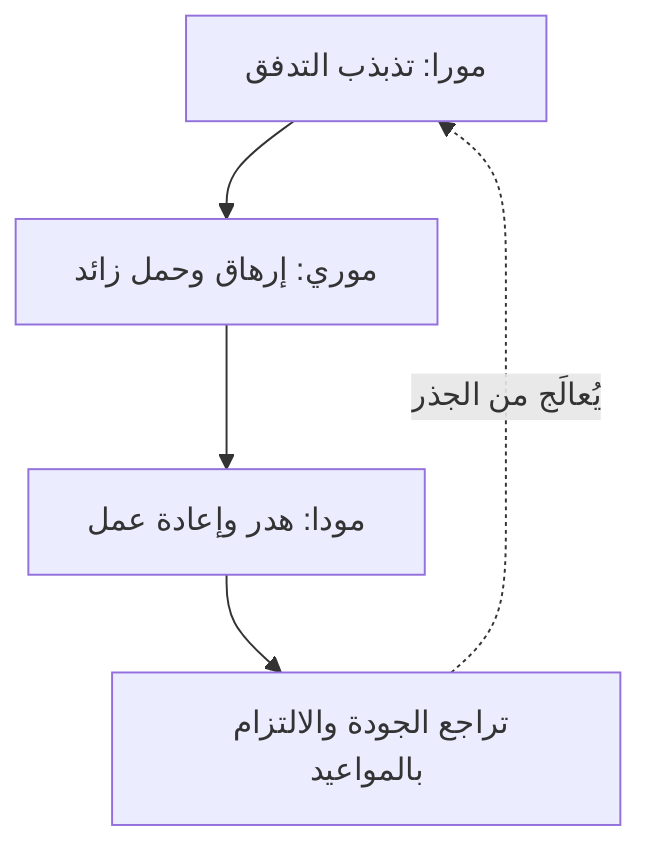

# مودا ومورا وموري (Muda, Mura, Muri)
> [!info] تعريف مختصر
> ثلاث كلمات يابانية تصف أنواع الخلل في أي عملية عمل: **مودا (Muda)** = الهدر، **مورا (Mura)** = عدم الانتظام أو التذبذب، **موري (Muri)** = الإرهاق أو الحمل الزائد. تُستخدم معًا في نظام إنتاج تويوتا لتحليل أسباب ضعف الأداء وإزالتها من جذورها.

## الشرح العلمي والاحترافي
هذه الكلمات الثلاث مترابطة، وفهمها معًا أهم من فهم كل واحدة بمفردها:

- **مودا (الهدر)**: أي نشاط يستهلك موارد (وقت، جهد، مال) دون أن يضيف قيمة للعميل. تُقسَّم تقليديًا إلى ثمانية أنواع (انظر [[DOWNTIME]])، مثل الانتظار، إعادة العمل، والتنقّل غير الضروري.
- **مورا (عدم الانتظام)**: التذبذب في تدفق العمل أو الطلب — أحيانًا حمل زائد وأحيانًا خمول. مثال: فريق يستلم عشرة طلبات يوم الاثنين وصفرًا يوم الثلاثاء.
- **موري (الإرهاق/الحمل الزائد)**: الضغط على الأفراد أو الأنظمة أو المعدات لتقديم أكثر مما تحتمله طاقتها الطبيعية بشكل مستدام.

النقطة الجوهرية في فلسفة تويوتا: **مورا تُسبّب موري، وموري تُسبّب مودا**. حين يتذبذب تدفق العمل (مورا)، يضطر الفريق أحيانًا للعمل بأقصى طاقته أو أكثر (موري)، وهذا الإجهاد يولّد أخطاءً وإعادة عمل وانتظارًا (مودا). لذلك يبدأ التحسين الحقيقي بمعالجة عدم الانتظام أولًا، لا بمطاردة الهدر مباشرة — لأن الهدر غالبًا عرَض، لا سبب.

هذا المفهوم يرتبط مباشرة بفكرة [[Value-Added vs Non-Value-Added vs Pure Waste]] وبأداة [[Value Stream Mapping]] التي تُستخدم لتصوير هذه الأنواع الثلاثة عمليًا على خريطة تدفق العمل.

## أين ومتى يُستخدم
- في [[Toyota Production System|نظام إنتاج تويوتا]] وفي كل ممارسات Lean وLean-Kanban.
- عند إجراء [[Gemba Walk]] لملاحظة العمل الفعلي في مكانه.
- عند مراجعة سعة الفريق ([[Capacity]]) وتوازن تدفق العمل عبر حدود [[WIP Limit]].
- في جلسات تحسين مستمر ([[Kaizen]]) حين يبحث الفريق عن السبب الجذري لتراجع الجودة أو تأخر التسليم.

## مثال وسيناريو تطبيقي
> [!example]
> فريق تطوير في شركة "نُظم الخليج" يبني تطبيق توصيل. لاحظ مدير المنتج أن المطورين يعملون بشكل طبيعي معظم الأسبوع، لكن قبل كل موعد إطلاق (كل أسبوعين) يعملون لساعات إضافية لثلاثة أيام متتالية لإنهاء المهام المتراكمة.
> 
> عند التحليل: السبب هو أن فريق التصميم يُسلّم كل تصاميم السبرنت دفعة واحدة في اليوم الأخير بدلًا من التسليم التدريجي — هذا **مورا** (تذبذب في تدفق العمل الوارد). هذا التذبذب يجبر المطورين على العمل بضغط شديد قبل الموعد النهائي — هذا **موري** (إرهاق). ونتيجة الإرهاق، يرتفع معدل الأخطاء البرمجية التي تحتاج إصلاحًا لاحقًا — هذا **مودا** (هدر في شكل إعادة عمل / [[Rework Percentage]]).
> 
> الحل: فرض اتفاق عمل ([[Team Working Agreement]]) يُلزم فريق التصميم بالتسليم اليومي التدريجي، ووضع [[WIP Limit]] على عدد المهام قيد التصميم، مما يقضي على مورا من جذورها ويمنع موري ومودا لاحقًا.

## خطوات أو مخطّط
1. لاحظ العملية فعليًا (Gemba) بدل الاعتماد على التقارير فقط.
2. ابحث أولًا عن مصادر **مورا** (تذبذب الطلب أو التدفق).
3. عالج مورا عبر موازنة التدفق (مثل [[Pull System]] و[[WIP Limit]]).
4. راقب أثر ذلك على **موري** (هل انخفض الضغط على الأفراد والأنظمة؟).
5. أخيرًا، قِس **مودا** المتبقية وابدأ إزالتها بأدوات مثل [[Value Stream Mapping]] و[[5S]].

## ⚠️ مفاهيم خاطئة شائعة
> [!warning]
> - **الخلط بينها وبين مرادفات لبعضها**: مودا ليست "كل عمل شاق"، بل تحديدًا العمل الذي لا يضيف قيمة للعميل.
> - **التركيز على مودا فقط**: كثير من الفرق تبدأ التحسين بمطاردة الهدر (مودا) وتتجاهل مورا وموري، فتعالج الأعراض لا السبب وتعود المشكلة بعد فترة قصيرة.
> - **اعتبار موري مجرد "عمل بجهد"**: الحمل الزائد المقصود هنا هو تجاوز الطاقة المستدامة بشكل متكرر، وليس مجرد يوم عمل مكثف عرضي.

## ❌ ممارسات خاطئة في المشاريع
> [!failure]
> - **زيادة السعة لتغطية موري بدل معالجة مورا**: توظيف أفراد إضافيين لامتصاص ذروة العمل بدل تسوية تدفق الطلب هو حل مكلف ومؤقت.
> - **تجاهل قياس التذبذب**: كثير من الفرق تقيس فقط [[Velocity]] الإجمالية ولا تلاحظ أن التذبذب بين السبرنتات (مورا) هو الجذر الحقيقي لتدهور الجودة.
> - **معاقبة الأفراد بدل إصلاح النظام**: حين يظهر إعادة عمل (مودا) بسبب إرهاق (موري)، الحل ليس محاسبة الشخص بل إعادة توازن التدفق نفسه.

## 🔗 مصطلحات ومفاهيم ذات صلة
[[Toyota Production System]] | [[DOWNTIME]] | [[Value-Added vs Non-Value-Added vs Pure Waste]] | [[Value Stream Mapping]] | [[Kaizen]] | [[Gemba Walk]] | [[5S]] | [[WIP Limit]] | [[Pull System]] | [[Sustainable Pace]] | [[03 - Kanban]]
