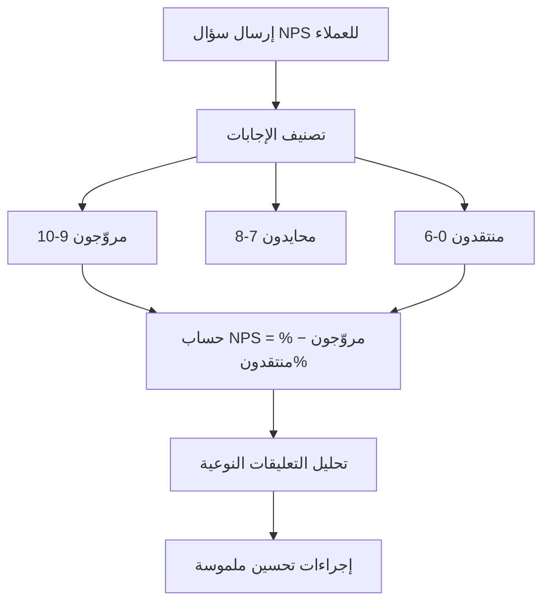

# صافي نقاط الترويج (NPS)

> [!info] تعريف مختصر
> صافي نقاط الترويج (Net Promoter Score أو NPS) هو مؤشّر يقيس ولاء العملاء ورضاهم عن منتج أو خدمة، بالاعتماد على سؤال واحد بسيط: "ما مدى احتمال أن توصي بهذا المنتج/الخدمة لصديق أو زميل؟"، على مقياس من 0 إلى 10.

## الشرح العلمي والاحترافي
- يُصنَّف المستجيبون حسب إجابتهم إلى ثلاث فئات:
  - **المروّجون (Promoters)**: من أجابوا 9 أو 10. عملاء أوفياء يوصون بالمنتج بحماس ويكرّرون الشراء.
  - **السلبيون أو المحايدون (Passives)**: من أجابوا 7 أو 8. راضون لكن غير متحمسين، وقد ينتقلون لمنافس بسهولة.
  - **المنتقدون (Detractors)**: من أجابوا 0 إلى 6. غير راضين، وقد ينشرون رأيًا سلبيًا يضر بالسمعة.
- تُحسب النتيجة النهائية بالمعادلة: NPS = نسبة المروّجين % − نسبة المنتقدين % (وتُهمَل نسبة المحايدين من المعادلة، لكنها تُحسب ضمن إجمالي المستجيبين). النتيجة رقم بين −100 و+100.
- عمومًا: أي رقم أعلى من الصفر يُعتبر مقبولًا، فوق 50 يُعتبر ممتازًا، وفوق 70 نادر جدًا ويعني ولاءً استثنائيًا.
- غالبًا ما يُتبع سؤال NPS بسؤال مفتوح ("لماذا أعطيت هذا التقييم؟") لجمع تعليقات نوعية تفسّر الرقم وتوجّه التحسينات.
- ميزة NPS الأساسية أنه بسيط جدًا للعميل (سؤال واحد، ثوانٍ معدودة)، مما يرفع معدل الاستجابة مقارنة باستبيانات الرضا الطويلة، لكنه يقيس "الولاء المُتوقَّع مستقبلًا" أكثر من كونه تفصيلًا دقيقًا لكل جانب من تجربة المستخدم.

## أين ومتى يُستخدم
- يُستخدم على نطاق واسع في إدارة المنتجات وتجربة العملاء ([[UX vs CX]]) لقياس الصحة العامة للعلاقة مع العملاء عبر الزمن، وليس لقياس ميزة واحدة بعينها.
- يُرسَل عادة بعد نقاط تفاعل مهمة (Milestones) مثل: بعد فترة تجريبية، بعد تجديد اشتراك، أو دوريًا كل ربع سنة لعموم قاعدة العملاء.
- يُستخدم كأحد مؤشرات الأداء الرئيسية ([[KPI]]) في تقارير الإدارة، وأحيانًا كنتيجة رئيسية (Key Result) ضمن [[OKR]] لفريق نجاح العملاء أو المنتج.
- مفيد بشكل خاص عند إطلاق منتج جديد أو نسخة تجريبية أولية ([[MVP]]) لقياس استقبال السوق المبكر، أو بعد إطلاق ميزات رئيسية لقياس أثرها على الولاء العام.

## مثال وسيناريو تطبيقي
> [!example] تطبيق "توصيل" لخدمات التوصيل السريع أرسل استبيان NPS لعينة من 500 مستخدم بعد شهر من إطلاق ميزة "التتبع اللحظي". النتائج: 55% مروّجون (275 شخصًا)، 25% محايدون (125 شخصًا)، 20% منتقدون (100 شخص).
> NPS = 55% − 20% = 35 نقطة.
> فريق المنتج قارن هذا الرقم بنتيجة الربع السابق (NPS = 22 قبل إطلاق الميزة)، فاستنتج أن ميزة التتبع اللحظي رفعت الولاء فعليًا. لكن عند مراجعة التعليقات المفتوحة من المنتقدين، لاحظ الفريق تكرار شكوى واحدة: "التتبع يتوقف أحيانًا في المناطق النائية". استُخدمت هذه الملاحظة النوعية لفتح تذكرة تحسين تقني (Bug) محددة، رغم أن الرقم الإجمالي كان إيجابيًا.

## خطوات أو مخطّط
1. تحديد الفئة المستهدفة ونقطة التفاعل المناسبة لإرسال الاستبيان.
2. إرسال سؤال NPS (0-10) مع سؤال مفتوح اختياري لسبب التقييم.
3. تصنيف الإجابات إلى مروّجين ومحايدين ومنتقدين.
4. حساب صافي النقاط: نسبة المروّجين ناقص نسبة المنتقدين.
5. تحليل التعليقات النوعية من المنتقدين والمحايدين لفهم أسباب الرقم.
6. مقارنة النتيجة بالفترات السابقة، وربطها بإجراءات تحسين ملموسة.

## ⚠️ مفاهيم خاطئة شائعة
> [!warning]
> - الاعتقاد بأن NPS يقيس رضا العميل عن كل تفصيلة في المنتج: هو مقياس ولاء وتوصية عامة، وليس بديلًا عن دراسة تجربة المستخدم التفصيلية.
> - الظن بأن رقمًا واحدًا معزولًا كافٍ للحكم: القيمة الحقيقية في اتجاه NPS عبر الزمن ومقارنته بمعايير الصناعة، لا في رقم لحظة واحدة.
> - تجاهل فئة "المحايدين" باعتبارها غير مهمة: هؤلاء عملاء معرضون للانتقال لمنافس، وتحويلهم إلى مروّجين فرصة نمو مهمة.

## ❌ ممارسات خاطئة في المشاريع
> [!failure]
> - **إرسال استبيان NPS لكل عميل عند كل تفاعل صغير**: يسبب إرهاق الاستبيانات (Survey Fatigue) وانخفاض معدل الاستجابة ومصداقية النتيجة. الحل: تحديد تردد معقول (ربع سنوي مثلًا) ونقاط تفاعل ذات معنى فقط.
> - **الاكتفاء بالرقم النهائي دون قراءة التعليقات المفتوحة**: يفوّت الفريق أسباب المشكلة الجذرية. الحل: تخصيص وقت لتحليل التعليقات النوعية بعد كل جولة استبيان.
> - **مقارنة NPS الخاص بالشركة مباشرة بشركة من قطاع مختلف تمامًا**: معايير NPS تختلف جذريًا بين الصناعات. الحل: المقارنة مع متوسط القطاع نفسه، ومع أداء الشركة عبر الزمن.

## 🔗 مصطلحات ومفاهيم ذات صلة
[[KPI]] | [[UX vs CX]] | [[OKR]] | [[Customer and Market Validation]] | [[Pain Point]] | [[User Journey Map]] | [[MVP]] | [[Feedback Loop]]
