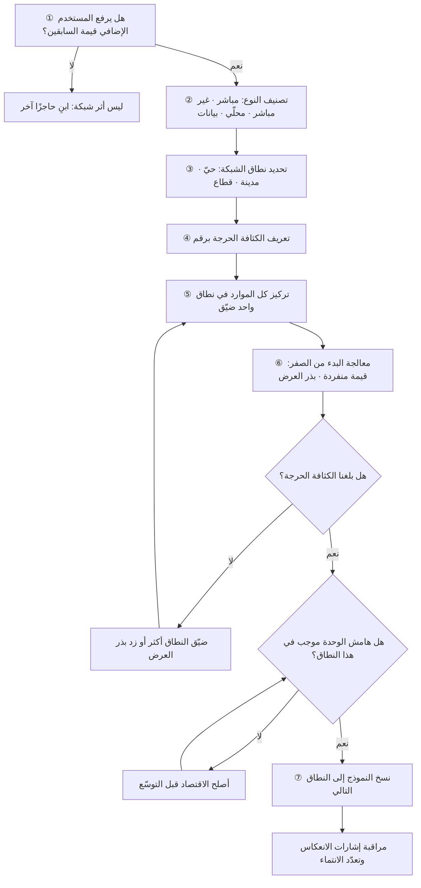

# أثر الشبكة (Network Effects)

> [!info] تعريف مختصر
> خاصّية يزداد بها **نفع المنتج لكل مستخدم** كلما ازداد عدد مستخدميه — فالقيمة لا تأتي من المنتج وحده بل من الشبكة المتجمّعة حوله. حين يتحقّق هذا الأثر فعلًا، يصبح النموّ ذاتي التعزيز: مستخدمون أكثر يجعلون المنتج أفضل، والمنتج الأفضل يجذب مستخدمين أكثر، وتنشأ حاجزًا تنافسيًّا يصعب على المنافس تجاوزه بميزات أفضل وحدها. لكن الأثر سيف ذو حدّين: هو **متماثل في الاتجاهين**، فكما يتضاعف صعودًا ينهار هبوطًا حين يبدأ المستخدمون بالمغادرة. وأخطر سوء استخدام للمصطلح هو إطلاقه على كل منتج له مستخدمون كثيرون؛ فكثرة المستخدمين ليست أثر شبكة إن لم يكن وجود المستخدم الإضافي **يرفع قيمة المنتج لمن سبقه**.

## الشرح العلمي والاحترافي
- **الاختبار الفاصل**: اسأل عن المستخدم رقم ألف: هل جعل التطبيق أفضل للمستخدم رقم عشرة؟ إن كان الجواب نعم فهناك أثر شبكة. أما إن كان المستخدمون يستفيدون من المنتج بمعزل عن بعضهم — كتطبيق تحرير صور مثلًا — فما لديك هو **وفورات حجم** (كلفة أقلّ لكل وحدة) أو **قوّة علامة**، لا أثر شبكة. التمييز مهم لأنه يحدّد استراتيجية مختلفة تمامًا: وفورات الحجم تُدافَع عنها بالكفاءة، وأثر الشبكة يُدافَع عنه بالكثافة.
- **الأنواع الأربعة الرئيسة:**
  1. **مباشر (Direct / Same-side)**: قيمة المستخدم ترتفع بانضمام مستخدمين من **نوعه نفسه**. مثاله الكلاسيكي شبكات الاتصال والمراسلة: تطبيق محادثة لا يفيدك إن لم يكن من تعرفهم عليه.
  2. **غير مباشر (Indirect / Cross-side)**: قيمة طرف ترتفع بانضمام أفراد من **الطرف الآخر**. متجر تطبيقات: المستخدمون يجذبون المطوّرين، والمطوّرون يجذبون المستخدمين. وهذا هو النوع السائد في [[Two-sided Marketplace]].
  3. **محلّي (Local / Localized)**: القيمة لا ترتبط بحجم الشبكة الكلّي بل بكثافتها **داخل نطاق ضيّق** — حيّ، مدينة، تخصّص مهني، أو دائرة معارف. المستخدم لا يستفيد من مليون مستخدم في مدينة أخرى.
  4. **بيانات (Data Network Effects)**: يتحسّن المنتج تلقائيًّا كلما زاد استخدامه لأن الاستخدام يولّد بيانات تُغذّي نماذج التوصية أو التنبّؤ أو التسعير. وهذا النوع **مشروط وليس تلقائيًّا**: لا يتحقّق إلا إذا كانت البيانات المتراكمة تُحسّن فعلًا تجربةً يشعر بها المستخدم، ولم يبلغ التحسّن سقفه سريعًا، ولم يكن المنافس قادرًا على بلوغ الأثر نفسه ببيانات أقلّ. كثير من الادّعاءات عن «أثر شبكة البيانات» هي في الحقيقة تحسّن تقني يصل إلى مرحلة تشبّع بعد قدر متواضع من البيانات.
- **لماذا يكون الأثر المحلّي هو الحاسم في منصّات التوصيل؟** لأن الوحدة التي تُنتج القيمة هي **زمن الوصول**، وزمن الوصول دالّة على الكثافة في نطاق جغرافي صغير لا على الحجم الوطني. عشرة آلاف مندوب موزّعون على عشر مدن لا يحسّنون تجربة مستخدم في حيّ لا يوجد فيه غير مندوبين اثنين. ولهذا:
  - المنصّة تُبنى **مدينة بمدينة، بل حيًّا بحيّ**، لا بلدًا ببلد. والنجاح في مدينة لا يمنح إلا القليل جدًّا من الأفضلية في المدينة التالية — تبدأ الحسبة من الصفر تقريبًا، عدا العلامة والخبرة التشغيلية ورأس المال.
  - الحاجز التنافسي **قابل للاختراق محلّيًّا**: منافس يركّز كل موارده على مدينة واحدة قد يتفوّق فيها على لاعب وطني موزّع الجهد، وهذا ما يفسّر بقاء منافسة حادّة في هذا القطاع رغم وجود لاعبين كبار.
  - **الكثافة تتحوّل مباشرةً إلى اقتصاديات**: كثافة أعلى تعني رحلات أقصر وإمكانية تجميع الطلبات وانتظارًا أقلّ للمندوب — أي كلفة متغيّرة أدنى لكل طلب وهامش مساهمة أفضل ([[Unit Economics]]). فالأثر المحلّي ليس ميزة تجربة فقط، بل رافعة ربحية.
  - **مقياس النجاح ليس عدد المستخدمين بل الكثافة**: طلبات لكل كيلومتر مربّع في الساعة، ونسبة الطلبات التي تُوصَّل خلال زمن مستهدف، ونسبة وقت المندوب المشغول.
- **مشكلة البدء من الصفر (Cold Start)**: الشبكة بلا مستخدمين بلا قيمة، وبلا قيمة لا تجتذب مستخدمين. الحلول المنشورة والمتداولة في أدبيات المنصّات:
  - **البدء بنطاق صغير جدًّا حتى تُبلَغ الكثافة الحرجة فيه** (حيّ واحد، جامعة واحدة، فئة منتج واحدة) بدل الانتشار الرقيق الواسع. النطاق الضيّق يجعل الكثافة ممكنة بموارد محدودة.
  - **توفير قيمة مستقلّة عن الشبكة (Single-player Value)**: أن يكون المنتج نافعًا للمستخدم الأول حتى قبل وصول الآخرين — أداة تنظيم، أو سجلّ، أو محتوى — فتُشترى بها الفترة الانتقالية.
  - **دعم الجانب الأصعب أو بذر العرض يدويًّا**: تشغيل الطرف النادر بجهد غير قابل للتوسّع مؤقّتًا (تعاقد مباشر، ضمان دخل، إدخال بيانات يدويًّا).
  - **الاستفادة من شبكة قائمة** لاستيراد المستخدمين أو المحتوى بدل بنائهم من الصفر.
  - **الأحداث والتزامن**: تركيز الطلب في نافذة زمنية أو مناسبة تجعل الكثافة تبدو أعلى ممّا هي عليه فعليًّا.
- **قيود الأثر وحدوده**: (١) **التشبّع** — بعد حجم معيّن لا يضيف المستخدم الإضافي قيمة تُذكر؛ (٢) **الازدحام والأثر السلبي** — قد يخفض المستخدمون الإضافيون القيمة (رسائل مزعجة، منافسة على المورد نفسه، تدهور جودة المحتوى)؛ (٣) **تعدّد الانتماء (Multi-homing)** — قدرة المستخدم على استخدام منصّتين معًا تُضعف الحاجز بشدّة، وهي شائعة جدًّا في التوصيل ونقل الركّاب حيث تكون [[Switching Cost]] شبه معدومة؛ (٤) **قابلية الانهيار** — الأثر يعمل عكسيًّا عند التراجع فيتسارع الخروج.

## أين ومتى يُستخدم
- **في صياغة استراتيجية المنتج وتحديد الميزة الدفاعية**: يحدّد ما إذا كان الحاجز يُبنى بالكثافة أم بالكلفة أم بـ[[Switching Cost]] ([[Product Strategy]]).
- **في تخطيط التوسّع الجغرافي**: يقرّر بين التركيز على مدينة واحدة حتى الهيمنة أو الانتشار السريع الرقيق — وهو أحد أخطر قرارات [[Go-to-Market]] في منصّات التوصيل.
- **في تصميم مؤشّرات الأداء**: يستبدل مؤشّرات الحجم العامّة ([[Vanity Metrics]]) بمؤشّرات كثافة محلّية، ويؤثّر في اختيار [[North Star Metric]].
- **في تقدير القيمة الدائمة**: العميل في شبكة كثيفة يبقى أطول ويكلّف خدمته أقلّ، فيرتفع [[Customer Lifetime Value]] وتنخفض كلفة الاكتساب عبر الإحالة.
- **في [[Business Case]] وتقييم الاستثمار**: تبرير خسائر مبكّرة يستقيم فقط إن كانت هناك آلية أثر شبكة موصوفة وقابلة للقياس، لا مجرّد رهان على الحجم.
- **عند تقييم منافس جديد**: يُقاس خطره بقدرته على بلوغ كثافة حرجة في نطاق صغير، لا بحجمه الكلّي.

## مثال وسيناريو تطبيقي
> [!example] **الافتراض معلن: سيناريو تعليمي مُركَّب لمنصّة افتراضية؛ الأرقام للتوضيح ولا تُنسب إلى شركة حقيقية.**
> منصّة افتراضية لتوصيل الطلبات أطلقت في ثلاث مدن خليجية دفعةً واحدة سعيًا إلى «تغطية وطنية سريعة». بعد ستّة أشهر: 140,000 تنزيل، و6,200 مندوب مسجَّل، و2,900 متجر شريك — أرقام ممتازة في العرض التقديمي، وتجربة سيّئة على الأرض.
> **التشخيص**: متوسّط زمن التوصيل 61 دقيقة، ونسبة الطلبات التي يُلغيها النظام لعدم توفّر مندوب 17%، ونسبة وقت المندوب المشغول 34% فقط — أي أن ثلثي وقته انتظار. كان الفريق يقيس **الحجم الوطني**، بينما القيمة تُصنع في نطاق 3–5 كيلومترات.
> عند التقطيع بالحيّ ظهرت الحقيقة: الشبكة موزّعة على 46 حيًّا، متوسّط 4.1 طلبات في الساعة للحيّ الواحد — وهو رقم لا يكفي لجعل المندوب ينتظر في المنطقة، فيغادر، فيطول زمن الوصول، فيلغي العملاء، فيقلّ الطلب أكثر. الحلقة التي كان يُفترض أن تصعد كانت تدور نازلة.
> في المقابل ظهر حيّان اثنان (منطقة مكاتب مزدحمة، ومنطقة سكنية عالية الكثافة) بلغا 22 و19 طلبًا في الساعة، وفيهما: زمن توصيل 26 دقيقة، وإلغاء 3%، وانشغال مندوب 71%، وهامش مساهمة موجب بنحو 5.4 ريال للطلب مقابل سالب 3.1 ريال في بقية الأحياء.
> **القرار**: انسحاب مؤقّت من مدينتين، وتقليص التغطية في المدينة الرئيسة من 46 حيًّا إلى 9 أحياء متجاورة تشكّل رقعة متّصلة. وفي هذه الرقعة: تركيز كل ميزانية التسويق، وضمان دخل ساعي للمندوبين في ساعات الذروة الأولى (بذر العرض)، وتعاقد حصري مؤقّت مع 40 مطعمًا مطلوبًا في المنطقة (قيمة يُفتقر إليها عند المنافس)، وإطلاق ميزة «التوصيل خلال 30 دقيقة أو الرسوم مجانية» — وهو وعد لا يمكن قطعه إلا بكثافة كافية، وبالتالي **إعلان تموضع مبني على الكثافة نفسها**.
> **النتيجة بعد أربعة أشهر**: عدد المستخدمين الكلّي انخفض من 140,000 إلى 51,000 (وهو ما بدا تراجعًا)، لكن: الطلبات في الساعة للحيّ ارتفعت إلى 27، وزمن التوصيل نزل إلى 23 دقيقة، والإلغاء إلى 2%، وانشغال المندوب إلى 78%، وصار تجميع طلبين في رحلة واحدة ممكنًا في 41% من الرحلات فانخفضت أجرة المندوب لكل طلب 31%. الأهمّ: **معدّل الطلب المتكرّر شهريًّا للمستخدم ارتفع من 1.9 إلى 5.6**، وصار 38% من المستخدمين الجدد يأتون بالإحالة (كلفة اكتساب شبه معدومة) لأن الشبكة صارت كثيفة بما يكفي لتصير موضوع حديث داخل الحيّ.
> **الدرس**: لم تتغيّر التقنية ولا التصميم ولا الميزات. تغيّر **نطاق الكثافة** فقط — وهو جوهر الأثر المحلّي.

## خطوات أو مخطّط
1. **تحقّق من وجود الأثر أصلًا**: هل يرفع المستخدم الإضافي قيمة المنتج لمن سبقه؟ اكتب الآلية بجملة واحدة صريحة. إن عجزت، فليس لديك أثر شبكة.
2. **صنّف النوع**: مباشر · غير مباشر · محلّي · بيانات — لأن كل نوع يفرض استراتيجية توسّع ومؤشّرًا مختلفًا.
3. **حدّد نطاق الشبكة الحقيقي** (Network Scope): حيّ · مدينة · قطاع · دائرة معارف. هذا القرار يحدّد أين تُقاس الكثافة وأين تُصرف الميزانية.
4. **عرّف الكثافة الحرجة رقميًّا**: ما أدنى مستوى يجعل التجربة تتجاوز البديل؟ (طلبات/كم²/ساعة، زمن انتظار، نسبة تغطية).
5. **اختر نطاقًا واحدًا ضيّقًا واهجم عليه بكل الموارد** حتى تجاوز الكثافة الحرجة، ولا توسّع قبل ذلك.
6. **عالج البدء من الصفر**: وفّر قيمة للمستخدم المنفرد، وابذر الجانب الأصعب يدويًّا، واستفد من شبكة قائمة إن أمكن.
7. **قِس الكثافة لا الحجم** في لوحة القيادة، واجعل الحجم الوطني مؤشّرًا ثانويًّا.
8. **كرّر النموذج في النطاق التالي** بعد إثبات وحدة اقتصادية موجبة في النطاق الأول، ووثّق «كتيّب إطلاق الحيّ» ليصير قابلًا للنسخ.
9. **راقب إشارات الانعكاس**: تراجع الكثافة، ارتفاع تعدّد الانتماء، تدهور الجودة — وعالجها قبل أن تدور الحلقة نازلة.

## ⚠️ مفاهيم خاطئة شائعة
> [!warning]
> - **الخلط بين كثرة المستخدمين وأثر الشبكة**: منتج بمليون مستخدم لا يستفيد أيّ منهم من وجود الآخر لا يملك أثر شبكة، بل قاعدة عملاء. الحاجز في هذه الحالة يأتي من العلامة أو الكلفة أو [[Switching Cost]] لا من الشبكة.
> - **الخلط بينه وبين وفورات الحجم**: وفورات الحجم تخفض **كلفتك**، وأثر الشبكة يرفع **قيمة المنتج للمستخدم**. الأول يُدافَع عنه بالكفاءة والثاني بالكثافة، والخلط بينهما يقود إلى استراتيجية توسّع خاطئة.
> - **افتراض أن الأثر وطني أو عالمي بينما هو محلّي**: أخطر خطأ في منصّات التوصيل والنقل والخدمات الميدانية؛ يبرّر انتشارًا واسعًا رقيقًا يُنتج تجربة سيّئة في كل مكان واقتصادًا سالبًا في كل مكان.
> - **الادّعاء التلقائي بأثر شبكة البيانات**: تراكم البيانات لا يولّد أثرًا إلا إن تحوّل إلى تحسّن ملموس يشعر به المستخدم ولم يبلغ سقف التشبّع سريعًا. كثير من الحالات تُشبع بعد قدر متواضع من البيانات، فيصبح الادّعاء تسويقًا لا استراتيجية.
> - **الظنّ بأن الأثر يصنع حصانة دائمة**: تعدّد الانتماء (استخدام تطبيقين معًا) شائع حين تكون كلفة التحوّل صفرًا، وهو يفرّغ الحاجز من مضمونه. الحصانة تُبنى بمزيج من الكثافة و[[Switching Cost]] لا بالكثافة وحدها.
> - **تجاهل الأثر السلبي**: المستخدم الإضافي قد يقلّل القيمة (ازدحام، محتوى رديء، إساءة)، ومنصّات كثيرة تدهورت جودتها بعد النموّ لأنها عاملت كل انضمام على أنه مكسب صافٍ.
> - **الاعتقاد بأن الأثر يعمل صعودًا فقط**: هو متماثل؛ فحين يبدأ الانحدار يتسارع مثلما تسارع الصعود، وقد ينهار السوق المحلّي خلال أسابيع.

## ❌ ممارسات خاطئة في المشاريع
> [!failure]
> - **الخطأ: الإطلاق في عدّة مدن معًا لإثبات «التغطية الوطنية».** → **لماذا يضرّ**: يوزّع الموارد بحيث لا تُبلغ الكثافة الحرجة في أي نطاق، فتسوء التجربة في كل مكان ويرتفع الإلغاء والتسرّب ويصير الهامش سالبًا بنيويًّا. → **الحل**: اهجم على رقعة متّصلة صغيرة حتى الهيمنة، ووثّق شروط الانتقال إلى النطاق التالي كمعيار مكتوب لا كقرار سياسي.
> - **الخطأ: قياس النجاح بعدد التنزيلات أو المستخدمين المسجَّلين.** → **لماذا يضرّ**: يخفي فشل الكثافة تمامًا، ويكافئ الفريق على نموّ لا يُنتج قيمة، ويؤخّر اكتشاف الحلقة النازلة أشهرًا ([[Vanity Metrics]]). → **الحل**: اجعل مؤشّر الكثافة المحلّية (طلبات/نطاق/ساعة، زمن الاستجابة، انشغال المورد) هو المؤشّر الأساسي في اللوحة.
> - **الخطأ: بذر العرض بحوافز نقدية سخيّة دون خطة خروج منها.** → **لماذا يضرّ**: تصبح الكثافة مشتراة لا مكتسبة، وتنهار لحظة توقّف الحافز، وتكون الشركة قد بنت توقّعات نموّ على أساس زائف. → **الحل**: حدّد سلفًا مستوى الكثافة الذي عنده يُخفَّض الحافز تدريجيًّا، واختبر الخفض على نطاق واحد أولًا وقِس الانخفاض الفعلي.
> - **الخطأ: تجاهل تعدّد الانتماء عند تقدير الحاجز التنافسي.** → **لماذا يضرّ**: تُبنى خطط طويلة الأمد على افتراض ولاء غير موجود، ويكفي عرض منافس أرخص بريالين لتحويل نصف الطلب في يوم واحد. → **الحل**: قِس نسبة تعدّد الانتماء صراحةً، وابنِ [[Switching Cost]] مشروعة (سجلّ، اشتراك، برنامج ولاء، تكامل) بدل الاعتماد على الكثافة وحدها.
> - **الخطأ: الادّعاء بأثر شبكة بيانات في [[Business Case]] دون آلية مكتوبة.** → **لماذا يضرّ**: يبرّر استثمارًا ضخمًا على وعد غير قابل للاختبار، ويؤخّر بناء حاجز حقيقي حتى يفوت الأوان. → **الحل**: اكتب الآلية بدقّة (أي بيانات؟ تحسّن أي مؤشّر؟ متى يتشبّع؟) واختبرها بقياس تحسّن المؤشّر مع تراكم البيانات فعليًّا.
> - **الخطأ: توسيع الشبكة بضمّ مستخدمين منخفضي الجودة لرفع العدد.** → **لماذا يضرّ**: يخفض قيمة الشبكة لباقي الأعضاء (أثر سلبي)، ويرفع كلفة الوساطة وحلّ النزاعات، ويضرّ سمعة المنصّة. → **الحل**: اجعل معايير القبول والجودة جزءًا من تصميم الشبكة، وقِس صحّتها بمؤشّر مضادّ ([[Counter Metric]]) لا بالعدد فقط.
> - **الخطأ: الانسحاب من نطاق ناجح لتمويل توسّع جديد قبل استقرار الأول.** → **لماذا يضرّ**: يهبط النطاق الأول تحت الكثافة الحرجة فتدور فيه الحلقة نازلة، وتخسر الشركة سوقها الوحيد الرابح. → **الحل**: اشترط استقرارًا مثبتًا لفوجين على الأقل قبل تحويل الموارد ([[Cohort Analysis]]).

## 🔗 مصطلحات ومفاهيم ذات صلة
[[Two-sided Marketplace]] | [[Switching Cost]] | [[Unit Economics]] | [[Customer Acquisition Cost]] | [[Customer Lifetime Value]] | [[Retention]] | [[Churn]] | [[Cohort Analysis]] | [[Systems Thinking]] | [[Product Strategy]] | [[Go-to-Market]] | [[North Star Metric]] | [[Vanity Metrics]] | [[Counter Metric]] | [[Product-Market Fit]]
