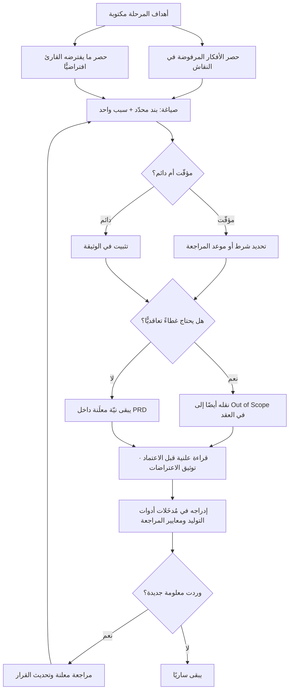

# ما لا نريده (Non-Goals)

> [!info] تعريف مختصر
> قسم صريح داخل [[PRD]] (أو أي وثيقة تصميم) يعلن **ما لن يُبنى عمدًا** ضمن هذا النطاق، ولماذا. ليس قائمة استثناءات دفاعية، بل **بيان نيّة**: هذه أشياء خطرت لنا، وفكّرنا فيها، وقرّرنا ألّا نفعلها الآن — لأنها تخدم مستخدمًا آخر، أو تحلّ مشكلة أخرى، أو تكلف أكثر ممّا تستحقّ في هذه المرحلة. قيمتها أنها تحسم مسبقًا الأسئلة التي كانت ستُطرح لاحقًا في منتصف التنفيذ، وتمنع القارئ — إنسانًا كان أو نموذجًا لغويًّا — من **ملء الفراغ بافتراضاته**.

## الشرح العلمي والاحترافي

- **الأصل والمنشأ**: القسم شائع في ثقافة وثائق التصميم الهندسية (Design Docs / RFCs) في شركات البرمجيات الكبرى منذ العقد الأول من الألفية، حيث صار «Goals / Non-Goals» زوجًا قياسيًّا في أعلى أي وثيقة تصميم تقريبًا. وجذره الفكري أقدم: صياغة الاستراتيجية بوصفها **اختيارًا**، أي أن الاستراتيجية ليست قائمة ما ستفعله بل ما رفضت فعله — فبلا رفض معلن لا يوجد تركيز، وإنما نيّة حسنة موزّعة على كل شيء.

- **الفرق الجوهري عن [[Out of Scope]]**: كلاهما يقول «لن نفعل هذا»، لكنهما مختلفان في **الطبيعة والوظيفة والجمهور والأثر**:

  | الوجه | `Non-Goals` (ما لا نريده) | `[[Out of Scope]]` (خارج النطاق) |
  |---|---|---|
  | الطبيعة | **نيّة معلَنة** — قرار منتج/تصميم | **حدّ تعاقدي** — قرار نطاق وعقد |
  | السؤال | ماذا لا نحاول أن نحقّق؟ ولماذا؟ | ماذا لا يشمله هذا التسليم/العقد؟ |
  | الموقع | داخل [[PRD]] أو وثيقة التصميم | في [[Scope Statement]] و[[SOW]] |
  | الجمهور | الفريق، المصمّم، المهندس، من يقرأ الوثيقة | العميل، المشتريات، الحوكمة، الجهة المتعاقدة |
  | الأثر عند الخرق | انحراف عن نيّة المنتج، يُناقَش ويُعاد ضبطه | مطالبة تعاقدية، تحتاج [[Change Request]] رسميًّا |
  | النبرة | «لسنا نحاول أن نحلّ مشكلة الفواتير الآن» | «لا يشمل هذا العقد وحدة الفوترة» |

  عمليًّا: `Non-Goals` تشرح **لماذا** لن نفعل، و`Out of Scope` تحدّد **أن** ذلك ليس ضمن المُلزَم به. الأولى تمنع سوء الفهم، والثانية تمنع النزاع. وأي بند مهمّ يحتاج غالبًا إلى الاثنين معًا: نيّة معلَنة في الوثيقة، وحدّ مكتوب في العقد.

- **وظيفتها المعرفية: إغلاق الفراغ**: أي وثيقة تُقرأ في ضوء **ما لم يُذكر فيها** بقدر ما تُقرأ في ضوء ما ذُكر. حين تصف الوثيقة نظام حجز مواعيد ولا تذكر الدفع الإلكتروني إطلاقًا، فإن ثلاثة قرّاء يخرجون بثلاثة تفسيرات: أحدهم يفترض أنه سيُبنى (فيصمّم له حيّزًا في الواجهة)، وثانٍ يفترض أنه أُلغي (فيهمله)، وثالث يفترض أن أحدًا لم ينتبه (فيسأل في اجتماع بعد ستة أسابيع). سطر واحد في `Non-Goals` — «الدفع الإلكتروني ليس هدفًا في هذه المرحلة؛ التحصيل يتم في الفرع، وسنعيد النظر بعد قياس معدّل الحجز» — يُلغي التفسيرات الثلاثة معًا.

- **لماذا صارت أهمّ حين صار القارئ نموذجًا لغويًّا**: حين يقرأ إنسانٌ وثيقةً ويجد فراغًا، فإنه في الغالب **يتوقّف ويسأل** — لأنه يعرف أنه لا يعرف، ولأن السؤال أرخص عليه من الخطأ. أما النموذج اللغوي فسلوكه الافتراضي معاكس تمامًا: هو **يكمل** — مُدرَّب على أن ينتج استمرارًا معقولًا ومتّسقًا لما قرأ، فيملأ الفراغ بأكثر الافتراضات شيوعًا في بيانات تدريبه، ويقدّمها بالثقة نفسها التي يقدّم بها ما ورد في الوثيقة حرفيًّا. ويترتّب على ذلك عمليًّا:
  1. **الصمت يُقرأ كإذن**، لا كسؤال معلّق. النموذج لا يميّز بين «لم يُذكر لأنه غير مطلوب» و«لم يُذكر لأنه بديهي».
  2. **الافتراضات تكون عامّة لا سياقية**: يملأ الفراغ بما هو شائع في المنتجات المشابهة عمومًا، لا بما يناسب مستخدمك وسوقك وقيودك التنظيمية.
  3. **الإضافة الزائدة تبدو خدمةً**: النموذج مُحفَّز على أن يكون شاملًا ومفيدًا، فيضيف تسجيل دخول واستعادة كلمة مرور ولوحة إدارة وتصدير إلى Excel لم يطلبها أحد — وهو [[Gold Plating]] آليّ الإنتاج وبسرعة عالية.
  4. **الكلفة تنقلب**: كتابة شيء لم يُطلب صارت شبه مجانية، بينما مراجعته وفهمه وصيانته وحذفه لاحقًا لم ترخص أبدًا. فحين ينهار حاجز كلفة الإنتاج، يصبح **الحدّ المكتوب هو الحاجز الوحيد الباقي**.
  فالنتيجة أن `Non-Goals` تحوّلت من ترف توثيقي إلى **جزء وظيفي من المُدخَل**: تُكتب لتُقرأ من الإنسان والآلة معًا، وتُصاغ بصيغة صريحة قابلة للتنفيذ («لا تُنشئ نظام صلاحيات؛ افترض مستخدمًا واحدًا») لا بصيغة إنشائية مبهمة.

- **الصياغة الجيّدة لها ثلاث خصائص**: أن تكون **محدّدة** (تُسمّي الشيء لا الفئة)، وأن تكون **مُعلَّلة** (سطر سبب واحد يمنع إعادة فتح النقاش)، وأن تكون **مؤقّتة صراحةً حين تكون مؤقّتة** («ليس الآن — سنراجعها بعد قياس س»). فبند بلا سبب يُقرأ كتعنّت ويُعاد فتحه كل شهر؛ وبند مطلق يُقرأ كرفض أبدي فيُبنى حوله سرًّا.

- **ما ليست هي**: ليست قائمة أمنيات مؤجَّلة (ذاك [[Backlog Refinement]])، ولا سجلّ مخاطر (ذاك [[Risk Register]])، ولا مبرّرًا لرفض كل تغيير — بل قرارًا قابلًا للمراجعة عند ورود معلومة جديدة، بشرط أن تُراجَع علنًا وتُسجَّل في [[Decision Log]] لا أن تُخترق صمتًا.

## أين ومتى يُستخدم

- **في [[PRD]]**: قسم إلزامي مباشرة بعد الأهداف؛ ووثيقة بأهداف بلا لا-أهداف تُعدّ ناقصة في الفرق الناضجة.
- **في وثائق التصميم الهندسي وقرارات المعمارية**: لتحديد ما لا يحاول التصميم حلّه (التوسّع الأفقي، تعدّد المناطق، التوافق مع النسخ القديمة…) فلا يُحاكَم التصميم بمعايير لم يدّعِها.
- **في تحديد نطاق [[MVP]]**: أوضح مواضع الاستعمال؛ فتعريف الحد الأدنى الصالح يقوم على الحذف بقدر ما يقوم على الإضافة.
- **في مواجهة [[Scope Creep]]**: بند مكتوب مسبقًا يحوّل النقاش من صراع أشخاص إلى مراجعة قرار موثَّق، ويقلّل الحاجة إلى [[Scope Freeze]] المتأخّر.
- **في المُدخَلات المكتوبة لأدوات الذكاء الاصطناعي المولّدة للشيفرة أو المحتوى**: قسم «لا تفعل» صريح صار جزءًا قياسيًّا من صياغة الطلب، وبديلًا عمليًّا عن مراجعة مخرجات منتفخة لاحقًا.
- **في [[Sprint Goal]] و[[Shape Up]]**: تحديد ما لن يُلمس داخل الدورة يحمي التركيز ويجعل الصندوق الزمني قابلًا للاحترام فعلًا.
- **قبل [[Sign-off]] ومع أصحاب المصلحة**: قراءة قائمة اللا-أهداف بصوت عالٍ في اجتماع الاعتماد تكشف الخلافات الكامنة قبل أن تتحوّل إلى [[Change Request]] مكلفة.

## مثال وسيناريو تطبيقي

> [!example] شركة سعودية تطوّر منصّة داخلية لإدارة طلبات الإجازات لـ٤٠٠ موظف. كُتبت [[PRD]] من صفحتين بأهداف واضحة: تقديم الطلب، سلسلة اعتماد من مستويين، إشعارات، ورصيد إجازات محدَّث.
> في النسخة الأولى لم يكن هناك قسم `Non-Goals` إطلاقًا. النتيجة خلال ٥ أسابيع:
> • أضاف مهندس **نظام صلاحيات كامل** بأدوار مخصّصة قابلة للتعريف (١١ يوم-عمل) لأنه «افترض أن الموارد البشرية ستحتاجه».
> • بنى فريق آخر **تكاملًا مع نظام الرواتب** لخصم الإجازات غير المدفوعة (٩ أيام) لأن أحدهم ذكرها عرضًا في اجتماع.
> • ولّد مساعد برمجي بالذكاء الاصطناعي — استُخدم لتسريع العمل — شاشة **تقارير وتحليلات** كاملة و**تصديرًا إلى Excel** ولوحة مدير لم يطلبهما أحد، لأن الطلب المكتوب لم يذكر أنهما غير مطلوبين، فأكمل النموذج ما يعرفه عن «أنظمة الإجازات» عمومًا. مراجعة تلك الشيفرة وحذفها استهلكت ٤ أيام إضافية.
> المجموع: **٢٤ يوم-عمل** على أشياء لم يطلبها أحد، في مشروع مقدَّر بـ٤٠ يومًا أصلًا — أي تجاوز يقارب ٦٠٪ سببه الوحيد **الصمت**، لا الخلاف.
> في النسخة الثانية أُضيف القسم التالي حرفيًّا إلى الوثيقة، وأُدرج نصّه أيضًا في المُدخَل المعياري لأدوات التوليد:
> > **ما لا نريده في هذه المرحلة:**
> > ١. **لا نظام صلاحيات قابل للتعريف** — دورَان ثابتان فقط: موظف ومدير. السبب: ٩٨٪ من الحالات تُغطّى بهما، والمرونة تكلف أضعاف قيمتها الآن.
> > ٢. **لا تكامل مع نظام الرواتب** — التسوية المالية تتم يدويًّا في نهاية الشهر كما هي اليوم. السبب: التكامل يستلزم موافقة أمنية تستغرق ٦ أسابيع ولا يمنع إطلاق النسخة الأولى.
> > ٣. **لا تقارير ولا تصدير ولا لوحات تحليلية** — نقيس التبنّي من سجلّات النظام مباشرة. السبب: التقارير مطلب لاحق لجمهور مختلف (الإدارة) لا لجمهورنا الحالي (الموظف والمدير المباشر).
> > ٤. **لا تطبيق جوّال أصيل** — واجهة ويب متجاوبة تكفي. السبب: ٨٧٪ من الطلبات تُقدَّم من داخل المكتب.
> > *كل بند أعلاه مؤقّت ويُعاد النظر فيه بعد ٩٠ يومًا من الإطلاق بناءً على بيانات الاستخدام.*
> النتيجة في التنفيذ الثاني: أُغلقت ثلاثة نقاشات قبل أن تبدأ، وحين طلب أحد المديرين تصديرًا إلى Excel لم يتحوّل الأمر إلى جدال — بل أُشير إلى البند الثالث وسببه وموعد مراجعته، وسُجّل الطلب في [[Backlog Refinement]] بدل أن يُنفَّذ فورًا. أمّا مخرجات المساعد البرمجي فانضبطت لأن قسم «لا تفعل» صار جزءًا من الطلب نفسه.

## خطوات أو مخطّط

1. **اكتب الأهداف أولًا** بصيغة نتائج لا مخرجات ([[Outcome vs Output]]).
2. **اجمع ما دار في النقاش ولم يُعتمد**: الأفكار المرفوضة داخل الجلسة هي المادّة الخام الأصدق للا-أهداف.
3. **أضف الافتراضات الشائعة في منتجات مشابهة**: كل ما «يفترضه» قارئ عادي أو نموذج لغوي موجودًا افتراضيًّا ولن يوجد عندك.
4. **صُغ كل بند بجملة محدّدة + سبب واحد**: لا فئات مبهمة، ولا أسباب مركّبة.
5. **صنّف كل بند: مؤقّت أم دائم**، وحدّد شرط أو موعد إعادة النظر في المؤقّت.
6. **افصل ما يحتاج غطاءً تعاقديًّا** وانقله إضافةً إلى [[Out of Scope]] في [[Scope Statement]] أو [[SOW]] — النيّة في الوثيقة والحدّ في العقد.
7. **اقرأ القائمة علنًا مع أصحاب المصلحة قبل الاعتماد**، وسجّل الاعتراضات وما حُسم منها في [[Decision Log]].
8. **أدرج القائمة في المُدخَلات المعيارية لأدوات التوليد** وفي معايير مراجعة الشيفرة والتصميم، وإلا بقيت زينة في وثيقة لا يقرؤها أحد.
9. **راجعها دوريًّا**: بند مؤقّت انقضى شرطه ولم يُراجَع يفقد مصداقيته، وقائمة فقدت مصداقيتها تُخترق بلا نقاش.

## ⚠️ مفاهيم خاطئة شائعة

> [!warning]
> - **«هي نفسها [[Out of Scope]]»**: لا. الأولى **نيّة معلَنة** موجّهة للفريق داخل [[PRD]] وتشرح لماذا لا نحاول؛ والثانية **حدّ تعاقدي** موجّه للعميل والحوكمة في [[Scope Statement]] و[[SOW]] ويحدّد ما لسنا ملزمين به. خرق الأولى نقاش منتج، وخرق الثانية مطالبة تحتاج [[Change Request]].
> - **«هي قائمة أمنيات مؤجَّلة»**: لا. الـBacklog يقول «لاحقًا»، واللا-أهداف تقول «ليس هذا ما نحاول فعله أصلًا». كثير من بنودها لن ينتقل إلى الـBacklog إطلاقًا.
> - **«كتابتها تبدو سلبية أمام العميل»**: العكس. البند المُعلَّل يُظهر أن الفريق فكّر في الاحتمال ووازن بين البدائل واختار. الغموض هو ما يبدو ارتجالًا، لا الحسم.
> - **«ما دام لا أحد طلبه فلا داعي لكتابته»**: هذا بالضبط سبب وجودها. البنود التي **لم يطلبها أحد لكن يفترضها الجميع ضمنًا** هي مصدر الانحراف الأكبر، وهي أولى ما يُكتب.
> - **«الفريق يفهم ضمنًا»**: الفهم الضمني يتبخّر عند أول انضمام عضو جديد، أو أول تغيّر في القيادة، أو أول مرّة تُقرأ الوثيقة بعد ثلاثة أشهر. المكتوب وحده هو ما يبقى.
> - **«هي التزام لا رجعة فيه»**: بل قرار قابل للمراجعة بشرطين: أن تكون هناك معلومة جديدة، وأن تُراجَع علنًا وتُسجَّل. الممنوع هو الخرق الصامت لا التغيير المعلن.
> - **«الذكاء الاصطناعي يفهم المقصود من السياق»**: النموذج اللغوي يكمل الفراغ بأكثر الاحتمالات شيوعًا في بيانات تدريبه ثم يقدّمها بثقة كاملة. الصمت عنده إذن لا سؤال، ولذلك صار البند الصريح «لا تفعل» جزءًا وظيفيًّا من المُدخَل لا زينة توثيقية.

## ❌ ممارسات خاطئة في المشاريع

> [!failure]
> - **كتابة PRD بأهداف بلا لا-أهداف**: الخطأ: قسم أهداف ثري وصفحة تنتهي عنده. لماذا يضرّ: يترك مساحة تفسير واسعة يملؤها كل قارئ بافتراضاته، فينفَق الجهد على ما لم يُطلب ويُكتشف الأمر بعد أسابيع. الحل: اجعل قسم اللا-أهداف حقلًا إلزاميًّا في [[PRD]]، ولا تُعتمد وثيقة بدونه.
> - **صياغة بنود مبهمة بلا سبب**: الخطأ: «لن نتعامل مع الحالات المعقّدة». لماذا يضرّ: بند غير محدّد لا يمنع شيئًا، وبند بلا سبب يُعاد فتحه في كل اجتماع لأن أحدًا لا يعرف على أي أساس أُغلق. الحل: سمِّ الشيء بعينه واكتب سطر السبب: «لا دعم للإجازات المجزّأة بالساعة — أقل من ٣٪ من الطلبات، وتضاعف تعقيد حساب الرصيد».
> - **خرق البند صمتًا أثناء التنفيذ**: الخطأ: مهندس أو مصمّم يبني بندًا معلنًا في اللا-أهداف لأنه «سهل ومنطقي». لماذا يضرّ: يهدم مصداقية الوثيقة كاملة، فتصبح القائمة نصًّا مهجورًا ويعود الفريق إلى الفوضى. الحل: اجعل «هل يخالف لا-هدفًا معلنًا؟» سؤالًا في قائمة مراجعة الدمج والتصميم، ضمن [[Guard Rails]] الفريق.
> - **استخدامها سلاحًا لرفض كل تغيير**: الخطأ: الاحتماء بالقائمة لإغلاق أي نقاش حتى مع ورود معلومة تنقض الأساس الذي بُنيت عليه. لماذا يضرّ: يحوّل أداة تركيز إلى أداة جمود، فيتوقّف التعلّم وتفقد الوثيقة علاقتها بالواقع. الحل: مسار مراجعة معلن — معلومة جديدة تُوجب إعادة النظر، والقرار يُسجَّل في [[Decision Log]] سواء تغيّر أو ثبت.
> - **كتابتها ثم إخفاؤها عن أصحاب المصلحة**: الخطأ: تُكتب للفريق فقط ولا تُقرأ في اجتماع الاعتماد. لماذا يضرّ: يُكتشف الخلاف عند التسليم حيث يكون أغلى ما يكون، ويتحوّل إلى نزاع ثقة. الحل: اقرأ القائمة بندًا بندًا في اجتماع [[Sign-off]] واطلب اعتراضًا صريحًا مكتوبًا.
> - **الاكتفاء بها بديلًا عن الغطاء التعاقدي**: الخطأ: بند حسّاس ماليًّا يُكتب في [[PRD]] فقط ولا يُنقل إلى [[SOW]]. لماذا يضرّ: الوثيقة الداخلية لا تُلزم طرفًا خارجيًّا، فتتحوّل النيّة إلى مطالبة عند أول خلاف. الحل: افحص كل بند بسؤال «هل يترتّب عليه أثر مالي أو تعاقدي؟» وانقل ما إجابته نعم إلى [[Out of Scope]] في العقد.
> - **إهمالها في المُدخَلات الموجّهة لأدوات التوليد**: الخطأ: يُطلب من مساعد برمجي «ابنِ نظام الإجازات» بلا قسم «لا تفعل». لماذا يضرّ: يُنتج النموذج شيفرة وميزات لم يطلبها أحد بسرعة تفوق قدرة الفريق على مراجعتها، فتتحوّل السرعة إلى [[Technical Debt]] و[[Gold Plating]] مؤتمتين. الحل: اجعل نصّ اللا-أهداف جزءًا ثابتًا من قالب المُدخَل، وافحص كل مخرَج بسؤال «هل أُضيف ما لم يُطلب؟».
> - **تركها بلا تاريخ مراجعة**: الخطأ: بنود مؤقّتة تبقى سنة بلا إعادة نظر. لماذا يضرّ: تفقد القائمة صلتها بالواقع فيتجاهلها الفريق تدريجيًّا، وقد تمنع فرصة حقيقية نضجت شروطها. الحل: أرفق بكل بند مؤقّت شرط إعادة نظر أو تاريخًا، واجعل مراجعتها بندًا ثابتًا في مراجعة الربع.

## 🔗 مصطلحات ومفاهيم ذات صلة
[[Prototype]] | [[Proof of Concept]] | [[Cost of Experimentation]] | [[Out of Scope]] | [[PRD]] | [[Scope Statement]] | [[Scope Creep]] | [[Change Request]] | [[MVP]] | [[Gold Plating]] | [[Decision Log]] | [[Sprint Goal]] | [[Guard Rails]] | [[Outcome vs Output]]
