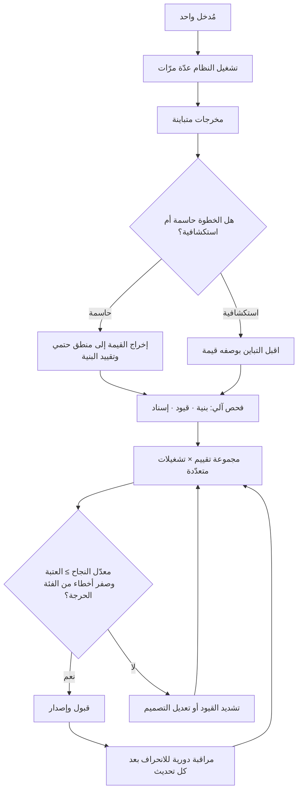

# اللاحتمية (Non-determinism)

> [!info] تعريف مختصر
> خاصّية نظام يعطي **المُدخل نفسه مخرَجًا مختلفًا بين تشغيل وآخر**، دون أن يكون في ذلك عطل. النظام الحتمي (Deterministic) يضمن أن نفس المُدخل ينتج نفس المخرَج دائمًا، وهذا الضمان هو ما بُنيت عليه أغلب ممارسات الاختبار وضبط الجودة والدعم الفنّي: نُعيد إنتاج الحالة، فنرى الخطأ، فنصلحه، فنتحقّق باختبار انحداري ثابت. أمّا في الأنظمة غير الحتمية — وأبرزها اليوم النماذج التوليدية — فيسقط هذا الضمان، فينهار معه ثلاثة أشياء دفعة واحدة: **إعادة إنتاج الخطأ**، و**معيار القبول القائم على المطابقة**، و**توقّعات المستخدم بالثبات**. والخلاصة الإدارية أن اللاحتمية ليست خللًا يُصلَح بل **خاصّية تُدار**: تُقيَّد حيث تضرّ، وتُستثمر حيث تنفع، ويُعاد بناء الجودة حولها على أساس **توزيعات ونطاقات مقبولة** بدل قيمة واحدة صحيحة.

## الشرح العلمي والاحترافي
- **المصطلح أقدم بكثير من الذكاء الاصطناعي**: اللاحتمية مفهوم مؤسّس في علوم الحاسوب ونظرية الحوسبة، ومعروف في هندسة البرمجيات منذ عقود في صور مألوفة: التزامن وتداخل الخيوط (Race Conditions)، وترتيب وصول الرسائل عبر الشبكة، والاعتماد على الوقت أو المولّد العشوائي أو حالة قاعدة بيانات مشتركة. ومن هنا فإن «الاختبارات المتذبذبة» (Flaky Tests) — التي تنجح وتفشل دون تغيير في الشيفرة — هي أقدم صورة يعرفها المهندسون للّاحتمية، وكانت تُعالَج بالعزل وتثبيت المتغيّرات. الجديد في الأنظمة التوليدية أن اللاحتمية فيها **جوهرية في قلب المخرَج** لا عرضية في محيطه.
- **مصادر اللاحتمية في الأنظمة الذكية متعدّدة، وخلطها يعطّل التشخيص**: ① **العشوائية في التوليد نفسه**، وهي المصدر المقصود والقابل للضبط جزئيًّا عبر معاملات التوليد؛ ② **تغيّر السياق المُدخَل** — طابع زمني، أو ترتيب مختلف لنتائج بحث، أو محتوى مستند تغيّر — فالمُدخل هنا ليس هو نفسه فعليًّا وإن بدا كذلك؛ ③ **تغيّر النظام تحت الأداة**: تحديث النموذج أو المزوّد قد يغيّر السلوك دون أي تغيير من طرفك، وهو مصدر خطر تعاقدي وتشغيلي يستدعي تثبيت الإصدار حيث أمكن؛ ④ **اللاحتمية في مسار [[AI Agent|الوكيل]]**: اختيار أداة مختلفة أو ترتيب خطوات مختلف يقود إلى نتيجة مختلفة حتى مع ثبات كل شيء آخر. وقبل أي علاج يجب تحديد **أي مصدر** نتعامل معه، لأن العلاجات مختلفة تمامًا: ما يُعالَج بضبط معامل يختلف عمّا يُعالَج بتثبيت إصدار أو بتنقية السياق.
- **الضبط يقلّل التباين ولا يلغيه**: تخفيض معامل العشوائية يزيد ثبات المخرجات لكنه لا يضمن تطابقًا حرفيًّا، لأسباب تشغيلية تتعلّق بالبنية التحتية وترتيب العمليات الحسابية. لذلك القاعدة الهندسية: **لا تبنِ أي جزء حرج على افتراض التطابق الحرفي للنصّ المولَّد**. وإن كنت تحتاج قيمة ثابتة تمامًا (رقم، رمز، قرار من قائمة مغلقة) فالتصميم الصحيح أن يستخرجها **منطق حتمي** خارج النموذج، أو أن يُقيَّد المخرَج ببنية صارمة تُفحص آليًّا، لا أن تُترك للصياغة الحرّة.
- **الأثر الأول: انهيار الاختبار القائم على المطابقة**: اختبار يقارن المخرَج بنصّ مرجعي (Golden Output) يصير عديم المعنى — يفشل عند مخرَج صحيح ومختلف الصياغة، وينجح عند مخرَج مطابق شكلًا وفاسد مضمونًا. البدائل المعمول بها أربعة، وتُستخدم مجتمعة لا متفرّقة: **① اختبار بنيوي** (هل المخرَج بالصيغة المطلوبة وكل الحقول الإلزامية حاضرة وضمن الأنواع الصحيحة؟) وهو حتمي وسريع ورخيص؛ **② اختبار قيود ومحظورات** (لم يتجاوز السقف، لم يستدعِ أداة ممنوعة، لم يذكر معلومة محظورة، الرقم ضمن نطاق معقول)؛ **③ اختبار خصائص دلالية** (هل الإجابة تتضمّن العناصر المطلوبة؟ هل تتّسق مع المصدر المُعطى؟)؛ **④ مجموعة تقييم ثابتة** (Evaluation Set) تُشغَّل مرارًا ويُقاس عليها **معدّل النجاح** بوصفه نسبة، مع تتبّع اتّجاهه عبر الإصدارات.
- **الأثر الثاني: معيار القبول يتحوّل من قيمة واحدة إلى نطاق واحتمال**: في النظام الحتمي يُقال «المخرَج المتوقّع كذا». وفي النظام غير الحتمي تُصاغ معايير القبول بصيغة إحصائية: «نسبة نجاح لا تقلّ عن 92% على مجموعة تقييم من 200 حالة، وصفر حالات من الفئة الحرجة». وهذا يقتضي تحوّلًا في ثقافة الفريق: التفكير بـ[[Percentiles and Median vs Average|النسب المئوية والوسيط]] بدل القيمة المفردة، والتمييز بين الفشل المقبول والفشل الممنوع منعًا باتًّا. ويجب أن تُدرج هذه الصياغة صراحةً في [[Definition of Done]] ووثائق المتطلّبات وشروط القبول التعاقدية، وإلّا نشأ نزاع لاحق: العميل يفهم «يعمل» بمعنى دائمًا، والفريق يفهمها بمعنى «في الغالب».
- **الأثر الثالث: انهيار «إعادة إنتاج المشكلة» في الدعم والتشخيص**: البلاغ التقليدي يبدأ بـ«افعل كذا ترَ الخطأ». وهنا قد لا يظهر الخطأ عند إعادة المحاولة إطلاقًا، فيُغلق البلاغ خطأً بوصفه «غير قابل للتكرار» بينما هو حقيقي ويتكرّر عند نسبة من المستخدمين. العلاج التشغيلي: **تسجيل شامل لكل تشغيلة** (المُدخل الكامل، السياق، إصدار النموذج، المعاملات، مسار الخطوات، المخرَج) بحيث يُشخَّص الحادث من السجلّ لا من إعادة الإنتاج؛ والتحوّل من «هل يتكرّر؟» إلى «ما نسبة تكرّره؟» عبر تشغيل الحالة عشرات المرّات — وهذا يغيّر جوهريًّا طريقة عمل [[Root Cause Analysis]] في هذه الأنظمة.
- **الأثر الرابع: توقّعات المستخدم والثقة**: المستخدم البشري يقيس موثوقية أي أداة بثباتها. حين يحصل زميلان على إجابتين مختلفتين للسؤال نفسه، أو يحصل المستخدم نفسه على نتيجة تختلف عن أمس، ينشأ إحساس بأن النظام «غير موثوق» حتى لو كانت الإجابتان صحيحتين. وعلاج ذلك ليس تقنيًّا فقط بل تواصلي وتصميمي: **إعلان طبيعة الأداة صراحةً**، وعرض المصدر ليحكم المستخدم بنفسه، و**تثبيت المخرجات التي تحتمل الاستشهاد** (حفظ نسخة معتمدة بدل إعادة توليدها كلما فُتحت)، وضبط اللغة التسويقية بحيث لا تَعِد بثبات لا يوجد.
- **اللاحتمية ليست عيبًا في كل سياق**: في مهام التوليد الإبداعي وتوسيع البدائل واستكشاف الحلول، التباين **قيمة** لا خلل — فهو ما يجعل النظام يقترح ثلاث صياغات مختلفة بدل تكرار واحدة. القاعدة العملية: **قيّد التباين في الخطوات الحاسمة والحسابية، وأطلقه في الخطوات الاستكشافية**. والخلل التصميمي الشائع هو عكس ذلك تمامًا: أنظمة تعطي إجابات متغيّرة في الأرقام والسياسات (حيث الثبات مطلوب) وتعطي صياغات متكرّرة مملّة في المحتوى (حيث التنوّع مطلوب).
- **اللاحتمية تتضاعف مع طول السلسلة**: في [[AI Agent|الوكيل]] لا يتفرّع الاحتمال مرّة واحدة بل عند كل خطوة، فيتّسع فضاء المسارات الممكنة بسرعة كبيرة. ولهذا يستحيل عمليًّا اختبار «كل المسارات»، ويصبح الضبط الفعّال قائمًا على **تقييد فضاء الفعل** نفسه: قائمة أدوات محصورة، وسقف خطوات، ومخرجات مقيّدة ببنية، وفحص آلي بعد كل خطوة يمنع انتقال الانحراف إلى ما بعدها.

## أين ومتى يُستخدم
- **في تصميم استراتيجية الاختبار للأنظمة الذكية**: إعادة بناء [[Regression Testing]] و[[Smoke Testing]] على أساس خصائص وقيود ومعدّلات نجاح بدل مطابقة مخرجات ثابتة.
- **في صياغة معايير القبول والتسليم**: تعديل [[Definition of Done]] و[[UAT]] لتشمل نسب نجاح ونطاقات مقبولة، وتحديد فئة أخطاء ممنوعة تمامًا مهما ندرت.
- **في العقود واتفاقيات مستوى الخدمة**: صياغة التزامات واقعية بدلالة نسب لا بدلالة «صحيح دائمًا»، وربطها بـ[[SLO]] و[[SLI]] ومؤشّرات مقيسة.
- **في الدعم وتحليل الحوادث**: بناء التشخيص على السجلّات وقياس نسبة التكرار بدل الاعتماد على إعادة إنتاج يدوية، مع أثر مباشر على [[MTTR]].
- **في إدارة توقّعات أصحاب المصلحة**: توضيح طبيعة الأداة مبكرًا لتفادي نزاع تفسيري عند التسليم، ضمن [[Communication Plan]].
- **في تقدير الجهد والتخطيط**: التباين يزيد الحاجة إلى دورات ضبط وتقييم متكرّرة، ويرفع [[Estimation Variance]]، ويستدعي احتياطيًّا زمنيًّا معقولًا ([[Contingency Reserve]]).

## مثال وسيناريو تطبيقي
> [!example] شركة برمجيات في الكويت تبني مساعدًا يجيب موظّفي مركز الاتصال عن **سياسات المنتج**. الاتفاق مع العميل نصّ على أن «النظام يعطي الإجابة الصحيحة من دليل السياسات».
> **الأزمة عند قبول التسليم:** فريق العميل جرّب سؤالًا واحدًا خمس مرّات: «كم مدّة استرجاع المنتج؟». الإجابات: مرّتان «14 يومًا من تاريخ الاستلام»، ومرّة «خلال أسبوعين»، ومرّة «14 يومًا، ويمتدّ إلى 30 لعملاء الباقة الذهبية»، ومرّة «يُرجى مراجعة الدليل». **كل الإجابات صحيحة أو غير ضارّة، ومع ذلك رُفض التسليم** — لأن العميل قرأ التباين على أنه عدم استقرار في المنتج، وقال جملة كاشفة: «إن كان يعطيني خمس إجابات فكيف أدرّب 60 موظّفًا عليه؟». المشكلة لم تكن في الدقّة بل في **غياب اتفاق على معنى الصحّة في نظام غير حتمي**.
> **إعادة التأطير:** أعاد الفريق تصميم القبول على ثلاثة مستويات بدل معيار واحد:
> ① **حقائق ثابتة** (مدد، نسب، رسوم، شروط أهلية): تُستخرج من جدول سياسات منظّم عبر **منطق حتمي**، ويُمنع النموذج من توليدها؛ دوره يقتصر على فهم السؤال وصياغة الإجابة حول القيمة المستخرجة. النتيجة: الرقم واحد دائمًا وإن اختلفت الصياغة.
> ② **بنية الإجابة**: قالب ثابت (الإجابة المباشرة → الشرط إن وُجد → رابط بند السياسة)، يُفحص آليًّا؛ وأي إجابة بلا استشهاد ببند تُرفض تلقائيًّا قبل عرضها.
> ③ **مجموعة تقييم** من 180 سؤالًا حقيقيًّا مأخوذة من سجلّ المكالمات، تُشغَّل كل منها 3 مرّات (540 تشغيلة) قبل كل إصدار.
> وأُعيدت صياغة شرط القبول في المستند إلى: «≥ 95% إجابات صحيحة موثّقة ببند، و**صفر** إجابات تخالف رقمًا في جدول السياسات، و≥ 90% التزامًا بالقالب».
> **النتيجة:** في التقييم قبل الإطلاق: 96.1% صحّة، وصفر مخالفة رقمية (لأن الأرقام لم تعد مولَّدة أصلًا)، و93% التزامًا بالقالب. قُبِل التسليم. **وفي الشهر الثالث ظهرت الفائدة العملية الأكبر: تحديث من المزوّد غيّر سلوك النموذج، فرصدت مجموعة التقييم انخفاض الصحّة من 96% إلى 89% قبل أن يشتكي مستخدم واحد** — وهو أمر كان سيمرّ صامتًا لولا وجود قياس متكرّر بدل اختبار مطابقة.

## خطوات أو مخطّط
1. حدّد أين اللاحتمية مقبولة وأين ممنوعة داخل نظامك، خطوةً خطوة.
2. اسحب القيم الحاسمة (أرقام، سياسات، قرارات من قائمة مغلقة) خارج التوليد إلى منطق حتمي أو مصدر منظّم.
3. قيّد شكل المخرَج ببنية صارمة يمكن فحصها آليًّا، وارفض ما يخالفها قبل عرضه.
4. ثبّت ما يمكن تثبيته: إصدار النموذج، والمعاملات، والسياق المُدخَل، وترتيبه.
5. ابنِ مجموعة تقييم من حالات حقيقية، وشغّل كل حالة عدّة مرّات لقياس معدّل النجاح لا نتيجة واحدة.
6. صُغ معيار القبول إحصائيًّا: نسبة نجاح دنيا + فئة أخطاء ممنوعة تمامًا (عتبة صفر).
7. فعّل تسجيلًا كاملًا لكل تشغيلة يكفي للتشخيص دون إعادة إنتاج.
8. راقب الانحراف عبر الزمن (Drift): أعد تشغيل مجموعة التقييم دوريًّا وبعد أي تحديث خارجي.
9. أدر التوقّعات صراحةً مع المستخدم والعميل، وثبّت المخرجات التي يُستشهد بها بدل إعادة توليدها.

## ⚠️ مفاهيم خاطئة شائعة
> [!warning]
> - **«اختلاف المخرجات يعني خللًا»**: التباين خاصّية متوقّعة لا عطل. الخلل الحقيقي هو أن يتغيّر **رقم أو سياسة أو قرار** بين تشغيلين، لا أن تتغيّر الصياغة.
> - **«ضبط المعاملات يجعل النظام حتميًّا»**: يقلّل التباين ولا يلغيه. أي تصميم يفترض تطابقًا حرفيًّا للنصّ المولَّد هشّ بطبيعته.
> - **«تشغيلة واحدة ناجحة دليل كافٍ»**: النجاح المفرد لا يقول شيئًا عن الاحتمال. الحكم يحتاج تشغيلات متعدّدة على حالات متنوّعة ومعدّل نجاح مقيس.
> - **الخلط بين اللاحتمية والخطأ (الهلوسة)**: التباين قد يقع بين إجابتين صحيحتين، والخطأ قد يتكرّر بثبات تامّ. هما محوران مستقلّان، وعلاج كل منهما مختلف.
> - **«البلاغ غير القابل للتكرار غير حقيقي»**: في هذه الأنظمة يكون البلاغ غالبًا حقيقيًّا وباحتمال معيّن. أغلقه فقط بعد قياس نسبة تكرّره على عدّة تشغيلات، لا بعد محاولة واحدة.
> - **«الجودة تُقاس بالمخرَج فقط»**: مع اللاحتمية يجب أن يُقاس **مسار** الإنتاج أيضًا: أي أداة استُدعيت، وأي مصدر استُخدم، وكم خطوة استُهلكت — فمخرَج صحيح عبر مسار خاطئ سينقلب خطأً في الحالة التالية.
> - **«ما دام النظام مستقرًّا اليوم فسيبقى غدًا»**: تحديث المزوّد أو تغيّر البيانات قد يزيح السلوك دون تغيير من طرفك. الاستقرار حالة تُراقَب باستمرار لا تُفترض.

## ❌ ممارسات خاطئة في المشاريع
> [!failure]
> - **الخطأ: كتابة اختبارات تطابق نصّ المخرَج حرفيًّا.** لماذا يضرّ: تفشل عند صواب مختلف الصياغة وتنجح عند فساد مطابق الشكل، فيفقد الفريق ثقته بالاختبارات ثم يعطّلها. الحل: اختبر البنية والقيود والخصائص، وقِس معدّل نجاح على مجموعة تقييم.
> - **الخطأ: توليد الأرقام والسياسات نصًّا بدل استخراجها من مصدر منظّم.** لماذا يضرّ: يُنتج تناقضات صريحة قد تصل إلى العميل وتُنشئ التزامًا خاطئًا. الحل: افصل القيم الحاسمة إلى منطق حتمي و[[Single Source of Truth]].
> - **الخطأ: صياغة شرط قبول تعاقدي بعبارة «الإجابة صحيحة دائمًا».** لماذا يضرّ: التزام يستحيل الوفاء به ويُنشئ نزاعًا مؤجّلًا عند التسليم. الحل: صُغ نسبًا وعتبات وفئة أخطاء ممنوعة، وأدرجها في [[SOW]] و[[Definition of Done]].
> - **الخطأ: إغلاق البلاغات بوصفها «غير قابلة للتكرار» بعد محاولة واحدة.** لماذا يضرّ: تُهمل أخطاء حقيقية متكرّرة عند نسبة من المستخدمين، فتتراكم دون معالجة. الحل: أعد التشغيل عدّة مرّات وسجّل نسبة الظهور، وشخّص من السجلّ لا من المحاولة اليدوية.
> - **الخطأ: عدم تسجيل السياق الكامل لكل تشغيلة.** لماذا يضرّ: يصير التشخيص مستحيلًا بعد ساعات، ويتحوّل التحليل إلى تخمين. الحل: سجّل المُدخل والسياق وإصدار النموذج والمعاملات والمسار والمخرَج، واعتبره شرط إطلاق.
> - **الخطأ: تجاهل الانحراف بعد الإطلاق.** لماذا يضرّ: يتدهور الأداء تدريجيًّا بعد تحديث خارجي دون إنذار حتى تصل الشكاوى. الحل: أعد تشغيل مجموعة التقييم دوريًّا وبعد كل تحديث، وضع عتبة إنذار.
> - **الخطأ: وعد المستخدمين بثبات لا يوجد.** لماذا يضرّ: يُنتج فقدان ثقة أشدّ من الخطأ نفسه، لأنه يكسر توقّعًا صنعته أنت. الحل: اشرح طبيعة الأداة، واعرض المصادر، وثبّت المخرجات المرجعية بحفظها بدل إعادة توليدها.
> - **الخطأ: السماح بالتباين في الخطوات الحاسمة ومنعه في الاستكشافية.** لماذا يضرّ: يجمع أسوأ الخيارين — قرارات متقلّبة ومحتوى مكرّر. الحل: اضبط التباين حسب طبيعة الخطوة كجزء من [[AI Orchestration]].

## 🔗 مصطلحات ومفاهيم ذات صلة
[[AI Agent]] | [[AI Copilot]] | [[AI Orchestration]] | [[Human in the Loop]] | [[Automation Bias]] | [[Definition of Done]] | [[Regression Testing]] | [[Escaped Defect Rate]] | [[Percentiles and Median vs Average]] | [[Single Source of Truth]] | [[SLO]] | [[Root Cause Analysis]]
