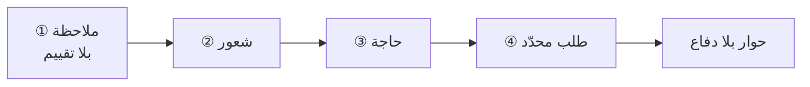

# التواصل اللاعنفي (Nonviolent Communication)
> [!info] تعريف مختصر
> نموذج تواصل من أربع خطوات — **ملاحظة بلا تقييم** ← **شعور** ← **حاجة** ← **طلب محدّد** — غرضه التعبير عن موقفك بلا اتّهام، وسماع موقف غيرك بلا دفاع.

## الشرح العلمي والاحترافي
طوّره **مارشال روزنبرغ (Marshall Rosenberg)** في *Nonviolent Communication: A Language of Life* (2003).

| الخطوة | تعريفها | مثال صحيح | مثال خاطئ |
|---|---|---|---|
| **① ملاحظة** | ما يُرى ويُسمَع فقط، بلا حكم | «اتّفقنا على العاشر ولم يصلني تحديث حتى اليوم» | «أنت دائمًا متأخّر» |
| **② شعور** | حالتك أنت | «أشعر بالقلق» | «أشعر أنّك لا تهتمّ» *(حكم لا شعور)* |
| **③ حاجة** | ما تحتاجه خلف الشعور | «لأنّي أحتاج وضوحًا لأُبلّغ العميل» | — |
| **④ طلب** | فعل محدّد قابل للتنفيذ | «هل تستطيع أن ترسل لي حالة البند اليوم قبل الرابعة؟» | «كن أكثر التزامًا» |

**والخطوة الأولى هي الأهمّ** ويتقاطع فيها النموذج مباشرةً مع قاعدة [[Labeling|التسمية]] «صف الحالة لا الشخص»: كلاهما يُلغي الإسناد السماتي الذي يُنتج الإنكار — انظر [[Fundamental Attribution Error]].

**وفرق جوهري بينه وبين أدوات التفاوض** يستحقّ التصريح:

| | **التواصل اللاعنفي** | **[[Tactical Empathy\|التعاطف التكتيكي]]** |
|---|---|---|
| ما تُفصح عنه | **مشاعرك واحتياجاتك أنت** | حالة **الطرف الآخر** |
| البنية | **تبادلية** — انكشاف متكافئ | **أحاديّة الاتّجاه** |
| متى يصلح | علاقة مستمرّة · تكافؤ نسبي · هدوء | **لحظة حادّة · تفاوت سلطة** |
| أثره الطويل | تكافؤ ومعرفة متبادلة | فاعلية عالية + **عدم تكافؤ متراكم** |

**والنموذجان متكاملان لا متنافسان:** أدوات التفاوض تُدير اللحظة الحادّة؛ والتواصل اللاعنفي يُعالج **عدم التكافؤ** الذي تُنتجه إن استُخدمت وحدها سنوات.

## أين ومتى يُستخدم
- تغذية راجعة على أداء أو سلوك متكرّر.
- التعبير عن اعتراضك أنت في اجتماع بلا اتّهام أحد.
- بعد أن تهدأ الحالة الحادّة — لبناء تفاهم دائم لا لإطفاء حريق.
- في [[Team Working Agreement|اتّفاقية عمل الفريق]]: كيف نُخاطب بعضنا؟

## مثال وسيناريو تطبيقي
> [!example] مالك منتج يُغيّر الأولويات مرارًا. الصياغة الاتّهامية: «أنت تُغيّر الأولويات دائمًا ولا تحترم تخطيطنا» — تُنتج دفاعًا فورًا. والصياغة اللاعنفية: **«في السبرنتات الثلاثة الأخيرة دخلت خمسة بنود بعد بدء السبرنت** *(ملاحظة)*. **وأنا قلق** *(شعور)* **لأنّي أحتاج التزامًا مستقرًّا كي أُعطي العميل مواعيد أثق بها** *(حاجة)*. **هل نتّفق على أن يمرّ أيّ بند جديد بقرار مفاضلة معلن؟»** *(طلب محدّد)*. لاحظ أنّها **لا تُخفّف الرسالة** بل تُزيل منها ما يستدعي الدفاع.

## خطوات أو مخطّط
1. اكتب الملاحظة كما تُسجّلها كاميرا: أفعال وتواريخ وأرقام فقط.
2. سمِّ **شعورك أنت** — واحذر «أشعر أنّك…» فهي حكم متنكّر في صيغة شعور.
3. اذكر **الحاجة** خلف الشعور — وهي غالبًا مصلحة عمل لا مسألة شخصية.
4. اطلب **فعلًا محدّدًا قابلًا للتنفيذ**، لا سمة ولا نيّة.
5. أنهِ بسؤال يترك مجال الرفض — انظر [[Psychological Reactance]].

## ⚠️ مفاهيم خاطئة شائعة
> [!warning]
> - **ليس تلطيفًا للرسالة.** يُزيل ما يستدعي الدفاع ولا يُخفّف المضمون؛ والملاحظة المحدّدة بتواريخ **أشدّ** من عبارة عائمة.
> - **«أشعر أنّك…» ليست شعورًا.** كلّ ما يليها حكم على الآخر. الشعور: قلق · إحباط · ارتياح.
> - **لا يصلح وحده في اللحظة الحادّة.** من يُفصح عن مشاعره أمام مُهاجِم مُشتعِل قد يُقرأ ضعفًا؛ فالترتيب: تهدئة أوّلًا بأدوات اللحظة، ثم التواصل اللاعنفي.

## ❌ ممارسات خاطئة في المشاريع
> [!failure]
> - **طلب غير قابل للتنفيذ** («كن أكثر التزامًا») — لا يُنتج سلوكًا لأنّه لا يصف فعلًا.
> - **استخدامه صيغةً حرفية جامدة** في كلّ جملة — يُلاحَظ فيُقرأ أسلوبًا مُتعلَّمًا؛ المطلوب المبدأ لا القالب.
> - **الخلط بين الحاجة والحلّ** — «أحتاج اجتماعًا أسبوعيًّا» حلّ؛ والحاجة «أن أعرف حالة العمل بلا أن أسأل». انظر [[Positions vs Interests]].
> - **استخدامه بديلًا عن قرار إداري** حين يكون السلوك نمطًا متكرّرًا استُنفدت معه المحادثات.

## 🔗 مصطلحات ومفاهيم ذات صلة
[[Labeling]] | [[Tactical Empathy]] | [[Ruinous Empathy]] | [[Fundamental Attribution Error]] | [[Active Listening]] | [[Team Working Agreement]] | [[Psychological Safety]] | [[Positions vs Interests]]

> [!tip] 💡 إثراء عملي — كورس لعبة العقل
> الفرق بين النموذج التبادلي والنموذج أحاديّ الاتّجاه، وقاعدة «صف الحالة لا الشخص»: [[04 - التسمية - صناعة الجملة المحايدة]].
