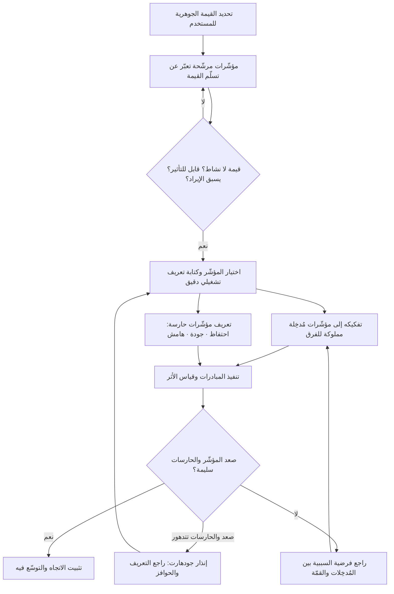

# مؤشّر النجم القطبي (North Star Metric)

> [!info] تعريف مختصر
> مؤشّر واحد تختاره المؤسّسة ليعبّر عن **القيمة الأساسية التي يتلقّاها المستخدم من المنتج فعلًا**، فتلتفّ حوله الفرق المختلفة بدل أن يجرّ كل فريق المنتج في اتجاه مؤشّره الخاص. ليس هدفه أن يلخّص كل شيء، بل أن يحسم سؤال «ما الذي نحسّنه أولًا حين تتعارض أهدافنا؟». مصطلح ذائع في أدبيات النمو وإدارة المنتجات الرقمية، لا معيار رسمي، وتعريفاته تتباين بين الممارسين.

## الشرح العلمي والاحترافي
المشكلة التي يعالجها المؤشّر ليست نقص القياس بل **فائضه المتضارب**. في المؤسّسة المتوسّطة الحجم، يقيس التسويق عدد التسجيلات، وتقيس المبيعات الصفقات المغلقة، ويقيس المنتج استخدام الميزات، وتقيس الهندسة الاستقرار — وكل فريق يحسّن مؤشّره بصدق، بينما تتحرّك المؤسّسة ككل في اتجاهات متعاكسة. حملة تسجيل ناجحة قد ترفع رقم التسجيلات وتخفض جودة المستخدمين وتزيد عبء الدعم. النجم القطبي هو محاولة لوضع **مرجع مشترك أعلى** تُقاس إليه هذه المؤشّرات الفرعية.

### شروط المؤشّر الجيّد
- **يعبّر عن قيمة وصلت للمستخدم فعلًا، لا عن نشاط**: الفارق بين «عدد الجلسات» و«عدد المستخدمين الذين أنهوا مهمّة كاملة» هو الفارق بين قياس الحركة وقياس النفع. عدد التسجيلات والتحميلات وزمن البقاء في التطبيق كلها مؤشّرات نشاط قد ترتفع من الاحتكاك والارتباك بقدر ما ترتفع من القيمة.
- **يمكن للفريق التأثير فيه**: مؤشّر لا يتحرّك بأي قرار داخل سيطرة الفرق يتحوّل إلى ديكور. سعر السهم مثلًا مؤشّر مهم لكنه لا يصلح نجمًا قطبيًّا لفريق منتج.
- **يسبق الإيراد ولا يساويه**: الإيراد نتيجة متأخّرة تعكس ما حدث بالفعل، ولا يخبرك بما تفعله اليوم. النجم القطبي يُختار ليكون **مؤشّرًا مبكّرًا (Leading Indicator)** يُتوقّع أن يقود الإيراد لاحقًا. واختيار الإيراد نفسه نجمًا قطبيًّا يدفع نحو قرارات استخراجية قصيرة الأجل على حساب القيمة.
- **مفهوم وقابل للشرح في جملة**: إن احتاج شرحه إلى شريحتين فلن يوجّه سلوك أحد.
- **قابل للقياس بثبات ودورية معقولة**: مؤشّر يُحدَّث مرة كل ستة أشهر لا يصلح لتوجيه قرارات أسبوعية.
- **يحمل بداخله بُعد الجودة أو التكرار قدر الإمكان**: صياغات مثل «عدد المستخدمين الذين أنجزوا X مرات على الأقل خلال أسبوع» أمتن من العدّ المجرّد لأنها تقاوم التضخيم السطحي.

### بنية المؤشّر والمؤشّرات المُدخِلة (Input Metrics)
النجم القطبي وحده غير قابل للتشغيل: فريق يجلس أمام رقم واحد كبير لا يعرف ماذا يفعل صباح الاثنين. لذلك يُبنى دائمًا كـ**شجرة**: المؤشّر في القمّة، وتحته عدد محدود من **المؤشّرات المُدخِلة** التي يملك كل فريق واحدة منها ويستطيع تحريكها مباشرة. والعلاقة بينها يجب أن تكون **علاقة سببية معقولة ومكتوبة**، لا مجرد تجميع.

مثال على البنية: إذا كان المؤشّر «عدد المستخدمين الذين أنجزوا مهمّة كاملة أسبوعيًّا»، فقد تكون مُدخِلاته: نسبة من يصلون إلى المهمّة الأولى خلال 24 ساعة من التسجيل · متوسّط زمن إنجاز المهمّة · نسبة المحاولات الفاشلة · نسبة العائدين في الأسبوع التالي. هذه الأربعة قابلة للتخصيص لفرق مختلفة، وكل تحسّن فيها يُفترض أن ينعكس صعودًا في القمّة. وحين لا ينعكس، فذلك اكتشاف قيّم بحدّ ذاته: فرضية السببية كانت خاطئة.

هذه البنية هي أيضًا ما يربط النجم القطبي بأطر الأهداف: النجم القطبي يجيب عن «إلى أين؟» على مدى سنوات، بينما [[OKR]] تجيب عن «ماذا هذا الربع؟»، و[[KPI]] هي أدوات المراقبة التشغيلية اليومية. الخلط بين المستويات الثلاثة مصدر إرباك شائع.

### الفخّ الأول: قانون جودهارت (Goodhart's Law)
يُصاغ القانون عادة بالعبارة المشهورة: **«حين يصير المقياس هدفًا، يكفّ عن كونه مقياسًا جيّدًا»**. والسبب أن المقياس ليس هو الظاهرة، بل **بديل مختصر (Proxy)** عنها. وما دام المقياس بلا مكافأة، يبقى ارتباطه بالظاهرة سليمًا. لكن حين تُعلَّق عليه الحوافز والترقيات وتقييم الفرق، يبدأ الناس بتحسين **البديل** بأقصر الطرق — وأقصر الطرق غالبًا لا يمرّ عبر الظاهرة الأصلية.

أمثلة على الأنماط المتكرّرة: إن كان المؤشّر عدد الرسائل المرسلة، تُقسَّم الرسالة الواحدة إلى عدّة رسائل أو تُضاف إشعارات تحرّض على الإرسال. وإن كان زمن الاستخدام، تُصمَّم واجهات أبطأ وأكثر تشتيتًا. وإن كان عدد التذاكر المغلقة في الدعم، تُغلق التذاكر قبل حلّ المشكلة فعلًا. لا يتطلّب أيٌّ من هذا سوء نيّة؛ يكفي أن يكون الناس عقلانيين وأن يكون النظام يكافئ الرقم لا الأثر.

**سبل التخفيف** (لا الإلغاء، فالقانون لا يُلغى):
- إقران المؤشّر بـ**مؤشّرات حارسة (Guardrail Metrics)** يُمنع تدهورها مهما صعد المؤشّر: الاحتفاظ، الجودة، شكاوى الدعم، معدّل الإلغاء، الهامش.
- الفصل بين **مؤشّر التوجيه** و**مقياس تقييم الأداء الشخصي** قدر الإمكان، لأن ربط المكافأة مباشرة بالرقم هو المحرّك الأقوى للتلاعب.
- مراجعة **تعريف** المؤشّر دوريًّا وتوثيق أي تغيير فيه، لأن التلاعب يحدث في التعريف أكثر مما يحدث في البيانات.
- تفسير الحركة سرديًّا لا رقميًّا فقط: **لماذا** ارتفع؟ الارتفاع غير المفهوم ليس نجاحًا بل إنذار.

### الفخّ الثاني: مؤشّر يصعد بينما العمل ينهار
قد يرتفع النجم القطبي ارتفاعًا حقيقيًّا لا تلاعب فيه، بينما تتدهور صحّة العمل تحته. أنماط شائعة:
- **نمو الاستخدام مقابل انهيار الاحتفاظ**: يرتفع عدد المستخدمين النشطين لأن التسويق يضخّ مستخدمين جددًا بوتيرة تفوق وتيرة تسرّب القدامى. الرقم الإجمالي صاعد، والقاعدة تتآكل — وهو ما لا يظهر إطلاقًا إلّا في تحليل الأفواج (Cohorts).
- **نمو الاستخدام مقابل انهيار الهامش**: يرتفع الاستخدام بينما تكلفة خدمة المستخدم الواحد ترتفع أسرع، فيصبح كل مستخدم إضافي خسارة إضافية.
- **نمو مركّز في شريحة غير مستهدفة**: يصعد المؤشّر بفضل شريحة لا تدفع ولا تتحوّل، فيوجّه الفريق نحو تحسين المنتج لمن لن يبقى.
- **نمو مسحوب من المستقبل**: خصومات وحملات ترفع الرقم هذا الربع باستهلاك طلب الأرباع القادمة.

والعلاج المنهجي واحد: **لا يُقرأ النجم القطبي منفردًا أبدًا**، بل ضمن لوحة تضم مؤشّراته المُدخِلة ومؤشّراته الحارسة، ومع تحليل أفواج لا مجاميع فقط، وبمقارنة دائمة بخط أساس معلن ([[Baseline]]).

### لماذا لا يصلح مؤشّر واحد لكل الشركة في كل مرحلة
النجم القطبي **دالّة في المرحلة والاستراتيجية**، لا حقيقة أبدية عن المنتج:
- في مرحلة البحث عن ملاءمة المنتج للسوق، يكون المؤشّر الأنسب عادة مؤشّر **عمق** يعبّر عن وصول قيمة حقيقية لعدد صغير (مثل نسبة من يكرّرون الاستخدام أسبوعيًّا)، لا مؤشّر حجم.
- في مرحلة النمو، ينتقل التركيز إلى **الاتّساع** والتوسّع.
- في مرحلة النضج، تصعد مؤشّرات **الاحتفاظ والكفاءة والهامش**.
- وفي المؤسّسات متعدّدة المنتجات أو ذات الأسواق ثنائية الجانب (عرض وطلب)، غالبًا لا يوجد مؤشّر واحد صادق أصلًا؛ فمحاولة ضغط جانبَي السوق في رقم واحد تنتج مؤشّرًا مركّبًا لا يفهمه أحد ولا يستطيع أحد تحريكه. البديل الواقعي: نجم قطبي لكل خط منتج أو لكل جانب من السوق، مع مؤشّر مالي جامع على مستوى المؤسّسة.
- وتغيير المؤشّر عند تغيّر المرحلة ليس فشلًا بل نضج — بشرط أن يكون التغيير **معلنًا ومُبرَّرًا وموثّقًا**، لا صامتًا بعد ربع سيّئ.

## أين ومتى يُستخدم
- **عند مواءمة فرق متعدّدة** حول اتجاه واحد بعد أن يبدأ تضارب المؤشّرات في إنتاج قرارات متعاكسة.
- **في التخطيط الاستراتيجي السنوي** ومنه تُشتقّ [[OKR]] الربعية.
- **في تصميم لوحات المتابعة**: النجم في القمّة، ومؤشّراته المُدخِلة تحته، ومؤشّراته الحارسة بجانبه.
- **عند تقييم المبادرات قبل تنفيذها**: سؤال «أي مؤشّر مُدخِل تحرّك هذه المبادرة؟» مرشّح ممتاز لتصفية الـ Backlog، ومكمّل طبيعي لمنطق [[Outcome vs Output]].
- **في التواصل مع مجلس الإدارة والمستثمرين**، لتقديم سردية نمو مبنية على القيمة لا على أرقام النشاط.
- **غير مناسب** للفرق الداخلية التي لا تخدم مستخدمًا نهائيًّا مباشرة، ولا كأداة لتقييم أداء الأفراد.

## مثال وسيناريو تطبيقي
> [!example] منصّة تعليمية بنموذج اشتراك. كان المؤشّر المعتمد لدى القيادة هو **المستخدمون النشطون شهريًّا (MAU)**. خلال ثلاثة أرباع ارتفع الرقم من 60,000 إلى 92,000، واحتفلت الفرق بنمو 53%.
> لكن في المراجعة السنوية ظهرت ثلاث حقائق متزامنة: الإيراد نما 6% فقط · الاحتفاظ بعد 90 يومًا هبط من 34% إلى 21% · تذاكر الدعم لكل ألف مستخدم ارتفعت 40%.
> عند تحليل الأفواج تبيّن السبب: النمو كلّه جاء من حملة اكتساب مكثّفة، وكان تعريف «المستخدم النشط» هو **من فتح التطبيق مرة واحدة خلال الشهر**. أي أن المؤشّر كان يقيس فتح التطبيق، لا التعلّم. وكان بعض النمو ناتجًا عن إشعارات متكرّرة تعيد فتح التطبيق دون أي قيمة تعليمية — وهو تجسيد مباشر لقانون جودهارت: صار الهدف تحريك الرقم، فصُمّمت أرخص وسيلة لتحريكه.
> أعادت المؤسّسة تعريف نجمها القطبي إلى: **«عدد المتعلّمين الذين أكملوا درسًا كاملًا واحدًا على الأقل في الأسبوع»** — لأنه يقيس قيمة وصلت فعلًا، ويسبق الاشتراك المتجدّد، وتستطيع الفرق التأثير فيه.
> وبُنيت تحته أربعة مؤشّرات مُدخِلة موزّعة على الفرق: نسبة من يكمل أول درس خلال 48 ساعة من التسجيل · متوسّط الدروس المكتملة لكل متعلّم نشط · نسبة الدروس المهجورة في المنتصف · نسبة العائدين في الأسبوع التالي. وأُضيف مؤشّران حارسان يُمنع تدهورهما: الاحتفاظ بعد 90 يومًا، وتذاكر الدعم لكل ألف مستخدم.
> النتيجة بعد ربعين: رقم القمّة الجديد كان **أصغر بكثير** من MAU القديم — 21,000 متعلّم أسبوعيًّا مقابل 92,000 «نشط» — لكنه كان الرقم الوحيد الذي تحرّك الإيراد معه في نفس الاتجاه.

## خطوات أو مخطّط
1. تحديد **القيمة الجوهرية** التي يأتي المستخدم إلى المنتج لأجلها، بلغة المستخدم لا بلغة المؤسّسة ([[Jobs to be Done]]).
2. صياغة عدّة مؤشّرات مرشّحة تعبّر عن **تسلّم** تلك القيمة، لا عن النشاط المحيط بها.
3. اختبار كل مرشّح بالشروط الأربعة: قيمة لا نشاط · قابل للتأثير · يسبق الإيراد · واضح ومفهوم.
4. التحقّق من وجود **ارتباط تاريخي معقول** بين المرشّح والنتائج المالية في بيانات المؤسّسة نفسها، وتوثيق فرضية السببية صراحة.
5. اختيار مؤشّر واحد وكتابة **تعريف تشغيلي دقيق** له: من يُحتسب؟ خلال أي نافذة؟ وما الذي يُستبعد؟
6. تفكيكه إلى 3–5 مؤشّرات مُدخِلة، وإسناد كل واحدة إلى فريق يملك القدرة على تحريكها.
7. تعريف **مؤشّرات حارسة** يُمنع تدهورها، وعلى رأسها الاحتفاظ والجودة والهامش.
8. إعلان **خط الأساس** ([[Baseline]]) والهدف الزمني، وبناء لوحة متابعة واحدة مشتركة.
9. المراجعة الدورية: هل تحرّك النجم فعلًا مع تحرّك مُدخِلاته؟ وهل بقيت الحارسات سليمة؟
10. مراجعة صلاحية المؤشّر نفسه عند كل تحوّل في المرحلة أو الاستراتيجية، وتغييره علنًا وبتبرير موثّق عند الحاجة.

## ⚠️ مفاهيم خاطئة شائعة
> [!warning]
> - **الظنّ بأن النجم القطبي يعني إلغاء بقية المؤشّرات**: هو مؤشّر **التوجيه** عند التعارض، وليس بديلًا عن مؤشّرات التشغيل والسلامة والمالية.
> - **الخلط بينه وبين [[OKR]] أو [[KPI]]**: النجم اتجاه طويل الأجل نادر التغيير، والـ OKR التزام ربعي محدّد، والـ KPI مؤشّر مراقبة مستمر. الثلاثة طبقات مختلفة لا مترادفات.
> - **اختيار الإيراد نجمًا قطبيًّا**: مؤشّر متأخّر يعكس الماضي، ويدفع نحو سلوك استخراجي على حساب القيمة التي تولّده أصلًا.
> - **اعتبار المؤشّر ثابتًا أبديًّا**: صلاحيته مرتبطة بالمرحلة والاستراتيجية، ومراجعته الواعية علامة نضج لا تقلّب.
> - **افتراض أن الارتباط سببية**: كون مؤشّر يتحرّك مع الإيراد لا يعني أن تحريكه قسريًّا سيحرّك الإيراد. الفرضية السببية تُختبر بالتجربة، ولا تُفترض من الرسم البياني.
> - **الظنّ أن رقمًا أكبر أفضل دائمًا**: مؤشّر أصغر لكنه صادق أنفع بكثير من مؤشّر ضخم مُضخَّم؛ ونزول الرقم بعد تصحيح التعريف نجاح لا انتكاسة.

## ❌ ممارسات خاطئة في المشاريع
> [!failure]
> - **اختيار مؤشّر نشاط بدل مؤشّر قيمة**: التسجيلات والتحميلات وزمن البقاء ترتفع بالاحتكاك والتشتيت بقدر ما ترتفع بالنفع. الحل: اختر مؤشّرًا يتضمّن **إنجاز مهمّة كاملة** لها معنى عند المستخدم، وقيّده بتكرار زمني.
> - **ربط مكافآت الأفراد مباشرة بالمؤشّر**: أقوى محرّك لتفعيل قانون جودهارت. الحل: افصل مؤشّر التوجيه عن تقييم الأداء الفردي، وقيّم بالسلوك والأثر المشترك لا بالرقم الشخصي.
> - **متابعة المؤشّر بلا مؤشّرات حارسة**: يسمح بنموّ يستهلك صحّة العمل دون أن يلاحظ أحد. الحل: ثبّت الاحتفاظ والجودة والهامش كحدود دنيا معلنة تُوقف الاحتفال إن انكسرت.
> - **قراءة المجاميع دون تحليل أفواج**: يخفي تمامًا نمطَ «مستخدمون جدد كثيرون يغطّون تسرّب القدامى». الحل: اعرض المؤشّر مقسّمًا حسب فوج التسجيل وحسب الشريحة دائمًا.
> - **فرض مؤشّر واحد على مؤسّسة متعدّدة المنتجات أو سوق ثنائي الجانب**: ينتج مؤشّرًا مركّبًا لا يملكه أحد ولا يحرّكه أحد. الحل: نجم قطبي لكل خط منتج أو جانب سوق، مع مؤشّر مالي جامع في الأعلى.
> - **الإعلان عن المؤشّر دون تفكيكه إلى مُدخِلات مملوكة**: يبقى شعارًا على شريحة عرض لا يغيّر قرار أحد صباح الاثنين. الحل: لكل فريق مؤشّر مُدخِل واحد يملكه ويستطيع تحريكه هذا الربع.
> - **تغيير تعريف المؤشّر بصمت بعد ربع ضعيف**: يفسد كل السلاسل الزمنية ويقتل الثقة بالقياس. الحل: عامل التعريف كعقد موثّق، وأي تعديل يُعلن مع تاريخه وسببه وإعادة حساب الفترات السابقة.
> - **تفسير الصعود دون معرفة سببه**: قد يكون الارتفاع خللًا في التتبّع أو أثرًا موسميًّا أو تلاعبًا. الحل: اشترط لكل تغيّر ملحوظ تفسيرًا سرديًّا مسنودًا قبل اعتماده نجاحًا.

## 🔗 مصطلحات ومفاهيم ذات صلة
[[KPI]] | [[OKR]] | [[Outcome vs Output]] | [[Adoption]] | [[NPS]] | [[Baseline]] | [[Business Impact]]
