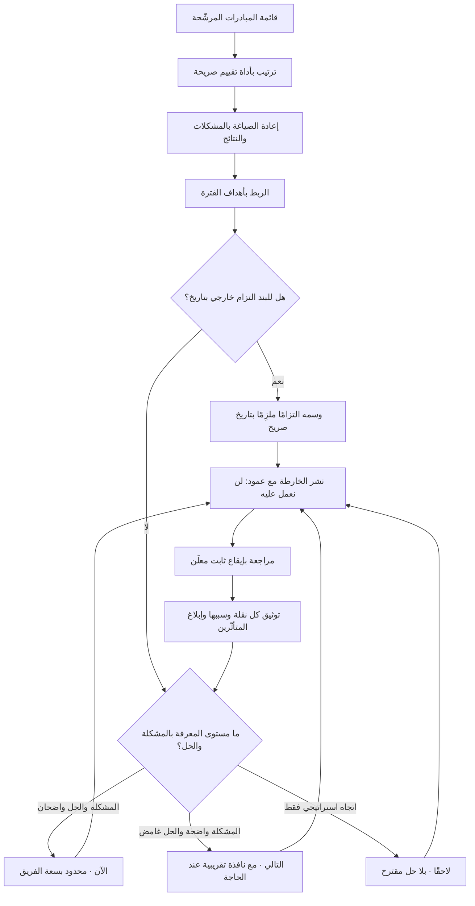

# خارطة طريق الآن/التالي/لاحقًا (Now-Next-Later Roadmap)

> [!info] تعريف مختصر
> شكل من خرائط الطريق يستبدل التواريخ الحادّة بثلاثة **أفق زمنية متدرّجة الثقة**: **الآن (Now)** لما يُعمل عليه فعلًا بفهم واضح وتقدير معقول والتزام قائم، و**التالي (Next)** لما يليه مباشرة بفهم جيّد للمشكلة وغموض في الحل، و**لاحقًا (Later)** لاتجاهات ورهانات مطروحة بلا تفصيل ولا التزام. المنطق الحاكم بسيط وصارم: **دقّة التخطيط يجب أن تتناسب مع مقدار ما نعرفه**، ووضع تاريخ محدّد لبند لم يبدأ اكتشافه بعد ليس دقّة بل ادّعاء دقّة. وتُصاغ بنودها في الحالة الناضجة **بالمشكلات والنتائج المرجوّة** لا بأسماء الميزات، فيبقى للفريق حرّية اختيار الحل بينما يبقى الالتزام قائمًا تجاه النتيجة.

## الشرح العلمي والاحترافي
- **المنشأ والانتشار**: الصيغة شاعت في أوساط إدارة المنتجات الرقمية خلال العقد الثاني من الألفية كردّ فعل على خرائط الطريق المبنية على مخطّطات زمنية بأسلوب [[Gantt Chart]] الممتدّة ١٢–١٨ شهرًا. لا يُنسب الشكل إلى مؤلّف واحد بشكل حاسم؛ فقد تبلور عبر ممارسات متعدّدة، ثم رسّخته أدوات خرائط الطريق التجارية حين جعلته قالبًا افتراضيًّا. ما يُنسب بوضوح هو **الحركة الفكرية** الأوسع التي دفعت إليه: الانتقال من خرائط طريق تعدّد المخرجات إلى خرائط تعدّد النتائج، وهي حركة قادها كتّاب إدارة المنتجات الرقمية في تلك الفترة.
- **الأفق كتعبير عن الثقة لا عن الوقت**: الخطأ الشائع فهم الأعمدة الثلاثة كفترات زمنية (ربع أول، ثانٍ، ثالث). التفسير الأدقّ أنها **درجات ثقة ومعرفة**: بند في "الآن" مفهوم بما يكفي للبدء؛ وبند في "التالي" مفهومة مشكلته لكن حلّه لم يُختبر؛ وبند في "لاحقًا" لا يزال فرضية استراتيجية. عمليًّا، ترتبط الأعمدة بمدى زمني تقريبي (الآن ≈ الربع الجاري، التالي ≈ الربع القادم، لاحقًا ≈ ما بعده) لكن الارتباط تقريبي ومقصود بقاؤه كذلك.
- **قمع الالتزام (Commitment Funnel)**: يمكن قراءة الأعمدة كقمع يضيق فيه العدد ويزداد الالتزام. القاعدة العملية أن يكون في "الآن" عدد قليل جدًّا من البنود (بقدر ما يستطيع الفريق إنجازه فعلًا)، وأن يتّسع العدد كلّما ابتعد الأفق. **خارطة فيها في "الآن" اثنا عشر بندًا لفريق واحد ليست خارطة طريق بل قائمة أمنيات**، وقد ألغت بذلك وظيفتها الأساسية وهي إعلان ما لن يُعمل عليه.
- **صياغة البنود بالمشكلات لا بالميزات**: أقوى نسخة من هذه الخارطة تكتب في "لاحقًا": «خفض نسبة التخلّي عن سلّة الشراء» لا «إضافة محفظة رقمية». السبب منهجي لا تجميلي: كلّما بَعُد الأفق قلّ يقيننا بأن الحل المقترح هو الصحيح، والالتزام بحل بعينه قبل الاكتشاف يقفل الباب على أفضل الاحتمالات ويحوّل الفريق إلى منفّذ طلبات ([[Feature Factory]]). لذلك يُنصح بأن يزداد التجريد كلّما ابتعد العمود: "الآن" قد يذكر حلولًا محدّدة، و"لاحقًا" لا يذكر إلا نتائج ([[Outcome vs Output]]).
- **العلاقة بطرائق التقييم**: هذه الخارطة **ليست طريقة ترتيب أولويات** بل **طريقة عرض وتواصل لنتيجة الترتيب**. الترتيب نفسه يُنتَج بأدوات أخرى — [[RICE Prioritization]] أو [[Weighted Scoring]] أو [[WSJF]] أو [[Opportunity Scoring]] — ثم تُعرض المخرجات في هذا القالب. الخلط بينهما شائع، ويؤدّي إلى خرائط مرتّبة بالانطباع لأن أحدًا لم يسأل: على أي أساس دخل هذا البند عمود "الآن"؟
- **لماذا تنجح مع أصحاب المصلحة**: تنجح حين تُلبّي حاجتهم الحقيقية، وهي غالبًا ليست التاريخ بل **إمكانية التخطيط والاطمئنان**: هل مشكلتي معروفة؟ في أي أفق؟ ومتى سأعرف أكثر؟ فحين تُظهر الخارطة أن مشكلتهم في "التالي"، وتُقرن ذلك بموعد معلوم للمراجعة، تُستبدل معلومة زائفة بمعلومة صادقة — وهي مقايضة يقبلها كثير من أصحاب المصلحة إن شُرحت.
- **لماذا تفشل**: تفشل في حالات محدّدة يجب الاعتراف بها بدل إنكارها. (أ) **حين يوجد التزام خارجي حقيقي بتاريخ**: عقد بمواعيد، أو موعد تنظيمي إلزامي، أو حملة تسويق محجوزة، أو معرض. الأفق المرن هنا ليس نضجًا بل تهرّب. (ب) **حين تحتاج جهات أخرى التنسيق**: فريق التسويق أو التدريب أو المبيعات لا يستطيع التخطيط على "لاحقًا"؛ يحتاج نافذة زمنية ولو تقريبية بعدم يقين معلَن. (ج) **حين تُستعمل غطاءً للغموض**: فريق ينقل البنود بين الأعمدة كل شهر بلا تفسير ولا تسليم يفقد ثقة أصحاب المصلحة أسرع مما يفقدها فريق يتأخّر عن تاريخ معلن ويشرح سبب التأخّر.
- **الحلول الوسط الناضجة**: أشهرها إبقاء الأعمدة الثلاثة مع **إعلان مستوى ثقة صريح** لكل بند (عالٍ/متوسّط/استكشافي)، وإضافة **تواريخ للالتزامات الخارجية فقط** موسومة بوضوح كالتزامات تعاقدية أو تنظيمية، وعرض النطاقات الزمنية كمدى احتمالي لا نقطة واحدة على غرار منطق [[Monte Carlo Simulation]] و[[Percentiles and Median vs Average]]. وأهمّها جميعًا: **إعلان إيقاع مراجعة ثابت** — «تُحدَّث هذه الخارطة أول كل شهر» — لأن ما يقلق أصحاب المصلحة في غياب التواريخ هو الجهل بموعد معرفة المزيد، لا غياب التاريخ ذاته.

## أين ومتى يُستخدم
- **في التواصل مع أصحاب المصلحة الداخليين ([[Stakeholder Map]])**: كواجهة موحّدة تُغني عن نسخ متضاربة من الخطط تتداولها الإدارات.
- **في المنتجات ذات عدم اليقين العالي**: منتجات جديدة، أو استكشاف [[Product-Market Fit]]، أو مبادرات تعتمد على تقنيات غير مستقرّة يصعب تقدير جدولها بثقة.
- **مع الفرق التي تعمل بمنهج الاكتشاف المستمر**: تتناغم بنيويًّا مع [[Continuous Discovery]] و[[Dual-Track Agile]]، إذ يكون "لاحقًا" مساحة الفرضيات و"الآن" مساحة التسليم.
- **في ربط التنفيذ بالأهداف**: تُقرأ مع [[OKR]] بحيث يكون لكل بند في "الآن" و"التالي" ارتباط صريح بهدف الفترة، وإلا فوجوده في الخارطة موضع سؤال.
- **في إبلاغ ما لن يُنفَّذ**: عمود رابع صريح للمستبعَد ([[Non-Goals]]) يمنع بقاء الطلبات المرفوضة معلّقة في أذهان أصحابها إلى الأبد.
- **في عرض مخرجات ورش الأولويات**: نتائج جلسة [[Buy-a-Feature]] أو تقييم موزون تُترجم مباشرة إلى توزيع بنود على الأعمدة الثلاثة.
- **مع خرائط أخرى**: يُقرن العمود الأول بشرائح [[Story Mapping]] لبيان ما يُسلَّم فعلًا داخل الأفق القريب بمستوى تفصيل أعلى.

## مثال وسيناريو تطبيقي
> [!example] شركة برمجيات لوجستية في الرياض كانت تنشر خارطة طريق سنوية بمخطّط زمني يعرض ١٤ مبادرة موزّعة على أربعة أرباع بتواريخ محدّدة. في المراجعة السنوية تبيّن أن **٣ مبادرات فقط** سُلّمت في ربعها المعلَن، و٥ تأخّرت بين شهرين وخمسة أشهر، و٤ أُلغيت كليًّا، واثنتان لم تبدآ. كانت النتيجة أن فريق المبيعات فقد الثقة بالخارطة وتوقّف عن استخدامها، وصار يَعِد العملاء بتواريخ يجمعها من محادثات جانبية مع المهندسين — وهو أسوأ ما يمكن أن يحدث.
> انتقلت الشركة إلى الأفق الثلاثي، وصاغت البنود بالنتائج:
>
> | الأفق | البند | صياغته | الثقة |
> |---|---|---|---|
> | الآن | تقليل زمن تسليم إثبات الاستلام إلى أقل من دقيقتين | نتيجة + حل محدّد قيد التنفيذ | عالية |
> | الآن | إغلاق فجوة الامتثال في تخزين بيانات السائقين ([[PDPL]]) | التزام تنظيمي بتاريخ إلزامي معلَن | ملزِم |
> | التالي | خفض نسبة الشحنات المرتجعة بسبب عنوان خاطئ | مشكلة مفهومة · الحل قيد الاكتشاف | متوسّطة |
> | لاحقًا | تمكين العميل من متابعة الشحنة دون الاتصال بالدعم | اتجاه استراتيجي بلا حل مقترح | استكشافية |
>
> ثلاثة قرارات تصميمية هي التي أنجحت الانتقال:
> **الأول**: البند التنظيمي بقي بتاريخ صريح وسُمّي «التزام ملزِم». الاعتراف بأن بعض البنود لها مواعيد حقيقية منع اتّهام الخارطة بالتهرّب، وحفظ مصداقيتها في نظر الإدارة المالية والقانونية.
> **الثاني**: أُعلن **إيقاع مراجعة ثابت** أول كل شهر مع محضر يوثّق كل نقلة بين الأعمدة وسببها في [[Decision Log]]. هذا عالج القلق الحقيقي لدى المبيعات، الذي لم يكن غياب التاريخ بل الجهل بموعد معرفة المزيد.
> **الثالث**: أُضيف عمود «لن نعمل عليه هذا العام» ضمّ ٦ طلبات متكرّرة مع سبب مختصر لكل منها. المفاجأة أن هذا العمود كان أكثر ما أُشيد به من فرق المبيعات والدعم، لأنه أنهى وعودًا معلّقة كانوا يقدّمونها للعملاء منذ سنتين بلا أساس.
> **أين تعثّرت الطريقة**: فريق التسويق احتجّ بحق أنه لا يستطيع حجز حملة إعلانية على بند في "التالي". فاعتُمد حلّ وسط: يحصل التسويق على **نافذة تقريبية بمدى** («بين منتصف الربع الثالث وبداية الرابع، بثقة متوسّطة») لبنود عمود "التالي" فقط، مع تنبيه صريح بأن النافذة قابلة للتغيير عند المراجعة الشهرية. وبعد سنة، ارتفعت نسبة البنود المُسلَّمة داخل الأفق المعلَن من ٢١٪ إلى **٧٨٪** — ليس لأن الفريق صار أسرع، بل لأن الوعد صار مطابقًا لما تسمح المعرفة المتاحة بالتعهّد به.

## خطوات أو مخطّط
1. اجمع المبادرات المرشّحة كاملةً، ورتّبها أولًا بأداة تقييم صريحة ([[RICE Prioritization]] أو [[Weighted Scoring]] أو [[WSJF]]) — لا تبدأ بتوزيع الأعمدة.
2. أعد صياغة كل بند بالمشكلة أو النتيجة المرجوّة، وليس بالحل، خصوصًا في الأفق البعيد.
3. اربط كل بند بهدف معلَن من أهداف الفترة؛ وأيّ بند لا يرتبط بهدف يحتاج مبرّرًا صريحًا للبقاء.
4. عرّف معنى الأعمدة كتابةً لمنظّمتك: ما شرط دخول بند في "الآن"؟ وما الذي ينقله من "لاحقًا" إلى "التالي"؟ اكتب هذه الشروط ولا تتركها ضمنية.
5. املأ عمود "الآن" **بسعة الفريق الفعلية لا برغبات الإدارة**، مع ترك احتياطي للعمل غير المخطّط ([[Reserve Capacity]]).
6. اعزل الالتزامات ذات المواعيد الحقيقية (تعاقدية أو تنظيمية) وأظهرها بتواريخ ووسم مميّز — لا تُخفها داخل الأفق المرن.
7. أضف عمودًا صريحًا لما لن يُنفَّذ ([[Non-Goals]]) مع سبب مختصر لكل بند.
8. أعلن **إيقاع المراجعة والتحديث** بوضوح على الخارطة نفسها، والتزم به بدقّة — الانضباط في الإيقاع هو ما يشتري الثقة التي فُقدت بغياب التواريخ.
9. عند كل مراجعة، وثّق كل نقلة بين الأعمدة وسببها، وأبلغ المتأثّرين بها بشكل استباقي لا عند سؤالهم.
10. اقرن كل بند في "الآن" بمقياس نجاح محدّد، وراجعه بعد التسليم؛ فبند سُلّم ولم يحقّق نتيجته يعود إلى الخارطة لا يُشطب منها.

## ⚠️ مفاهيم خاطئة شائعة
> [!warning]
> - **الظنّ بأنها تعني رفض الالتزام**: الالتزام قائم لكنه ينصبّ على **النتائج والأفق** بدل التواريخ الدقيقة للميزات. والفريق الذي لا يلتزم بشيء إطلاقًا لا يمارس هذه الطريقة بل يستعملها ذريعة.
> - **اعتبار الأعمدة أرباعًا زمنية مقنَّعة**: من يقرأها "الربع الأول/الثاني/الثالث" يعيد إنتاج مشكلة التواريخ نفسها بغلاف جديد، ويفقد المعنى الأصلي وهو تدرّج الثقة.
> - **الخلط بينها وبين طريقة لترتيب الأولويات**: هي **قالب عرض وتواصل** لنتيجة ترتيب تمّ بأداة أخرى. غياب أداة الترتيب خلفها يجعل توزيع الأعمدة انطباعيًّا ويحوّل الخارطة إلى واجهة لقرارات غير مبرّرة.
> - **افتراض أنها تصلح لكل السياقات**: في المشاريع التعاقدية ذات المخرجات والمواعيد المحدّدة، أو في البيئات التي تحكمها مواعيد تنظيمية، تبقى الحاجة إلى [[Milestone]] وتواريخ ملزمة قائمة — ويمكن الجمع بين الشكلين لا استبدال أحدهما بالآخر.
> - **الظنّ بأن عمود "لاحقًا" مستودع لكل شيء**: تحويله إلى مقبرة لمئات الطلبات يُفقده معناه كإعلان اتجاه استراتيجي. القاعدة: بضعة رهانات معدودة، وما عداها يُعلَن بوضوح ضمن ما لن يُنفَّذ.
> - **الاعتقاد بأن غياب التواريخ يُلغي الحاجة إلى التقدير**: التقدير لا يزال ضروريًّا داخليًّا لتخطيط السعة وترتيب البنود؛ ما تغيّر هو **ما يُعلَن خارجيًّا**، لا ما يُحسب داخليًّا.

## ❌ ممارسات خاطئة في المشاريع
> [!failure]
> - **الخطأ: حشو عمود "الآن" ببنود تتجاوز سعة الفريق أضعافًا.** لماذا يضرّ: يُلغي وظيفة الخارطة الأساسية — إعلان ما لن يُعمل عليه — ويُنتج تعدّد مهام يطيل زمن الدورة ([[Cycle Time]]) ويخفض الإنتاجية فعليًّا. الحل: اربط عدد بنود "الآن" بحدّ عمل جارٍ صريح ([[WIP Limit]])، ولا تُدخل بندًا جديدًا إلا بإخراج آخر.
> - **الخطأ: استخدام الأفق المرن للتهرّب من التزام تعاقدي أو تنظيمي حقيقي.** لماذا يضرّ: يُفقد الخارطة مصداقيتها أمام الشؤون القانونية والمالية والمبيعات، وقد يعرّض الشركة لمخاطر امتثال حقيقية. الحل: افصل «الالتزامات ذات المواعيد» في قسم مستقلّ بتواريخ صريحة، وتعامل معها بمنطق [[Milestone]] لا بمنطق الأفق.
> - **الخطأ: نقل البنود بين الأعمدة بلا توثيق ولا إبلاغ.** لماذا يضرّ: يتشكّل انطباع بأن الخارطة عشوائية وأن لا أحد مسؤول عمّا وُعد به، فيتوقّف أصحاب المصلحة عن الاعتماد عليها ويعودون إلى القنوات الجانبية. الحل: محضر تغييرات مع كل تحديث يذكر ما تحرّك ولماذا، ورسالة استباقية لكل متأثّر.
> - **الخطأ: صياغة البنود كأسماء ميزات في كل الأعمدة.** لماذا يضرّ: يقفل الحل قبل الاكتشاف، فيُلزم الفريق ببناء ما قد يثبت البحث لاحقًا أنه ليس أفضل حل، ويحوّل الفريق إلى منفّذ طلبات. الحل: اشترط أن تُكتب بنود "لاحقًا" و"التالي" كمشكلات أو نتائج مقيسة، واترك أسماء الحلول لعمود "الآن" فقط.
> - **الخطأ: نشر الخارطة مرّة ثم إهمالها أشهرًا.** لماذا يضرّ: خارطة قديمة أسوأ من غياب خارطة، لأنها تنشر معلومات خاطئة يخطّط عليها الآخرون فعليًّا. الحل: أعلن إيقاع تحديث ثابتًا واجعله مسؤولية شخص مسمّى، وضع تاريخ آخر تحديث ظاهرًا في أعلى الخارطة.
> - **الخطأ: بناء الخارطة داخل فريق المنتج وحده ثم إعلانها.** لماذا يضرّ: تُفاجَأ المبيعات والتسويق والدعم بما لا يستطيعون التخطيط عليه، فيقاومون الخارطة أو يتجاوزونها. الحل: أشرك ممثّلي الوظائف المتأثّرة في مراجعة ما قبل النشر، وامنحهم نوافذ تقريبية معلَنة عدم اليقين لبنود "التالي".
> - **الخطأ: عدم قياس نتيجة ما سُلّم من عمود "الآن".** لماذا يضرّ: تتحوّل الخارطة إلى عدّاد تسليم ميزات لا إلى أداة تحقيق نتائج، وهي عودة كاملة إلى ما جاءت لتصلحه. الحل: اقرن كل بند بمقياس نجاح، وراجعه بعد فترة كافية، وأعد البند إلى الخارطة إن لم تتحقّق نتيجته.

## 🔗 مصطلحات ومفاهيم ذات صلة
[[RICE Prioritization]] | [[Weighted Scoring]] | [[WSJF]] | [[MoSCoW Prioritization]] | [[ICE Scoring]] | [[Opportunity Scoring]] | [[Buy-a-Feature]] | [[Story Mapping]] | [[Outcome vs Output]] | [[OKR]] | [[Non-Goals]] | [[Stakeholder Map]] | [[Milestone]] | [[Gantt Chart]] | [[Continuous Discovery]] | [[GIST Planning]]
