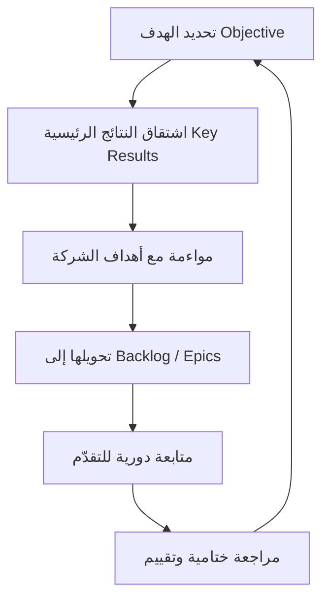

# الأهداف والنتائج الرئيسية (OKR)
> [!info] تعريف مختصر
> OKR اختصار لـ Objectives and Key Results، وهو إطار عمل لتحديد الأهداف يربط بين "هدف" (Objective) نوعي وملهم، و"نتائج رئيسية" (Key Results) كمّية وقابلة للقياس تُثبت تحقّق الهدف. يُستخدم لمواءمة جهود الأفراد والفرق والشركة مع الاستراتيجية العامة.

## الشرح العلمي والاحترافي
- **الهدف (Objective)**: جملة نوعية تصف أين تريد الوصول إليه. يجب أن يكون طموحًا وواضحًا وملهِمًا، وليس بالضرورة رقميًا.
- **النتائج الرئيسية (Key Results)**: عادة 2-5 نتائج لكل هدف، كل منها مقياس رقمي يوضّح كيف نعرف أننا وصلنا للهدف. يجب أن تكون قابلة للقياس والتحقّق، وليست قائمة مهام.
- الفكرة الجوهرية: الهدف يجيب عن سؤال "ماذا نريد أن نحقق؟"، والنتائج الرئيسية تجيب عن سؤال "كيف نعرف أننا حققناه؟".
- تُعتمد OKR عادة على مستويين أو ثلاثة: مستوى الشركة، ثم الفريق أو القسم، وأحيانًا الفرد؛ بحيث تتوافق OKR الفرق مع OKR الشركة (Alignment) دون أن تكون نسخة حرفية منها.
- عادة تُقيَّم النتائج الرئيسية بمقياس من 0 إلى 1.0 (أو 0% إلى 100%)، وتحقيق نسبة 0.6-0.7 يُعتبر جيدًا إذا كانت الأهداف طموحة بما فيه الكفاية (Stretch Goal)، لأن تحقيق 100% دائمًا يعني أن الأهداف كانت متحفظة جدًا.
- تختلف OKR عن مؤشرات الأداء الرئيسية (KPI) في أن KPI يقيس صحة عملية مستمرة، بينما OKR يقيس تقدّمًا نحو تغيير أو طموح محدد خلال فترة زمنية معينة.

## أين ومتى يُستخدم
- تُستخدم عادة على دورة ربع سنوية (Quarter) أو سنوية في الشركات التي تتبنى إدارة استراتيجية شفافة، بغض النظر عن كون فرقها Agile أو تقليدية.
- شائعة في شركات التقنية (مثل Google وIntel التي ابتكرتها)، لكنها صالحة لأي منظمة تريد ربط العمل اليومي بالاستراتيجية.
- تُستخدم في بداية كل ربع سنة لتحديد الأولويات، وفي اجتماعات مراجعة دورية (أسبوعية أو شهرية) لمتابعة التقدّم، وفي نهاية الربع لتقييم النتائج واستخلاص الدروس قبل صياغة OKR التالية.
- تتكامل جيدًا مع Scrum وKanban: يمكن لملحمة (Epic) أو عناصر الـ Backlog أن تُشتق من نتيجة رئيسية معينة لتوضيح كيف يخدم عمل الفريق اليومي الهدف الأكبر.

## مثال وسيناريو تطبيقي
> [!example] شركة "نُظم" لتطوير تطبيقات الجوّال حددت لفريق المنتج في الربع الثالث من 2026 الهدف التالي: "جعل تطبيق التوصيل الخيار الأول للمستخدمين الجدد في السوق المحلي". النتائج الرئيسية:
> 1. رفع معدل تفعيل المستخدمين الجدد (Activation Rate) من 40% إلى 65%.
> 2. تقليل زمن أول طلب ناجح (Time to First Order) من 6 أيام إلى يومين.
> 3. الوصول إلى صافي نقاط الترويج (NPS) لا يقل عن 45.
> فريق التطوير حوّل النتيجة الثانية إلى ملحمة (Epic) باسم "تبسيط تدفق الطلب الأول"، وقسّمها إلى قصص مستخدم في الـ Backlog. في نهاية الربع تحقّق 70% من الهدف: Activation وصل إلى 58%، والزمن انخفض إلى 2.5 يوم، وNPS بلغ 42. الفريق اعتبر هذا نجاحًا جزئيًا جيدًا لأن الهدف كان طموحًا، وصاغ OKR جديدة للربع التالي بناءً على الدروس المستفادة.

## خطوات أو مخطّط
1. صياغة الهدف (Objective) على مستوى الشركة أو الفريق، بلغة ملهمة وواضحة.
2. اشتقاق 2-5 نتائج رئيسية قابلة للقياس لكل هدف.
3. مواءمة OKR الفرق مع OKR الشركة (Alignment) دون نسخ حرفي.
4. تحويل النتائج الرئيسية إلى عناصر عمل ملموسة (ملاحم، قصص) في الـ Backlog.
5. متابعة أسبوعية أو شهرية لدرجة التقدّم (0 إلى 1.0).
6. مراجعة ختامية في نهاية الفترة: تقييم، استخلاص دروس، صياغة OKR جديدة.

## ⚠️ مفاهيم خاطئة شائعة
> [!warning]
> - الاعتقاد بأن OKR هي قائمة مهام (To-do List): OKR تصف نتائج وتأثيرًا، وليست خطوات تنفيذية.
> - الخلط بين OKR وKPI: KPI يراقب صحة عملية مستمرة، أما OKR فيقيس تقدّمًا نحو تغيير محدد بفترة زمنية.
> - الاعتقاد بأن تحقيق 100% من OKR دائمًا أمر جيد؛ في الواقع قد يعني أن الأهداف كانت متحفظة جدًا وغير طموحة.

## ❌ ممارسات خاطئة في المشاريع
> [!failure]
> - **ربط OKR مباشرة بتقييم الأداء الفردي ومكافآت الموظفين**: يدفع الناس لصياغة أهداف سهلة التحقيق بدلًا من أهداف طموحة. الحل: فصل تقييم الأداء عن تتبع OKR.
> - **صياغة عدد كبير جدًا من الأهداف والنتائج**: يشتت التركيز. الحل: الاقتصار على 3-5 أهداف كحد أقصى لكل مستوى.
> - **عدم متابعة OKR بعد صياغتها إلا في نهاية الفترة**: يفقدها قيمتها كأداة توجيه. الحل: مراجعة أسبوعية أو نصف شهرية قصيرة لتتبع الدرجة.

## 🔗 مصطلحات ومفاهيم ذات صلة
[[Alignment]] | [[KPI]] | [[SMART Goals]] | [[Stretch Goal]] | [[Epic]] | [[Backlog Refinement]] | [[Outcome vs Output]] | [[13 - Backlog]] | [[15 - Roadmap]]
