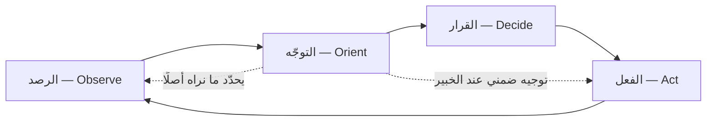

# حلقة OODA (OODA Loop)

> [!info] تعريف مختصر
> **حلقة OODA** نموذج لاتّخاذ القرار في البيئات التنافسية سريعة التغيّر، وضعه العقيد الأمريكي **جون بويد (John Boyd)**، وحروفه اختصار لأربع مراحل: **الرصد (Observe)** — جمع ما يقع فعلًا، ثم **التوجّه (Orient)** — بناء صورة ذهنية لمعنى ما رُصد، ثم **القرار (Decide)** — اختيار فرضية عمل، ثم **الفعل (Act)** — تنفيذها ورصد ما ينتج عنها. والفكرة المحورية فيها **ليست السرعة وحدها**، بل أن تجدّد صورتك عن الموقف أسرع ممّا يجدّد خصمك صورته، حتى تصير أفعالك مبنيّة على واقع اليوم وأفعاله مبنيّة على واقع الأمس.

## الشرح العلمي والاحترافي

نشأت الحلقة في سياق عسكري لا إداري. فقد كان بويد طيّارًا مقاتلًا ومحلّلًا، وشغله سؤال محدّد: **لماذا كانت طائرة F-86 الأمريكية تتغلّب على الميغ-15 السوفييتية في كوريا** مع أن الميغ تفوقها في السرعة القصوى والتسلّق؟ وكان جوابه أن الأولى **تنتقل بين المناورات أسرع** — بفضل مظلّة رؤية أوسع وتحكّم هيدروليكي أخفّ — فيصير الطيّار السوفييتي في كل لحظة يردّ على وضعٍ قد تجاوزه خصمه. ثم عمّم بويد هذه البصيرة في سلسلة عروضه — أشهرها *Patterns of Conflict* (1986) و*The Essence of Winning and Losing* (1996) — ولم يُصدر فيها كتابًا قطّ، فبقيت أفكاره في شرائح ومحاضرات هي مصدرها الأصلي.

وأكثر ما يُساء فهمه في هذه الحلقة أنها تُرسم دائرةً من أربع محطّات متساوية. **ومخطّط بويد نفسه ليس كذلك:** فمرحلة **التوجّه** فيه أكبر المراحل وأكثفها، وتتفرّع منها أسهم راجعة إلى المراحل الثلاث الأخرى. وعلّة ذلك أن التوجّه هو الذي **يقرّر ماذا ترى أصلًا** — فالفريق الذي يقيس رضا العميل بعدد التذاكر المغلقة لا «يرصد» شكوى العميل غير المُذكّرة في تذكرة، لأن صورته الذهنية لا تحتوي على مكان لها.

وقد عدّ بويد أربعة روافد تتشكّل منها هذه الصورة: **الموروث الثقافي**، و**الخبرة السابقة**، و**المعطيات الجديدة**، و**قدرة الشخص على التحليل والتركيب**. والثلاثة الأولى تُبطئ التحديث وتقاومه، والرابع وحده هو الذي يكسرها.

ومن مخطّطه أيضًا فكرة **التوجيه الضمنيّ (Implicit Guidance and Control)**: أن الخبير في مجاله يقفز من التوجّه إلى الفعل بلا مرحلة قرار واعية — كالطبيب الذي يميّز الحالة الحرجة قبل أن يستكمل الفحص. وهذا ليس تجاوزًا للحلقة بل نضجٌ فيها، وهو ما يفسّر لماذا يكون الفريق المتمرّس أسرع من الفريق الذي يملك المعلومات نفسها.

**والمقصود بـ«الدخول داخل حلقة الخصم»** ليس أن تركض أسرع، بل أن يبلغ إيقاعك حدًّا يجعل صورته عن الموقف **قديمة قبل أن يتصرّف بها**. فيدخل في ارتباك متراكم: كلّما ردّ، ردّ على ما مضى. ولهذا فإن تسريع الحلقة بلا تحسين التوجّه يُنتج ما هو أسوأ من البطء — قرارات خاطئة تُتّخذ أسرع.

## أين ومتى يُستخدم

- في **إدارة الحوادث التشغيلية** (وهي في [[ITIL 4]] باب قائم بذاته): حيث لا تُتاح مهلة لقياس دقيق، والقرار يُتّخذ على معلومات ناقصة تتجدّد كل دقيقة — ويُقاس أثر إتقان الحلقة في [[MTTR|متوسّط زمن الإصلاح]].
- في **الأسواق التنافسية** حين يستجيب منافس لكل خطوة تخطوها، فتصير المسألة إيقاعًا متبادلًا لا خطّة ثابتة.
- في **اكتشاف المنتج المبكّر** ([[Product Discovery]]) حيث المشكلة نفسها غير مستقرّة، فتتغيّر مع كل تجربة.
- في **إدارة الأزمات** والمواقف التي يصفها [[Cynefin|إطار كَنِڤِن]] بالفوضوية (Chaotic) أو المعقّدة (Complex)، إذ يوصي الإطار فيها بالفعل ثم الاستشعار — وهو منطق OODA نفسه.
- **ولا تصلح** حيث تكون العملية مستقرّة ومقيسة، فتلك موضع [[PDCA]] و[[DMAIC]] لا موضعها.

## مثال وسيناريو تطبيقي

> [!example] سيناريو ملموس
> منصّة حجز عيادات اسمها **«موعدي»** يخرج منافس لها بميزة «حجز فوري خلال 60 ثانية» في موسم الذروة. والخطّة السنوية الموضوعة تقول إن التحسينات القادمة في بوّابة الدفع.
>
> - **الرصد (يوم 1):** لا يكتفي الفريق بأرقام لوحة المؤشّرات، بل يرصد ثلاثة أشياء معًا: انخفاض إتمام الحجز 9%، وارتفاع مكالمات الدعم بسؤال «كم يستغرق التأكيد؟»، وتغيّر لغة إعلانات المنافس.
> - **التوجّه (يوم 2):** يكتشف الفريق أن صورته الذهنية كانت خاطئة: كان يقيس **زمن الحجز التقني** (4 ثوانٍ)، والعميل يقيس **زمن التأكيد من العيادة** (ساعتين وسيطًا). فالمنافس لم يُسرع نظامه، بل ألغى انتظار التأكيد بأن ضمن المواعيد على حسابه.
> - **القرار (يوم 3):** يقرّر الفريق تجربة **تأكيد فوريّ مضمون** على ثلاث عيادات فقط، مع بند تعويض إن أُلغي الموعد.
> - **الفعل (الأسبوع 2):** يُنفَّذ. فيرتفع الإتمام في العيادات الثلاث 22%، وتظهر مشكلة لم تكن في الحسبان: تضارب في جداول طبيبين. **وهذه المشكلة الجديدة مدخل الحلقة التالية.**
>
> **وموضع الدرس:** أنّ الحلقة لم تنجح لأن الفريق تحرّك بسرعة، بل لأنه **صحّح المقياس الذي كان يحجب عنه المشكلة** في مرحلة التوجّه. ولو أسرع بلا هذا التصحيح لبنى ميزةً أسرع في المكان الخطأ.

## خطوات أو مخطّط

1. **ارصد بلا تصفية مبكّرة**: اجمع الإشارة الكمّية والنوعية معًا، واحرص على المصادر التي لا تمرّ بلوحة مؤشّراتك.
2. **وجِّه — وهذه أثقل الخطوات**: اسأل صراحةً «أي افتراض عندي قد يكون بطل مفعوله؟»، وميّز ما رأيته عمّا فسّرته.
3. **قرّر بفرضية قابلة للإبطال**: القرار هنا ليس خطّة طويلة بل رهانٌ يُعرف بأي شيء يظهر خطؤه ([[Kill Criteria|شروط الإيقاف]]).
4. **افعل بأصغر خطوة تُنتج إشارة**: الغاية من الفعل معرفةٌ لا إنجاز وحده.
5. **أعد الكرّة فورًا** بما نتج، ولا تنتظر اكتمال الخطة الأصلية.

## ⚠️ مفاهيم خاطئة شائعة

> [!warning]
> - **أنها دعوة إلى السرعة وحدها.** السرعة نصف الفكرة، ونصفها الآخر جودة التوجّه. والحلقة السريعة بتوجّه فاسد تُنتج أخطاء أكثر في زمن أقصر — وهي أسوأ من التمهّل.
> - **أنها أربع محطّات متساوية على دائرة.** مخطّط بويد يجعل **التوجّه** مركزًا تتفرّع منه أسهم راجعة إلى المراحل كلّها، لأنه هو الذي يشكّل الإدراك ذاته.
> - **الخلط بينها وبين [[PDCA]]**. تلك دورة **تحسين** تفترض عمليةً قائمة يمكن قياسها وتكرار التجربة عليها؛ وهذه حلقة **قرار** تفترض خصمًا أو سوقًا يتحرّك ويردّ عليك. وجدول التمييز في [[PDCA]] يفصّل الفرق.
> - **أنها نموذج عسكري لا يصلح للأعمال.** الأصل عسكريّ، لكن الآلية — تجديد الصورة الذهنية أسرع من تقادمها — عامّة في كل بيئة تنافسية.

## ❌ ممارسات خاطئة في المشاريع

> [!failure]
> - **الاكتفاء بلوحة المؤشّرات مرحلةَ رصد**: فاللوحة لا تعرض إلا ما قرّرتَ سلفًا أنه مهمّ، وأخطر التغيّرات ما لا عمود له فيها. **التجنّب:** اجعل لكل دورة مصدرًا واحدًا على الأقلّ من خارج اللوحة — مكالمة عميل، أو قراءة لتذاكر الدعم نصًّا.
> - **حذف مرحلة التوجّه عمليًّا**: يُقفز من الرصد إلى القرار بحجّة ضيق الوقت، فيُفسَّر الرقم بالافتراض القديم نفسه الذي أوقع في المشكلة. **التجنّب:** سؤال واحد مكتوب قبل كل قرار عاجل: «ما الذي يجب أن يكون صحيحًا حتى يصحّ هذا التفسير؟».
> - **تسريع الحلقة بلا صلاحية**: فريق يرصد ويحلّل ويقرّر ثم ينتظر اعتماد لجنة تجتمع أسبوعيًّا — فتُقاس الحلقة بأبطأ حلقاتها لا بأسرعها. **التجنّب:** حدّد سلفًا مدى القرار الذي يملكه الفريق بلا تصعيد ([[Guard Rails|حواجز الحماية]]).
> - **جعل «الفعل» تنفيذًا كاملًا لا تجربة**: فيصير الخطأ مكلفًا إلى حدّ يمنع الاعتراف به، فتتوقّف الحلقة عند أوّل دورة.

## 🔗 مصطلحات ومفاهيم ذات صلة

[[PDCA]] | [[DMAIC]] | [[Cynefin]] | [[VUCA]] | [[Feedback Loop]] | [[Kill Criteria]] | [[Reversible vs Irreversible Decisions]] | [[Blameless Postmortem]] | [[Guard Rails]] | [[Systems Thinking]] | [[Data Informed vs Data Driven]] | [[Knightian Uncertainty]]
