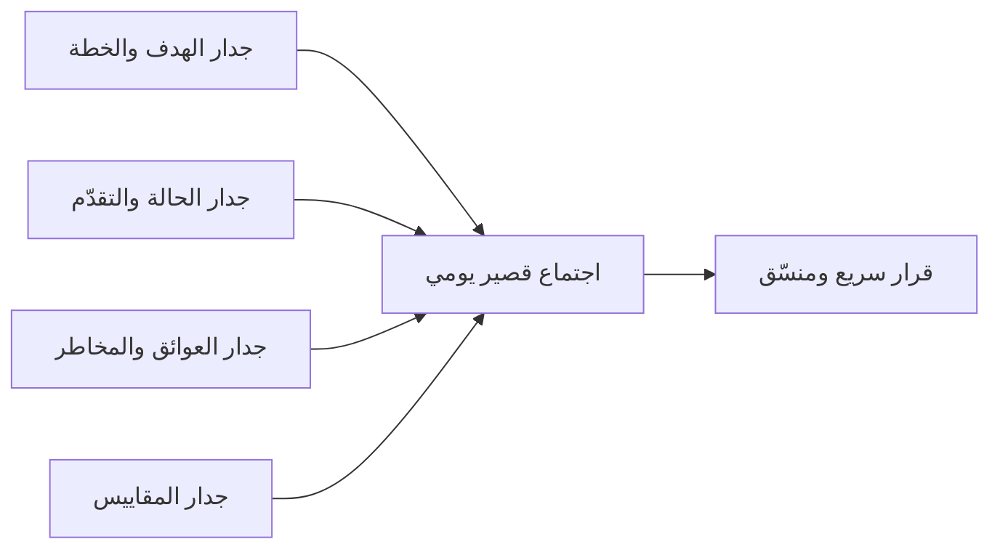

# غرفة أوبيا (Obeya)
> [!info] تعريف مختصر
> "أوبيا" كلمة يابانية تعني "الغرفة الكبيرة". هي مساحة مادية (أو رقمية) مخصصة يجتمع فيها فريق المشروع أو قيادة المشروع حول لوحات بصرية شاملة (خطط، مقاييس، مخاطر، حالة العمل) لاتخاذ قرارات سريعة ومنسّقة.

## الشرح العلمي والاحترافي
نشأت فكرة أوبيا داخل [[Toyota Production System|نظام إنتاج تويوتا]] كغرفة يجتمع فيها قادة تطوير منتج جديد مع كل المعلومات الحرجة معروضة على الجدران في مكان واحد، بدل تشتّتها في تقارير وملفات منفصلة. الفكرة الأساسية: **رؤية واحدة، مكان واحد، قرار أسرع**.

في سياق إدارة المشاريع الحديثة، تحتوي غرفة أوبيا عادة على:
- لوحة الهدف والاستراتيجية (خارطة الطريق، [[OKR]]).
- لوحة حالة العمل ([[Task Boards]] أو [[Burndown Chart]] / [[Burnup Chart]]).
- لوحة المخاطر والعوائق ([[Risk Register]]، [[RAID Log]]، [[Blocker]]).
- لوحة المقاييس الرئيسية ([[KPI]]، [[Throughput]]، [[Cycle Time]]).

الفرق عن اجتماع عادي أن المعلومات **دائمة العرض** ومُحدَّثة باستمرار، وليست شرائح تُعرض ثم تختفي. أي شخص يدخل الغرفة يفهم حالة المشروع خلال دقائق دون شرح شفهي طويل. هذا يخلق ما يُسمى "الشفافية الجذرية" ([[Radical Transparency]]) ويُسرّع اتخاذ القرار الجماعي لأن جميع المعنيين يرون نفس الحقيقة ([[Single Source of Truth]]) في نفس الوقت.

مع انتشار العمل عن بُعد، تحوّلت أوبيا الفعلية إلى "أوبيا رقمية" (Virtual Obeya) — لوحة رقمية دائمة (مثل لوحة Miro أو Confluence) تُحاكي نفس الوظيفة.

## أين ومتى يُستخدم
- في إدارة برامج كبيرة متعددة الفرق (Scaled Agile) حيث يحتاج القادة رؤية موحّدة عبر عدة مشاريع.
- في مراحل حرجة من المشروع (إطلاق منتج، أزمة، تسليم كبير) حيث يُنشأ "غرفة حرب" مؤقتة لمتابعة يومية مكثفة.
- كأداة دعم لاجتماعات [[07 - Daily Standup]] أو مراجعات الحالة الأسبوعية.
- عند الحاجة لتوحيد رؤية أصحاب المصلحة المتعددين ([[Stakeholder Map]]).

## مثال وسيناريو تطبيقي
> [!example]
> شركة "تِرافيجن" تُطلق منصة تجارة إلكترونية جديدة خلال 90 يومًا، بمشاركة أربعة فرق: الواجهة الأمامية، الخلفية، الدفع، والبنية التحتية. مدير البرنامج ينشئ غرفة أوبيا فعلية في الطابق الثالث تحتوي على:
> - جدار "الخطة الرئيسية" بالمعالم الكبرى ([[Milestone]]) لكل فريق.
> - جدار "الحالة اليومية" بالألوان (أخضر/أصفر/أحمر — [[RAG Status]]) لكل مسار عمل.
> - جدار "العوائق الحرجة" حيث يُلصق كل فريق أي [[Blocker]] يعيق تقدّمه فور ظهوره.
> - جدار "المقاييس" يعرض [[Throughput]] الأسبوعي و[[Escaped Defect Rate]].
> 
> كل صباح الساعة 9، يجتمع ممثل واحد من كل فريق لمدة 15 دقيقة فقط أمام هذه الجدران. لأن كل المعلومات معروضة مسبقًا، لا يحتاجون لشرح الخلفية — يناقشون فقط القرارات: "فريق الدفع متأخر بسبب اعتماد خارجي، من يستطيع المساعدة اليوم؟" هذا يقلّص وقت اتخاذ القرار من اجتماعات الساعة إلى دقائق.

## خطوات أو مخطّط
1. حدّد الهدف: هل الغرفة لبرنامج طويل الأمد أم لأزمة مؤقتة؟
2. اختر مكانًا (فعليًا أو رقميًا) يسهل الوصول إليه يوميًا.
3. صمّم اللوحات الأساسية: الهدف، الحالة، العوائق، المقاييس.
4. عيّن مسؤولًا عن تحديث كل لوحة باستمرار (لا تتركها تصبح قديمة).
5. اجعل الاجتماع اليومي أمام الغرفة قصيرًا ومركّزًا على القرارات لا السرد.
6. راجع فعالية الغرفة دوريًا واحذف ما لا يُستخدم من اللوحات.

## ⚠️ مفاهيم خاطئة شائعة
> [!warning]
> - **الاعتقاد أنها مجرد "غرفة اجتماعات مزخرفة"**: الفارق الجوهري هو التحديث المستمر والرؤية الموحدة، لا الديكور.
> - **الخلط بينها وبين "غرفة الحرب" الطارئة فقط**: أوبيا يمكن أن تكون دائمة لبرنامج مستمر، وليست بالضرورة استجابة لأزمة.
> - **الظن أن الغرفة الرقمية أضعف من الفعلية**: أوبيا رقمية مُحدَّثة جيدًا قد تكون أفعل من غرفة فعلية مهملة.

## ❌ ممارسات خاطئة في المشاريع
> [!failure]
> - **إهمال تحديث اللوحات**: أوبيا تفقد قيمتها فور أن تصبح المعلومات المعروضة قديمة؛ يجب تعيين مسؤول تحديث واضح.
> - **تحويلها لاجتماع طويل**: الهدف اتخاذ قرار سريع أمام معلومة مرئية، لا عقد اجتماع حالة مطوّل يُعيد سرد ما هو معروض أصلًا.
> - **حشرها بمعلومات كثيرة جدًا**: كثرة اللوحات تُغرق الفريق وتُفقد الرؤية وضوحها؛ اختر فقط ما يُحرّك قرارًا فعليًا.

## 🔗 مصطلحات ومفاهيم ذات صلة
[[Toyota Production System]] | [[Radical Transparency]] | [[Single Source of Truth]] | [[RAG Status]] | [[RAID Log]] | [[Risk Register]] | [[Blocker]] | [[Stakeholder Map]] | [[Gemba Walk]] | [[07 - Daily Standup]] | [[19 - Risk Management]]
