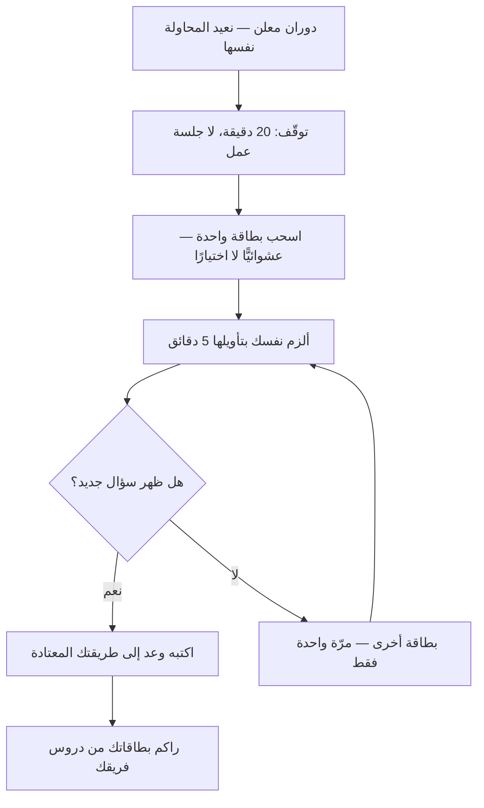

# الاستراتيجيات المائلة (Oblique Strategies)

> [!info] تعريف مختصر
> **الاستراتيجيات المائلة** مجموعة بطاقات وضعها الموسيقيّ **برايان إينو** والفنّان **بيتر شميت** سنة 1975، تحمل كلٌّ منها **أمرًا قصيرًا مائلًا** يُقرأ عند التعثّر — من نحو: *«كرّم خطأك بوصفه نيّةً خفيّة»* · *«استعمل فكرة قديمة»* · *«ماذا كان ليفعل أقرب أصدقائك؟»*. تُسحب بطاقة واحدة عشوائيًّا، وتُطبَّق على ما بين يديك مهما بدت بعيدة.
> **وغايتها ليست إعطاء الجواب بل تغيير السؤال.** فهي أداة **لكسر النمط** حين يدور الفريق في حلقة مفرغة، لا طريقةً لتوليد الحلول ولا لاختيارها. ووُلدت في الأستوديو لا في المكتب: من ملاحظة أن الفرق المبدعة تتعطّل تحت الضغط فترتدّ إلى ما تعرفه.

## الشرح العلمي والاحترافي

**والمشكلة التي تعالجها اسمها «الأخدود»:** أن الفريق المتعثّر لا يتوقّف عن العمل، بل **يكرّر المحاولة نفسها بصيغ متقاربة** ويظنّها محاولات جديدة. وكلّما ضاق الوقت ضاق المدى المستكشَف، فيقلّ التنوّع في اللحظة التي يحتاجه فيها أكثر ما يكون.

**وآليّتها إدخال مثيرٍ لا صلة له بالمشكلة.** فالبطاقة لا تعرف مشكلتك، وهذا بعينه شرطها: أنها تجبر العقل على **بناء صلة** بين أمرها ووضعك — وفي أثناء بناء الصلة تُطرح المشكلة من زاوية لم تُطرح منها. **فالنافع ليس البطاقة بل التأويل**، وهذا ما يجعل «العشوائية» فيها مقصودة لا كسلًا: البطاقة المختارة عمدًا تعيد النمط، والمسحوبة عشوائيًّا تكسره.

**وثلاثة أوصاف تميّزها عن كل ما يجاورها:**

1. **مائلة لا مباشرة.** لا تقول «اختبر مع مستخدمين»، بل تقول ما يحتمل التأويل. والمباشرة هنا عيب لا فضيلة، لأن الأمر الواضح يُنفَّذ بلا تفكير، والمائل يُجبر على التفكير.
2. **بلا ترتيب ولا عملية.** ليس لها خطوات ولا مخرجات ولا معيار نجاح.
3. **بلا دعوى علمية.** لم يزعم صاحباها أنها مثبتة، ولم تُبنَ على دراسة؛ وهي في أصلها أداة عمل شخصية نُشرت.

**وهي عندنا مثالٌ على نمط أعمّ: كتاب البطاقات.** فالمعرفة العملية قد تُصاغ مجموعةَ بطاقات لا فصولًا متسلسلة، حين يكون المطلوب **الاستدعاء عند الحاجة** لا القراءة من أوّلها. وهذا هو النمط نفسه الذي بُنيت عليه قاعدة [[Storytelling|السرد القصصي]] في هذا المستودع. وقيمة البطاقة أنها **وحدة واحدة تُستدعى وحدها**، وهو معنى الذرّية الذي تقوم عليه قواعد المعرفة الدائمة.

> [!info] إضافة مرجعية — حدّ النقل والاقتباس
> نصوص البطاقات **مؤلَّفة منشورة منسوبة إلى صاحبيها**، فلا تُنقل مجموعةً في هذه الموسوعة ولا تُترجم كاملة. ويُذكر منها ما تقتضيه الحاجة للتوضيح، منسوبًا ومحدودًا. **والقابل للنقل هو النمط لا المحتوى:** أن يصنع الفريق مجموعته الخاصّة من الأوامر المائلة النابعة من عمله، فتكون أنفع له من مجموعةٍ وُضعت لأستوديو موسيقى سنة 1975.

## أين ومتى يُستخدم

- **عند التعثّر المعلن:** حين يقول أحدهم في اجتماع التصميم «عدنا إلى النقطة نفسها».
- **في [[Retrospective|الاسترجاع]] الراكد** الذي يخرج بالإجراءات نفسها كل مرّة.
- **في الجلسة التي طال فيها الجدل بين خيارين**، فالبطاقة تُخرج النقاش من الثنائية.
- **مع فرد يعمل وحده** ويجد نفسه يعيد كتابة الشيء نفسه.
- **مثالًا يُحتذى في بناء مجموعة داخلية**: بطاقات من دروس الفريق نفسه («ماذا لو لم يكن لدينا هذا التكامل؟» · «ما أرخص نسخة تُعلّمنا الشيء نفسه؟»).

> [!warning] متى لا تُستخدَم؟
> - **في القرار.** لا تُختار بها البدائل ولا تُفاضَل؛ ومن استعملها في الاختيار أدخل العشوائية موضعًا لا تحتمله.
> - **في العمل التشغيلي المنضبط**، حيث يكون كسر النمط هو الخطر نفسه.
> - **مع فريق لم يتعثّر أصلًا** — فتُبطئ عملًا سائرًا وتبدو تكلّفًا.
> - **بديلًا عن معلومة ناقصة.** الفريق الذي لا يعرف ماذا يريد المستخدم لا ينقصه كسر نمط؛ ينقصه [[User Interview|مقابلة]].

## مثال وسيناريو تطبيقي

> [!example] «فريق واجهات رِفد» — أسبوعان على شاشة واحدة
> **الوضع:** خمس نسخ من شاشة التقارير، كلّها متقاربة، وكل مراجعة تنتهي بـ«أوضح قليلًا لكن ليست هي». والفريق يعلم أنه يدور.
> **ما فُعل:** خُصّصت عشرون دقيقة، وسُحبت بطاقتان بالقرعة من مجموعة داخلية صاغها الفريق سابقًا:
> - **«احذف أثمن ما فيه.»** → أثمن ما في الشاشة مخطّط الاتّجاه الذي أنفقوا عليه أسبوعًا. وحين حُذف افتراضًا ظهر أن أكثر المستخدمين يأتون لسؤال واحد: **أنحن على المسار أم لا؟** والمخطّط لا يجيب عنه، بل يؤجّله.
> - **«ماذا لو كان المستخدم مستعجلًا جدًّا؟»** → صيغت الشاشة جوابًا واحدًا في الأعلى، وتحته التفصيل لمن أراد.
> **النتيجة:** نسخة سادسة مختلفة في **السؤال** لا في الترتيب، أقرّت من أوّل مراجعة.
> **وما يُنصف قوله:** لم تكن البطاقة هي التي أعطت الحلّ؛ الفريق كان يملك المعلومة كلّها. البطاقة أوقفت التكرار وحدها — **وهذا كلّ ما تدّعيه**.

## خطوات أو مخطّط

1. **أعلن التعثّر صراحةً.** فالبطاقة قبل الاعتراف بالدوران تُقرأ لعبًا.
2. **حدّد وقتًا قصيرًا** — عشرون دقيقة تكفي، فليست جلسة عمل.
3. **اسحب بطاقة واحدة عشوائيًّا** ولا تختر، ولا تسحب ثانيةً لأن الأولى لم تعجبك.
4. **ألزم نفسك بتأويلها** خمس دقائق قبل أن تحكم عليها بأنها لا تنطبق — فالحكم السريع هو النمط نفسه يدافع عن بقائه.
5. **اكتب ما ظهر ولو بدا بعيدًا**، ثم عد إلى طريقتك المعتادة.
6. **راكم مجموعتك الخاصّة:** كل درس تعلّمه الفريق يصلح أن يصير أمرًا مائلًا في بطاقة.

## ⚠️ مفاهيم خاطئة شائعة

> [!warning]
> - **حسبانها أداة توليد أفكار.** [[SCAMPER]] يولّد بمسحٍ منهجيّ، وهذه **تكسر النمط** فحسب؛ وقد لا تعطي فكرة واحدة وتكون قد أدّت وظيفتها.
> - **اختيار البطاقة الملائمة.** الاختيار يعيد النمط الذي جئت تكسره، والعشوائية هي الآليّة لا زينةً فيها.
> - **الظنّ بأن لها سندًا تجريبيًّا.** لا تدّعيه ولم يُدّعَ لها؛ وقيمتها في شهادة من استعملها.
> - **معاملتها منهج عمل.** لا عملية لها ولا مخرجات ولا معيار — وهذا وصفها لا نقصها.
> - **الخلط بينها وبين [[Six Thinking Hats|القبّعات الستّ]].** تلك **تنظّم** التفكير الجماعي بتتابع مصمَّم، وهذه **تشوّشه عمدًا** لحظةً واحدة ليخرج من أخدوده.

## ❌ ممارسات خاطئة في المشاريع

> [!failure]
> - **إقحامها في اجتماع لم يتعثّر** — فتُقرأ تسليةً وتُفقد مصداقيتها عند الحاجة إليها. **الحلّ:** لا تُستعمل إلا بعد إعلان الدوران.
> - **السحب المتكرّر حتى تجيء بطاقة مريحة** — فيُنتقى ما يوافق الميل القائم. **الحلّ:** بطاقتان على الأكثر، ثم إغلاق.
> - **ردّ البطاقة في عشر ثوانٍ** («لا علاقة لها») — وهو أشيع ما يقع، وهو النمط نفسه يحمي نفسه. **الحلّ:** خمس دقائق تأويل ملزمة قبل الحكم.
> - **بناء قرار عليها** — فتُدخَل العشوائية موضع الحكم. **الحلّ:** مخرجها **سؤال** يُختبر، لا قرار يُنفَّذ.
> - **نسخ نصوص المجموعة الأصلية في وثائق الشركة** — وهي مؤلَّفة منسوبة. **الحلّ:** اصنع مجموعتك من دروس فريقك، وهي أنفع لك أصلًا.

## 🔗 مصطلحات ومفاهيم ذات صلة

[[SCAMPER]] | [[Six Thinking Hats]] | [[Backcasting]] | [[Retrospective]] | [[Design Thinking]] | [[Cognitive Bias]] | [[Psychological Safety]] | [[Intelligent Failure]] | [[Facilitator]] | [[Storytelling]]
