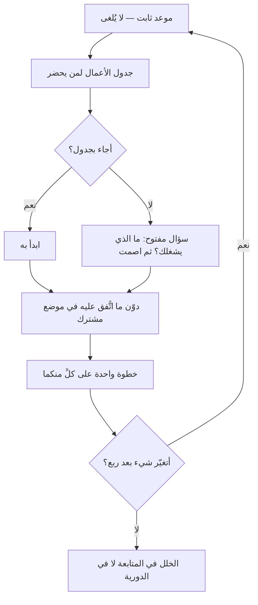

# الاجتماع الفردي (One-on-One)

> [!info] تعريف مختصر
> **الاجتماع الفردي** لقاءٌ دوريّ محجوز بين المدير وكلّ من يعمل معه مباشرةً، **جدولُ أعماله لمن يحضر لا لمن يدير**. وغايته ما لا يُقال في الجماعة: العوائق، والنموّ المهني، والتغذية الراجعة في الاتّجاهين، وما بدأ يقلق ولم يبلغ بعدُ حدَّ الشكوى.
> **وهو أداة مدير لا أداة سكرم.** فليس من أحداث سكرم الخمسة ولا يذكره دليله، ولا يُغني عنه ولا يُغنى عنه — و[[07 - Daily Standup|الوقفة اليومية]] تخصّ عمل الفريق نحو هدف السبرنت، وهذا يخصّ الشخص.
> **والمعيار العملي:** إن كان أكثر الكلام فيه للمدير، فهو **تقرير حالة** لا اجتماعًا فرديًّا.

## الشرح العلمي والاحترافي

**والمشكلة التي وُجد لها** أن الإشارات التي تسبق المشكلات الكبيرة — نيّة الاستقالة، والاحتراق، وسوء فهم متراكم، والعائق الذي لا يُذكر في الوقفة لأنه يخصّ شخصًا لا مهمّة — **لا تظهر في اجتماع جماعي أبدًا**. فمن انتظرها في الجماعة لم يرَها إلا وقد صارت واقعًا لا إشارة.

**وقد شاعت الممارسة بعد ما كتبه أندرو غروف** — رئيس إنتل — في *High Output Management*، وحجّته فيه اقتصادية لا وجدانية: أن ساعةً من المدير في لقاء فرديّ ترفع جودة عمل المرؤوس أسبوعين، **فمردودها من أعلى ما ينفقه المدير من وقته**. وأقرّها بعده كثير من أدبيات إدارة فرق الهندسة.

**وأربع قواعد هي التي تفصل النافع من الطقس:**

1. **جدول الأعمال لمن يحضر.** فإن أتى فارغًا فالسؤال المفتوح: **ما الذي يشغلك؟** ولا يُملأ الفراغ بأسئلة المدير عن حالة المهامّ — فتلك لها أدواتها.
2. **لا يُلغى ولا يُؤجَّل عادةً.** فإلغاؤه مرّتين متتاليتين رسالةٌ أبلغ من كل ما يقال فيه؛ ومن ضاق وقته فليقصّره لا فليُلغِه.
3. **دوريّ ثابت** — أسبوعيًّا أو كل أسبوعين. **والأسوأ من ندرته تذبذبُه**، لأن غير المنتظم يفقد صفة الموضع الآمن الذي يُنتظر فيه القول.
4. **له أثر مكتوب مشترك** — ما اتُّفق عليه ومن يتابعه — وإلّا أُعيد الحديث نفسه بعد شهر بلا أن يعرف أحد أنه أُعيد.

**وما لا يكون فيه:** ليس تقرير حالة (فالأدوات تعرضها)، ولا تقييم أداء (ذاك موعده وصيغته)، ولا مسرحًا للتوبيخ (فالتغذية الراجعة الصعبة تُقال في وقتها لا تُدَّخر إليه)، ولا موضعًا لقرارٍ يخصّ الفريق كلّه (فالقرار الذي يُصنع في لقاء ثنائيّ ويُعلن على الفريق يُنشئ محاور خفيّة تُفسد الثقة).

### تصنيف الاجتماعات: أيّ سؤال يجيب عنه كلٌّ؟

| ما يفعله الحاضر | **الفردي** | **[[Skip-Level Meeting\|تخطّي المستوى]]** | **العامّ (All-Hands)** | **[[07 - Daily Standup\|الوقفة اليومية]]** |
|---|---|---|---|---|
| يتكلّم مع | مديره المباشر | مدير مديره | القيادة | زملائه في الفريق |
| يضع جدول أعماله | **هو** | **هو** | القيادة | الفريق |
| يخرج بـ | عائق مرفوع أو خطوة نموّ | إشارة عن الطبقة الوسطى | سياق واتّجاه | خطّة اليوم نحو هدف السبرنت |
| دوريّته | أسبوع أو أسبوعان | كل ربع تقريبًا | شهريًّا أو ربعيًّا | يوميًّا |
| إن أُلغي | **يُقرأ رسالةً** | يُؤجَّل بلا ضرر | يُعوَّض بتدوينة | يتفكّك اليوم |

> **السؤال الفارق:** الفردي يسأل: **ما الذي يعوق هذا الشخص؟** وتخطّي المستوى يسأل: **ما الذي لا يبلغني عبر مديري؟** والعامّ يسأل: **هل يعرف الجميع إلى أين نمضي؟** والوقفة تسأل: **ما خطّة اليوم؟** — **وأشيع الخلط أن يبتلع الأوّلُ الرابعَ**: فيصير الفردي مراجعةً للمهامّ، وتضيع وظيفته وحدها لأن للمهامّ من يعرضها.

## أين ومتى يُستخدم

- **مع كل من يعمل معك مباشرةً**، بلا استثناء الكفء منهم — فالمجتهد الصامت أوّل من يُهمَل وآخر من يشكو.
- **في العمل عن بُعد** حيث ينعدم الاحتكاك العابر الذي كان ينقل الإشارات في الممرّ.
- **في الأسابيع الأولى للملتحق الجديد**، ودوريّته فيها أعلى ثم تخفّ.
- **قبل تغيير كبير وبعده** — إعادة تنظيم، أو تبدّل قيادة — فالقلق فيها فرديّ لا جماعيّ.
- **لسكرم ماستر مع أعضاء الفريق** حين يكون مدرّبًا لا مديرًا: ويبقى الفرق أنه لا يملك تقييمًا ولا ترقية، فيُصرَّح بذلك.

> [!warning] متى لا يُستخدَم؟
> - **لتأجيل التغذية الراجعة إليه.** فما استُحقّ قولُه اليوم يُقال اليوم؛ وادّخاره أسبوعًا يُفقده أثره ويجعل اللقاء موعدًا مخيفًا.
> - **بديلًا عن قرارٍ جماعيّ.** ما يخصّ الفريق يُقرَّر معه.
> - **مع من لا تربطك به علاقة عمل مباشرة** — فيصير عبئًا على الطرفين، وموضعه حينها لقاء عند الحاجة.
> - **بديلًا عن تقييم الأداء الرسمي.** يمهّد له ويمنع مفاجآته، ولا يقوم مقامه.

## مثال وسيناريو تطبيقي

> [!example] «فريق منصّة رِفد» — استقالتان في شهر، وكلّ المؤشّرات خضراء
> **الوضع:** فريق من تسعة، والسرعة مستقرّة، ولا شكوى في الاسترجاعات. ثم استقال مهندسان في ثلاثة أسابيع.
> **ما ظهر في مقابلتَي المغادرة:** أحدهما كان يرى أنه لا مسار نموّ له منذ عام، والآخر كان يحمل عبء المناوبة وحده منذ خمسة أشهر. **ولم يُذكر أيّ منهما في اجتماع قطّ** — لأن الأوّل يخصّ الشخص لا الفريق، والثاني بدا للمهندس شكوى شخصية يُستحى منها أمام الزملاء.
> **ما تغيّر:** لقاء فرديّ كل أسبوعين، نصف ساعة، جدول أعماله للمهندس، ووثيقة مشتركة لكلٍّ فيها ثلاثة أقسام: ما يشغلني · ما اتّفقنا عليه · ما أريد أن أتعلّمه.
> **ما ظهر في الجولة الأولى:** ثلاثة عوائق لم تكن معروفة، منها اثنان أُصلحا في أسبوع لأنهما كانا صلاحيةَ وصول لا أكثر.
> **وما يُنصف قوله:** لم تكن الاجتماعات هي التي حلّت المشكلات، بل **هي التي جعلتها تُقال**. والمدير الذي لا يستطيع أن يتصرّف بما يسمع سيُنشئ لقاءً يُسمَع فيه ولا يتغيّر شيء — **وهذا أسوأ من ألّا يسمع**.

## خطوات أو مخطّط

1. **احجزه دوريًّا ثابتًا** واجعله موعدًا لا يُزاح.
2. **أعطِ جدول الأعمال لمن يحضر**، وشارِكْه الوثيقة قبل اللقاء.
3. **افتح بسؤال مفتوح** — «ما الذي يشغلك؟» — ثم اصمت.
4. **دوّن ما اتُّفق عليه** في موضع يراه الطرفان.
5. **أغلق بخطوة واحدة على كلٍّ منكما**، فالمدير الذي يخرج بلا التزام لم يشترك في اللقاء.
6. **راجع كل ربع:** أما زال نافعًا؟ وهل تغيّر شيء بسببه؟ فإن كان الجواب لا، **فالخلل في المتابعة لا في الدورية**.

## ⚠️ مفاهيم خاطئة شائعة

> [!warning]
> - **الظنّ بأنه من سكرم.** ليس من أحداثه ولا يذكره دليله؛ هو **أداة إدارة** تتعايش معه.
> - **حسبانه مراجعةً للمهامّ.** فتُهدر ساعةٌ في استعراض ما تعرضه اللوحة، ويضيع الغرض الذي لا بديل له.
> - **الظنّ بأن الفريق الجيّد لا يحتاجه.** بل هو أحوج ما يكون إليه، لأن أعراض المشكلات فيه أخفى.
> - **عدّ إلغائه أمرًا إداريًّا محايدًا.** إلغاؤه المتكرّر رسالةُ ترتيبٍ للأولويات يقرؤها الطرف الآخر بوضوح.
> - **الخلط بينه وبين [[Skip-Level Meeting|تخطّي المستوى]].** ذاك مع مدير المدير، وغرضه مختلف — انظر الجدول أعلاه.
> - **حسبان طوله دليل جودته.** نصف ساعة منتظمة خيرٌ من ساعتين كل ثلاثة أشهر.

## ❌ ممارسات خاطئة في المشاريع

> [!failure]
> - **افتتاحه بسؤال «أين وصلت في المهمّة؟»** — فيُقرأ من أوّل دقيقة تقريرَ حالة، ولا يعود إلى غرضه. **الحلّ:** سؤال مفتوح، والمهامّ في أدواتها.
> - **إلغاؤه عند الضغط** — وهو وقت الحاجة إليه أشدّ. **الحلّ:** قصّره إلى خمس عشرة دقيقة ولا تُلغِه.
> - **الاستماع بلا تصرّف** — فيتعلّم الحاضر ألّا يقول. **الحلّ:** خطوة واحدة على المدير في كل لقاء، ومتابعتها معلنة.
> - **ادّخار التغذية الراجعة السلبية إليه** — فيصير موعدًا مخيفًا. **الحلّ:** تُقال في وقتها، ويبقى اللقاء موضعَ سياق لا محاسبة.
> - **إجراؤه مع بعض الفريق دون بعض** — فيُقرأ تفضيلًا وينشئ دائرةً مقرّبة. **الحلّ:** للجميع أو لا أحد.
> - **تحويله إلى موضع قرارات تخصّ الفريق** — فتنشأ محاور خفيّة وتُستنزف الثقة. **الحلّ:** ما يخصّ الفريق يُقرَّر معه.

## 🔗 مصطلحات ومفاهيم ذات صلة

[[Skip-Level Meeting]] | [[07 - Daily Standup]] | [[Psychological Safety]] | [[Micromanagement]] | [[Empowerment]] | [[Burnout]] | [[Servant Leadership]] | [[Nonviolent Communication]] | [[Active Listening]] | [[Ruinous Empathy]] | [[Retrospective]] | [[06 - Scrum Master]]
