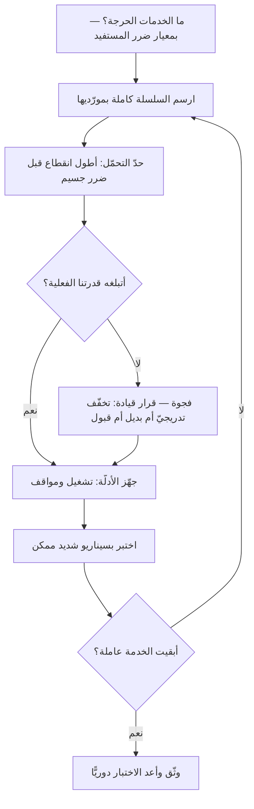

# المرونة التشغيلية (Operational Resilience)

> [!info] تعريف مختصر
> **المرونة التشغيلية** قدرةُ المؤسّسة على **الاستمرار في تقديم خدماتها الحرجة أثناء الاضطراب** — لا على منع الاضطراب. فمحورها **الخدمة التي يعتمد عليها المستفيد**، لا النظام ولا القسم: أيستطيع المريض أن يصل إلى موعده وإن سقط مزوّد الرسائل؟
> **وهذا هو موضع افتراقها عمّا يجاورها:** فإدارة المخاطر تعمل على **تقليل احتمال** الوقوع، وخطط الاستمرارية على **الاستعادة بعده**، والمرونة التشغيلية تفترض أن **الاضطراب سيقع حتمًا** وتسأل: **ما الذي يجب أن يبقى عاملًا وهو واقع؟**

## الشرح العلمي والاحترافي

**والانتقال الذي تمثّله انتقالٌ في وحدة القياس:** من «نسبة إتاحة الخادم» إلى **«أطول انقطاع تحتمله هذه الخدمة قبل أن يقع ضرر جسيم»**. وهذا ما جعل الجهات التنظيمية في القطاع المالي وغيره تتبنّاه: لأن المؤسّسة قد تكون كل أنظمتها ضمن مستوى الخدمة المتّفق عليه، **والخدمة التي يعتمد عليها الناس متوقّفة** — إذ تمرّ بسلسلة من الأنظمة والمورّدين لا يملك أحدٌ منهم صورتها كاملة.

**وبناؤها أربع خطوات، وأوّلها أشقّها:**

1. **تحديد الخدمات الحرجة** — بمعيار **الضرر على المستفيد** لا بأهمّيتها عند صاحبها. **وأكثر المؤسّسات تسمّي كل شيء حرجًا**، وحين يكون كل شيء حرجًا فلا شيء حرج.
2. **رسم سلسلة الخدمة كاملة:** الأنظمة، والبيانات، والأشخاص، **والمورّدون ومورّدوهم**. وهنا يظهر ما لم يكن يُرى — أن ثلاث خدمات حرجة تمرّ كلّها بمورّد واحد لم يُصنَّف حرجًا قطّ.
3. **تحديد حدّ التحمّل (`Impact Tolerance`)**: أطول انقطاع مقبول لكل خدمة **قبل أن يقع ضرر جسيم**. وهو حكمٌ من القيادة لا من التقنية.
4. **الاختبار بسيناريوهات شديدة لكن ممكنة** — لا بالمرجّح. **فالمرجّح يقع وتُعالجه إدارة المخاطر؛ وما يكشف المرونة هو الشديد الممكن.**

**وحدّ التحمّل هو مركز الفكرة**، ويفترق عن [[RTO and RPO|زمن الاستعادة المستهدف]] فرقًا يُغفَل: فذاك **هدفٌ داخليّ يتعهّد به فريق التقنية**، وهذا **حدٌّ خارجيّ يُقاس بالضرر الواقع على المستفيد**. وقد يكون زمن الاستعادة أربع ساعات وحدّ التحمّل ساعة — **وهذه فجوةٌ تُعالَج قرارًا لا تُخفى في تقرير**.

**وقاعدةٌ لا يُختلف عليها: المسؤولية لا تُسنَد.** فالخدمة التي تعتمد على مورّد خارجيّ تبقى مسؤوليتك أمام مستفيدك وأمام الجهة التنظيمية — وهذا يلتقي مباشرةً بما تقرّره [[Outsourcing|أنماط التوريد]].

**وما يبنيها عمليًّا** ليس وثيقةً واحدة بل ثلاث طبقات: **تصميمٌ** يحتمل السقوط (تخفّف تدريجيّ بدل انهيار كامل، ومسار بديل، وعزل الأعطال)، و**أدلّة** جاهزة ([[Runbook|دليل التشغيل]] لما هو حاسم، و[[Playbook|دليل المواقف]] لما يحتاج حكمًا)، و**تمارين** تُثبت أن الأوّلين يعملان.

> [!info] إضافة مرجعية — الفرق عن استمرارية الأعمال
> يُستعمل المصطلحان بالترادف أحيانًا، وبينهما فرقٌ في **زاوية النظر**:
> - **استمرارية الأعمال (`Business Continuity`)** تقليدٌ أقدم، محوره **الاستعادة بعد الكارثة**: خطط، ومواقع بديلة، وأزمنة استعادة.
> - **والمرونة التشغيلية** أحدث، ومحوره **الخدمة أثناء الاضطراب** وسلسلتها كاملةً بما فيها المورّدون، ومقياسه **الضرر على المستفيد**.
>
> **فالثانية تشمل الأولى وتزيد عليها**، ولا تُلغيها. وقد أُبقيت «استمرارية الأعمال» في `aliases` لأن القارئ يلقاها في الأنظمة والعقود، **ولا يُعدّ استعمالها خطأً** — إنّما تُميَّز عنها حيث يكون التمييز مؤثّرًا.

## أين ومتى يُستخدم

- **في القطاعات المنظَّمة** (مالية · صحية · بنية تحتية) حيث يكون مطلبًا نظاميًّا لا خيارًا.
- **في الخدمات التي يعتمد عليها الناس اعتمادًا لا بديل له** — دفع، أو موعد طبّي، أو خدمة حكومية.
- **قبل الاعتماد على مورّد وحيد** في مسار حرج، وهذا من أكثر مواضعه نفعًا.
- **بعد حادث كبير**، حيث يكون السؤال الصحيح ليس «كيف نمنع تكراره؟» بل **«ماذا كان ينبغي أن يبقى عاملًا وهو واقع؟»**
- **في تصميم المعمارية**، فهي قيدٌ يُقرَّر مبكّرًا كما تُقرَّر [[Quality Attributes|سمات الجودة]] — ولا تُضاف بعد البناء إلا بإعادة بناء.

> [!warning] متى لا تُستخدَم؟
> - **في منتج ما يزال يُختبر في السوق.** بناء المرونة قبل أن يتّضح أن للمنتج مستفيدًا إنفاقٌ في غير موضعه.
> - **بديلًا عن [[Risk Register|سجلّ المخاطر]].** ذاك يعالج الاحتمال، وهذه تفترض الوقوع؛ والمؤسّسة تحتاجهما معًا.
> - **حين تُسمّى كل الخدمات حرجة.** فالنتيجة إنفاقٌ موزّع بالتساوي، وهو أسوأ من عدمه لأنه يشتري طمأنينة بلا حماية.
> - **وثيقةً تُكتب للجهة التنظيمية.** فما لم يُختبر لم يُبنَ، ولو اعتُمد على الورق.

## مثال وسيناريو تطبيقي

> [!example] «منصّة عافية» — كل الأنظمة ضمن مستوى الخدمة، والخدمة متوقّفة
> **الوضع:** تقرير الإتاحة الشهري 99.95٪ لكل نظام على حدة. ثم توقّف حجز المواعيد ساعتين وعشرين دقيقة.
> **ما وقع:** لم يسقط نظام واحد من أنظمة عافية. سقط **مزوّد الرسائل القصيرة** الذي يُرسل رمز التحقّق. وقد كان مصنَّفًا «مساندًا».
> **ما كشفه رسم السلسلة بعدها:**
> - **ثلاث خدمات حرجة** تمرّ كلّها بالمزوّد نفسه، ولم يكن أحد يعلم ذلك لأن كلًّا رُسمت وحدها.
> - **حدّ التحمّل لحجز المواعيد ساعة واحدة** (بحكم الإدارة الطبّية: فبعدها تُفقد مواعيد اليوم)، **وزمن الاستعادة المتعاقَد عليه مع المزوّد أربع ساعات**. فالفجوة كانت مكتوبة في العقد منذ سنتين ولم يُنظر فيها.
> **ما فُعل:** لم تُشترَ إتاحة أعلى — **بل صُمِّم تخفّفٌ تدريجيّ**: عند تعذّر الرسالة القصيرة يُحوَّل التحقّق إلى البريد، وعند تعذّره يُتاح الحجز بتأكيد لاحق. **فصار الانقطاع الكامل انقطاعًا جزئيًّا.**
> **والدرس:** المؤشّر الذي كان أخضر كان يقيس **الأنظمة**، والمستفيد يعيش **الخدمة**. وما بينهما هو المرونة التشغيلية كلّها.

## خطوات أو مخطّط

1. **سمِّ الخدمات الحرجة بمعيار الضرر على المستفيد** — وقاوم أن تكون كلّها حرجة.
2. **ارسم السلسلة كاملة** لكل خدمة: أنظمة · بيانات · أشخاص · مورّدون · مورّدو المورّدين.
3. **حدّد حدّ التحمّل** لكل خدمة بحكم القيادة، لا بما تستطيعه التقنية.
4. **قارِن الحدّ بالقدرة الفعلية** ([[RTO and RPO]] والعقود)، **وأظهِر الفجوة قرارًا لا تقريرًا**.
5. **صمّم التخفّف التدريجي** قبل شراء إتاحة أعلى — فهو أرخص وأنفع غالبًا.
6. **جهّز الأدلّة**: [[Runbook|تشغيل]] لما هو حاسم، و[[Playbook|مواقف]] لما يحتاج حكمًا.
7. **اختبر بسيناريو شديد ممكن** — لا بالمرجّح — وسجّل ما انكشف.

## ⚠️ مفاهيم خاطئة شائعة

> [!warning]
> - **قياسها بإتاحة الأنظمة.** الأنظمة تُقاس فرادى، والخدمة تُعاش كاملة — وبينهما الفجوة التي وُجد المفهوم لأجلها.
> - **الخلط بين حدّ التحمّل وزمن الاستعادة.** الأوّل حدٌّ خارجيّ بالضرر، والثاني هدف داخليّ بالقدرة.
> - **حسبانها منعًا للأعطال.** بل هي **الاستمرار أثناءها**؛ ومن سعى إلى المنع وحده بنى نظامًا هشًّا يوم يقع ما لم يتوقّعه.
> - **إخراج المورّدين من الحساب.** أكثر الانقطاعات الحديثة تأتي من طرف ثالث، **والمسؤولية لا تُسنَد**.
> - **الظنّ بأنها للأنظمة التقنية.** السلسلة تشمل الأشخاص أيضًا: خدمةٌ حرجة يعرفها موظّف واحد **خدمةٌ هشّة**، وإن كانت أنظمتها مكرّرة.
> - **الاختبار بالسيناريو المرجّح.** المرجّح تعالجه إدارة المخاطر؛ وما يكشف المرونة **الشديد الممكن**.

## ❌ ممارسات خاطئة في المشاريع

> [!failure]
> - **تصنيف كل الخدمات حرجة** — فيُوزَّع الإنفاق بالتساوي ولا تُحمى الحرجة فعلًا. **الحلّ:** ترتيب صريح بمعيار الضرر، ولو أغضب أصحاب الخدمات.
> - **رسم كل خدمة وحدها** — فتختفي نقاط الفشل المشتركة. **الحلّ:** خريطة واحدة تُظهر تقاطع المورّدين.
> - **إخفاء الفجوة بين حدّ التحمّل والقدرة** — فتُكتشف يوم الحادث. **الحلّ:** تُرفع قرارًا: نُصلح، أم نبني بديلًا، أم نقبل الفجوة مكتوبةً.
> - **خطط تُعتمد ولا تُختبر** — فتصير امتثالًا ورقيًّا. **الحلّ:** تمرين دوريّ مسجَّل، ولو محدود النطاق.
> - **إهمال طبقة الأشخاص** — فيسقط التشغيل بإجازة موظّف. **الحلّ:** لا خدمة حرجة يعرفها واحد؛ وهذا ما يبنيه [[Runbook|دليل التشغيل]] المجرَّب.
> - **شراء إتاحة أعلى قبل تصميم التخفّف** — فيُنفق كثير على حماية جزئية. **الحلّ:** صمّم الانحدار الرشيق أوّلًا.

## 🔗 مصطلحات ومفاهيم ذات صلة

[[Runbook]] | [[Playbook]] | [[SOP]] | [[RTO and RPO]] | [[Risk Register]] | [[Outsourcing]] | [[Vendor Management]] | [[SLA]] | [[Quality Attributes]] | [[Blameless Postmortem]] | [[MTTR]] | [[Uptime]] | [[Data Residency]]
