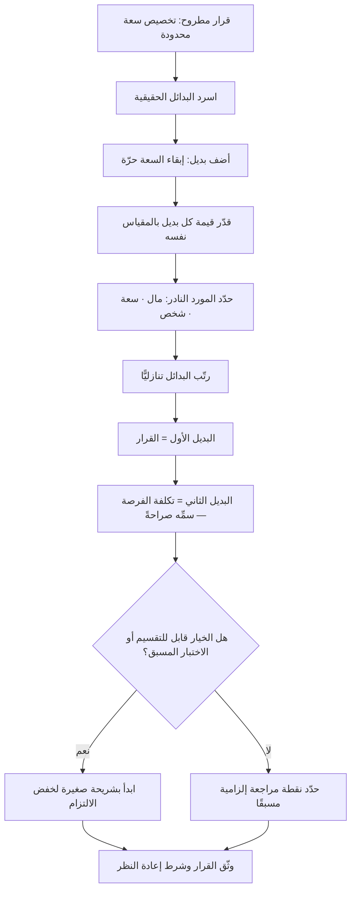

# تكلفة الفرصة البديلة (Opportunity Cost)

> [!info] تعريف مختصر
> قيمة **أفضل بديل واحد** جرى التخلّي عنه عند اتّخاذ قرار — لا مجموع البدائل المرفوضة ولا متوسّطها. حين يختار فريق أن يبني الميزة (أ) بسعة الربع، فالتكلفة الحقيقية ليست ساعات العمل ولا الرواتب المصروفة، بل **الميزة (ب)** التي كانت الأعلى قيمة بين ما تُرك. ولأن هذه التكلفة لا تظهر في أي فاتورة ولا في أي تقرير مالي، فهي التكلفة الأكثر تجاهلًا والأشدّ أثرًا في قرارات المنتج والمشاريع.

## الشرح العلمي والاحترافي
- **الأصل الاقتصادي والمعنى الدقيق**: المفهوم من صلب علم الاقتصاد، ونشأ من ملاحظة أن الموارد نادرة وقابلة للاستخدامات المتعدّدة، فكل استخدام يُلغي غيره. صياغته المعتمدة أنه **قيمة الاستخدام البديل الأفضل التالي (Next Best Alternative)**. وقيد «الأفضل التالي» ليس تفصيلًا لغويًّا: لو كانت التكلفة هي مجموع كل ما تُرك، لصار كل قرار خاسرًا بالضرورة، ولانهار المفهوم منطقيًّا. المقارنة دائمًا ثنائية: ما اخترتَه مقابل أقوى ما تركتَه.
- **العلاقة بالمفاضلة (Trade-off)**: المفاضلة هي **الفعل**، وتكلفة الفرصة هي **ثمنه**. حين نقول «فاضلنا بين السرعة والجودة» فنحن نصف عملية الاختيار؛ وحين نسأل «ماذا خسرنا بالضبط حين اخترنا السرعة؟» فنحن نقيس تكلفة الفرصة. ولهذا يُستخدم المصطلحان مترادفين في الاستعمال اليومي رغم اختلافهما الدقيق. الفائدة العملية من التمييز: أي مفاضلة معلنة يجب أن يتبعها اسم صريح للبديل المُضحّى به، وإلا كانت المفاضلة شعارًا. جملة «لا يمكننا فعل كل شيء» بلا تسمية ما تُرك هي أضعف صيغ الإدارة.
- **المورد النادر في المشاريع ليس المال بل السعة والانتباه**: يمكن استقدام تمويل إضافي، لكن لا يمكن مضاعفة انتباه فريق ولا خبرته المتراكمة بسرعة. لذلك تُحسب تكلفة الفرصة في المشاريع بوحدات [[Capacity]] وأسابيع الفريق، لا بالريالات فقط. وهذا يفسّر لماذا تكون تكلفة الفرصة أعلى ما تكون في الفرق الصغيرة والفرق ذات الخبرة النادرة.
- **بُعد زمني: التكلفة تكبر مع طول الالتزام**: قرار يستهلك أسبوعين تكلفة فرصته صغيرة وقابلة للتصحيح؛ وقرار يحبس الفريق ستة أشهر تكلفة فرصته ضخمة لأنه يُلغي كل ما كان يمكن تعلّمه أو كسبه في تلك الشهور. لذلك تُوصى القرارات الكبيرة بالتقسيم إلى مراحل قابلة للإيقاف — وهو المنطق نفسه وراء [[Circuit Breaker]] و[[Timeboxing]].
- **تكلفة الفرصة ليست دائمًا خسارة إيراد**: قد تكون تأخّر تعلّم (فرضية لم تُختبَر)، أو تراكم [[Technical Debt]] يُبطئ كل ما بعده، أو استنزاف فريق يُفقد شخصًا رئيسيًّا. أخطر أشكالها هي **تكلفة فرصة الخيارات المستقبلية**: قرار معماري يُغلق مسارات كان يمكن سلوكها لاحقًا، مثل الارتباط الشديد بمزوّد واحد ([[Vendor Lock-in]]).
- **لا تُخلط بالتكلفة الغارقة**: تكلفة الفرصة تنظر إلى **الأمام** (ما الذي سأخسره إن مضيت؟)، والتكلفة الغارقة تنظر إلى **الخلف** (كم أنفقت؟). ما أُنفق سابقًا لا يدخل الحساب إطلاقًا؛ إدخاله هو [[Sunk Cost Fallacy]]. القاعدة العملية: عند كل نقطة قرار اسأل «لو كنت أبدأ اليوم من الصفر، بهذه السعة، هل أختار هذا؟».
- **قابليّتها للقياس التقريبي لا الدقيق**: لا يمكن حساب رقم نهائي لتكلفة الفرصة لأنها تعتمد على نتيجة لم تحدث. لكن يمكن **تقريبها بشكل مفيد جدًّا**: قدّر قيمة البديل الأفضل بالطريقة نفسها التي قدّرت بها الخيار المختار ([[Cost of Delay]]، أثر متوقّع، حجم شريحة)، ثم قارن. الغرض ليس الدقّة بل منع الوهم بأن القرار مجّاني.
- **الخيار «لا نفعل شيئًا» بديل مشروع**: في كثير من الحالات يكون البديل الأفضل هو ترك السعة حرّة لالتقاط فرصة قادمة أو لتقليل الازدحام. الفرق التي تعتبر السعة غير المستخدَمة هدرًا تقع في [[100 Percent Utilization Fallacy]]، وتدفع تكلفة فرصة ضخمة في صورة بطء استجابة لكل ما هو غير مخطّط.

## أين ومتى يُستخدم
- **في كل جولة [[Prioritization]]**: بوصفها السؤال الحاكم — لا «هل البند مفيد؟» بل «هل هو أفضل من أفضل بديل بالسعة نفسها؟».
- **في بناء [[Business Case]] وقرارات [[CapEx vs OpEx]] و[[TCO]]**: حيث تُقارن الاستثمارات البديلة لا الاستثمار مقابل الصفر، وهو الخطأ الشائع في دراسات الجدوى.
- **في قرار البناء أو الشراء وفي [[Vendor Management]]**: بناء حل داخليًّا يستهلك سعة كانت ستذهب إلى ما يميّز المنتج فعلًا؛ وهذه من أوضح حالات تكلفة الفرصة في القرار التقني.
- **عند تحديد [[Non-Goals]] و[[Out of Scope]]**: إعلان ما لن يُعمل هو الاعتراف الصريح بالمفاضلة، وهو ما يمنع عودة النقاش كل أسبوعين.
- **في [[Go or No-Go Decision]] ومراجعات [[Steering Committee]]**: الاستمرار في مشروع متعثّر له تكلفة فرصة مستمرة تُدفع كل شهر، وغالبًا تكون أكبر من كلفة إيقافه.
- **في إدارة الاجتماعات ووقت الخبراء النادرين**: ساعة مهندس قاعدة بيانات وحيد في المنظّمة أغلى بكثير من أجرها، لأنها تُسحب من [[Bottleneck]] فعلي وفق [[Theory of Constraints]].

## مثال وسيناريو تطبيقي
> [!example] شركة تقنية في الرياض لديها فريق منتج من 12 شخصًا. أمام اللجنة التنفيذية خياران للربع القادم بالسعة نفسها تقريبًا (نحو 10 أسابيع فريق):
> **الخيار (أ):** بناء تكامل مخصّص لعميل حكومي واحد، بعقد مؤكّد قيمته 900 ألف ريال سنويًّا.
> **الخيار (ب):** إطلاق التسعير الذاتي (Self-serve) الذي يفتح شريحة الشركات الصغيرة، بتقدير داخلي متحفّظ 60 عميلًا في السنة الأولى بمتوسّط 1,200 ريال شهريًّا — أي نحو 860 ألف ريال سنويًّا، لكن باحتمال نجاح مقدَّر 50%.
> المقارنة الساذجة تقول: (أ) مؤكّد و(ب) محتمل، فلنأخذ (أ). لكن اللجنة أضافت ثلاثة أبعاد كانت غائبة:
> **أولًا**، التكامل المخصّص يفرض التزام صيانة سنويًّا يُقدَّر بأسبوعين فريق كل ربع — أي أنه يقتطع من سعة كل الأرباع القادمة لا من هذا الربع فقط.
> **ثانيًا**، الخيار (ب) قابل للتقسيم: نسخة أولى تُختبَر عبر [[Fake Door Test]] في أسبوعين تحسم جزءًا كبيرًا من عدم اليقين قبل إنفاق باقي السعة، بينما (أ) صفقة «كل شيء أو لا شيء».
> **ثالثًا**، التخلّي عن (ب) هذا الربع لا يؤجّله فقط، بل يؤجّل معه التعلّم عن شريحة كاملة — وهي تكلفة فرصة معرفية تتراكم.
> القرار النهائي: تنفيذ شريحة اختبار من (ب) في أسبوعين، وقبول (أ) لكن بنطاق مُقلَّص يُعاد استخدام 60% منه في المنتج الأساسي بدل أن يبقى تخصيصًا معزولًا. النقطة الجوهرية أن اللجنة **سمّت البديل المُضحّى به صراحةً وكتبته في [[Decision Log]]**: «اخترنا (أ) المقلَّص، وثمن ذلك تأخير التسعير الذاتي ربعًا واحدًا؛ يُعاد فتحه بلا نقاش في الربع التالي». هذا السطر هو الفرق بين مفاضلة واعية وانجراف.

## خطوات أو مخطّط
1. صُغ القرار كخيار بين بدائل محدّدة، لا كسؤال «هل نفعل هذا؟» — القرار بلا بديل مطروح ليس قرارًا.
2. اجعل «لا نفعل شيئًا / نبقي السعة حرّة» بديلًا مكتوبًا في القائمة دائمًا.
3. قدّر قيمة كل بديل بالمقياس نفسه (أثر متوقّع × احتمال، مع [[Cost of Delay]]).
4. حدّد المورد النادر الفعلي: هل هو المال، أم سعة الفريق، أم شخص بعينه؟ فالتكلفة تُقاس بوحدته.
5. اختر البديل الأعلى قيمة، ثم **سمِّ الثاني صراحةً** — هو تكلفة فرصتك.
6. افحص إن كان الخيار المختار قابلًا للتقسيم أو للاختبار المسبق، فذلك يخفض تكلفة الفرصة جذريًّا.
7. اكتب شرط إعادة النظر: ما الذي إن حدث يجعل البديل المتروك هو الصواب؟
8. وثّق كل ما سبق في [[Decision Log]] لتُقاس جودة القرار لاحقًا بمعطياته لا بنتيجته وحدها.

## ⚠️ مفاهيم خاطئة شائعة
> [!warning]
> - **اعتبارها مجموع كل البدائل المرفوضة**: هذا يجعل كل قرار يبدو كارثيًّا ويُفقد المفهوم معناه. التصحيح: التكلفة هي **أفضل بديل واحد فقط**؛ المقارنة ثنائية دائمًا.
> - **الظنّ أنها تكلفة نقدية تظهر في الميزانية**: تكلفة الفرصة لا تُقيَّد محاسبيًّا إطلاقًا، ولهذا تُهمَل في التقارير المالية رغم أنها قد تفوق كل البنود المقيَّدة. التصحيح: اجعلها بندًا صريحًا في وثيقة القرار حتى لو بقيت خارج الدفاتر.
> - **خلطها بالتكلفة الغارقة**: «أنفقنا 400 ألف، فالانسحاب يكلّفنا 400 ألف». التصحيح: المنفَق ذهب في الحالتين؛ التكلفة الحقيقية للاستمرار هي ما ستخسره **من الآن فصاعدًا** بعدم استخدام السعة في الأفضل التالي.
> - **افتراض أن البديل المتروك سيبقى متاحًا بالقيمة نفسها لاحقًا**: كثير من الفرص لها نافذة زمنية تُغلق. التصحيح: قدّر قيمة البديل **في وقت إتاحته لاحقًا** لا في وقت القرار.
> - **الظنّ أن زيادة الموارد تُلغي المفاضلة**: إضافة أفراد إلى فريق قائم ترفع كلفة التنسيق وقد لا ترفع الإنتاجية في المدى القصير، فتظلّ المفاضلة قائمة وتنتقل فقط إلى شكل آخر. التصحيح: عالج المفاضلة بتقليص النطاق لا بتضخيم الفريق.
> - **قصرها على قرارات الاستثمار الكبرى**: أكثر تكلفة الفرصة تُدفع في قرارات صغيرة متكرّرة — اجتماع أسبوعي بعشرة حاضرين، أو مراجعة يدوية كان يمكن أتمتتها. التصحيح: افحص الالتزامات المتكرّرة سنويًّا، لا المشاريع الجديدة فقط.
> - **اعتبار المفاضلة إخفاقًا إداريًّا**: بعض المديرين يعتبرون إعلان «لن نفعل هذا» اعترافًا بالضعف، فيَعِدون بكل شيء. التصحيح: المفاضلة المعلنة هي جوهر عمل الإدارة؛ غيابها هو الإخفاق.

## ❌ ممارسات خاطئة في المشاريع
> [!failure]
> - **الخطأ: تقييم كل مقترح بمعزل عن غيره («هل هذا يستحق؟»).** لماذا يضرّ: الجواب دائمًا نعم لأن كل مقترح له فائدة ما، فتُقبل قائمة لا تسعها السعة. الحل: لا تُقيَّم البنود إلا مقارنةً ببعضها في جلسة واحدة وبسعة معلنة سلفًا.
> - **الخطأ: قول «نعم» لطلب دون تحديد ما سيتأخّر مقابله.** لماذا يضرّ: الالتزامات تتراكم بلا مقابل مرئي، فتُخرق المواعيد كلها لاحقًا دفعة واحدة وتضيع الثقة. الحل: اجعل قاعدة «كل دخول يقابله خروج» ملزِمة ومكتوبة ضمن [[Explicit Policies]].
> - **الخطأ: احتساب تكلفة المشروع بالنفقات المباشرة فقط.** لماذا يضرّ: يُخفي أن أثمن ما أُنفق هو انتباه أفضل ثلاثة مهندسين لستة أشهر، وهو مورد لا يُشترى. الحل: أضف بند «سعة الفريق المستهلَكة والبديل المُضحّى به» في كل [[Business Case]].
> - **الخطأ: قبول التزامات صيانة دائمة مقابل مكسب لمرة واحدة.** لماذا يضرّ: تخصيص لعميل واحد يبدو ربحًا اليوم لكنه يقتطع من سعة كل ربع قادم إلى الأبد. الحل: احسب تكلفة الفرصة على أفق 3 سنوات لا على أفق الصفقة، واشترط مسار إعادة استخدام أو موعد إنهاء.
> - **الخطأ: تجاهل تكلفة فرصة الاجتماعات والعمليات الداخلية.** لماذا يضرّ: اجتماع أسبوعي بساعة و10 حاضرين يستهلك أكثر من 500 ساعة سنويًّا — أي ما يعادل مشروعًا كاملًا لم يُنفَّذ. الحل: راجع الاجتماعات المتكرّرة كل ربع بمنطق «لو أُلغي، ما الذي يُكسَب؟».
> - **الخطأ: إبقاء مشروع متعثّر حيًّا «حتى لا نضيّع ما أُنجز».** لماذا يضرّ: يُستنزف الفريق في عمل منخفض القيمة، وتُدفع تكلفة الفرصة كل شهر بصمت. الحل: راجع المشاريع الجارية بالسؤال نفسه المطروح على الجديدة، واجعل الإيقاف قرارًا محترمًا لا فضيحة.
> - **الخطأ: عدم إدراج «إبقاء السعة حرّة» ضمن البدائل.** لماذا يضرّ: تُملأ السعة بالكامل فتنعدم القدرة على التقاط فرصة عاجلة أو معالجة حادثة، فتتضخّم أوقات الاستجابة. الحل: احجز [[Reserve Capacity]] صراحةً واعتبرها استثمارًا في المرونة لا هدرًا.

## 🔗 مصطلحات ومفاهيم ذات صلة
[[Prioritization]] | [[Sunk Cost Fallacy]] | [[Initiative]] | [[Eisenhower Matrix]] | [[Circuit Breaker]] | [[HiPPO]] | [[Cost of Delay]] | [[Business Case]] | [[TCO]] | [[Non-Goals]] | [[Reserve Capacity]] | [[100 Percent Utilization Fallacy]] | [[Iron Triangle]] | [[Decision Log]]
