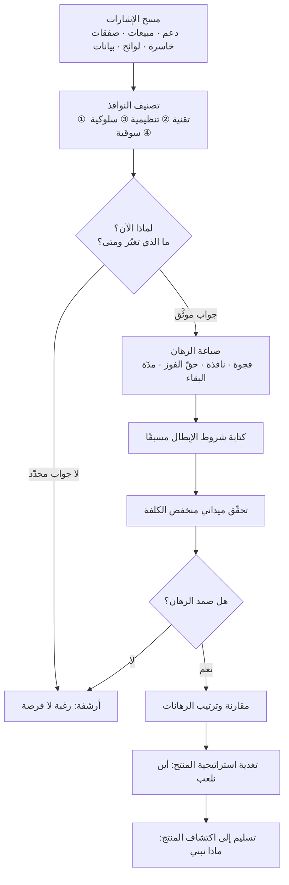

# اكتشاف الفرص (Opportunity Discovery)

> [!info] تعريف مختصر
> ممارسة منهجية لرصد **النوافذ** التي تجعل شيئًا صار ممكنًا أو مطلوبًا الآن ولم يكن كذلك من قبل — نافذة تقنية، أو تنظيمية/تشريعية، أو سلوكية، أو سوقية — ثم تحويل هذه النوافذ إلى **رهانات** قابلة للتقييم والاختيار. جوهرها سؤال التوقيت: «لماذا الآن؟ (Why Now)». وهي تختلف عن [[Product Discovery]] في المستوى والاتجاه: اكتشاف الفرص ينظر إلى **الخارج** ليقرّر أين يستحق أن نلعب أصلًا، بينما اكتشاف المنتج ينظر إلى **المستخدم داخل فرصة تمّ اختيارها** ليقرّر ماذا نبني وكيف.

## الشرح العلمي والاحترافي
- **الفرصة = فجوة + نافذة**: وجود ألم لدى المستخدم ليس فرصة بحد ذاته؛ فكثير من الآلام قديمة ومعروفة وبقيت بلا حل لأن حلّها كان مستحيلًا أو غير اقتصادي أو ممنوعًا. الفرصة تنشأ حين تلتقي **فجوة قائمة** بـ**نافذة انفتحت** تجعل معالجتها ممكنة اليوم. ولهذا يكون سؤال «لماذا الآن ولم يكن قبل ثلاث سنوات؟» أدقّ اختبار لجدّية أي فرصة؛ فإن لم يوجد جواب محدّد فالغالب أنك أمام رغبة لا فرصة.
- **الأنواع الأربعة للنوافذ**: **(١) تقنية** — نضوج قدرة تقنية أو انهيار كلفتها أو ظهور واجهة تكامل جديدة، فيصير ما كان مشروعًا بملايين مسألة أسابيع. **(٢) تنظيمية/تشريعية** — صدور نظام أو إلزام حكومي أو تحرير قطاع، وهي أقوى النوافذ لأنها تخلق طلبًا مؤجَّلًا محدّد الموعد (مثال إقليمي واضح: أنظمة حماية البيانات وإلزامات الفوترة الإلكترونية والهوية الرقمية). **(٣) سلوكية** — تغيّر عادات فئة كاملة، كتحوّل قطاع إلى العمل الموزَّع، أو ارتفاع قبول الدفع الرقمي، أو تغيّر توقّعات المستخدم لسرعة الاستجابة. **(٤) سوقية** — خروج لاعب، أو انكشاف قطاع، أو تحوّل في سلاسل التوريد، أو تغيّر نموذج التسعير السائد.
- **مصادر الإشارات المنهجية**: لا تُلتقط النوافذ بالحدس وحده. المصادر العملية: تحليل السياق الكلي عبر [[PESTEL]]؛ مراجعة اللوائح والأنظمة المنشورة ومواعيد نفاذها؛ إشارات الدعم والمبيعات المتكرّرة ([[Pain Point]])؛ حلول الالتفاف اليدوية التي بناها العملاء بأنفسهم (وهي أقوى إشارة على ألم حقيقي مدفوع الثمن)؛ الطلبات المرفوضة والصفقات الخاسرة؛ تغيّرات تسعير المورّدين والمنصّات؛ وبيانات الاستخدام الشاذّة في [[Product Analytics]].
- **الفرق الجوهري عن [[Product Discovery]]**: هذان نشاطان متتاليان لا مترادفان. اكتشاف الفرص يعمل على **مستوى المحفظة والسوق** ومخرجه: قائمة رهانات مرتّبة وقرار «أين نلعب» يغذّي [[Product Strategy]]. أمّا اكتشاف المنتج فيعمل على **مستوى الحل داخل مساحة محدّدة سلفًا** ومخرجه: فهم مُتحقَّق لمشكلة المستخدم وحلول مختبَرة عبر النماذج والتجارب. الأول يسأل «هل يستحق أن ندخل هذا المجال؟»، والثاني يسأل «بما أننا دخلنا، ما الحل الذي ينجح؟». فريق يمارس اكتشاف المنتج باحتراف داخل فرصة خاطئة يبني الشيء الصحيح في المكان الخطأ. ملاحظة مهمة: مصطلح **Opportunity** يُستعمل أيضًا بمعنى أضيق داخل [[Opportunity Solution Tree]] — حيث يعني حاجة أو ألمًا للمستخدم يمكن معالجته — وهذا استعمال داخل مساحة الحل، لا بمعنى نافذة السوق المقصودة هنا؛ والخلط بينهما شائع.
- **تحويل النافذة إلى رهان**: الفرصة الخام لا تُقارَن ولا تُموَّل. يُصاغ الرهان بأربعة عناصر: **الفجوة** (من يعاني وماذا يخسر اليوم)، **النافذة** (ما الذي تغيّر ومتى)، **حقّنا في الفوز (Right to Win)** (لماذا نحن تحديدًا وليس غيرنا)، و**مدّة بقاء النافذة** (كم شهرًا قبل أن تُغلق بدخول منافسين أو استقرار السوق).
- **نافذة الفرصة تُغلق**: هذا ما يميّز الفرصة عن الفكرة الجيدة. الدخول المبكّر جدًّا يعني تحمّل كلفة تعليم السوق ثم تسليم الثمار لمن يأتي بعدك؛ والدخول المتأخّر يعني منافسة على سعر في سوق استقرّ. تقدير عرض النافذة الزمني جزء أصيل من تقييم الفرصة، ويتقاطع مباشرة مع [[Cost of Delay]].
- **تقييم الفرص ومفاضلتها**: بعد الصياغة تُقارَن الرهانات بمعايير: حجم الفجوة، وعرض النافذة وسرعة إغلاقها، وقوّة حقّنا في الفوز، وكلفة الاختبار ([[Cost of Experimentation]])، وقابلية الإبطال السريع. الترتيب الكمّي عبر [[RICE Prioritization]] أو [[WSJF]] مفيد بشرط أن يسبقه الحكم النوعي؛ فالرقم هنا يوثّق الحكم ولا يُنتجه.
- **نشاط مستمر لا حدث سنوي**: النوافذ لا تنفتح وفق تقويم التخطيط. المنظمات الناضجة تُبقي «سجلّ فرص» حيًّا يُغذَّى أسبوعيًّا من الدعم والمبيعات والهندسة، ويُراجَع فصليًّا — بما ينسجم مع منطق [[Continuous Discovery]]، مع فارق أن الأخير يركّز على تماس مستمر مع المستخدمين بينما اكتشاف الفرص يشمل مسحًا للسياق الخارجي كذلك.
- **أخطر منزلق فيه: التحيّز التأكيدي**: من يبحث عن مبرّر لفكرة يحبّها سيجد إشارات تدعمها في أي سوق. العلاج المنهجي أن تُكتب **الشروط التي تُبطل الفرصة** قبل جمع الأدلة، وأن يُكلَّف شخص صراحةً بدور نقض الفرضية — وهو تطبيق مباشر لتفادي [[Confirmation Bias]].

## أين ومتى يُستخدم
- **قبل صياغة أو مراجعة [[Product Strategy]]**: لأن قرار «أين نلعب» لا يمكن اتخاذه دون خريطة فرص مقارنة.
- **في التخطيط السنوي وتوزيع الاستثمار بين المسارات**: لتحويل النقاش من «من يطلب أكثر» إلى «أي نافذة أوسع وأقرب للإغلاق».
- **عند بلوغ المنتج طور النضج في [[Product Life Cycle]]**: حيث يصبح البحث عن نافذة جديدة شرطًا لتفادي الانحدار، لا ترفًا استكشافيًّا.
- **عند صدور أنظمة أو لوائح جديدة**: مثل متطلّبات حماية البيانات ([[PDPL]] و[[GDPR]]) أو متطلّبات التحقّق من الهوية ([[KYC]]) — فكل إلزام تنظيمي يخلق طلبًا محدّد الموعد.
- **عند دخول سوق جديد أو جغرافيا جديدة**: بالتقاطع مع [[Market Entry Modes]] و[[CAGE Framework]] و[[Go-to-Market]].
- **في مراجعة الصفقات الخاسرة وأسباب التخلّي**: أغنى مصدر لإشارات فرص لم يلتقطها أحد بعد.
- **عند تقييم قدرة تقنية ناشئة**: كإدخال قدرات الذكاء الاصطناعي في المنتج — السؤال الصحيح ليس «كيف نستخدمها؟» بل «أي مشكلة كانت مستعصية اقتصاديًّا وصارت اليوم قابلة للحل بها؟».

## مثال وسيناريو تطبيقي
> [!example] شركة برمجيات في جدة تخدم 340 منشأة تجارية صغيرة ومتوسطة بنظام نقاط بيع. الفريق أمام ثلاث أفكار توسّع متنافسة، ولا معيار للمفاضلة سوى حماس أصحابها. قرّرت قيادة المنتج إجراء دورة اكتشاف فرص مدّتها ستة أسابيع.
> **جمع الإشارات**: مراجعة 1,900 تذكرة دعم في 12 شهرًا، و64 صفقة خاسرة، وجلسات مع 9 من فرق المبيعات والتنفيذ، ومسح تنظيمي للأنظمة النافذة والمرتقبة، وتحليل ملفات إكسل التي يرسلها العملاء يدويًّا.
> **النوافذ المرصودة**: (أ) **تنظيمية** — إلزام يتعلّق بالفوترة الإلكترونية بمواعيد نفاذ معلنة يشمل شريحة عملائهم؛ الإشارة الداعمة أن 41% من الصفقات الخاسرة ذكرت التوافق كسبب. (ب) **سلوكية** — ارتفاع نسبة الطلبات الواردة عبر قنوات التواصل الاجتماعي لدى عملائهم من 12% إلى 47% خلال سنتين، مع بقاء إدخالها يدويًّا في النظام. (ج) **تقنية** — انخفاض كلفة استخراج البيانات من الصور والفواتير آليًّا إلى حد يجعل معالجة فاتورة المورّد تلقائيًّا أرخص من ثلاث دقائق عمل بشري.
> **صياغة الرهانات**: لكل نافذة كُتبت الفجوة والنافذة وحقّ الفوز ومدّة البقاء. النافذة التنظيمية: عرضها ضيّق (12–15 شهرًا قبل أن يصبح التوافق سلعة قياسية عند الجميع)، وحقّ الفوز مرتفع لأن الشركة تملك بالفعل بيانات المبيعات في نقطة البيع. النافذة السلوكية: عرضها أوسع لكن حقّ الفوز متوسّط لأن لاعبين آخرين أقرب إلى قنوات التواصل. النافذة التقنية: عرضها واسع وحقّ الفوز منخفض لأن القدرة متاحة للجميع بالكلفة نفسها.
> **شروط الإبطال المكتوبة مسبقًا**: يُعتبر الرهان التنظيمي مبطَلًا إن أظهرت 20 مقابلة أن أكثر من نصف العملاء قد سوّوا التوافق عبر مكاتبهم المحاسبية ولا ينوون تغييره.
> **القرار**: الرهان الأول أولًا بسبب ضيق النافذة وارتفاع حقّ الفوز، والثاني بعده، والثالث يُستبعد بوصفه قدرة تُشترى لاحقًا لا فرصة تُبنى عليها. **نتيجة بعد أربعة أرباع**: 219 عميلًا من قاعدة 340 فعّلوا الوحدة الجديدة، ومتوسط الإيراد لكل عميل ارتفع 28%، وسبب «عدم التوافق» اختفى من قوائم الصفقات الخاسرة. الملاحظة الأهم: الفكرتان المرفوضتان لم تكونا سيّئتين — كانتا بلا نافذة ضاغطة، وهذا وحده يكفي لتأجيلهما.

## خطوات أو مخطّط
1. **حدّد مجال المسح**: أي أسواق وشرائح وقدرات ستفحصها هذه الدورة، وما هو خارج النطاق ([[Out of Scope]]).
2. **اجمع الإشارات من مصادر متعدّدة**: دعم، مبيعات، صفقات خاسرة، بيانات استخدام، حلول التفاف يدوية، لوائح منشورة، تحوّلات تسعير، مسح [[PESTEL]].
3. **صنّف كل إشارة** إلى نوع نافذتها: تقنية · تنظيمية · سلوكية · سوقية.
4. **اختبر «لماذا الآن؟»** لكل نافذة: ما الذي تغيّر تحديدًا، ومتى، وما دليل التغيّر؟ أسقِط ما لا جواب محدّد له.
5. **صُغ الرهان** بأربعة عناصر: الفجوة · النافذة · حقّنا في الفوز · مدّة بقاء النافذة.
6. **اكتب شروط الإبطال قبل جمع الأدلة**، وعيّن من يتولّى نقض الفرضية.
7. **تحقّق ميدانيًّا بكلفة منخفضة**: مقابلات ([[User Interview]] و[[The Mom Test]])، اختبارات طلب مثل [[Fake Door Test]]، تحليل بدائل السوق.
8. **قارن الرهانات وقرّر**: نوعيًّا أولًا ثم كميًّا عبر [[RICE Prioritization]] أو [[WSJF]] مع مراعاة [[Cost of Delay]].
9. **مرّر الفائز إلى [[Product Discovery]]**: هنا ينتقل السؤال من «أين نلعب» إلى «ماذا نبني وكيف».
10. **أبقِ سجلّ الفرص حيًّا**: راجعه فصليًّا، وأعد فتح ما أُجّل حين تتغيّر نافذته، ووثّق قرارات الاستبعاد في [[Decision Log]].

## ⚠️ مفاهيم خاطئة شائعة
> [!warning]
> - **الخلط بينه وبين [[Product Discovery]]**: اكتشاف الفرص يسبقه ويعمل على مستوى السوق والمحفظة ومخرجه قرار «أين نلعب»؛ واكتشاف المنتج يعمل داخل مساحة محدّدة سلفًا ومخرجه حل مُتحقَّق للمستخدم. الخلط بينهما يجعل الفريق يبحث بعمق في مساحة لم يقرّر أحد أنها تستحق البحث.
> - **الظنّ أن الألم وحده فرصة**: الآلام كثيرة ومزمنة، ومعظمها بلا نافذة. الفرصة تحتاج جوابًا عن «لماذا الآن»؛ وغيابه يعني في الغالب أن السوق تعايش مع الألم بحل التفافي مقبول.
> - **حصر الفرص في النافذة التقنية**: القدرة التقنية الجديدة أكثر النوافذ إثارة وأقلّها تمييزًا، لأنها متاحة لكل المنافسين بالكلفة نفسها. النوافذ التنظيمية والسلوكية أبطأ لكنها أصعب تقليدًا وأطول أثرًا.
> - **افتراض أن النافذة تبقى مفتوحة**: الفرصة كائن له عمر افتراضي. تأجيل رهان بنافذة مدّتها عام إلى العام القادم ليس تأجيلًا بل إلغاء ضمني.
> - **الخلط بين «الفرصة» بمعنى نافذة السوق و«Opportunity» في [[Opportunity Solution Tree]]**: الثانية تعني حاجة مستخدم داخل مساحة حل مختارة، وليست نافذة سياقية. استخدام الكلمة نفسها لمستويين مختلفين يربك النقاش الاستراتيجي.
> - **اعتباره نشاطًا سنويًّا يُجرى مع التخطيط**: النوافذ تنفتح خارج تقويمك؛ رصدها الموسمي يعني اكتشافها بعد أن يدخلها غيرك.
> - **الظنّ أن كثرة الفرص المرصودة مؤشّر نجاح**: مخرج العملية الحقيقي ليس قائمة طويلة بل **قرار تركيز** — أي فرص استُبعدت ولماذا.

## ❌ ممارسات خاطئة في المشاريع
> [!failure]
> - **البدء من فكرة محبوبة ثم البحث عن نافذة تبرّرها**: لماذا يضرّ: ستُوجد إشارات مؤيّدة لأي فكرة في أي سوق، فيتحوّل البحث إلى تجميل قرار مُتّخذ سلفًا وتُهدَر أرباع كاملة. الحل: اكتب شروط الإبطال قبل جمع أي دليل، وكلّف شخصًا صراحةً بدور نقض الفرضية.
> - **الاعتماد على مصدر إشارة واحد (غالبًا المبيعات)**: لماذا يضرّ: المبيعات ترى الصفقة الحالية لا السوق، فتُصنَع «فرص» هي في حقيقتها طلبات عميل بعينه، وينحدر الفريق إلى [[Feature Factory]]. الحل: اشترط ثلاثة مصادر مستقلة لكل فرصة قبل ترقيتها إلى رهان.
> - **إهمال سؤال «لماذا نحن؟» (حقّ الفوز)**: لماذا يضرّ: تُختار فرصة حقيقية لكن في مساحة يملك فيها لاعب آخر توزيعًا أو بيانات أو علاقة عميل أقوى، فتُستنزف الموارد في سباق محسوم. الحل: اجعل حقّ الفوز عنصرًا إلزاميًّا في صياغة الرهان، ووثّق مصدره بدقّة.
> - **عدم تقدير مدّة بقاء النافذة**: لماذا يضرّ: يدخل الفريق بوتيرة هادئة نافذة عمرها تسعة أشهر فيصل بعد إغلاقها، وقد أنفق كامل الكلفة دون أي عائد. الحل: قدّر عرض النافذة صراحةً واربطه بـ[[Cost of Delay]]، واجعل نطاق الدخول متناسبًا مع الوقت المتاح لا مع الطموح.
> - **الانتقال من الفرصة إلى البناء مباشرة دون [[Product Discovery]]**: لماذا يضرّ: النافذة تخبرك أن الطلب موجود لكنها لا تخبرك بالحل الصحيح، فيُبنى منتج في مساحة صحيحة بتجربة لا تُتبنّى. الحل: اجعل تسليم الفرصة إلى دورة اكتشاف منتج خطوة إلزامية موثّقة، لا اختيارية.
> - **معاملة الفرص المستبعَدة كأنها مرفوضة نهائيًّا**: لماذا يضرّ: يُفقد التمييز بين «ليست الآن» و«ليست لنا»، فتضيع فرص أُجّلت لسبب ظرفي ولا يعود إليها أحد بعد زوال السبب. الحل: احتفظ بسجلّ فرص حيّ يوثّق سبب الاستبعاد وشرط إعادة الفتح، وراجعه فصليًّا.
> - **قصر الرصد على الفرق التجارية دون الهندسة**: لماذا يضرّ: النوافذ التقنية تُرصد أولًا من داخل فريق الهندسة الذي يرى ما صار ممكنًا وما انهارت كلفته، فيُفوَّت هذا المصدر بالكامل. الحل: اجعل للهندسة قناة رسمية لإدخال إشارات في سجلّ الفرص، لا مجرّد دور استشاري عند التقدير.

## 🔗 مصطلحات ومفاهيم ذات صلة
[[Product Strategy]] | [[Product Vision]] | [[Product Sense]] | [[Product Life Cycle]] | [[Product Discovery]] | [[Continuous Discovery]] | [[Opportunity Solution Tree]] | [[PESTEL]] | [[Market Entry Modes]] | [[Cost of Delay]] | [[Assumption Mapping]] | [[Hypothesis]] | [[Fake Door Test]] | [[Pain Point]] | [[Customer and Market Validation]]
