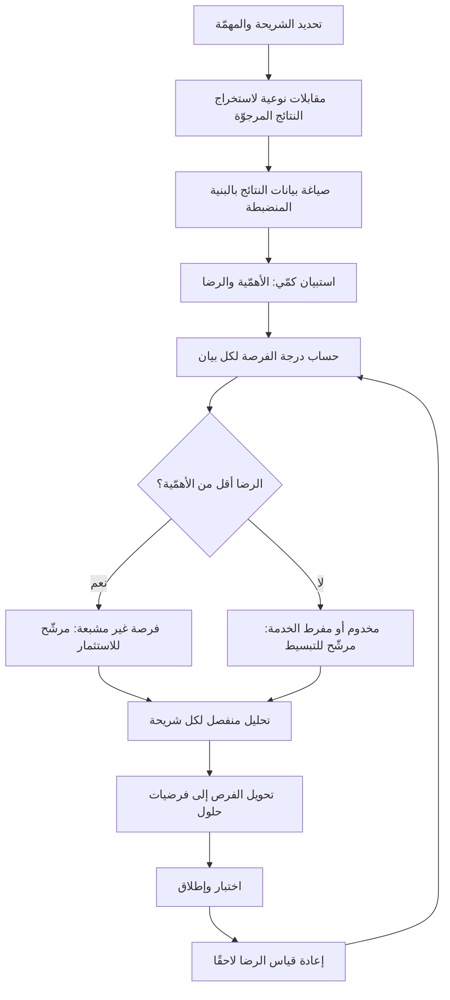

# تقييم الفرص (Opportunity Scoring)

> [!info] تعريف مختصر
> طريقة كمّية لكشف **أين توجد الفرصة الحقيقية** في سوق أو منتج، تقوم على قياس بُعدين لكل نتيجة يرجوها العميل: **مدى أهمّيتها** لديه، و**مدى رضاه الحالي** عن تحقّقها بالحلول المتاحة. الفرصة ليست حيث الأهمّية عالية فقط، ولا حيث الرضا منخفض فقط، بل حيث يجتمع الاثنان: **نتيجة مهمّة جدًّا ولا يزال العميل غير راضٍ عنها**. تُلخَّص في صيغة: `درجة الفرصة = الأهمّية + max(الأهمّية − الرضا، صفر)`. وقيمتها المنهجية أنها تنقل السؤال من «ما الميزة التي يطلبها العميل؟» إلى «أي نتيجة يسعى إليها ولا يزال متعثّرًا في بلوغها؟» — وهو سؤال يُنتج فرصًا لا يعرفها العميل نفسه.

## الشرح العلمي والاحترافي
- **الأصل والنسبة**: الصيغة جزء من منهجية **الابتكار المدفوع بالنتائج (Outcome-Driven Innovation – ODI)** التي طوّرها **أنتوني أولويك (Anthony Ulwick)**، وهي أحد الفروع الرئيسة لإطار [[Jobs to be Done]] — تحديدًا الفرع الكمّي القياسي منه، في مقابل الفرع السردي الذي يركّز على الظرف واللحظة السببية. الفكرة المركزية لدى أولويك أن العميل ليس مصمِّمًا فلا يُسأل عن الحلول، لكنه **خبير في نتائجه**، فيُسأل عن النتائج المرجوّة ويُترك ابتكار الحل لفريق المنتج.
- **وحدة القياس: بيان النتيجة (Outcome Statement)**: لا تُقاس "ميزات" بل نتائج مصاغة بصيغة منضبطة تجعلها قابلة للقياس والمقارنة عبر الزمن: **اتجاه التغيير + وحدة القياس + موضوع التحكّم + سياق**. مثال: «**تقليل** الـ**وقت** اللازم لـ**اكتشاف سبب رفض المعاملة**». الصياغة المنضبطة ليست تنميقًا؛ فهي التي تمنع الإجابة عن سؤال مبهم وتجعل النتيجة صالحة كمقياس ثابت عبر السنوات مهما تغيّرت التقنية.
- **منطق الصيغة**: تُقاس الأهمّية والرضا عادة كنسبة المستجيبين الذين صنّفوا البند «مهمًّا جدًّا» أو «راضٍ جدًّا» على مقياس من ١ إلى ١٠. ثم:
  - إن كان الرضا **أقل** من الأهمّية، فالفجوة موجبة وتُضاف — فتفوق درجة الفرصة الأهمّية نفسها.
  - إن كان الرضا **يساوي أو يفوق** الأهمّية، فالفجوة تُقصَر عند الصفر (`max(..., 0)`) وتصبح درجة الفرصة = الأهمّية فقط.
  وهذا القصر عند الصفر متعمّد ومهمّ: **الإفراط في الخدمة لا يُكافَأ**. نتيجة رضا العميل عنها يفوق أهمّيتها لديه هي منطقة **إفراط في الخدمة (Overserved)** — استثمار إضافي فيها إهدار محض، وقد تكون مرشّحة لخفض التكلفة أو حتى للتبسيط بحذف. هذه النقطة تحديدًا هي ما يميّز الصيغة عن مجرّد طرح الرضا من الأهمّية.
- **قراءة الحدود والمناطق**: الحدّ الفاصل المستعمل عادة أن الدرجات فوق **١٥** تشير إلى فرصة قوية غير مشبعة، وحول **١٠–١٢** إلى سوق مخدوم بشكل مناسب، وما دون ذلك إلى إفراط في الخدمة. لكن الأهم من الرقم المطلق هو **الترتيب النسبي بين النتائج داخل الدراسة نفسها**، لأن معايرة المقاييس تختلف باختلاف الجمهور والثقافة وصياغة الاستبيان.
- **العلاقة بنموذج كانو**: تتقاطع الفكرة مع [[Kano Model]] لكنها تختلف في المنهج والمخرَج. كانو يصنّف الميزات إلى فئات كيفية (أساسية، أدائية، مبهجة) عبر أسئلة مزدوجة (وظيفية/معكوسة)، بينما تقييم الفرص يُنتج **رقمًا متّصلًا يُرتَّب به** ويعمل على النتائج لا على الميزات. وهما متكاملان: كانو يفسّر **لماذا** لا يُشبع بند معيّن الرضا مهما تحسّن، وتقييم الفرص يحدّد **أيّ البنود** تستحقّ الاستثمار أولًا.
- **الفرق عن سؤال الرضا التقليدي**: قياس الرضا وحده (كما في [[NPS]] أو استبيانات الرضا العامة) يخبرك أن هناك مشكلة لا **أين** هي ولا هل تستحقّ الحل. نتيجة منخفضة الرضا لكنها منخفضة الأهمّية ليست فرصة إطلاقًا — بل فخّ يستهلك سعة الفريق في إصلاح ما لا يهمّ أحدًا. البُعدان معًا هما ما يمنع هذا الخطأ الشائع.
- **متطلّبات الصحّة الإحصائية**: الصيغة تفترض عيّنة كافية وممثّلة. تشغيلها على ١٢ ردًّا من عملاء متحمّسين ينتج أرقامًا مضلّلة تحمل مظهر الصرامة. القاعدة العملية: عيّنة بعشرات الردود على الأقل لكل شريحة، مع **تحليل منفصل لكل شريحة** — إذ كثيرًا ما تنكشف فرصة ضخمة داخل شريحة واحدة بينما يُظهر المتوسّط الكلّي سوقًا مخدومًا، وهذا التمويه بالمتوسّط من أخطر ما يعتري الطريقة.
- **دورة الاستخدام**: النتائج المرجوّة أثبت بكثير من الميزات؛ فهي تبقى صالحة سنوات بينما تتغيّر الحلول. لذلك تُعاد الدراسة كل سنة أو سنتين، والمتغيّر المتوقّع هو **درجة الرضا** لا قائمة النتائج نفسها — وانخفاض درجة فرصة بعد إطلاق حل هو أنظف دليل على أن الحل نجح فعلًا.

## أين ومتى يُستخدم
- **في اكتشاف المنتج ([[Product Discovery]]) قبل تحديد ما يُبنى**: لتحويل بحث نوعي ثريّ لكنه غير حاسم إلى ترتيب كمّي قابل للدفاع عنه أمام الإدارة.
- **في دخول سوق جديدة أو شريحة جديدة**: لكشف ما إذا كانت الشريحة مخدومة بإفراط (فتكون المنافسة على السعر) أم غير مشبعة (فتكون فرصة تمايز حقيقية) — وهو مدخل مباشر إلى [[Customer and Market Validation]].
- **في تحديد نطاق [[MVP]]**: النتائج ذات درجات الفرص الأعلى تحدّد ما يجب أن يؤدّيه الإصدار الأول بامتياز، وما يكفي فيه الأداء المتوسّط.
- **في تفسير ركود مؤشّرات الاحتفاظ رغم كثرة الميزات المُطلقة**: غالبًا لأن الفريق يستثمر في نتائج مخدومة أصلًا بإفراط، وهي حالة نموذجية لـ[[Feature Factory]].
- **في تغذية شجرة الفرص**: كل نتيجة غير مشبعة تصبح عقدة فرصة صريحة في [[Opportunity Solution Tree]] تتفرّع منها حلول مرشّحة للاختبار.
- **في تحديد ما يُبسَّط أو يُحذف**: الدرجات المنخفضة جدًّا تُرشّح مناطق للإفراط في الخدمة يمكن تقليصها لخفض التكلفة والتعقيد ومعالجة [[Gold Plating]].

## مثال وسيناريو تطبيقي
> [!example] شركة سعودية تقدّم نظامًا محاسبيًّا للمنشآت الصغيرة، ينمو ببطء رغم إطلاق ١٩ ميزة خلال عام. طلب الفريق من العملاء «قائمة أمنياتهم» فجاءت مليئة بطلبات متفرّقة متناقضة. فتحوّل إلى منهج النتائج: استخرج من ٢٢ مقابلة نوعية **٣٤ بيان نتيجة** بصياغة منضبطة، ثم أرسل استبيانًا كمّيًّا إلى ٤٠٠ عميل، أجاب منه ١٨٧ (نسبة استجابة ٤٧٪)، يقيس لكل بيان: الأهمّية (١–١٠) والرضا (١–١٠)، وحُسبت النسب المئوية لمن اختاروا ٩ أو ١٠.
> عيّنة من النتائج:
>
> | بيان النتيجة | الأهمّية | الرضا | الفرصة |
> |---|---|---|---|
> | تقليل الوقت اللازم لتجهيز إقرار الضريبة | 88 | 31 | 145 |
> | تقليل احتمال اكتشاف خطأ محاسبي بعد الإقفال | 84 | 44 | 124 |
> | تقليل الوقت اللازم لمعرفة السيولة المتاحة اليوم | 79 | 52 | 106 |
> | زيادة تنوّع تصاميم الفاتورة | 26 | 71 | 26 |
> | تقليل الوقت اللازم لإصدار فاتورة | 81 | 86 | 81 |
>
> القراءة كانت صادمة للفريق من وجهين. الأول: «إصدار الفاتورة» — وهو ما استُثمر فيه أكثر من نصف جهد العام — كان **مخدومًا بإفراط**؛ الرضا (٨٦) يفوق الأهمّية (٨١)، فقُصرت الفجوة عند الصفر وبقيت درجته ٨١ رغم أهمّيته العالية. أي أن مزيدًا من التحسين هناك لا يشتري ولاءً إضافيًّا. الثاني: «تنوّع تصاميم الفاتورة» كان أكثر طلب متكرّر في تذاكر الدعم، لكن أهمّيته الفعلية ٢٦ فقط — طلب صاخب من أقلّية، وفرصة شبه معدومة.
> **الفرصة الحقيقية** كانت في تجهيز الإقرار الضريبي بدرجة ١٤٥، وهي نتيجة لم يطلبها أحد بصيغة ميزة لأن العملاء تعايشوا معها بحلول التفافية (تصدير إلى جداول بيانات ومحاسب خارجي). ولمّا فُصلت النتائج بحسب الشريحة، اتّضح أن الدرجة تقفز إلى **١٦٢** لدى منشآت التجزئة متعدّدة الفروع، بينما تهبط إلى ٩٨ لدى مقدّمي الخدمات المفردين — وهو تباين كان المتوسّط الكلّي يخفيه تمامًا.
> أعاد الفريق تركيز خارطة الطريق على مسار الإقرار الضريبي لشريحة التجزئة، وأوقف الاستثمار في محرّر الفواتير. بعد إعادة الدراسة في العام التالي، هبطت درجة الفرصة للنتيجة الأولى من ١٤٥ إلى ٩٤ — وهو المؤشّر الذي اعتمده الفريق دليلًا على أن الفجوة أُغلقت فعلًا، لا مجرّد أن ميزات أُطلقت.

## خطوات أو مخطّط
1. حدّد الشريحة والمهمّة الأساسية محلّ الدراسة بدقّة — دراسة واحدة تخلط شرائح متباينة تُنتج متوسّطات بلا معنى.
2. أجرِ مقابلات نوعية ([[User Interview]]) لاستخراج النتائج المرجوّة، مع الالتزام بمبدأ عدم سؤال العميل عن الحلول (وهو منطق [[The Mom Test]] نفسه).
3. صُغ كل نتيجة بالبنية المنضبطة: اتجاه + وحدة قياس + موضوع + سياق، واحذف كل بيان يتضمّن تقنية أو حلًّا بعينه.
4. نقِّ القائمة من التكرار والتداخل حتى تستقرّ عادة بين ٣٠ و٧٠ بيانًا متمايزًا.
5. صمّم استبيانًا كمّيًّا يسأل عن الأهمّية والرضا لكل بيان، ووزّعه على عيّنة ممثّلة كافية الحجم لكل شريحة.
6. احسب `الأهمّية + max(الأهمّية − الرضا، 0)` لكل بيان.
7. رتّب النتائج تنازليًّا، وقسّمها إلى ثلاث مناطق: غير مشبعة، مخدومة بشكل مناسب، مخدومة بإفراط.
8. **أعد التحليل لكل شريحة على حدة** وقارن الفروق — الفرص الأثمن غالبًا تختبئ داخل شريحة لا في المتوسّط العام.
9. حوّل النتائج غير المشبعة إلى فرص في [[Opportunity Solution Tree]]، وولّد لكل فرصة عدّة حلول مرشّحة تُختبر بـ[[Hypothesis]] قابلة للدحض.
10. أعد قياس الرضا بعد الإطلاق؛ انخفاض درجة الفرصة هو دليل النجاح الحقيقي وليس عدد الميزات المُسلَّمة ([[Outcome vs Output]]).

## ⚠️ مفاهيم خاطئة شائعة
> [!warning]
> - **الظنّ بأن أدنى رضا هو أعلى فرصة**: الرضا المنخفض في نتيجة غير مهمّة ليس فرصة بل مصيدة تستنزف السعة. الأهمّية شرط لازم، والفجوة هي المضاعِف.
> - **قياس ميزات بدل نتائج**: سؤال العميل عن رضاه عن «لوحة التقارير» يُقيّم حلًّا موجودًا ويحبس التفكير داخله، بينما سؤاله عن «الوقت اللازم لمعرفة ربحية الفرع» يفتح الباب لحلول لم تُتخيّل بعد.
> - **إهمال قصر الفجوة عند الصفر**: من يطرح الرضا من الأهمّية بلا قصر يحصل على قيم سالبة تُفسَّر خطأً كأنها "فرص عكسية". القصر عند الصفر هو ما يجعل الإفراط في الخدمة محايدًا لا مكافَأً.
> - **اعتبارها بديلًا عن أدوات ترتيب التنفيذ**: هي تكشف **أين** الفرصة في السوق، لا **متى** يُنفَّذ ماذا ولا بأيّ كلفة. الانتقال من الفرصة إلى ترتيب التسليم يحتاج أداة أخرى مثل [[RICE Prioritization]] أو [[WSJF]] أو [[Weighted Scoring]].
> - **الثقة في المتوسّط الكلّي**: متوسّط عبر شرائح متباينة يُخفي فرصًا ضخمة داخل شريحة واحدة ويوهم بأن السوق مخدوم. التقطيع بحسب الشريحة ليس تحسينًا اختياريًّا بل شرط صحّة.
> - **الظنّ بأن الدرجة العالية تعني حلًّا سهلًا أو مربحًا**: الفرصة غير المشبعة قد تكون كذلك لأن حلّها صعب تقنيًّا أو ممنوع تنظيميًّا. درجة الفرصة تصف الطلب لا الجدوى، ويجب أن يتبعها تقدير جهد ومخاطر مستقلّ.

## ❌ ممارسات خاطئة في المشاريع
> [!failure]
> - **الخطأ: بناء قائمة النتائج من عصف ذهني داخلي بدل مقابلات مع العملاء.** لماذا يضرّ: يقيس الفريق افتراضاته عن نفسه، فيخرج استبيان يؤكّد ما يعتقده مسبقًا ولا يكشف شيئًا جديدًا. الحل: اشترط أن يكون كل بيان نتيجة مستخرَجًا من اقتباس فعلي في مقابلة، وسجّل مصدره.
> - **الخطأ: تشغيل الاستبيان على عيّنة صغيرة أو متحيّزة (عملاء متحمّسون أو قائمة بريدية).** لماذا يضرّ: يُنتج أرقامًا بمظهر إحصائي وأساس هشّ، فتُتّخذ قرارات استثمار سنوية على ضجيج. الحل: خطّط للعيّنة قبل الإرسال، وأعلن حجم الاستجابة وحدودها مع كل عرض للنتائج.
> - **الخطأ: صياغة بيانات نتائج تتضمّن حلًّا ("تقليل الوقت اللازم لاستخدام التطبيق الجديد").** لماذا يضرّ: يحبس الاستبيان داخل الحل القائم فتضيع الفرص الابتكارية كلّها. الحل: مراجعة تحريرية تحذف كل ذكر لتقنية أو واجهة أو منتج من البيانات.
> - **الخطأ: الاستجابة لأصوات الدعم المرتفعة بدل درجات الفرص.** لماذا يضرّ: الأقلّية الصاخبة ليست ممثّلة، فيُبنى المنتج لأكثر العملاء شكوى لا لأكثرهم قيمة. الحل: قابِل كل طلب متكرّر بدرجة فرصته المقاسة قبل قبوله في الـ Backlog.
> - **الخطأ: الاستمرار في تحسين مناطق مخدومة بإفراط لأنها "نقاط قوّتنا".** لماذا يضرّ: استثمار متزايد بعائد رضا صفري، مع إهمال الفجوة الحقيقية للمنافسين. الحل: خصّص حصّة صريحة من السعة للنتائج ذات الدرجات الأعلى، واعتبر المناطق المشبعة مرشّحة لخفض التكلفة لا للتطوير.
> - **الخطأ: عدم إعادة القياس بعد الإطلاق.** لماذا يضرّ: يبقى الفريق يقيس المخرجات (عدد الميزات) لا النتائج، فلا يعرف أبدًا هل أُغلقت الفجوة. الحل: اجعل إعادة قياس الرضا للنتيجة المستهدفة جزءًا رسميًّا من تعريف نجاح المبادرة ضمن [[Definition of Done]] على مستوى المبادرة.
> - **الخطأ: عرض درجة الفرصة على الإدارة كأنها عائد مالي متوقّع.** لماذا يضرّ: يخلق توقّعًا بأن الدرجة ١٤٥ تعني إيرادًا مضاعفًا، فتنهار الثقة بالطريقة عند أول إطلاق لا يحقّق ذلك. الحل: قدّمها بوصفها مؤشّر أولوية للطلب غير المُلبّى، واربطها بتقدير مالي منفصل في [[Business Case]].

## 🔗 مصطلحات ومفاهيم ذات صلة
[[Jobs to be Done]] | [[Kano Model]] | [[Opportunity Solution Tree]] | [[Product Discovery]] | [[User Interview]] | [[The Mom Test]] | [[Customer and Market Validation]] | [[RICE Prioritization]] | [[Weighted Scoring]] | [[ICE Scoring]] | [[WSJF]] | [[MoSCoW Prioritization]] | [[Outcome vs Output]]
