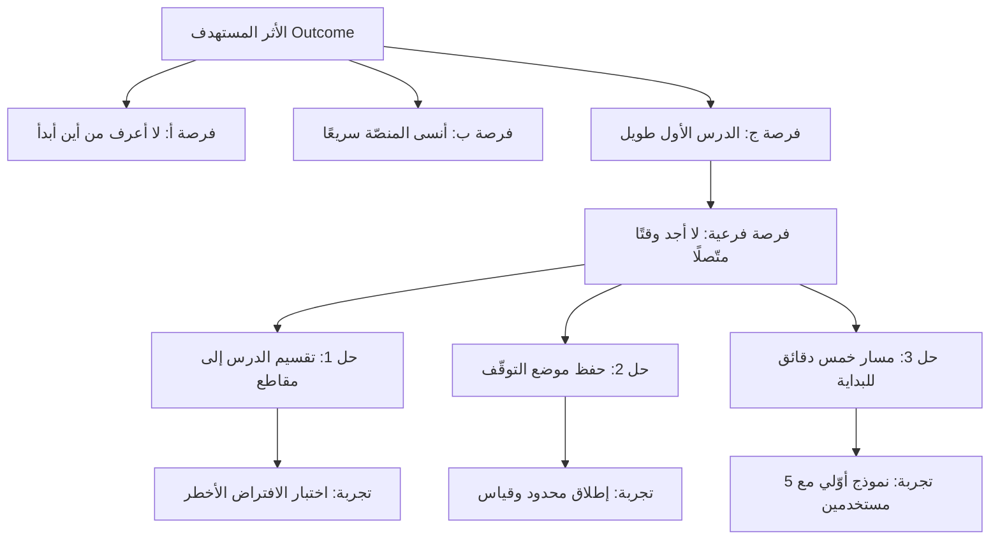

# شجرة الفرص والحلول (Opportunity Solution Tree)

> [!info] تعريف مختصر
> شجرة الفرص والحلول (Opportunity Solution Tree — اختصارًا OST) أداة بصرية طوّرتها تيريزا تورِس (Teresa Torres) وشرحتها في كتاب *Continuous Discovery Habits*. تربط الشجرة أربعة مستويات في بنية واحدة: **الأثر المستهدف (Outcome)** في الجذر، ثم **الفرص (Opportunities)** وهي الاحتياجات والآلام والرغبات الحقيقية التي سُمعت من المستخدمين، ثم **الحلول (Solutions)** المقترحة لكل فرصة، ثم **التجارب (Experiments)** التي تختبر كل حلّ. غايتها أن تجعل تفكير الفريق **مرئيًّا وقابلًا للنقد**، فتكشف القفزات المنطقية وتحوّل النقاش من "أي ميزة نبني؟" إلى "أي فرصة نهاجم؟".

## الشرح العلمي والاحترافي

- **المشكلة التي جاءت الشجرة لحلّها.** معظم فرق المنتج تنتقل مباشرة من **الهدف** إلى **الحل**: يُقال "نريد رفع الاحتفاظ بالعملاء" فيُقترح فورًا "لنبنِ برنامج ولاء". ما بينهما — أي **الفرصة**: أي حاجة أو ألم عند المستخدم يمنع الاحتفاظ فعلًا — يُقفز عليه بلا وعي. هذه القفزة تجعل النقاش عقيمًا: لا يمكن الحكم على "برنامج الولاء" مقابل "تحسين التهيئة" لأن كلًّا منهما يعالج شيئًا مختلفًا لم يُصرَّح به. الشجرة تُظهر الطبقة المفقودة وتفرض التصريح بها.

- **المستويات الأربعة.**
  1. **الأثر المستهدف (Outcome)** في الجذر: تغيير قابل للقياس في سلوك المستخدم أو نتيجة العمل، لا قائمة مخرجات. راجع [[Outcome vs Output]]. يجب أن يكون **أثرًا واحدًا** في الشجرة الواحدة؛ تعدّد الجذور يعني تشتّت الفريق.
  2. **الفرص (Opportunities)**: احتياجات وآلام ورغبات **سُمعت فعلًا** من المستخدمين في مقابلات أو ظهرت في بيانات سلوك، مصاغة بلغة المستخدم لا بلغة الحل. الصياغة الصحيحة: "لا أعرف هل وصلت دفعة العميل وأنا خارج المكتب". الصياغة الخاطئة: "نحتاج تطبيق جوّال" — هذه حلّ متنكّر في هيئة فرصة. تُنظَّم الفرص هرميًّا: فرص كبرى تتفرّع منها فرص أدقّ، فتصبح الشجرة **خريطة لفضاء المشكلة** كاملًا.
  3. **الحلول (Solutions)**: أفكار محدّدة تعالج فرصة بعينها. القاعدة أن تُولّد **حلول متعدّدة لكل فرصة** (ثلاثة على الأقل)، لأن الحل الأول نادرًا ما يكون الأفضل، وتوليد بدائل يكشف الفضاء الحقيقي للاختيار.
  4. **التجارب (Assumption Tests / Experiments)**: اختبارات صغيرة سريعة تستهدف **الافتراض الأخطر** في كل حل، لا الحل بأكمله. الغاية انتزاع دليل بأقل كلفة ممكنة قبل الالتزام بالبناء.

- **القاعدة الأساسية: لا يُقارَن حلّان إلا داخل الفرصة نفسها.** هذه أهم قاعدة عملية في الأداة. مقارنة حلّ يعالج فرصة "أ" بحلّ يعالج فرصة "ب" مقارنة بلا معنى، لأن المعيار مختلف: كل حل يُقاس بمدى معالجته لفرصته هو. أما **المقارنة بين الفرص** فتكون بمعايير أخرى: حجم الفرصة (كم مستخدمًا تمسّ؟)، وشدّة الألم (كم تكلّفهم اليوم؟)، وتكرارها، وقربها من الأثر المستهدف، ومدى ثقتنا في الأدلة عليها. بهذا تنفصل طبقتان من القرار كانتا مختلطتين: **أي مشكلة نهاجم؟** ثم **أي حل نجرّب؟**

- **الشجرة تجعل التفكير قابلًا للنقد.** حين تُرسم الشجرة على جدار أو لوح رقمي، يستطيع أي شخص — بما فيهم الجهات المعنية خارج الفريق — أن يرى **لماذا** اختار الفريق ما اختار. ويصبح الاعتراض بنّاءً ومحدّدًا: هل الاعتراض على المُخرَج؟ أم على أن هذه الفرصة هي الأهم؟ أم على أن هذا الحل هو الأنسب لهذه الفرصة؟ في غياب الشجرة يتحوّل الخلاف إلى صراع تفضيلات شخصية بلا مستوى مشترك للنقاش.

- **الشجرة كائن حيّ لا مستند.** تُحدَّث بعد كل مقابلة ضمن [[Continuous Discovery]]: كل قصة جديدة تضيف فرصة أو تعزّز فرصة قائمة أو تُسقط أخرى. لذلك لا تُرسم مرة واحدة في بداية الربع وتُعلَّق. الشجرة الميتة — التي لم تتغيّر منذ أسابيع — علامة على توقّف الاكتشاف.

- **العلاقة بالأدوات الأخرى.** تُستخرج الفرص من مقابلات قصصية تتقاطع مع منهج [[Jobs to be Done]] في البحث عن الدافع الحقيقي؛ وتُصنَّف بعض الفرص بوصفها [[Pain Point]] صريحة؛ وتُختبر حلولها عبر [[MVP]] وتجارب صغيرة؛ وقد يُستعان بأطر ترتيب مثل [[RICE Prioritization]] عند المفاضلة بين الفرص، بشرط ألّا يُستخدم الرقم لإخفاء غياب الدليل.

## أين ومتى يُستخدم

- **في بداية كل ربع** عند تحديد الأثر المستهدف، لرسم فضاء المشكلة قبل الالتزام بأي حل.
- **عند تعارض طلبات الجهات المعنية**: بدل مناقشة الميزات، تُوضع كل الطلبات على الشجرة، فيتّضح أي منها يعالج فرصة موثّقة وأيها لا يرتبط بالمُخرَج أصلًا.
- **في جلسات توليد الحلول (Ideation)**: تُثبَّت الفرصة أولًا ثم يُطلب توليد بدائل لها؛ هذا يمنع العصف الذهني المفتوح غير الموجّه.
- **عند تبرير قرار منتج للإدارة**: الشجرة تسرد قصة القرار كاملة من الهدف إلى التجربة، وهي أقوى بكثير من قائمة ميزات.
- **عند انضمام عضو جديد للفريق**: توفّر خريطة سريعة لما نعرفه عن المستخدم ولماذا نبني ما نبني.
- **كلما شعر الفريق أنه "يبني كثيرًا بلا أثر"**: الشجرة غالبًا تكشف أن الحلول المتراكمة تعالج فرصة واحدة صغيرة، أو لا تعالج فرصة مثبتة أصلًا.

## مثال وسيناريو تطبيقي

> [!example] فريق منتج في منصّة تعلّم إلكتروني. الأثر المستهدف للربع: **رفع نسبة المتعلّمين الذين يُكملون الوحدة الأولى خلال أسبوع من التسجيل**.
>
> **قبل الشجرة**: كان اجتماع الأولويات يدور حول ثلاث ميزات مقترحة — نظام شارات، إشعارات تذكير، وفيديو ترحيبي. كل جهة تدافع عن مقترحها، والقرار ينتهي إلى أقوى صوت في الغرفة أو إلى تنفيذ الثلاثة معًا.
>
> **بعد الشجرة**: أفرغ الفريق ملاحظات اثنتي عشرة مقابلة أُجريت خلال الأسابيع الماضية، فتشكّلت ثلاث فرص كبرى تحت الجذر:
> - **الفرصة أ**: "لا أعرف من أين أبدأ؛ أرى قائمة طويلة ولا أعرف أيها أولًا" — وردت في سبع مقابلات.
> - **الفرصة ب**: "أنسى المنصّة بعد يومين من التسجيل" — وردت في أربع.
> - **الفرصة ج**: "الدرس الأول طويل ولا أجد وقتًا متّصلًا له" — وردت في خمس، وأيّدتها البيانات: 60% من حالات التوقّف تقع في الدقائق الأولى من الدرس الأول.
>
> عند وضع الميزات المقترحة على الشجرة، اتّضح أمر لم يكن ظاهرًا: **الشارات والفيديو الترحيبي والإشعارات كلها كانت حلولًا للفرصة ب**، بينما الفرصتان أ وج — الأقوى دليلًا — لم يكن لهما حلّ مقترح واحد. لم يكن الفريق يقارن حلولًا؛ كان يهاجم فرصة واحدة من ثلاث زوايا ويهمل الباقي.
>
> **القرار**: اختار الفريق مهاجمة الفرصة ج أولًا (أكبر دليل كمّي ونوعي معًا)، وولّد لها ثلاثة حلول: تقسيم الدرس الأول إلى مقاطع قصيرة، وحفظ موضع التوقّف والاستئناف منه، ومسار "خمس دقائق للبداية". الافتراض الأخطر في الحل الأول كان: **هل الطول فعلًا هو المانع، أم صعوبة المحتوى؟** فاختُبر بتجربة رخيصة على شريحة صغيرة قبل إعادة إنتاج المحتوى كاملًا.
>
> **الفائدة الحقيقية**: لم تُلغَ الشارات، بل انتقلت إلى موضعها الصحيح في الشجرة بانتظار دورها. وتحوّل النقاش من "ميزة من ستُنفَّذ؟" إلى "أي فرصة تستحق ربعنا هذا؟".

## خطوات أو مخطّط

1. **ضع أثرًا واحدًا في الجذر**، قابلًا للقياس ومحدّد المدة.
2. **أفرغ أدلّتك**: مقابلات، بيانات، تذاكر دعم — واستخرج منها فرصًا بلغة المستخدم.
3. **نظّف الفرص من الحلول المتنكّرة**: كل عبارة تحوي اسم ميزة أو تقنية أعِد صياغتها إلى الحاجة الكامنة خلفها.
4. **رتّب الفرص هرميًّا**: فرص كبرى ثم فرص فرعية أدقّ تحتها، حتى تصير الشجرة خريطة كاملة لفضاء المشكلة.
5. **قارن الفرص فيما بينها** بالحجم والشدّة والتكرار والقرب من المُخرَج وقوة الدليل، واختر فرعًا واحدًا للتركيز.
6. **ولّد ثلاثة حلول على الأقل للفرصة المختارة**، ولا تقارن حلًّا بحلّ من فرصة أخرى.
7. **استخرج الافتراض الأخطر** في كل حل، وصمّم أرخص تجربة تختبره.
8. **نفّذ التجربة وقرّر**: ابنِ، أو عدّل، أو أسقِط الحل وعد إلى الفرصة.
9. **حدّث الشجرة أسبوعيًّا** مع كل مقابلة جديدة؛ الشجرة الثابتة شجرة ميتة.

## ⚠️ مفاهيم خاطئة شائعة

> [!warning]
> - **"الفرصة هي الميزة التي نريد بناءها"**: لا؛ الفرصة حاجة أو ألم عند المستخدم مصاغة بلغته. كل فرصة تحوي اسم ميزة هي حلّ متنكّر، ووجودها في مستوى الفرص يُفسد الشجرة كلها.
> - **"الشجرة مخطّط توثيقي يُرسم مرة ويُعلَّق"**: هي أداة تفكير حيّة تتغيّر أسبوعيًّا مع كل دليل جديد.
> - **"يمكن مقارنة كل الحلول ببعضها لاختيار الأفضل"**: لا معنى لمقارنة حلول تعالج فرصًا مختلفة؛ المقارنة داخل الفرصة الواحدة فقط، والمقارنة بين الفرص بمعايير الحجم والأثر والدليل.
> - **"كلما كبرت الشجرة كانت أفضل"**: شجرة متضخّمة بمئات العقد تفقد قدرتها على توجيه القرار. القيمة في **وضوح المسار المختار** لا في اكتمال التوثيق.
> - **"الفرص تُستنبط في غرفة الاجتماعات"**: الفرص تُسمع من المستخدمين؛ ما يُخترع داخليًّا افتراض يجب وسمه بوضوح حتى يُختبر.
> - **"الشجرة بديل عن خارطة الطريق"**: هما مستويان مختلفان؛ الشجرة تشرح **منطق الاختيار**، وخارطة الطريق تعرض **التتابع الزمني والالتزامات** المشتقّة منه.

## ❌ ممارسات خاطئة في المشاريع

> [!failure]
> - **بناء الشجرة من الحلول إلى أعلى**: يبدأ الفريق من قائمة الميزات القائمة ثم يخترع لها فرصًا تبرّرها بأثر رجعي، فتصير الشجرة زينة على قرار متّخذ سلفًا. الحل: البدء دائمًا من المُخرَج ثم الأدلة، وقبول أن بعض الميزات المحبوبة لن تجد فرصة تسندها.
> - **وضع أكثر من مُخرَج في الجذر**: تتحوّل الشجرة إلى شبكة متشابكة يستحيل ترتيب أولوياتها، ويتشتّت الفريق. الحل: شجرة واحدة لكل مُخرَج، وشجرات منفصلة إن تعدّدت الأهداف.
> - **صياغة الفرص بلغة داخلية أو تقنية**: عبارات مثل "تحسين أداء الخادم" ليست فرصة مستخدم بل حلّ؛ الفرصة هي "أنتظر طويلًا حتى تظهر تقاريري فأتركها". الحل: اشتراط أن تكون كل فرصة اقتباسًا قابلًا للعزو إلى مقابلة أو دليل بيانات.
> - **حلّ واحد لكل فرصة**: يُلغي فضاء الاختيار ويحوّل الشجرة إلى قائمة مهام. الحل: قاعدة "ثلاثة حلول على الأقل" قبل السماح بالمفاضلة.
> - **اختبار الحل كاملًا بدل الافتراض الأخطر**: تصبح "التجربة" مشروع بناء مصغّرًا يستهلك أسابيع ويُفقد التجربة معناها. الحل: تسمية الافتراض الذي إن سقط سقط الحل كله، واختباره وحده بأرخص وسيلة.
> - **إهمال تحديث الشجرة بعد المقابلات**: تتراكم الملاحظات في مستند منفصل وتتجمّد الشجرة، فينفصل الاكتشاف عن القرار. الحل: جعل تحديث الشجرة الخطوة الختامية الإلزامية لكل مقابلة.
> - **استخدام أرقام الترتيب لإخفاء غياب الدليل**: تُعطى الفرص درجات دقيقة المظهر بلا سند حقيقي، فيبدو القرار موضوعيًّا وهو تخمين مغلّف. الحل: تسجيل **مصدر الدليل ومستوى الثقة** بجانب كل فرصة، والتصريح بأن الفرص ضعيفة الدليل تحتاج اكتشافًا لا ترتيبًا.

## 🔗 مصطلحات ومفاهيم ذات صلة
[[Continuous Discovery]] | [[Product Discovery]] | [[Outcome vs Output]] | [[Pain Point]] | [[Jobs to be Done]] | [[MVP]] | [[RICE Prioritization]]
