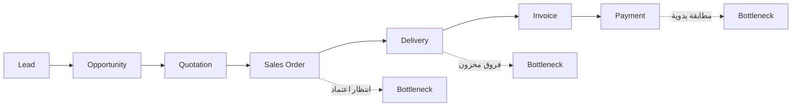

# من الطلب إلى التحصيل (Order to Cash)

> [!info] تعريف مختصر
> **`Order to Cash`** هو [[Value Stream|تدفّق القيمة]] الممتدّ من لحظة اهتمام العميل بالشراء حتى **دخول النقد فعلياً** إلى حساب المؤسسة. وهو أهمّ تدفّقات مشاريع الأنظمة المؤسسية لأنه التدفّق الوحيد الذي **يمسّ الإيراد مباشرة** ويلمسه العميل النهائي في آنٍ واحد. وقيمته المنهجية أنه يعبر أربع وحدات تنظيمية على الأقلّ (المبيعات، المخزون، الشحن، المالية) — فيكشف الاختناقات **بين** الإدارات، وهي بالضبط ما لا يظهر في أي مخطّط تنظيمي.

## الشرح العلمي والاحترافي

- **الخطوات الستّ القياسية**:
  ```
  Lead → Opportunity → Quotation → Sales Order → Delivery → Invoice → Payment
  ```
  وفي الواقع العملي تُضاف إليها متطلبات خاصة بالعميل مثل إظهار الرصيد والحدّ الائتماني، وسياسات الخصم الهدفي، وتوحيد حدود الائتمان عبر الفروع — وهي غالباً **أثقل ما في التدفّق تقديرياً**.

- **لماذا يُختار أولاً في معظم المشاريع؟** لثلاثة أسباب متضافرة:
  1. **الأثر المالي مباشر وقابل للقياس** — كل يوم تأخير في الدورة يُترجَم إلى إيراد مؤجَّل أو ضائع.
  2. **يلمسه العميل النهائي** — فتحسّنه يظهر في رضا العملاء لا في تقارير داخلية فقط.
  3. **يعبر أكثر الوحدات** — فإصلاحه يُنتج تغييراً ثقافياً يمتدّ إلى بقيّة التدفّقات.

- **الاختناقات النمطية فيه**: حين تُرسم خريطة التدفّق تتكرّر ثلاثة أصناف من الانتظار:
  | الصنف | أمثلة | العلاج |
  |---|---|---|
  | **اعتماد بشري** | اعتماد الطلب · اعتماد الفاتورة · اعتماد الصرف | `Approval Workflow` + [[SLA]] للقرارات |
  | **مراجعة يدوية** | تدقيق مالي · مطابقة بنكية · إدخال يدوي | قواعد تحقّق + تكامل بنكي |
  | **عدم ثقة في البيانات** | فروق مخزون · عدم مطابقة كميات | `Barcode` + جرد دوري |

- **مؤشّراته الأساسية**: `Order Cycle Time` (من الطلب إلى الفاتورة أو التحصيل) · `Invoice Error Rate` · `DSO` (متوسط أيام التحصيل) · [[Flow Efficiency]] للتدفّق كاملاً.

- **الرقم الصادم المتكرّر**: في مؤسسات كثيرة يكون **العمل الفعلي في هذا التدفّق قرابة ثلاث ساعات، والزمن الكلّي قرابة ثمانٍ وسبعين ساعة** — أي [[Flow Efficiency|كفاءة تدفّق]] نحو **4%**. والمعنى العملي القاسي: **لو ضاعفت سرعة فريقك لكسبت 2% فقط من الزمن الكلّي؛ ولو حذفت اعتماداً واحداً يستغرق يومين لكسبت 30%.**

- **علاقته بالتدفّقات الأخرى**: `O2C` ليس معزولاً — فهو يعتمد على [[Procure to Pay]] (توفّر البضاعة) وعلى `Inventory Replenishment` (دقّة الرصيد)، ويُغذّي `Record to Report` (الإقفال والتقارير). ولهذا فإن تحسينه دون معالجة دقّة المخزون يُنتج تحسّناً ظاهرياً ينهار عند أول نقص مخزون.

- **الخطأ الأشيع في تعريف حدوده**: كثيرون ينهون التدفّق عند **إصدار الفاتورة** لا عند **التحصيل**. وهذا يُخفي أطول انتظار في الدورة كلّها (المطابقة والتحصيل قد يستغرقان أياماً)، ويجعل المشروع يبدو ناجحاً بينما النقد ما زال محبوساً. **التدفّق يُسمّى `Order to Cash` لا `Order to Invoice` لسبب.**

## أين ومتى يُستخدم
- في **تحليل التدفّق** بعد [[Value Proposition Canvas]] وقبل [[Fit-Gap Analysis]].
- كأول تدفّق في **المرحلة الأولى** لمعظم مشاريع الأنظمة المؤسسية.
- في [[Financial Loss Analysis|تحليل الخسارة المالية]]، إذ تتركّز فيه غالباً أكبر بنود الخسارة.
- في [[PFRE]] كوحدة تقدير: خطوات التدفّق هي نفسها بنود التقدير.
- في **قياس القيمة بعد الإطلاق**: `Order Cycle Time` أوضح مؤشّر يشعر به العميل.

## مثال وسيناريو تطبيقي
> [!example] شركة توزيع — خريطة تدفّق كشفت أن المشكلة ليست في الموظفين
> | الخطوة | زمن العمل | زمن الانتظار | المسؤول | المشكلة |
> |---|---|---|---|---|
> | إنشاء عرض السعر | 20 د | 4 س | المبيعات | انتظار مراجعة |
> | **اعتماد الطلب** | 10 د | **8 س** | مدير المبيعات | المدير مشغول |
> | تجهيز الطلب | ساعتان | 6 س | المستودع | فروق مخزون |
> | إصدار الفاتورة | 15 د | 5 س | المالية | مراجعة يدوية |
> | اعتماد الفاتورة | 5 د | 4 س | مدير المالية | تأخّر الاعتماد |
> | **التحصيل** | 30 د | **48 س** | المالية | مطابقة يدوية |
> | **الإجمالي** | **3.33 ساعة** | **75 ساعة** | | |
>
> $$\text{Flow Efficiency} = \frac{3.33}{78.33} \approx 4\%$$
>
> **ما كشفته الخريطة:**
> - **96% من الزمن انتظار** — والموظفون يعملون بكفاءة تامة خلال الـ4% المتبقّية.
> - أطول انتظارين (**8 ساعات** لاعتماد الطلب و**48 ساعة** للتحصيل) مسؤولان عن **75% من الهدر**، وكلاهما **لا يحتاج تطويراً برمجياً** بل سياسة تفويض وتكاملاً بنكياً.
> - عمود «المسؤول» حوّل الاختناق من شكوى إلى مهمّة: مدير المبيعات وحده مسؤول عن 8 ساعات.
>
> **الأثر المالي:** 300 طلب يومياً × 10% تأخير × 3,000 متوسط الطلب = **90,000 شهرياً** — أكبر بند خسارة في المشروع كلّه.
>
> **النتيجة بعد الإطلاق:** كفاءة التدفّق من 4% إلى **32%**، وزمن الدورة من خمسة أيام إلى **يومين**. والمؤشّران يقيسان الشيء نفسه من زاويتين: أحدهما ما يشعر به العميل، والآخر لماذا شعر به.

## خطوات أو مخطّط
1. ارسم الخطوات من الاهتمام حتى **دخول النقد** — لا حتى إصدار الفاتورة.
2. سجّل لكل خطوة: زمن العمل · زمن الانتظار · **المسؤول** · المشكلة.
3. ثبّت وحدة الزمن (تقويمي أم ساعات عمل) في رأس الجدول.
4. احسب [[Flow Efficiency]] للتدفّق كاملاً.
5. رتّب الاختناقات تنازلياً بزمن الانتظار — لا بعدد الشكاوى.
6. صنّف كل اختناق: اعتماد بشري؟ مراجعة يدوية؟ عدم ثقة في البيانات؟
7. سعّر الهدر عبر [[Financial Loss Analysis]].
8. حوّل الخطوات إلى بنود [[Fit-Gap Analysis]] ثم [[PFRE]].
9. قِس `Order Cycle Time` قبل وبعد الإطلاق.



## ⚠️ مفاهيم خاطئة شائعة
> [!warning]
> - **إنهاء التدفّق عند الفاتورة**: يُخفي أطول انتظار ويجعل النجاح ظاهرياً بينما النقد محبوس.
> - **الخلط بينه وبين وحدة المبيعات**: `O2C` تدفّق يعبر أربع إدارات؛ ووحدة المبيعات جزء منه فقط.
> - **الظنّ بأن بطء الدورة سببه بطء الموظفين**: 96% من الزمن انتظار بين الأعمال لا داخلها.
> - **معالجة الاختناق الأكثر شكوى لا الأطول زمناً**: الشكاوى تتبع الوضوح لا الأثر.
> - **افتراض أن تحسينه مستقلّ عن دقّة المخزون**: تحسّن `O2C` بمخزون غير دقيق ينهار عند أول نقص.

## ❌ ممارسات خاطئة في المشاريع
> [!failure]
> - **رسم التدفّق دون عمود المسؤول**: يُنتج اختناقات بلا ملّاك — أي شكاوى لا مهامّ. الحلّ: عمود مسؤول إلزامي لكل خطوة.
> - **خلط وحدات الزمن (ساعات وأيام) دون تعريف**: يضاعف أو ينصّف كفاءة التدفّق. الحلّ: ثبّت الوحدة في رأس الجدول واستخدم الزمن التقويمي.
> - **تنفيذ وحدات النظام بدل التدفّق كاملاً**: يُنتج شاشات تعمل ودورة ما زالت متوقّفة. الحلّ: التسليم بالدورة الكاملة لا بالوحدة.
> - **إهمال الاعتمادات البشرية بحجّة أنها «خارج النظام»**: هي مصدر أكبر انتظار. الحلّ: سياسة تفويض + [[SLA]] + تصعيد آلي.
> - **عدم قياس الخط الأساسي قبل المشروع**: يجعل إثبات التحسّن مستحيلاً. الحلّ: قياس `Order Cycle Time` قبل البدء.

## 🔗 مصطلحات ومفاهيم ذات صلة
[[Value Stream]] | [[Value Stream Mapping]] | [[Flow Efficiency]] | [[Procure to Pay]] | [[Financial Loss Analysis]] | [[PFRE]] | [[Fit-Gap Analysis]] | [[06 - Value Streams]]
