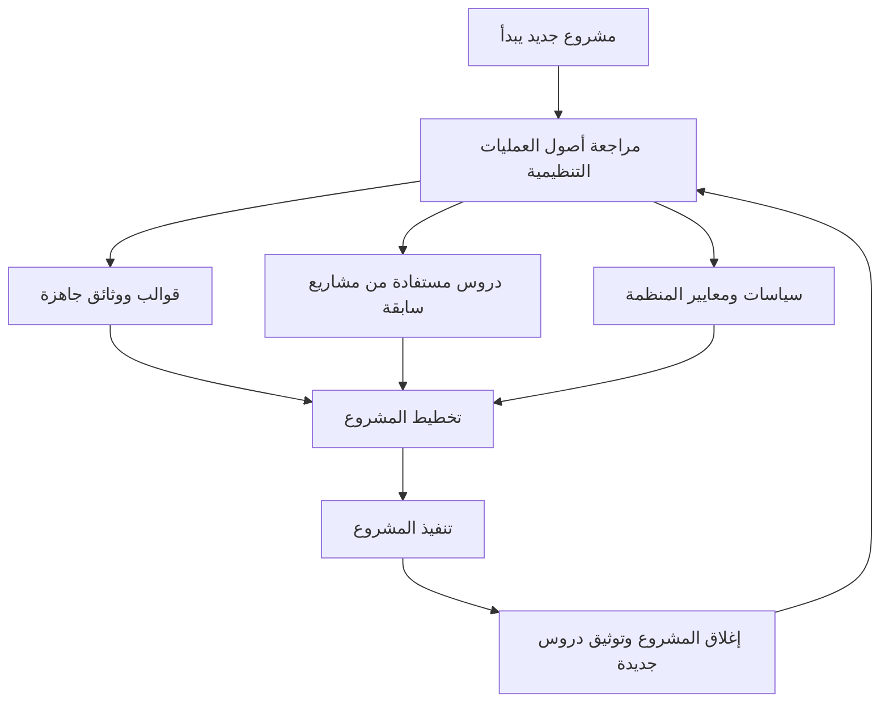

# أصول العمليات التنظيمية (Organizational Process Assets)
> [!info] تعريف مختصر
> أصول العمليات التنظيمية (Organizational Process Assets - OPA) هي كل ما تملكه المنظمة من خطط وسياسات وإجراءات ووثائق ودروس مستفادة من مشاريع سابقة. يستخدمها فريق المشروع كمرجع لتنفيذ العمل بدلاً من البدء من الصفر في كل مرة.

## الشرح العلمي والاحترافي
أصول العمليات التنظيمية مصطلح جاء أصلاً من دليل PMBOK، ويشير إلى فئتين رئيسيتين:
- **العمليات والإجراءات**: مثل السياسات الرسمية، إجراءات مراقبة الجودة، قوالب المستندات (Templates)، أدلة إرشادية، معايير الترميز البرمجي، ونماذج تقييم المخاطر الجاهزة.
- **قاعدة المعرفة المؤسسية**: مثل سجلات المشاريع المُغلقة، قواعد بيانات الدروس المستفادة (Lessons Learned)، سجلات القياس المالي، وسجلات المخاطر والمشكلات من مشاريع سابقة.

أهمية هذا المفهوم أنه يمنع "إعادة اختراع العجلة" في كل مشروع جديد. فبدلاً من أن يبدأ مدير المشروع من صفر لكتابة خطة اتصال أو نموذج تقدير تكلفة، يرجع إلى الأصول الجاهزة في المنظمة ويكيّفها حسب المشروع الحالي. كما تُستخدم هذه الأصول كمُدخل (Input) رسمي في كثير من عمليات التخطيط مثل تطوير ميثاق المشروع، تخطيط النطاق، وتخطيط المخاطر.

## أين ومتى يُستخدم
- في منهجية **الشلال (Waterfall)** والمنهجيات التقليدية القائمة على PMBOK، حيث تظهر أصول العمليات التنظيمية كمُدخل رسمي في جداول كل عملية تخطيطية تقريباً.
- في بداية أي مشروع جديد، عند إعداد ميثاق المشروع وخطة إدارة المشروع، يُراجع مدير المشروع الأصول المتاحة (قوالب، سياسات، دروس مستفادة) قبل البدء بالتخطيط من الصفر.
- عند إغلاق المشروع، يُضاف ما تعلّمه الفريق كأصل جديد يُغني هذه القاعدة للمشاريع المستقبلية.
- تُستخدم أيضاً في بيئات Agile وإن لم يُسمّ المفهوم صراحة، فمثلاً "تعريف الإنجاز" الموحّد على مستوى المؤسسة أو قوالب بطاقات Kanban المعتمدة تُعد أصولاً تنظيمية.

## مثال وسيناريو تطبيقي
> [!example] شركة "نُظم" لتطوير البرمجيات تبدأ مشروعاً جديداً لبناء تطبيق جوّال لعميل في قطاع البنوك. قبل أن يكتب مدير المشروع أحمد خطة إدارة المخاطر من الصفر، يفتح مستودع أصول العمليات التنظيمية الداخلي ويجد: (1) قالب سجل مخاطر جاهز (Risk Register Template) استُخدم في ثلاثة مشاريع بنكية سابقة، (2) وثيقة دروس مستفادة من مشروع مشابه قبل سنة تحذّر من أن "متطلبات الامتثال التنظيمي في القطاع البنكي تأخذ وقتاً أطول من المتوقع بمعدل 20%"، (3) سياسة أمن معلومات إلزامية لكل مشاريع القطاع المالي. يستخدم أحمد هذه الأصول الثلاثة مباشرة: يبني سجل المخاطر على القالب الجاهز، يضيف بنداً احترازياً في الجدول الزمني بناءً على الدرس المستفاد، ويُدرج سياسة الأمن كمتطلب غير وظيفي منذ اليوم الأول. هذا وفّر عليه أسبوعاً كاملاً من إعداد الوثائق وتجنّب خطأً وقع فيه مشروع سابق.

## خطوات أو مخطّط
1. عند بدء المشروع، حدّد قائمة بالأصول المتاحة ذات الصلة (قوالب، سياسات، سجلات مشاريع سابقة).
2. راجع الدروس المستفادة من مشاريع مشابهة في المجال أو التقنية نفسها.
3. كيّف القوالب والسياسات لتناسب سياق المشروع الحالي دون نسخها حرفياً.
4. استخدم الأصول كمُدخل في عمليات التخطيط (النطاق، الجدول، التكلفة، المخاطر).
5. عند إغلاق المشروع، وثّق الدروس الجديدة وأضفها إلى مستودع الأصول لتستفيد منها المشاريع القادمة.

## ⚠️ مفاهيم خاطئة شائعة
> [!warning]
> - **الخلط بينها وبين "عوامل البيئة المؤسسية" (Enterprise Environmental Factors)**: الأصول التنظيمية هي أشياء تملكها المنظمة ويمكنها التحكم بها وتعديلها (قوالب، سياسات)، بينما عوامل البيئة المؤسسية هي ظروف خارجية أو داخلية لا تتحكم بها المنظمة مباشرة (السوق، الثقافة التنظيمية، البنية التحتية).
> - **الاعتقاد بأنها خاصة بالمنهجيات التقليدية فقط**: صحيح أن المصطلح جاء من PMBOK، لكن مفهومه (إعادة استخدام المعرفة التنظيمية) ينطبق أيضاً على فرق Agile وDevOps.
> - **الظن أن الأصول ثابتة لا تتغير**: هي في الحقيقة حيّة ومتجددة، تُحدَّث باستمرار بعد كل مشروع.

## ❌ ممارسات خاطئة في المشاريع
> [!failure]
> - **تجاهل الأصول الموجودة والبدء من الصفر** في كل مشروع، مما يهدر وقتاً ويكرر أخطاء سابقة. الحل: خصّص وقتاً في بداية كل مشروع لمراجعة المستودع.
> - **عدم توثيق الدروس المستفادة عند إغلاق المشروع**، فتبقى المعرفة حبيسة رأس مدير المشروع وتُفقد عند مغادرته. الحل: اجعل توثيق الدروس المستفادة خطوة إلزامية في عملية إغلاق المشروع.
> - **استخدام قوالب قديمة دون تحديثها** لتناسب السياق الجديد، مما ينتج وثائق غير دقيقة أو غير ملائمة. الحل: راجع وكيّف كل قالب قبل اعتماده.

## 🔗 مصطلحات ومفاهيم ذات صلة
[[Risk Register]] | [[SOP]] | [[Root Cause Analysis]] | [[Single Source of Truth]] | [[Docs as Code]] | [[04 - Waterfall]] | [[19 - Risk Management]]
