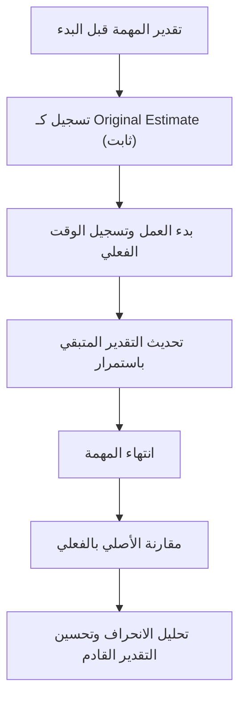

# التقدير الأصلي (Original Estimate)
> [!info] تعريف مختصر
> التقدير الأصلي (Original Estimate) هو أول تقدير يُسجَّل للوقت أو الجهد اللازم لإنجاز مهمة أو مشروع، قبل بدء العمل الفعلي عليه. يبقى ثابتًا كمرجع لمقارنة الأداء الفعلي لاحقًا.

## الشرح العلمي والاحترافي
- بمجرد تقدير مهمة (سواء بالساعات أو نقاط القصة أو أيام-رجل) وتسجيل هذا الرقم في أداة إدارة المشروع (مثل Jira)، يُصبح هذا الرقم "التقدير الأصلي" ولا يُغيَّر بعد ذلك، حتى لو تبيّن أن المهمة أكبر أو أصغر مما توقعنا.
- الهدف من تثبيته هو خلق خط أساس (Baseline) موثوق يُقارَن به الوقت الفعلي المُستهلك (Actual Time)، لحساب تباين التقدير (راجع [[Estimation Variance]]).
- يختلف عن "التقدير المتبقي" (Remaining Estimate) الذي يُحدَّث باستمرار أثناء العمل ليعكس ما تبقى فعليًا لإنجاز المهمة.
- في أدوات مثل Jira وAzure DevOps، تظهر عادة ثلاثة حقول منفصلة: Original Estimate (لا يتغيّر)، Time Spent/Logged (الوقت الفعلي المسجَّل)، وRemaining Estimate (يُحدَّث يوميًا).
- الفائدة الإدارية الكبرى: عند تحليل عشرات المهام بعد انتهاء السبرنت أو المشروع، تتيح المقارنة بين التقدير الأصلي والفعلي تحسين دقة التقديرات المستقبلية (Estimation Accuracy) بشكل تراكمي عبر الزمن.
- يُستخدم أيضًا كأداة مساءلة (Accountability) وتعلّم، وليس أداة عقاب؛ الانحراف الكبير المتكرر يشير لمشكلة في عملية التقدير نفسها وليس بالضرورة في أداء الفرد.

## أين ومتى يُستخدم
- يُسجَّل عند التخطيط للسبرنت ([[08 - Sprint Planning]]) أو عند تحديد نطاق مشروع Waterfall في مرحلة التخطيط الأولي.
- يُستخدم لاحقًا في تقارير الأداء وتحليل [[EVM]] (إدارة القيمة المكتسبة) لحساب مؤشرات مثل [[CPI and SPI]].
- يُستخدم في مراجعات ما بعد السبرنت أو المشروع (Retrospectives) لتحسين دقة عملية التقدير المستقبلية.
- مهم بشكل خاص في العقود ذات السعر الثابت أو الوقت والمواد، حيث يُقارَن التقدير الأصلي بالفعلي لتقييم ربحية المشروع.

## مثال وسيناريو تطبيقي
> [!example] في سبرنت تطوير ميزة "الدفع بالتقسيط" لتطبيق تجارة إلكترونية، قدّر المطور "سامي" المهمة بـ 16 ساعة عمل (التقدير الأصلي)، وسُجِّل هذا الرقم في Jira يوم بدء السبرنت.
> - بعد يومين، سجّل سامي 10 ساعات عمل فعلية (Logged)، لكنه اكتشف تعقيدًا إضافيًا في التكامل مع بوابة الدفع، فحدّث "التقدير المتبقي" إلى 12 ساعة بدلًا من 6.
> - في النهاية استغرقت المهمة 24 ساعة فعلية (Actual).
> - عند مراجعة السبرنت، قارن مدير المشروع: التقدير الأصلي (16) مقابل الفعلي (24)، فوجد تباينًا 50%، وناقش الفريق السبب (عدم معرفة تعقيد بوابة الدفع مسبقًا) لتحسين تقدير مهام مشابهة في المستقبل.

## خطوات أو مخطّط
1. تقدير المهمة قبل بدء العمل بالاستعانة بتقنيات مثل [[Planning Poker]] أو [[Relative Estimation]].
2. تسجيل الرقم في أداة إدارة المشروع كـ"Original Estimate" وعدم تعديله لاحقًا.
3. تسجيل الوقت الفعلي المُستهلك يوميًا أثناء العمل.
4. تحديث "التقدير المتبقي" بشكل منفصل كلما تغيّر الفهم للمهمة.
5. عند انتهاء المهمة، مقارنة التقدير الأصلي بالوقت الفعلي لحساب [[Estimation Variance]].
6. توثيق أسباب الانحراف الكبير (إن وجد) لتحسين التقديرات المستقبلية.

## ⚠️ مفاهيم خاطئة شائعة
> [!warning]
> - الاعتقاد أن التقدير الأصلي يجب تعديله كلما تغيّر الفهم أثناء العمل؛ الصحيح أنه يبقى ثابتًا كمرجع، والتحديث يكون على "التقدير المتبقي" فقط.
> - استخدام التقدير الأصلي كوعد ملزم قانونيًا للعميل دون هامش أمان، رغم أنه في الأصل تقدير احتمالي قابل للانحراف.
> - الخلط بينه وبين الوقت الفعلي المُستغرق (Actual Time)؛ فهما رقمان منفصلان يُقارَنان لتقييم الأداء، وليسا الشيء نفسه.

## ❌ ممارسات خاطئة في المشاريع
> [!failure]
> - معاقبة الأفراد على انحراف التقدير الأصلي عن الفعلي، مما يدفعهم لتضخيم التقديرات مستقبلًا خوفًا من المساءلة بدلًا من تقديرها بدقة.
> - عدم تحليل بيانات الانحراف التراكمي عبر السبرنتات، فتضيع فرصة تحسين دقة التقدير التنظيمي بمرور الوقت.
> - تعديل التقدير الأصلي بأثر رجعي لجعله يطابق الرقم الفعلي، وهذا يُفقد المؤشر قيمته التحليلية بالكامل.

## 🔗 مصطلحات ومفاهيم ذات صلة
[[Estimation Variance]] | [[Man-Day and Person-Day]] | [[Relative Estimation]] | [[Planning Poker]] | [[EVM]] | [[CPI and SPI]] | [[Baseline]] | [[12 - Story Points]]
