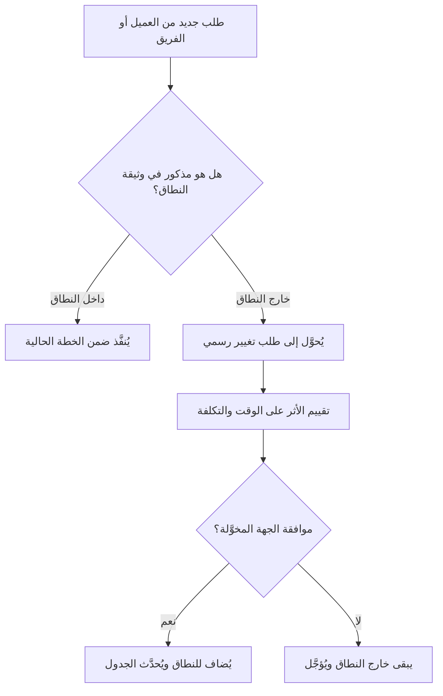

# خارج النطاق (Out of Scope)
> [!info] تعريف مختصر
> "خارج النطاق" (Out of Scope) يعني أن عنصراً أو ميزة أو متطلباً معيناً غير مشمول في نطاق المشروع الحالي، وبالتالي لن يُنفَّذ ضمن هذا المشروع أو هذه المرحلة. تحديده بوضوح لا يقل أهمية عن تحديد ما هو داخل النطاق.

## الشرح العلمي والاحترافي
كل مشروع يحتاج إلى حدود واضحة تفصل بين ما سيُنفَّذ وما لن يُنفَّذ. "خارج النطاق" هو الجزء المكمّل لـ"داخل النطاق" (In Scope)، ويُذكر عادة صراحة في وثيقة نطاق المشروع ([[Scope Statement]]) تحت بند مخصص باسم "الاستثناءات" (Exclusions).

توثيق ما هو خارج النطاق يخدم عدة أغراض مهمة:
- **يمنع سوء الفهم** بين الفريق والعميل حول ما سيحصل عليه العميل فعلياً.
- **يحمي الفريق من [[Scope Creep]]** (الزحف في النطاق)، لأن أي طلب لاحق لعنصر مذكور صراحة أنه خارج النطاق يصبح "طلب تغيير" رسمي يحتاج موافقة وميزانية إضافية بدل أن يُنفَّذ مجاناً وبصمت.
- **يوضّح الأولويات**: أحياناً يكون العنصر مهماً لكن تقرر إدارة المشروع تأجيله لمرحلة لاحقة أو إصدار مستقبلي، فيُذكر أنه "خارج نطاق الإصدار الحالي" مع الإشارة إلى أنه قد يُعاد النظر فيه لاحقاً.

من الناحية العملية، كل بند "خارج النطاق" يجب أن يكون محدداً وواضحاً وليس عاماً غامضاً، لأن الغموض هنا يفتح باب الجدال لاحقاً.

## أين ومتى يُستخدم
- في وثيقة **نطاق المشروع (Scope Statement)** ووثيقة متطلبات النظام (SRS)، ضمن قسم "الاستثناءات" أو "خارج النطاق".
- عند إعداد **بيان العمل (SOW)** أو العقد مع عميل خارجي، لحماية الطرفين من التوقعات غير الواقعية.
- في اجتماعات **صقل المتراكم (Backlog Refinement)** في Agile، عندما يقترح صاحب المنتج ميزة تخرج عن هدف السبرنت الحالي أو المنتج الأدنى القابل للتطبيق ([[MVP]]).
- عند التعامل مع طلبات تغيير جديدة ([[Change Request]])، حيث يُرجع الفريق أولاً إلى قائمة "خارج النطاق" ليقرر إن كان الطلب يستوجب عملية تغيير رسمية.

## مثال وسيناريو تطبيقي
> [!example] تتعاقد شركة "بيانات" مع عميل لبناء نظام إدارة مخزون. في وثيقة نطاق المشروع، يكتب مدير المشروع سارة بنداً واضحاً: "خارج نطاق هذا المشروع: (1) تطبيق الجوال (سيكون مشروعاً منفصلاً لاحقاً)، (2) دعم اللغة الفرنسية في الواجهة، (3) الربط مع نظام المحاسبة القديم SAP، (4) الدعم الفني بعد التسليم لأكثر من 30 يوماً." بعد شهرين من بدء التطوير، يطلب العميل خلال اجتماع أسبوعي إضافة تطبيق جوال "بسيط" مجاناً ضمن المشروع نفسه. يرجع الفريق فوراً إلى وثيقة النطاق ويوضّح للعميل أن هذا البند مذكور صراحة كـ"خارج النطاق"، وأن تنفيذه يتطلب طلب تغيير رسمي مع تقدير تكلفة وزمن إضافيين. هذا يحمي الفريق من العمل الإضافي المجاني ويحوّل النقاش من خلاف عاطفي إلى عملية إدارية واضحة.

## خطوات أو مخطّط
1. عند تحديد نطاق المشروع، اسأل صراحة: "ماذا لن نفعله في هذا المشروع؟"
2. اكتب كل بند خارج النطاق بشكل محدد وقابل للقياس، وليس عبارات عامة غامضة.
3. اعرض قائمة "خارج النطاق" على العميل والفريق واحصل على موافقتهم الصريحة.
4. أثناء التنفيذ، عند ظهور طلب جديد يقع ضمن هذه القائمة، وجّهه لعملية طلب التغيير الرسمية بدل تنفيذه مباشرة.
5. راجع القائمة دورياً؛ فبعض البنود قد تُصبح ضمن نطاق مرحلة أو إصدار لاحق.

## ⚠️ مفاهيم خاطئة شائعة
> [!warning]
> - **الاعتقاد بأن ما لم يُذكر يعني أنه داخل النطاق تلقائياً**: الصحيح هو العكس غالباً؛ ما لم يُذكر صراحة قد يكون غامضاً ومصدر خلاف، لذا يُفضَّل توثيق الاستثناءات المهمة بوضوح بدل الاعتماد على الصمت.
> - **الظن بأن "خارج النطاق" يعني "لن يُنفَّذ أبداً"**: في الحقيقة قد يعني فقط "ليس ضمن هذا المشروع أو هذا الإصدار"، وقد يُنفَّذ لاحقاً في مشروع أو إصدار آخر.
> - **معاملتها كقائمة ثابتة لا تُراجَع**: النطاق وحدوده قد يتغيران مع تطور فهم المشروع، فيجب مراجعتها عند كل تحديث كبير للخطة.

## ❌ ممارسات خاطئة في المشاريع
> [!failure]
> - **عدم توثيق "خارج النطاق" إطلاقاً** والاكتفاء بذكر ما هو داخل النطاق فقط، مما يترك الباب مفتوحاً لتفسيرات متضاربة لاحقاً. الحل: اجعل قسم "الاستثناءات" جزءاً إلزامياً من كل وثيقة نطاق.
> - **قبول تنفيذ بنود "خارج النطاق" بصمت إرضاءً للعميل** دون توثيق أو تعويض، مما يؤدي إلى [[Scope Creep]] تدريجي يستنزف الميزانية والوقت. الحل: وجّه أي طلب كهذا لعملية طلب تغيير رسمية دائماً.
> - **كتابة بنود خارج النطاق بصياغة غامضة** مثل "لا يشمل ميزات متقدمة"، مما يفتح باب الجدل حول تعريف "متقدمة". الحل: استخدم صياغة محددة وقابلة للقياس مثل الأمثلة الملموسة.

## 🔗 مصطلحات ومفاهيم ذات صلة
[[Scope Statement]] | [[Functional Specification]] | [[Scope Creep]] | [[Change Request]] | [[MVP]] | [[Feature Freeze]] | [[Backlog Refinement]] | [[SOW]] | [[BRD]] | [[Software Requirements Specification]]
