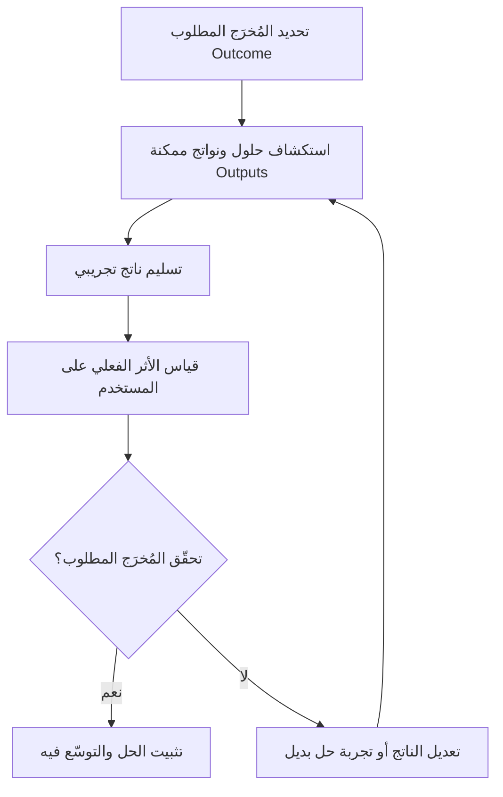

# المُخرَج مقابل الناتج (Outcome vs Output)

> [!info] تعريف مختصر
> "الناتج" (Output) هو الشيء الملموس الذي ينتجه الفريق فعليًا، مثل ميزة أو تقرير أو تطبيق. أما "المُخرَج" أو الأثر (Outcome) فهو التغيير الحقيقي الذي يحدثه ذلك الناتج في سلوك المستخدم أو في العمل، مثل زيادة رضا العملاء أو تحسين الكفاءة. الفرق بينهما جوهري: يمكن تسليم نواتج كثيرة دون تحقيق أي أثر فعلي.

## الشرح العلمي والاحترافي
- **الناتج (Output)**: أي عنصر عمل يمكن إحصاؤه بسهولة عند تسليمه، مثل: عدد الميزات المُطلقة، عدد الأسطر البرمجية، عدد التقارير المُنجزة، عدد السباقات (Sprints) المكتملة. الناتج سهل القياس لكنه لا يخبرنا شيئًا عن قيمته الفعلية.
- **المُخرَج (Outcome)**: التغيير الفعلي في سلوك أو حالة المستخدم أو العمل نتيجة لذلك الناتج، مثل: ارتفاع معدل الاحتفاظ بالعملاء، انخفاض زمن إنجاز مهمة معينة، زيادة الإيرادات، أو تحسّن رضا المستخدم (مقاس مثلًا عبر [[NPS]]).
- الفكرة الجوهرية التي يُرسّخها هذا التمييز: "التسليم لا يساوي النجاح". فريق قد يعمل بجد وينتج الكثير (Output عالٍ) دون أن يُحدث أي تغيير حقيقي في حياة المستخدم أو نتائج العمل (Outcome منعدم)، وهو ما يُعرف أحيانًا بـ"وهم الإنتاجية" (Productivity Theater).
- هذا التمييز هو حجر الأساس في التفكير المُوجَّه بالمنتج (Product Thinking) وأطر مثل [[OKR]]، التي تُصاغ نتائجها الرئيسية (Key Results) دائمًا كمُخرَجات (Outcomes) لا كنواتج (Outputs). مثال: "إطلاق ميزة الدفع بنقرة واحدة" ناتج، أما "زيادة معدل إتمام الشراء بنسبة 15%" فمُخرَج.
- ينطبق نفس المنطق على مؤشرات الأداء الرئيسية ([[KPI]]): كثير من فرق المنتج تنتقل تدريجيًا من قياس مخرجات الفريق (سرعة، عدد المهام) إلى قياس المخرجات على المستخدم (رضا، سلوك، قيمة).

## أين ومتى يُستخدم
- أساسي في إدارة المنتجات الرقمية عند تحديد أولويات الـ Backlog: يُفضَّل ترتيب العمل حسب المُخرَج المتوقع، لا حسب حجم الناتج أو سهولة تنفيذه.
- يُستخدم عند صياغة [[OKR]] والأهداف الاستراتيجية، لضمان أن النتائج الرئيسية تصف أثرًا حقيقيًا لا مجرد قائمة مهام مُنجزة.
- يُطبَّق في مراجعات السباق ([[09 - Sprint Review]]) للتحول من سؤال "ماذا سلّمنا؟" إلى سؤال "ما الذي تغيّر فعلًا بسبب ما سلّمناه؟".
- مفيد جدًا عند تقييم نجاح مشروع أو مرحلة (مثل تقرير الحالة النهائي)، لتفادي الاكتفاء بعرض قائمة إنجازات دون ربطها بأثر عملي على العميل أو العمل.

## مثال وسيناريو تطبيقي
> [!example] فريق منتج في تطبيق تعليمي أطلق في الربع الأول ثلاث ميزات: نظام شارات إنجاز، وضع ليلي، وتنبيهات تذكير يومية (كل هذه Outputs). في تقرير نهاية الربع، فخر الفريق بأنه "أنجز 3 ميزات من أصل 3 مخطَّطة".
> لكن عند مراجعة البيانات الفعلية، تبيّن أن معدل إتمام الدروس (Course Completion Rate) لم يتغيّر، وظل عند 22%. الفريق أدرك أن قياس النجاح بعدد الميزات المُطلقة (Output) كان مضللًا؛ فأعاد صياغة هدف الربع التالي كـ Outcome صريح: "رفع معدل إتمام الدروس من 22% إلى 35%"، وترك للفريق حرية اختيار الحلول (قد تكون ميزة جديدة، أو تحسين تصميم موجود، أو حتى حذف خطوات غير ضرورية) بدل تحديد ميزات جاهزة سلفًا.

## خطوات أو مخطّط
1. عند تحديد أي هدف عمل، اسأل: "ما التغيير الذي نريده في سلوك المستخدم أو نتائج العمل؟" قبل التفكير في الحل.
2. صياغة الهدف كمُخرَج (Outcome) قابل للقياس، لا كقائمة نواتج (Outputs) جاهزة.
3. ترك الفريق يستكشف حلولًا (نواتج) متعددة يمكن أن تحقق ذلك المُخرَج.
4. تسليم ناتج تجريبي أولي (مثل [[MVP]]) وقياس أثره الفعلي على المستخدم.
5. مقارنة الأثر المُقاس بالمُخرَج المستهدف، والتكرار أو التعديل إذا لم يتحقق الأثر رغم تسليم الناتج.
6. الإبلاغ عن النجاح بلغة الأثر (Outcome) لا بلغة قائمة المهام المُنجزة فقط.

## ⚠️ مفاهيم خاطئة شائعة
> [!warning]
> - الاعتقاد بأن إنجاز كمية كبيرة من العمل (Output) يعني بالضرورة نجاحًا: قد يكون الفريق مشغولًا جدًا دون تحقيق أي قيمة فعلية.
> - الخلط بين "الميزة الجديدة" و"القيمة الجديدة": إطلاق ميزة لا يضمن أن المستخدمين سيستخدمونها أو سيستفيدون منها.
> - الظن بأن قياس المُخرَجات معقّد جدًا فلا يستحق العناء: حتى مقاييس بسيطة (رضا، معدل استخدام، زمن إنجاز) تكفي للبدء بربط العمل بالأثر الحقيقي.

## ❌ ممارسات خاطئة في المشاريع
> [!failure]
> - **مكافأة الفرق بناءً على عدد الميزات المُطلقة فقط**: يشجّع على إنتاج نواتج كثيرة سطحية بدل حلول عميقة مؤثرة. الحل: ربط التقييم بمقاييس أثر فعلي (Outcome-based Metrics).
> - **كتابة خرائط الطريق (Roadmap) كقوائم ميزات جامدة بدل أهداف**: يحصر الفريق في تنفيذ حلول محددة مسبقًا حتى لو ثبت أنها لا تحقق الأثر المطلوب. الحل: صياغة عناصر خارطة الطريق كمشاكل أو مُخرَجات مطلوبة، وترك مساحة لاختيار الحل الأنسب.
> - **عدم قياس أي شيء بعد إطلاق الميزة**: يجعل الفريق يفترض النجاح دون دليل. الحل: تحديد مقياس أثر واضح قبل الإطلاق، ومتابعته بعد الإطلاق مباشرة.

## 🔗 مصطلحات ومفاهيم ذات صلة
[[OKR]] | [[KPI]] | [[NPS]] | [[MVP]] | [[SMART Goals]] | [[Increment]] | [[Customer and Market Validation]] | [[15 - Roadmap]] | [[13 - Backlog]]
