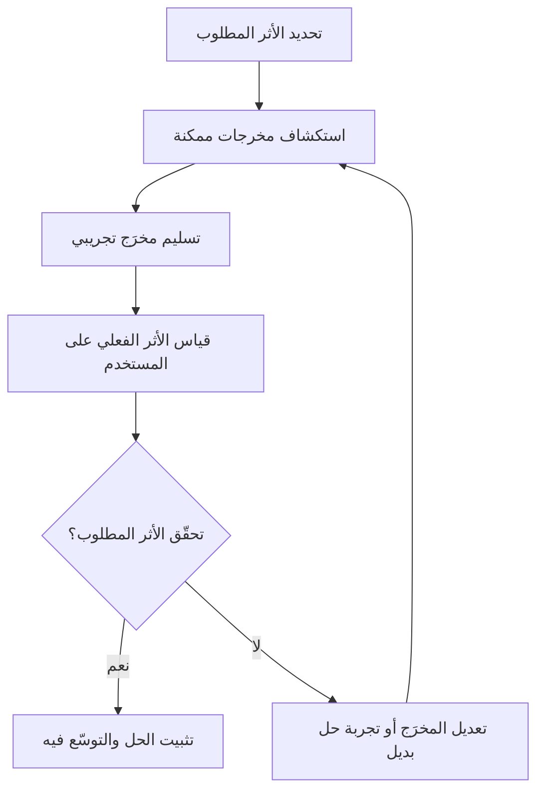

# المخرَج والأثر (Outputs and Outcomes)

> [!info] تعريف مختصر
> **المخرَج (Output)** هو الشيء الملموس الذي ينتجه الفريق ويسلّمه، كميزة أو تقرير أو خدمة رقمية. و**الأثر (Outcome)** هو التغيّر الذي يقع عند المستخدم أو في العمل بسبب ذلك المخرَج، كارتفاع الرضا أو انخفاض زمن الإنجاز. والفرق الجوهري بينهما **موضع السيطرة**: المخرَج يملكه الفريق، والأثر يرجّحه ولا يملكه — ولهذا تُسلَّم مخرجات كثيرة بلا أثر يُذكر. وتفصيله في [[22 - Outputs and Outcomes]].

## الشرح العلمي والاحترافي
- **المخرَج (Output)**: أي عنصر عمل يمكن إحصاؤه بسهولة عند تسليمه: عدد الميزات المُطلَقة، أو التقارير المنجَزة، أو السبرنتات المكتملة. سهل القياس، ولا يخبر عن قيمته شيئًا.
- **الأثر (Outcome)**: التغيّر الفعلي في سلوك المستخدم أو حاله أو في العمل نتيجةً لذلك المخرَج: ارتفاع معدّل الاحتفاظ بالعملاء، أو انخفاض زمن إنجاز مهمّة، أو تحسّن الرضا (مقيسًا بـ[[NPS]] مثلًا). ويليه في السلسلة **المنفعة (Benefit)** التي تحصّلها المنظّمة.
- الفكرة الجوهرية التي يُرسّخها هذا التمييز: "التسليم لا يساوي النجاح". فريق قد يعمل بجد وينتج الكثير (مخرجات كثيرة) دون أن يُحدث أي تغيير حقيقي في حياة المستخدم أو نتائج العمل (أثر منعدم)، وهو ما يُعرف أحيانًا بـ"وهم الإنتاجية" (Productivity Theater).
- هذا التمييز هو حجر الأساس في التفكير المُوجَّه بالمنتج (Product Thinking) وأطر مثل [[OKR]]، التي تُصاغ نتائجها الرئيسية (Key Results) دائمًا آثارًا (Outcomes) لا مخرجات (Outputs). مثال: «إطلاق ميزة الدفع بنقرة واحدة» مخرَج، أمّا «رفع معدّل إتمام الشراء من 60% إلى 75%» فأثر.
- ينطبق نفس المنطق على مؤشرات الأداء الرئيسية ([[KPI]]): كثير من فرق المنتج تنتقل تدريجيًا من قياس مخرجات الفريق (سرعة، عدد المهام) إلى قياس الأثر على المستخدم (رضا، سلوك، قيمة).

## أين ومتى يُستخدم
- أساسي في إدارة المنتجات الرقمية عند تحديد أولويات الـ Backlog: يُفضَّل ترتيب العمل حسب الأثر المتوقَّع، لا حسب حجم المخرَج أو سهولة تنفيذه.
- يُستخدم عند صياغة [[OKR]] والأهداف الاستراتيجية، لضمان أن النتائج الرئيسية تصف أثرًا حقيقيًا لا مجرد قائمة مهام مُنجزة.
- يُطبَّق في مراجعات السباق ([[09 - Sprint Review]]) للتحول من سؤال "ماذا سلّمنا؟" إلى سؤال "ما الذي تغيّر فعلًا بسبب ما سلّمناه؟".
- مفيد جدًا عند تقييم نجاح مشروع أو مرحلة (مثل تقرير الحالة النهائي)، لتفادي الاكتفاء بعرض قائمة إنجازات دون ربطها بأثر عملي على العميل أو العمل.

## مثال وسيناريو تطبيقي
> [!example] فريق منتج في تطبيق تعليمي أطلق في الربع الأول ثلاث ميزات: نظام شارات إنجاز، وضع ليلي، وتنبيهات تذكير يومية (كل هذه مخرجات). في تقرير نهاية الربع، فخر الفريق بأنه "أنجز 3 ميزات من أصل 3 مخطَّطة".
> لكن عند مراجعة البيانات الفعلية، تبيّن أن معدل إتمام الدروس (Course Completion Rate) لم يتغيّر، وظل عند 22%. الفريق أدرك أن قياس النجاح بعدد الميزات المُطلَقة (المخرَج) كان مضللًا؛ فأعاد صياغة هدف الربع التالي أثرًا صريحًا: "رفع معدل إتمام الدروس من 22% إلى 35%"، وترك للفريق حرية اختيار الحلول (ميزة جديدة، أو تحسين تصميم قائم، أو حذف خطوات لا لزوم لها) بدل تحديد ميزات جاهزة سلفًا.

## خطوات أو مخطّط
1. عند تحديد أي هدف عمل، اسأل: "ما التغيير الذي نريده في سلوك المستخدم أو نتائج العمل؟" قبل التفكير في الحل.
2. صياغة الهدف أثرًا (Outcome) قابلًا للقياس، لا قائمةَ مخرجات (Outputs) جاهزة.
3. ترك الفريق يستكشف مخرجات متعدّدة يمكن أن تحقّق ذلك الأثر.
4. تسليم مخرَج تجريبي أوّلي (مثل [[MVP]]) وقياس أثره الفعلي على المستخدم.
5. مقارنة الأثر المقيس بالمستهدَف، والتكرار أو التعديل إذا لم يتحقّق الأثر رغم تسليم المخرَج.
6. الإبلاغ عن النجاح بلغة الأثر (Outcome) لا بلغة قائمة المهام المُنجزة فقط.

## ⚠️ مفاهيم خاطئة شائعة
> [!warning]
> - الاعتقاد بأن إنجاز كمّية كبيرة من العمل (مخرجات) يعني بالضرورة نجاحًا: قد يكون الفريق مشغولًا جدًا دون تحقيق أي قيمة فعلية.
> - الخلط بين "الميزة الجديدة" و"القيمة الجديدة": إطلاق ميزة لا يضمن أن المستخدمين سيستخدمونها أو سيستفيدون منها.
> - الظن بأن قياس الأثر معقّد جدًا فلا يستحق العناء: حتى مقاييس بسيطة (رضا، معدل استخدام، زمن إنجاز) تكفي للبدء بربط العمل بالأثر الحقيقي.

## ❌ ممارسات خاطئة في المشاريع
> [!failure]
> - **مكافأة الفرق بناءً على عدد الميزات المُطلقة فقط**: يشجّع على إنتاج مخرجات كثيرة سطحية بدل حلول عميقة مؤثرة. الحل: ربط التقييم بمقاييس أثر فعلي (Outcome-based Metrics).
> - **كتابة خرائط الطريق (Roadmap) كقوائم ميزات جامدة بدل أهداف**: يحصر الفريق في تنفيذ حلول محددة مسبقًا حتى لو ثبت أنها لا تحقق الأثر المطلوب. الحل: صياغة عناصر خارطة الطريق مشكلاتٍ أو آثارًا مطلوبة، وترك مساحة لاختيار الحل الأنسب.
> - **عدم قياس أي شيء بعد إطلاق الميزة**: يجعل الفريق يفترض النجاح دون دليل. الحل: تحديد مقياس أثر واضح قبل الإطلاق، ومتابعته بعد الإطلاق مباشرة.

## 🔗 مصطلحات ومفاهيم ذات صلة
[[22 - Outputs and Outcomes]] | [[OKR]] | [[KPI]] | [[NPS]] | [[MVP]] | [[SMART Goals]] | [[Increment]] | [[Customer and Market Validation]] | [[15 - Roadmap]] | [[13 - Backlog]]
