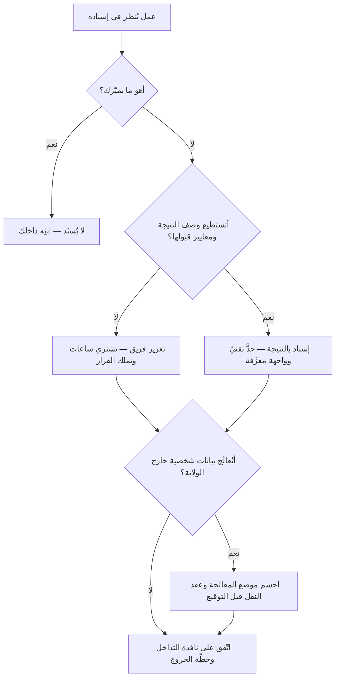

# الإسناد الخارجي وأنماط التوريد (Outsourcing)

> [!info] تعريف مختصر
> **الإسناد الخارجي (Outsourcing)** أن تُسنِد المؤسّسة عملًا كانت تؤدّيه بنفسها — أو تستطيع أن تؤدّيه — إلى **جهة أخرى**. وحوله عائلة مصطلحات يكثر الخلط بينها: **الإسناد البعيد (Offshoring)** و**القريب (Nearshoring)** و**المحلّي (Onshoring)** و**الداخلي (Insourcing)**.
> **والخلط كلّه يرتفع بمحورين مستقلّين:** `مَن ينفّذ؟` — أهو فريقك أم جهة أخرى — و`أين ينفّذ؟` — أفي ولايتك النظامية أم خارجها. فـ**الإسناد الخارجي جوابٌ عن الأوّل، والبعيد والقريب جوابٌ عن الثاني** — ولا تلازم بينهما: تستطيع أن تفتح فرعك في بلد آخر فتُسنِد بعيدًا بلا إسناد خارجيّ، وأن تتعاقد مع شركة في حيّك فتُسنِد خارجيًّا بلا مغادرة بلدك.

## الشرح العلمي والاحترافي

**والمصفوفة التي ترفع اللبس:**

| | **داخل ولايتك النظامية** | **خارجها** |
|---|---|---|
| **فريقك (موظّفوك)** | التنفيذ الداخلي · الإسناد الداخلي (`Insourcing`) | **المركز المملوك** (`Captive Center`) — فرعك في بلد آخر |
| **جهة أخرى** | **الإسناد المحلّي** (`Onshoring`) | **الإسناد الخارجي البعيد أو القريب** بحسب المسافة والفارق الزمني |

**والفرق بين البعيد والقريب في المسافة والتزامن لا في جودة العمل:** فـ«القريب» ما يشترك معك في نطاق زمنيّ متقارب فتبقى ساعات العمل متداخلة، و«البعيد» ما ينقطع فيه التداخل فيصير كل سؤال يومًا كاملًا. **وهذا التداخل هو المتغيّر الحاسم عمليًّا**، لا الجنسية ولا سعر الساعة: فالفريق الذي يجيبك بعد ثماني ساعات لا يمكن أن يعمل معك عملًا تكراريًّا مهما بلغت كفاءته.

### والمحور الثالث — وهو أنفعها عمليًّا: ماذا تشتري؟

| النمط | ما تشتريه | من يملك القرار التقني | متى يصلح |
|---|---|---|---|
| **تعزيز الفريق** (`Staff Augmentation`) | **ساعاتِ أفراد** يعملون داخل فريقك وبأدواته | **أنت** | نقص سعة مؤقّت، ومعرفتك بالمنتج قائمة |
| **الإسناد بالنتيجة** (`Managed Outcome`) | **نتيجةً موصوفة** يسلّمها المورّد كما يشاء | **المورّد** | نطاق واضح مستقرّ، وتملك وصفه ومعايير قبوله |
| **المركز المملوك** (`Captive Center`) | **قدرةً دائمة** تبنيها في بلد آخر | أنت | حجم كبير طويل الأمد يبرّر كلفة التأسيس |

**وأشيع خطأ في العقود** أن يُشترى أحدهما ويُدار على أنه الآخر: أن تُوقّع عقد **نتيجة** ثم تُدير أفراد المورّد بالمهامّ اليومية — فتكون قد دفعت ثمن النتيجة وتحمّلت مسؤولية الطريق. أو أن تُوقّع **تعزيزًا** ثم تُحاسب على مخرَج لم تصفه.

**ولماذا يُسنَد أصلًا؟** أربعة دوافع معلنة، وثالثها هو الحقيقيّ غالبًا: خفض الكلفة · بلوغ خبرة نادرة · سرعة التوسّع بلا توظيف · والتركيز على ما يميّزك. **والقاعدة الحاكمة في القرار: لا يُسنَد ما يميّزك.** فما كان مصدر تفوّقك فبناؤه داخلك؛ وما كان لازمًا لا مميِّزًا فالإسناد فيه سائغ. وأكثر ندم المؤسّسات على إسنادٍ وقع في القسم الأوّل.

### الولاية النظامية — والمحور الذي يُنسى حتى يقع

الإسناد لا ينقل العمل وحده، بل **يعرّض بياناتك لولاية أخرى**. فمعالجة بيانات المستخدمين خارج البلد تُدخِلك في أحكام [[Data Residency|مكان حفظ البيانات]] و[[PDPL|نظام حماية البيانات الشخصية]]، وقد تلزمك [[Standard Contractual Clauses|بنود تعاقدية معيارية]] للنقل عبر الحدود.

**والقاعدة التي لا يُختلف عليها: المسؤولية لا تُسنَد.** فأنت المسؤول أمام الجهة التنظيمية وأمام مستخدميك عن بياناتهم، سواء عالجها موظّفك أو مورّدك أو مورّد مورّدك. **والمورّد ينفّذ ولا يتحمّل عنك.**

> [!info] إضافة مرجعية — لماذا «الإسناد المحلّي» لا «التوطين»؟
> يُترجَم `Onshoring` أحيانًا «التوطين»، **ولا تصلح هنا في هذه الموسوعة لسببين مجتمعين**:
> 1. **«التوطين» عندنا `Localization`** — تكييف المنتج لسوق بعينه، وله [[Localization|مدخله المستقلّ]].
> 2. **و«التوطين» في السياق السعودي** ينصرف إلى توطين الوظائف — إحلال الكوادر الوطنية — وهو مفهوم في سياسات العمل لا في التوريد.
>
> فثلاثة معانٍ للفظ واحد، ولا يجمعها سياق. فاعتُمد **«الإسناد المحلّي»** لـ`Onshoring`، وبقيت «التوطين» لـ`Localization`، ويُذكر معنى العمالة صراحةً حيث يُقصد. **وهذا اختيار تحريريّ يرفع لبسًا، لا حكمٌ على المقابل الشائع.**

## أين ومتى يُستخدم

- **عند نقص سعة مؤقّت** لا يبرّر توظيفًا دائمًا — وهذا أسلم مواضعه.
- **في عملٍ لازم غير مميِّز**: التشغيل والدعم والاختبار الروتيني والتكاملات المعيارية.
- **عند الحاجة إلى خبرة نادرة لمدّة قصيرة** — أمن، أو امتثال، أو هجرة بيانات.
- **في التوسّع إلى سوق جديد** حيث تحتاج حضورًا محلّيًّا قبل أن تبرّر مكتبًا.
- **في القطاع الحكومي والمنظَّم** حيث تفرض الأنظمة حدودًا على موضع المعالجة — فالسؤال هنا ليس أنُسنِد، بل **إلى أين يجوز**.

> [!warning] متى لا يُستخدَم؟
> - **في ما يميّزك.** إسناد قلب المنتج يبني قدرةً عند غيرك ويُفقدك سبب وجودك، ويصنع [[Vendor Lock-in|ارتهانًا للمورّد]].
> - **حين لا تستطيع وصف ما تريد.** الإسناد يحوّل غموض المتطلبات إلى نزاع تعاقديّ، ولا يحلّه. **فمن لا يملك [[Quality Attributes|سمات جودة]] مكتوبة لا يملك ما يقبل به التسليم أو يردّه.**
> - **في عمل تكراريّ سريع مع فارق زمنيّ كبير.** فالتكرار يقتضي تداخلًا يوميًّا.
> - **هربًا من مشكلة داخلية.** الفريق الذي لا يسلّم بسبب عمليات معطّلة سيصدّر عطله إلى المورّد ويستورد منه تأخيرًا.
> - **قبل حسم مسألة البيانات.** فالعقد الذي وُقّع ثم اكتُشف أنه يخالف موضع المعالجة يُلغى أو يُعدَّل بكلفة.

## مثال وسيناريو تطبيقي

> [!example] «منصّة عافية» — عقدٌ ناجح شكلًا، وثلاثة أعطال بنيوية
> **القرار:** إسناد بناء وحدة المواعيد إلى مورّد في نطاق زمنيّ يبعد ستّ ساعات، بعقد **نتيجة** موصوفة، وسعرٍ نصف الكلفة الداخلية.
> **ما وقع:**
> 1. **أُدير عقد النتيجة إدارةَ تعزيز فريق:** مدير المشروع يوزّع المهامّ اليومية على مطوّري المورّد. فصار يملك الطريق ويدفع ثمن النتيجة، وسقطت حجّته حين تأخّر التسليم — لأن الجدول كان جدوله.
> 2. **الفارق الزمنيّ أحال المراجعة إلى دورة يومين:** سؤال في الصباح، جواب في الغد، توضيح بعده. **فما كان يُحلّ في محادثة صار ثلاثة أيام.**
> 3. **وبيانات المرضى عولجت خارج البلد** بلا أن يُبحث موضع المعالجة قبل التوقيع — فتوقّف الاستلام حتى عُدّل العقد ونُقلت المعالجة، بكلفة تجاوزت الفرق الذي وُفّر.
> **ما نفع بعد التصحيح:** بقي الإسناد، وتغيّر شكله — **إسناد بالنتيجة على وحدة مستقلّة لها واجهة معرَّفة** (وهذا مقتضى [[Conway's Law|قانون كونواي]])، ومعايير قبول مكتوبة بأرقام، ومعالجة داخل البلد، وساعتان يوميًّا من التداخل المتّفق عليه.
> **الدرس:** لم يكن الخطأ في **قرار** الإسناد، بل في **نمطه** وفي إغفال محورَي التزامن والولاية النظامية.

## خطوات أو مخطّط

1. **صنّف العمل أوّلًا:** أهو مميِّز أم لازم غير مميِّز؟ فما كان مميِّزًا لا يُسنَد.
2. **حدّد ما تشتريه:** ساعاتٍ، أم نتيجةً، أم قدرةً دائمة؟ **واكتبه في العقد وأدِرْه على مقتضاه.**
3. **احسم موضع المعالجة قبل التوقيع** — أين تُحفظ البيانات، ومن يصل إليها، وبأيّ عقد نقل.
4. **ارسم الحدّ التقنيّ**: أيّ وحدة يملكها المورّد كاملة، وبأيّ واجهة تتصل بنظامك؟ فالإسناد بلا حدّ يُنتج تشابكًا لا تسليمًا.
5. **اكتب معايير القبول بأرقام** قبل بدء العمل، لا عند التسليم.
6. **اتّفق على نافذة تداخل يومية** إن كان الفارق الزمنيّ كبيرًا.
7. **خطّط للخروج من أوّل يوم:** لمن الكود، وأين التوثيق، وكيف يُنقل التشغيل إن انتهى العقد.

## ⚠️ مفاهيم خاطئة شائعة

> [!warning]
> - **الخلط بين الإسناد الخارجي والبعيد.** الأوّل عن **من**، والثاني عن **أين**، ولا تلازم بينهما.
> - **الظنّ بأن الإسناد يخفّض الكلفة حتمًا.** سعر الساعة أحد بنودها؛ ويُضاف إليه التنسيق، وإعادة العمل، وكلفة نقل المعرفة، وكلفة الخروج ([[TCO|الكلفة الإجمالية]]).
> - **حسبان المسؤولية منتقلةً مع العمل.** المسؤولية النظامية تبقى عليك، ولو خالف المورّد.
> - **الظنّ بأن العقد يعوّض غياب الوصف.** العقد يفصل في النزاع ولا يبني منتجًا؛ **وما لم يُوصف لن يُبنى وإن كُتب في العقد**.
> - **حسبان «القريب» أعلى جودة من «البعيد».** الفارق تزامنٌ وثقافةُ عمل، لا كفاءة.
> - **الخلط بين «التوطين» بمعانيه الثلاثة** — تكييف المنتج · إحلال الكوادر · الإسناد المحلّي. انظر صندوق الإضافة المرجعية أعلاه.

## ❌ ممارسات خاطئة في المشاريع

> [!failure]
> - **إدارة عقد النتيجة إدارةَ تعزيز فريق** — فتدفع ثمن النتيجة وتتحمّل مسؤولية الطريق. **الحلّ:** إمّا أن تملك القرار وتشتري ساعات، وإمّا أن تصف النتيجة وتتركه.
> - **إسناد وحدة متشابكة مع النظام كلّه** — فيصير التسليم تفاوضًا يوميًّا. **الحلّ:** لا يُسنَد إلا ما له حدّ وواجهة.
> - **تأجيل مسألة البيانات إلى ما بعد التوقيع** — وهذا ما يوقف الاستلام في القطاعات المنظَّمة. **الحلّ:** تُحسم قبل العقد، وتُكتب فيه.
> - **إغفال خطّة الخروج** — فينتهي العقد ولا أحد يعرف كيف يُشغَّل ما بُني. **الحلّ:** ملكية الكود والتوثيق ونقل التشغيل بنودٌ من أوّل يوم.
> - **قياس المورّد بالساعات المسلَّمة** — فيُكافأ على البطء. **الحلّ:** [[Vendor Scorecard|بطاقة تقييم]] فيها الجودة وزمن التدفّق وإعادة العمل.
> - **إسناد الاختبار وحده مع بقاء التطوير داخلًا** — فينشأ تسليمٌ بين طرفين وطابور انتظار بينهما ([[Handoff|التسليم بين الأطراف]]). **الحلّ:** أسنِد شريحةً كاملة أو لا تُسنِد.

## 🔗 مصطلحات ومفاهيم ذات صلة

[[Vendor Management]] | [[Vendor Lock-in]] | [[Vendor Scorecard]] | [[SOW]] | [[SLA]] | [[Data Residency]] | [[PDPL]] | [[Standard Contractual Clauses]] | [[Localization]] | [[Conway's Law]] | [[Handoff]] | [[TCO]] | [[Quality Attributes]] | [[Two-Pizza Team]]
