# مصفوفة PARIS

> [!info] تعريف مختصر
> **مصفوفة PARIS** إحدى صيغ مصفوفة إسناد المسؤوليات، وأدوارها خمسة: **المشارك (Participant)** من يؤدّي العمل · **المسؤول (Accountable)** من يُحاسَب على النتيجة، وهو واحد · **المراجِع (Review Required)** من يجب أن يراجع قبل الإقرار · **المُدخِل (Input Required)** من تُطلب مدخلاته وجوبًا لا استحبابًا · **المصدِّق (Sign-off)** من يوقّع فيصير العمل نافذًا. وإضافتها على [[RACI|مصفوفة المسؤوليات]] واحدة بعينها: أنها **تفصل التصديق عن المسؤولية**، فتُظهر أن من يُحاسَب على النتيجة قد لا يكون هو من يملك التوقيع الذي يُنفِذها — وهذا هو حال أكثر المشاريع الخاضعة لتنظيم أو عقد.

> [!info] إضافة مرجعية — ليست معيارًا
> `RACI` مذكورة في أدبيات إدارة المشاريع المعتمدة بوصفها صورة من **مصفوفة إسناد المسؤوليات (RAM)**، أمّا `PARIS` فصيغة متداولة **بلا مواصفة منشورة تحكمها**، وتختلف قراءة حروفها بين الجهات. فتُعرض هنا أداةً مفيدة يُصرَّح بتعريف حروفها في كل استعمال، ولا تُعرض معيارًا — عملًا بقاعدة هذا المستودع: ما ليس له مواصفة منشورة لا يُوصف بأنه معيار.

## الشرح العلمي والاحترافي

### 1. لماذا نشأت صيغة خامسة أصلًا؟

لأن حرف `A` في RACI يحمل معنيين يُخلطان في التطبيق: **من يُحاسَب إن ساء الأمر**، و**من يوقّع فيصير الأمر نافذًا**. وهما شخص واحد في الفريق الصغير، وشخصان مختلفان تمامًا في:

- **المشاريع التعاقدية** — فمدير المشروع مسؤول عن التسليم، والتوقيع الذي يُنشئ الالتزام المالي عند جهة أخرى.
- **البيئات الخاضعة لتنظيم** — صحّية أو مالية أو حكومية، حيث يكون التصديق شرطًا نظاميًّا لا إداريًّا.
- **العلاقة مع مورّد** — فالمورّد مسؤول، والعميل هو المصدِّق، وخلطهما يُنتج نزاعًا عند التسليم لا قبله.

وفصل `S` عن `A` يجعل السؤال صريحًا في الجدول: **من يوقّع؟** بدل أن يُكتشف جوابه يوم التسليم.

### 2. إضافتها الثانية: «مطلوب» لا «مستحسن»

في RACI يحمل حرف `C` معنى الاستشارة، ولا يقول أهي شرط قبل المضيّ أم رأي يُستأنس به. وPARIS تحسم ذلك في اسمي دورين: **`Review Required`** و**`Input Required`** — و«مطلوب» فيهما ليست زخرفة لفظية بل حكم: **العمل الذي مضى بلا مراجعة من صاحب `R` غير مكتمل**، ويُردّ ولا يُقبل بحجّة الاستعجال.

### 3. جدول التمييز: أسرة مصفوفات الإسناد

| وجه المقارنة | [[RACI]] | RASCI | [[DACI]] | **PARIS** |
|---|---|---|---|---|
| **ماذا تُسند؟** | أدوارًا على أنشطة | كسابقتها | أدوارًا في **قرار** واحد | أدوارًا على أنشطة وموافقات |
| **ما الذي تضيفه؟** | الأصل | `S` = الداعم المنفِّذ معك | فصل الحسم عن الرأي | فصل **التصديق** عن المحاسبة |
| **متى تختارها؟** | التشغيل المعتاد | حين يشترك في التنفيذ أكثر من فريق | حين يكون العطل «من يحسم؟» | حين يوجد توقيعٌ يُنشئ التزامًا |
| **مدى استقرارها** | مستقرّة ومذكورة في المراجع | متداولة | منسوبة إلى أطلاسيان | متداولة بلا مواصفة |

> **السؤال الفارق:** RACI تسأل **«من ينفّذ ومن يُحاسَب؟»**، وPARIS تضيف **«ومن يوقّع؟»**. فإن كان في مشروعك توقيعٌ يترتّب عليه مال أو مسؤولية نظامية، فالسؤال الثاني ليس تفصيلًا.

### 4. قاعدة الصفّ والعمود — وهي مشتركة بين الصيغ كلّها

مهما اختلفت الحروف، تبقى ثلاث قواعد تحكم أي مصفوفة إسناد:

1. **مسؤول واحد لكل صفّ.** فاثنان معناهما لا أحد.
2. **الصفّ الذي كلّ خاناته مراجعةً ومدخلات ولا منفّذ فيه** بندٌ لن يُنجَز.
3. **العمود المزدحم علامة اختناق**: الشخص الذي يظهر في ثلاثين صفًّا مراجِعًا هو **العائق القادم** في مشروعك، ولو لم يشتكِ أحد بعد.

## أين ومتى يُستخدم

- في المشاريع التعاقدية مع مورّد، لتحديد من يوقّع على كل تسليم قبل بدء العمل لا عنده.
- في القطاعات المنظَّمة، حيث يكون التصديق شرطًا نظاميًّا يجب إظهاره في الجدول لا افتراضه.
- في [[Sign-off|الاعتماد الرسمي]] للوثائق: [[BRD]] و[[Software Requirements Specification|وثيقة متطلبات البرمجيات]] وخطط الاختبار.
- عند تسليم نظام إلى فريق تشغيل، لفصل من يستلم عمّن يصدّق على جاهزية الاستلام.
- حين يتكرّر في مشروعك سؤال «ومن الذي وافق على هذا؟» بعد وقوع المشكلة — فهو عَرَض غياب `S`.

## مثال وسيناريو تطبيقي

> [!example] سيناريو ملموس
> مشروع نظام سجلّات في جهة صحّية، ونشاطه: **«اعتماد نموذج بيانات المريض».**
>
> **بـRACI:** المسؤول (`A`) مديرة المشروع، والمنفّذ (`R`) محلّل الأعمال، والمستشار (`C`) مسؤول أمن المعلومات. والجدول تامّ ظاهريًّا.
>
> **وما وقع:** أُنجز النموذج، وبدأت البرمجة عليه ثلاثة أسابيع. ثم تبيّن أن اعتماده يستلزم توقيع **مسؤول حماية البيانات** لأنه يمسّ بيانات صحّية، وأن لديه اعتراضًا على حقلين. فأُعيد العمل.
>
> **وبـPARIS كان الجدول:**
>
> | الدور | من |
> |---|---|
> | مشارك (P) | محلّل الأعمال · مهندس البيانات |
> | مسؤول (A) | مديرة المشروع |
> | مراجعة مطلوبة (R) | مسؤول أمن المعلومات |
> | مدخلات مطلوبة (I) | رئيس قسم السجلّات الطبّية |
> | تصديق (S) | **مسؤول حماية البيانات** |
>
> **والفارق ليس في الحقلين**، بل في أن الخانة الأخيرة كانت ستُملأ في أسبوع التخطيط، فيظهر عندها أن ثمّة توقيعًا خارج الفريق — وهو ما لا يظهر في RACI أصلًا لأنه لا يملك خانة له.

## خطوات أو مخطّط

1. اكتب أنشطة المشروع أو تسليماته صفوفًا، والأشخاص أو الأدوار أعمدةً.
2. عرّف الحروف الخمسة صراحةً في أعلى الجدول — فالصيغة غير معيارية، وقراءتها تختلف بين الجهات.
3. املأ `A` أوّلًا، واحدًا لكل صفّ.
4. ثم `S`، واسأل عنه سؤالًا صريحًا: **أثمّة توقيع يُنشئ التزامًا؟ ومن يملكه؟**
5. ثم `R` و`I`، ولا تضع أحدًا فيهما مجاملةً — فكل إضافة هنا خطوة إلزامية تُضاف إلى المسار.
6. افحص الأعمدة: من ظهر مراجِعًا في صفوف كثيرة فراجع توزيع الصلاحية معه قبل أن يصير عائقًا.
7. اعرض الجدول على أصحابه ووثّقه، فالمصفوفة التي لم يرَها من فيها ليست اتّفاقًا.

```mermaid
flowchart TD
    A["نشاط أو تسليم"] --> B["مسؤول واحد (A)"]
    B --> C{"أثمّة توقيع يُنشئ التزامًا؟"}
    C -- "نعم" --> D["حدّد المصدِّق (S) — وقد يكون خارج الفريق"]
    C -- "لا" --> E["يكفي المسؤول"]
    D --> F["مراجعة ومدخلات مطلوبة (R · I)"]
    E --> F
    F --> G{"أعمود مزدحم بالمراجعات؟"}
    G -- "نعم" --> H["عائق قادم — أعد توزيع الصلاحية"]
    G -- "لا" --> I["اعرض الجدول على أصحابه ووثّقه"]
```

## ⚠️ مفاهيم خاطئة شائعة

> [!warning]
> - **حسبانها معيارًا مقابلًا لـRACI.** فـRACI مستقرّة ومذكورة في المراجع، وPARIS صيغة متداولة بلا مواصفة — وتعريف حروفها يُكتب في كل استعمال.
> - **الظنّ أن `S` هو `A` بلفظ آخر.** بل هو الفرق الذي وُجدت الصيغة من أجله: المحاسبة تقع على النتيجة، والتصديق يُنشئ النفاذ، وقد يكون كلٌّ منهما عند جهة.
> - **قراءة `Input Required` استئناسًا.** فكلمة «مطلوب» حكمٌ: المضيّ بلا المدخلات إخلالٌ بالمسار لا تسريعٌ له.
> - **الظنّ أن كثرة الأدوار تعني ضبطًا أشدّ.** بل كل دور إضافي خطوةٌ في المسار الحرج؛ والمصفوفة التي تُبطئ التسليم بلا أن تمنع خطأً أداةُ تعطيل.

## ❌ ممارسات خاطئة في المشاريع

> [!failure]
> - **ملء المصفوفة في ورشة واحدة ثم عدم فتحها بعدها**، فتصير وثيقة امتثال لا أداة عمل — وهذا مصير أكثر مصفوفات الإسناد.
> - **إغفال خانة التصديق حتى موعد التسليم**، فيُكتشف عندها أن التوقيع اللازم عند جهة لم تُشرَك أصلًا. وهو بعينه ما وُجدت `S` لمنعه.
> - **وضع الرئيس التنفيذي مصدِّقًا على كل شيء**، فيتحوّل التصديق إلى طابور، ويبدأ الفريق في تجاوزه بالممارسة — فيصير الجدول يصف واقعًا لا وجود له.
> - **خلط صيغتين في مستند واحد** — صفوف بـRACI وصفوف بـPARIS — فلا يُعرف ما تعنيه الحروف في كل صفّ.
> - **إسناد `A` إلى فريق أو لجنة.** فالمحاسبة لا تُوزَّع؛ ما يُوزَّع هو التنفيذ.

## 🔗 مصطلحات ومفاهيم ذات صلة

[[RACI]] | [[DACI]] | [[SPADE]] | [[Sign-off]] | [[Governance]] | [[Steering Committee]] | [[Decision Log]] | [[BRD]] | [[Software Requirements Specification]] | [[Vendor Management]] | [[Bottleneck]] | [[Chain of Command]]
