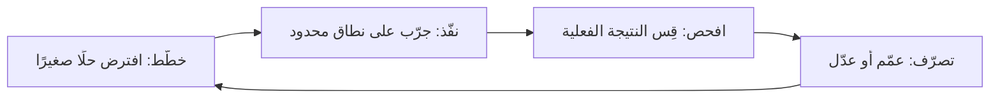

# خطّط نفّذ افحص تصرّف (PDCA)
> [!info] تعريف مختصر
> **PDCA** اختصار لأربع مراحل متكررة: **خطّط (Plan)**، **نفّذ (Do)**، **افحص (Check)**، **تصرّف (Act)**. هي دورة تحسين مستمر تُستخدم لاختبار تغيير صغير، قياس أثره، ثم تعميمه أو تعديله بناءً على نتائج حقيقية بدل الافتراضات.

## الشرح العلمي والاحترافي
دورة PDCA (وتُعرف أيضًا بـ "دورة ديمنغ" نسبة إلى إدواردز ديمنغ) هي المحرك المنهجي وراء [[Kaizen]] والتحسين المستمر في [[Toyota Production System|نظام إنتاج تويوتا]]. مراحلها:

1. **خطّط (Plan)**: حدّد المشكلة أو الفرصة، افترض سببًا محتملًا (يمكن الاستعانة بـ [[Root Cause Analysis]])، وضع خطة تغيير صغيرة وقابلة للاختبار.
2. **نفّذ (Do)**: طبّق التغيير على نطاق محدود ومضبوط — تجربة صغيرة لا تغييرًا شاملًا فوريًا.
3. **افحص (Check)**: قِس النتائج الفعلية مقابل التوقعات. هل تحسّن المقياس المستهدف ([[KPI]]، [[Cycle Time]]، [[Escaped Defect Rate]])؟
4. **تصرّف (Act)**: إن نجحت التجربة، عمّمها لتصبح المعيار الجديد (يمكن توثيقها في [[SOP]]). إن فشلت أو نجحت جزئيًا، عدّل الخطة وابدأ دورة جديدة.

الفكرة الجوهرية أن التحسين ليس حدثًا لمرة واحدة بل **حلقة مستمرة** تدور مرارًا: كل دورة تبني على معرفة الدورة السابقة. هذا يختلف جذريًا عن نهج "التخطيط الشامل ثم التنفيذ الكامل" لأنه يُقلّل المخاطرة عبر اختبارات صغيرة متتالية، وهو مبدأ يتماشى مع فكرة [[Feedback Loop]] في الأنظمة الرشيقة.

## أين ومتى يُستخدم
- في جلسات [[10 - Sprint Retrospective]] لاختبار تحسين واحد كل سبرنت بدل تغييرات كبيرة متزامنة.
- في [[Kaizen]] وثقافة التحسين المستمر داخل فرق Lean وKanban.
- عند إدخال تغيير في العملية (Process Change) يحتاج تحققًا قبل تعميمه على كل الفرق.
- في إدارة الجودة ([[Quality Assurance]]) لاختبار إجراء جديد قبل اعتماده رسميًا.

## مثال وسيناريو تطبيقي
> [!example]
> فريق دعم فني في شركة "دِعم24" يعاني من ارتفاع [[MTTR]] (متوسط زمن الإصلاح) لتذاكر الأعطال الحرجة، حاليًا 6 ساعات.
> 
> - **خطّط**: يفترض الفريق أن السبب هو غياب قائمة تحقق موحّدة عند استلام التذكرة. يضعون قائمة تحقق تجريبية من 5 خطوات لفئة واحدة فقط من الأعطال (أعطال قواعد البيانات).
> - **نفّذ**: يُطبَّق استخدام القائمة لمدة أسبوعين على هذه الفئة فقط، مع 8 مهندسين من أصل 20.
> - **افحص**: يقيس الفريق MTTR لهذه الفئة بعد أسبوعين: انخفض من 6 ساعات إلى 3.5 ساعة. يقارنون أيضًا مع فئة أعطال أخرى لم تُطبَّق عليها القائمة (لا تحسّن ملحوظ)، مما يؤكد أن التحسين ناتج عن القائمة لا عن عوامل خارجية.
> - **تصرّف**: يعتمدون القائمة رسميًا كإجراء معياري (يُضاف إلى [[SOP]]) ويعمّمونها على جميع فئات الأعطال وكل المهندسين العشرين، ثم يبدأون دورة PDCA جديدة لتحسين نقطة أخرى (مثل زمن التصعيد الأولي).

## خطوات أو مخطّط
1. **خطّط**: حدّد مشكلة واحدة، وافترض سببًا، وصمّم تجربة صغيرة.
2. **نفّذ**: طبّق التجربة على نطاق محدود (فريق فرعي، فئة واحدة، فترة قصيرة).
3. **افحص**: قارن المقاييس قبل/بعد بموضوعية، وتحقق أن التحسّن سببه التغيير فعلًا.
4. **تصرّف**: عمّم إن نجحت التجربة، أو عدّل الفرضية وابدأ من جديد إن لم تنجح.
5. كرّر الدورة بلا توقف — كل دورة تبني على الدرس المستفاد من السابقة.

## جدول التمييز: PDCA مقابل DMAIC مقابل OODA

ثلاث دورات تُرسم كلّها حلقاتٍ مغلقة، فيُظنّ أنها أسماء متنافسة لفكرة واحدة. **وهي في الحقيقة مبنيّة على ثلاث فرضيات مختلفة عن الواقع:** فـPDCA يفترض عمليةً قائمة يمكن تكرار التجربة عليها، و[[DMAIC]] يفترض فوق ذلك **بيانات كافية** تحتمل التحليل الإحصائي، و[[OODA Loop|OODA]] يفترض العكس تمامًا — واقعًا يتحرّك ويردّ عليك فلا ينتظر أن يُقاس.

وتُقارن هنا على **ما يفعله الفريق فعلًا** لا على أوصافها:

| ما يفعله الفريق | PDCA | [[DMAIC]] | [[OODA Loop\|OODA]] |
|---|---|---|---|
| **يحدّد المشكلة** | داخل «خطّط»، فرضيةً موجزة | مرحلة مستقلّة لها ميثاق ونطاق ومقياس | داخل «الرصد»، والمشكلة نفسها تتبدّل أثناء الحلقة |
| **يقيس قبل التغيير** | مستحسَن، ولا يوقف الدورة | **شرطٌ لا يُعبَر بدونه**: لا تحليل بلا خطّ أساس مُتحقَّق منه | لا يقيس؛ الوقت لا يتّسع، والإشارة نوعية غالبًا |
| **يبحث عن السبب** | بأدوات خفيفة داخل «خطّط» | مرحلة مستقلّة بأدوات إحصائية | داخل «التوجّه»، وهو أثقل مراحله وأهمّها |
| **يجرّب الحلّ** | صلب الدورة: تجربة صغيرة محدودة | بعد اختيار الحلّ من التحليل لا قبله | «الفعل» نفسه تجربة، ونتيجته مدخل الحلقة التالية |
| **يثبّت المكسب** | «تصرّف»: يصير معيارًا جديدًا | مرحلة ضبط بخطّة ومالك وحدّ تصعيد | لا تثبيت — الغاية موضع أفضل لا معيار ثابت |
| **يعيد الكرّة** | دائمًا؛ لا نهاية للحلقة | ينتهي المشروع بإغلاقه وتسليم مقياسه | باستمرار، وبأسرع إيقاع ممكن |
| **من ينفّذها** | الفريق نفسه في عمله اليومي | قائد مُدرَّب ([[Six Sigma\|حزام]]) وراعٍ تنفيذيّ | من بيده القرار في اللحظة |
| **كلفتها** | ساعات | أسابيع إلى أشهر | لحظات، وكلفتها في الخطأ لا في الوقت |

> **السؤال الفارق:** PDCA يسأل: **كيف نُحسّن ما نفعله؟** وDMAIC يسأل: **أين يقع الخلل بالضبط، وبأيّ دليل؟** وOODA يسأل: **من منّا يجدّد صورته عن الموقف أسرع؟** — فالأوّلان يفترضان أن الواقع سيقف حتى يُقاس، والثالث بُني على أنه لن يقف.

**وليست متعارضة بل متدرّجة:** فالمشكلة الصغيرة المتكرّرة موضعها PDCA، والمزمنة المكلفة التي فشلت فيها المحاولات الخفيفة موضعها DMAIC، والموقف المتحرّك الذي لا يحتمل قياسًا موضعه OODA. **والخطأ الشائع أن تُستعمل الثقيلة في موضع الخفيفة** — فيُفتح مشروع تحسين بستّة أسابيع لعطل كان يُحلّ بتجربة أسبوع.

## ⚠️ مفاهيم خاطئة شائعة
> [!warning]
> - **اعتبارها خطوة واحدة تُنجز ثم تنتهي**: PDCA حلقة مستمرة، لا مشروع بنقطة نهاية.
> - **تخطي مرحلة "افحص" أو الاكتفاء بانطباع شخصي**: بدون قياس فعلي وموضوعي، لا يمكن معرفة هل التغيير نجح فعلًا أم لا.
> - **الخلط بينها وبين [[Root Cause Analysis]]**: تحليل السبب الجذري أداة تُستخدم داخل مرحلة "خطّط"، لكن PDCA أوسع ويشمل التجربة والقياس والتعميم.

## ❌ ممارسات خاطئة في المشاريع
> [!failure]
> - **تطبيق التغيير على كل الفريق فورًا دون تجربة محدودة**: يرفع المخاطرة ويصعّب معرفة السبب الحقيقي للنتيجة إن فشلت.
> - **عدم تحديد مقياس نجاح واضح قبل البدء**: يؤدي إلى نقاش ذاتي في مرحلة "افحص" بدل قرار مبني على بيانات.
> - **التوقف بعد دورة واحدة ناجحة**: التحسين المستمر يعني الاستمرار في دورات جديدة، لا الاكتفاء بمكسب واحد واعتباره "الحل النهائي".

## 🔗 مصطلحات ومفاهيم ذات صلة
[[Kaizen]] | [[DMAIC]] | [[Six Sigma]] | [[OODA Loop]] | [[Toyota Production System]] | [[Root Cause Analysis]] | [[Feedback Loop]] | [[10 - Sprint Retrospective]] | [[SOP]] | [[Quality Assurance]] | [[KPI]] | [[Gemba Walk]] | [[Theory of Constraints]]
