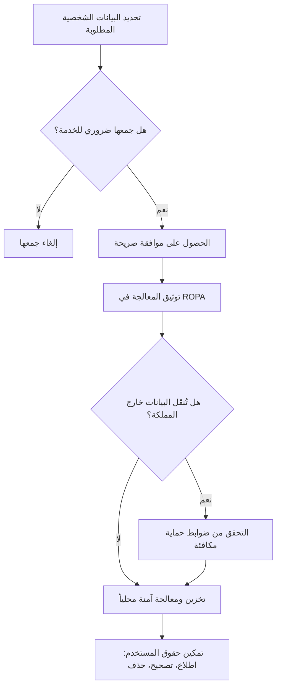

# نظام حماية البيانات الشخصية (PDPL)

> [!info] تعريف مختصر
> نظام حماية البيانات الشخصية (Personal Data Protection Law - PDPL) هو نظام سعودي ينظّم كيفية جمع الجهات والشركات للبيانات الشخصية للأفراد ومعالجتها وتخزينها ومشاركتها، ويمنح الأفراد حقوقاً واضحة على بياناتهم، ويفرض التزامات قانونية على أي جهة تتعامل مع هذه البيانات.

## الشرح العلمي والاحترافي
- يصدر النظام عن الهيئة السعودية لتنظيم البيانات (SDAIA)، ويُطبَّق على أي جهة تعالج بيانات شخصية لأفراد داخل المملكة العربية السعودية، سواء كانت هذه الجهة داخل المملكة أو خارجها إذا كانت المعالجة تخص مقيمين فيها.
- "البيانات الشخصية" هي أي معلومة تحدّد هوية شخص بعينه أو يمكن أن تُستخدَم لتحديدها، مثل الاسم، رقم الهوية، البريد الإلكتروني، الموقع الجغرافي، أو حتى سجل التصفح المرتبط بجهاز شخص معين.
- يميّز النظام بين طرفين أساسيين مثل معظم أنظمة حماية البيانات العالمية: "المتحكّم بالبيانات" (Controller) الذي يقرّر لماذا وكيف تُعالَج البيانات، و"معالج البيانات" (Processor) الذي ينفّذ المعالجة نيابة عن المتحكّم؛ راجع [[Controller vs Processor]] للتفاصيل.
- من أهم متطلبات الامتثال: الحصول على موافقة صريحة من صاحب البيانات قبل جمعها لأي غرض غير ضروري، تحديد غرض واضح للجمع، عدم استخدام البيانات لغرض آخر دون موافقة جديدة، وحفظ سجل بمعالجات البيانات المعروف بـ[[ROPA]] (Record of Processing Activities).
- يمنح النظام الأفراد حقوقاً محددة: الحق في معرفة كيف تُستخدَم بياناتهم، الحق في طلب نسخة منها، الحق في تصحيحها، والحق في طلب حذفها في حالات معينة.
- يفرض النظام قيوداً على نقل البيانات الشخصية خارج المملكة، ولا يُسمَح بذلك إلا وفق ضوابط محددة تضمن مستوى حماية مكافئ، وهو مفهوم مشابه لبنود [[Standard Contractual Clauses]] المستخدمة في أنظمة حماية بيانات أخرى حول العالم.
- عدم الامتثال يعرّض المؤسسة لغرامات مالية وأضرار سمعة كبيرة، ولذلك يجب أن يكون التخطيط لحماية البيانات جزءاً أساسياً من أي مشروع تقنية منذ مرحلة التصميم (مبدأ "الخصوصية بالتصميم" - Privacy by Design)، لا إضافة لاحقة بعد الإطلاق.

## أين ومتى يُستخدم
- يُراعى منذ مرحلة جمع المتطلبات ([[Software Requirements Specification]]) في أي مشروع يتعامل مع بيانات مستخدمين حقيقية، مثل تطبيقات صحية، مالية، أو تجارة إلكترونية.
- يُدمَج في عمليات التحقق من هوية العميل ([[KYC]]) في القطاع المالي، حيث تجمع المؤسسات بيانات حساسة يجب حمايتها وفق النظام.
- يُراجَع عند توقيع أي عقد مع مزوّد خدمة سحابية أو خارجي (Third-party Vendor) يعالج بيانات نيابة عن الشركة، للتأكد من أنه معالج (Processor) ملتزم بنفس المعايير.
- يُدرَج كبند دائم في [[Risk Register]] لأي مشروع تقني، وفي بعض المشاريع الحكومية أو الصحية يُشترَط تعيين مسؤول حماية بيانات (Data Protection Officer) يراجع الامتثال باستمرار.

## مثال وسيناريو تطبيقي
> [!example] سيناريو ملموس
> شركة "صحتي الرقمية" تبني تطبيقاً لحجز المواعيد الطبية يجمع بيانات المرضى: الاسم، رقم الهوية، التاريخ المرضي، ورقم الجوال. أثناء مرحلة تصميم قاعدة البيانات، أوقف مسؤول الامتثال الفريق لأنه لاحظ أن التطبيق كان سيُرسل نسخة من بيانات المرضى إلى خدمة تحليلات سحابية مقرّها خارج المملكة دون تقييم مسبق لمستوى الحماية هناك.
> عدّل الفريق التصميم: أضاف موافقة صريحة (Consent) داخل التطبيق توضح للمريض أن بياناته الطبية ستُستخدَم فقط لجدولة المواعيد، وأنشأ سجل [[ROPA]] يوثّق كل نوع بيانات يُجمَع وسبب جمعه ومدة الاحتفاظ به، واستبدل خدمة التحليلات الخارجية بخدمة محلية داخل المملكة تلتزم بنفس متطلبات النظام.
> بهذا التعديل، تجنبت الشركة مخالفة محتملة، وأصبح بإمكان أي مريض أن يطلب من التطبيق حذف بياناته بالكامل عبر شاشة "طلب حذف الحساب" التي أضافها الفريق تلبيةً لحق الحذف الذي يكفله النظام.

## خطوات أو مخطّط
1. تحديد أي بيانات شخصية سيجمعها المشروع، ولماذا، ومن سيُخزّنها ويعالجها.
2. تصنيف الجهة كـ"متحكّم" أو "معالج" لكل نوع بيانات؛ راجع [[Controller vs Processor]].
3. تصميم آلية موافقة صريحة وواضحة قبل جمع أي بيانات غير ضرورية للخدمة الأساسية.
4. توثيق كل معالجة بيانات في سجل [[ROPA]] يشمل الغرض ومدة الاحتفاظ والجهات التي تصل للبيانات.
5. التحقق من أي نقل للبيانات خارج المملكة والتأكد من وجود ضوابط حماية مكافئة قبل الموافقة عليه.
6. بناء آليات تمكّن المستخدم من تصحيح بياناته أو طلب حذفها، واختبارها قبل الإطلاق.
7. مراجعة الامتثال دورياً مع تحديث [[Risk Register]] عند أي تغيير في طريقة معالجة البيانات.

## ⚠️ مفاهيم خاطئة شائعة
> [!warning]
> - الاعتقاد أن النظام يُطبَّق فقط على الشركات الكبيرة أو القطاع الحكومي؛ في الواقع ينطبق على أي جهة، مهما كان حجمها، تعالج بيانات شخصية لأفراد في المملكة.
> - الظن بأن الموافقة العامة الغامضة ("بالمتابعة أنت توافق على شروط الاستخدام") كافية؛ النظام يشترط غالباً موافقة صريحة وواضحة للأغراض غير الضرورية، لا موافقة ضمنية مبهمة.
> - الخلط بين تشفير البيانات وحماية الخصوصية الكاملة؛ التشفير إجراء أمني مهم لكنه لا يُغني عن الالتزام بمتطلبات الموافقة، الغرض المحدد، وحقوق الأفراد التي يفرضها النظام.

## ❌ ممارسات خاطئة في المشاريع
> [!failure]
> - تأجيل التفكير بحماية البيانات إلى ما بعد إطلاق المنتج، فيتطلب الأمر إعادة تصميم مكلفة لاحقاً. التجنب: إشراك مراجعة الامتثال منذ مرحلة جمع المتطلبات الأولى، لا كخطوة أخيرة قبل الإطلاق.
> - استخدام خدمات سحابية أو تحليلية خارجية دون التحقق من موقع تخزين البيانات وسياسات الجهة المزوّدة. التجنب: مراجعة عقود مزوّدي الخدمة الخارجيين والتأكد من التزامهم بمعايير مكافئة قبل التعاقد.
> - عدم توثيق أي سجل لمعالجات البيانات (ROPA)، مما يجعل الاستجابة لأي طلب تدقيق أو شكوى بطيئة وغير منظمة. التجنب: بناء سجل ROPA حي يُحدَّث مع كل ميزة جديدة تجمع بيانات.

## 🔗 مصطلحات ومفاهيم ذات صلة
[[ROPA]] | [[Controller vs Processor]] | [[Standard Contractual Clauses]] | [[KYC]] | [[Risk Register]] | [[Software Requirements Specification]] | [[Sign-off]]
