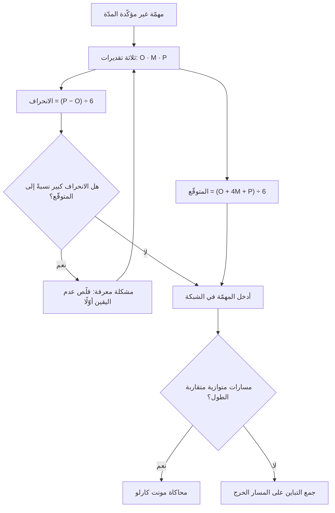

# أسلوب تقييم ومراجعة البرامج (PERT)

> [!info] تعريف مختصر
> **PERT** — اختصار *Program Evaluation and Review Technique* — أسلوب جدولة يُقدَّر فيه زمن كل مهمّة **بثلاثة أرقام** لا برقم واحد: متفائل، وأرجح، ومتشائم؛ ثم يُحسب منها زمن متوقّع ومقدار تباين، فيصير للتاريخ النهائي **احتمال** لا وعد قاطع. وهو أوّل ما أدخل عدم اليقين في جدولة المشاريع صراحةً، وقد طُوّر سنة 1958 في مكتب المشاريع الخاصّة بالبحرية الأمريكية لبرنامج صواريخ بولاريس، بالتعاون مع شركة Booz Allen Hamilton وشركة Lockheed. **وفائدته الباقية اليوم في صيغة التقدير الثلاثية أكثر منها في شبكته**، إذ حلّت [[Monte Carlo Simulation|محاكاة مونت كارلو]] محلّ حسابه لعلّة تُذكر أدناه.

## الشرح العلمي والاحترافي

### 1. الصيغة وما تعنيه

- تُطلب من المقدِّر ثلاثة أرقام لكل مهمّة:
  - **المتفائل (O):** إن سار كل شيء على أحسن ما يكون.
  - **الأرجح (M):** المدّة المعتادة في الأحوال الغالبة.
  - **المتشائم (P):** إن وقع ما يُخشى وقوعه — ولا يُقصد به الكارثة النادرة.
- **الزمن المتوقّع** = ‎(O + 4M + P) ÷ 6‎ — وهو متوسّط مرجّح يعطي الأرجح أربعة أضعاف وزن الطرفين، تقريبًا لتوزيع بيتا.
- **الانحراف المعياري للمهمّة** = ‎(P − O) ÷ 6‎ — أي أن **اتّساع الفجوة بين الطرفين هو مقياس عدم اليقين**. وهذه أنفع مخرجات الأسلوب وأكثرها إهمالًا.
- ويُجمع التباين على طول المسار، فيُقدَّر احتمال الوفاء بتاريخ بعينه. وتُستعمل أحيانًا صيغة أبسط بتوزيع مثلّثي: ‎(O + M + P) ÷ 3‎، وهي أثقل وزنًا للطرفين فتعطي تقديرًا أكبر عادةً.

### 2. ما الذي يضيفه فعلًا

- **يكشف عدم اليقين بدل أن يخفيه.** فمهمّتان زمنهما المتوقّع خمسة أيام إحداهما (4، 5، 6) والأخرى (1، 4، 16) — وهما في الجدول رقم واحد، وفي الواقع مختلفتان تمامًا. **والثانية هي التي ينبغي أن تُبكَّر ويُنظر في تقليل خطرها**، ولا يظهر ذلك إلا بالتقدير الثلاثي.
- **يُخرج المقدِّر من مأزق الرقم الواحد.** فسؤال «كم تستغرق؟» يُجيب عنه المهندس برقم يوازن به بين خوفين، وسؤالُه بثلاثة أرقام يستخرج منه معرفته الحقيقية بالمدى.
- **يجعل الحديث مع أصحاب المصلحة عن احتمال لا عن وعد**: «نفي بهذا التاريخ باحتمال عالٍ، وبالتاريخ الأبكر باحتمال متوسّط» أصدق من تاريخ واحد يُقال جازمًا ثم يُخلَف.

### 3. عيبه المعروف: انحياز الالتقاء

- **PERT يُقلّل مدّة المشروع بطبيعته**، لأنه يحسب تباين **المسار الحرج وحده**. وفي المشاريع ذات المسارات المتوازية المتقاربة الطول، يكفي أن يتأخّر أحد المسارات «شبه الحرجة» ليصير هو الحاكم — واحتمال أن يتأخّر **أحدها** أكبر من احتمال تأخّر مسار بعينه.
- ويُعرف هذا بـ**انحياز الالتقاء (Merge Bias)**، وهو السبب المباشر في أن الممارسة انتقلت إلى [[Monte Carlo Simulation|محاكاة مونت كارلو]]: فهي تُشغّل الشبكة كلّها آلاف المرّات بمدد عشوائية، فتلتقط تبادل المسارات على الحرجية بدل افتراض ثباتها.
- ولهذا **يُستعمل PERT اليوم على مستوى المهمّة أكثر منه على مستوى المشروع**: تُؤخذ الصيغة الثلاثية للتقدير، ويُترك حساب احتمال التاريخ النهائي للمحاكاة.

### 4. موضعه من الأدوات المجاورة

نشأ PERT في السنة نفسها تقريبًا التي نشأ فيها **CPM** ([[Critical Path|المسار الحرج]]) عند DuPont — لكن لغرض مختلف: CPM لمشاريع مدد مهامها معروفة يُراد المفاضلة فيها بين الوقت والكلفة، وPERT لمشاريع بحث وتطوير مدد مهامها مجهولة أصلًا. **والفرق بينهما فرق في المشكلة لا في الدقّة**: أحدهما يُدير التبعيات، والآخر يُدير عدم اليقين. وثالثهما [[Critical Chain|السلسلة الحرجة]] يُدير الموارد والاحتياط — وجدول التمييز الثلاثي بينها مبسوط في [[Critical Chain|صفحة السلسلة الحرجة]].

## أين ومتى يُستخدم

- في تقدير المهام **عالية عدم اليقين**: تكاملٌ مع نظام خارجي لم يُجرَّب، أو ترحيل بيانات لم تُفحص جودتها بعد.
- عند إعداد وعد تاريخي لجهة خارجية، لبيان أن التاريخ ذو احتمال — وهو أنفع من الوعد القاطع في التفاوض لا أضعف منه.
- في المشاريع البحثية والتطويرية التي لا سوابق لمهامها.
- كأداة **حوار** في جلسات التقدير: فالفجوة بين المتفائل والمتشائم عند شخصين تكشف اختلافًا في الفهم لا في الحساب، وهو ما يستحقّ النقاش فعلًا.
- **ولا يُلجأ إليه** حيث تكون المهام متكرّرة معروفة المدّة، فالتقدير الثلاثي هنا كلفة بلا عائد؛ ولا في الفرق الرشيقة التي تملك بيانات تدفّق تاريخية، فالتنبّؤ الاحتمالي من [[Cycle Time|زمن الدورة]] أصدق منه لأنه مبنيّ على قياس لا على رأي.

## مثال وسيناريو تطبيقي

> [!example] سيناريو ملموس
> فريق يقدّر مهمّة **ترحيل بيانات العملاء من نظام قديم**. سُئل المهندس أوّلًا برقم واحد فقال: **عشرة أيام**.
> ثم سُئل ثلاثةً: **متفائل 6 · أرجح 9 · متشائم 30**. فالمتشائم مرتفع جدًّا لأن جودة البيانات القديمة مجهولة، وقد يظهر فيها ما يستلزم تنظيفًا يدويًّا واسعًا.
> الزمن المتوقّع = ‎(6 + 36 + 30) ÷ 6 = 12 يومًا‎ — أي أعلى بيومين من الرقم الذي قيل ارتجالًا.
> والانحراف المعياري = ‎(30 − 6) ÷ 6 = 4 أيام‎ — وهذا رقم كبير جدًّا نسبةً إلى المتوقّع، ومعناه أن المهمّة **ليست مشكلة جدولة بل مشكلة معرفة**.
> **فكان القرار الصحيح ليس تعديل الجدول، بل تقديم ما يقلّص الفجوة:** أُفرد يومان في أوّل المشروع لفحص عيّنة من البيانات القديمة ([[Data Dry Run|تجربة جافّة]]). وبعد الفحص أعاد المهندس التقدير: **7 · 9 · 13** — فصار المتوقّع 9.3 يومًا وانحرافه يومًا واحدًا.
> **والفائدة لم تكن في الرقم الأدقّ**، بل في أن يومين من الفحص المبكر حوّلا مهمّةً قد تنفجر إلى ثلاثين يومًا إلى مهمّة معروفة الحدود.

## خطوات أو مخطّط

1. **قسّم العمل إلى مهام** ذات مخرَج واضح وحدود مفهومة.
2. **اطلب ثلاثة أرقام لكل مهمّة** من أقرب الناس إلى تنفيذها، واضبط معنى «المتشائم»: ما يُخشى وقوعه، لا الكارثة النادرة.
3. **احسب المتوقّع والانحراف** لكل مهمّة.
4. **رتّب المهام بانحرافها لا بمدّتها**، وابدأ بأعلاها تباينًا — فهي مصدر الخطر الحقيقي.
5. **قلّص الفجوة قبل أن تجدول**: فحص عيّنة، أو نموذج أوّلي، أو مكالمة مع المورّد. **فكل يوم يُنفق في تقليص عدم اليقين يوفّر أضعافه في الجدول.**
6. **اجمع على طول المسار** لتقدير احتمال التاريخ، **واستعمل [[Monte Carlo Simulation|المحاكاة]] إن كانت المسارات المتوازية متقاربة الطول** لتفادي انحياز الالتقاء.
7. **بلّغ التاريخ باحتماله** لا بوصفه رقمًا قاطعًا، وأعد الحساب كلّما تغيّر المعلوم.

## ⚠️ مفاهيم خاطئة شائعة

> [!warning]
> - **الظنّ أن PERT يعطي تاريخًا أدقّ**: لا يعطي دقّة بل **صدقًا في وصف عدم اليقين**. والرقم الواحد يبدو أدقّ وهو أكذب، لأنه يخفي المدى.
> - **الظنّ أن الصيغة قانون رياضي محكم**: هي تقريب لتوزيع بيتا بأوزان اصطُلح عليها، لا اشتقاق دقيق. وقيمتها في انضباط السؤال لا في عصمة الحساب.
> - **إعطاء المتشائم قيمة الكارثة**: أن يُقال «قد يستقيل المهندس فتصير سنة» يُفسد الحساب كلّه ويجعل التباين بلا معنى. **المتشائم ما يُخشى وقوعه في المجرى المعتاد، والكوارث موضعها [[Risk Register|سجلّ المخاطر]] لا التقدير.**
> - **الظنّ أنه يُغني عن المحاكاة**: انحياز الالتقاء يجعله يُقلّل مدّة المشاريع متعدّدة المسارات المتوازية بانتظام، وهذا عيب بنيوي فيه لا سوء استعمال له.
> - **الخلط بينه وبين [[Critical Path|المسار الحرج]]**: نشآ متقاربين في الزمن ويُذكران معًا، لكن هذا يُدير **عدم اليقين في المدد** وذاك يُدير **التبعيات**.
> - **الظنّ أنه بديل عن التقدير النسبي في أجايل**: [[12 - Story Points|نقاط القصّة]] و[[Relative Estimation|التقدير النسبي]] يعملان بمنطق مختلف يُقاس بالتدفّق التاريخي. وPERT أداة تقدير مطلق بالزمن، وموضعها المهمّة الفريدة عالية الغموض.

## ❌ ممارسات خاطئة في المشاريع

> [!failure]
> - **طلب الأرقام الثلاثة ثم استعمال الأرجح وحده في الجدول**: يُهدر الجهد كلّه ويُلغي الفائدة الوحيدة — وهي التباين. **التجنّب:** اعرض عمود الانحراف في جدول التقدير، ورتّب به أولويات تقليص الغموض.
> - **حساب المتفائل والمتشائم بنسبة ثابتة من الأرجح** (مثل ‎−20%‎ و‎+50%‎): يُنتج تباينًا وهميًّا متساويًا لكل المهام، فيُخفي المهمّة الخطرة بين المهام المستقرّة. **التجنّب:** اطلب الرقمين من المنفّذ بسبب مذكور لكلٍّ منهما.
> - **إعلان التاريخ المتوقّع للعميل بوصفه التزامًا**: الزمن المتوقّع احتماله نحو النصف تقريبًا، فالوعد به وعدٌ بما يُخلَف نصف الوقت. **التجنّب:** التزم بتاريخ عند احتمال أعلى، وأعلن الفرق بوصفه مخزونًا لا فسحة.
> - **جمع الاحتمالات على المسار الحرج في مشروع مسالكه المتوازية متقاربة**: تقدير مطمئن ومغلوط بنيويًّا. **التجنّب:** استعمل المحاكاة، أو ارفع التاريخ الملتزَم به تحسّبًا لانحياز الالتقاء.
> - **استعماله لكل مهمّة في المشروع**: الكلفة تفوق العائد في المهام المتكرّرة المعروفة، ويتحوّل إلى طقس تُملأ خاناته. **التجنّب:** اقصره على المهام التي يتّسع فيها المدى فعلًا، ولا تزد على ذلك.

## 🔗 مصطلحات ومفاهيم ذات صلة

[[Critical Path]] | [[Critical Chain]] | [[Monte Carlo Simulation]] | [[Estimation]] | [[Estimation Variance]] | [[Relative Estimation]] | [[Gantt Chart]] | [[Buffer]] | [[Data Dry Run]] | [[12 - Story Points]]
