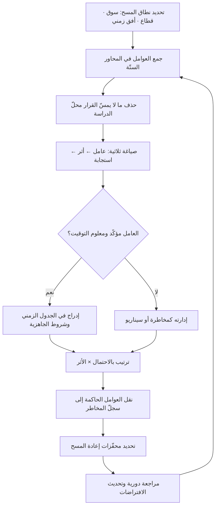

# إطار مسح البيئة الكلّية (PESTEL)

> [!info] تعريف مختصر
> إطار لمسح العوامل الخارجية الكلّية التي تؤثّر في المنشأة ولا تملك المنشأة السيطرة عليها، مصنَّفة في ستّة محاور: **السياسية (Political)، والاقتصادية (Economic)، والاجتماعية (Social)، والتقنية (Technological)، والبيئية (Environmental)، والقانونية/التشريعية (Legal)**. وظيفته ليست وصف العالم، بل ضمان ألّا يُغفَل محور كامل من محاور المخاطرة والفرصة بسبب تحيّز مهني — فالفريق التقني يرى العامل التقني وحده، والفريق المالي يرى الاقتصادي وحده. وقيمة الإطار الحقيقية تظهر حين ينتهي المسح **بقرارات ومخاطر مسجَّلة**، لا بقائمة عوامل مرتّبة في شريحة عرض.

## الشرح العلمي والاحترافي
- **الأصل والتسميات المتعدّدة**: بدأ الإطار في أدبيات التخطيط الاستراتيجي في ستّينيات وسبعينيات القرن العشرين بصيغة رباعية (PEST)، ثم توسّع لاحقًا بإضافة البعدين البيئي والقانوني ليصبح PESTEL أو PESTLE. وتتداول الأدبيات صيغًا أخرى (STEEPLE بإضافة الأخلاقي، أو SLEPT). التعدّد في التسميات دليل على أن الإطار **أداة تنظيم تفكير لا نظرية**؛ ولا يهمّ عدد الحروف بقدر ما يهمّ ألّا يُترك محور مؤثّر بلا فحص.
- **الحدّ الفاصل: ما لا نسيطر عليه**: العوامل الداخلية (فريقنا، منتجنا، مواردنا) ليست جزءًا من هذا الإطار — لها أدوات أخرى. الخلط شائع ويُفقد المسح قيمته، لأن الغرض هو تحديد ما يجب **التكيّف معه أو التحوّط منه**، لا ما يمكن تغييره.
- **المحاور الستّة بمعناها العملي**: **السياسي** — استقرار الحكم، السياسات الصناعية، التوجّهات نحو الاستثمار الأجنبي، الرؤى والبرامج الوطنية، العلاقات التجارية والعقوبات. **الاقتصادي** — النمو، التضخّم، أسعار الفائدة، سعر الصرف وثباته، القوّة الشرائية، سيولة السوق وسلوك الدفع. **الاجتماعي** — التركيبة السكّانية، معدّلات التوظيف بين الجنسين، أنماط الاستهلاك، انتشار الأجهزة، اللغة، القيم الشرائية، مواسم الذروة الدينية والاجتماعية. **التقني** — البنية التحتية للاتّصالات، انتشار الدفع الرقمي، الهويّة الرقمية الوطنية، النضج السحابي، توفّر الكفاءات التقنية. **البيئي** — الأثر المناخي والموارد، معايير الاستدامة، متطلّبات الإفصاح البيئي، مخاطر سلاسل الإمداد المرتبطة بالمناخ. **القانوني** — قوانين حماية البيانات، متطلّبات الفوترة، قوانين العمل والتوطين، الترخيص القطاعي، حقوق الملكية الفكرية، تنظيم المنافسة.
- **الفرق بين العامل والأثر والاستجابة**: المخرَج المفيد ثلاثي البنية لا أحادي. «ارتفاع نسبة التوطين المطلوبة» عامل؛ «ارتفاع كلفة التوظيف بنسبة كذا وطول زمن التوظيف شهرين إضافيين» أثر؛ «التعاقد المبكر مع شريك توظيف محلّي وتعديل خطّة النمو» استجابة. المسح الذي يتوقّف عند العوامل بلا آثار ولا استجابات هو المصدر الأول لسمعة الإطار السيّئة بوصفه «تمرينًا شكليًّا».
- **الترتيب بالأهمية لا بالسرد**: تُصنَّف العوامل بحسب **احتمال الحدوث × قوّة الأثر**، ثم يُميَّز بين ما هو **مؤكّد ومعروف التوقيت** (تشريع صدر وله تاريخ نفاذ) وما هو **غير مؤكّد** (اتّجاه اقتصادي). الأول يُخطَّط له في الجدول الزمني مباشرةً، والثاني يُدار كسيناريو ومخاطرة.
- **الاتّجاه أهمّ من اللقطة**: قراءة العامل عند لحظة واحدة تضلّل؛ ما يفيد هو **الاتّجاه وسرعته**. سوق تنخفض فيه حصّة الدفع النقدي بسرعة يختلف تمامًا عن سوق مستقرّ عند النسبة نفسها، لأن القرارات تُبنى على ما سيكون عليه السوق عند الإطلاق لا عند التحليل.
- **الصلة بأدوات التحليل الأخرى**: PESTEL يمسح البيئة الكلّية (Macro)، بينما تحليل قوى الصناعة يعالج البيئة التنافسية القريبة (Micro)، وتحليل المسافة بين الأسواق ([[CAGE Framework]]) يعالج الفجوة بين سوقك الأصلي والسوق المستهدف. الثلاثة متكاملة لا متنافسة: PESTEL يقول «ما الذي يحكم اللعبة؟»، وقوى الصناعة تقول «من يقتسم الأرباح؟»، وCAGE يقول «كم تبعد هذه اللعبة عن لعبتنا؟».
- **دورية المسح**: أخطر استعمال هو المسح لمرّة واحدة عند بدء المشروع. البيئة الكلّية تتحرّك، والتشريعات في الأسواق سريعة التنظيم قد تتغيّر داخل دورة المشروع نفسه. الممارسة السليمة تجعل المسح مراجعةً دورية مجدولة، مرتبطة بمواعيد نفاذ التشريعات المعروفة مسبقًا.

## أين ومتى يُستخدم
- **قبل قرار دخول سوق جديد**: هو المدخل الطبيعي لترتيب محفظة الأسواق واختيار [[Market Entry Modes]]، لأنه يكشف القيود التنظيمية التي قد تستبعد أنماطًا كاملة.
- **في بناء خطّة الوصول إلى السوق**: تُشتقّ من المسح شروط الجاهزية في [[Go-to-Market]] — طرق الدفع، متطلّبات الفوترة، توقيت الحملات بالنسبة للمواسم، لغة الواجهة والدعم.
- **في تأسيس دراسة الجدوى**: تدخل مخرجات المسح في افتراضات [[Business Case]]، ولا سيّما افتراضات سعر الصرف والتضخّم وكلفة الامتثال التي تحرّك النتيجة المالية بشدّة.
- **في تغذية سجلّ المخاطر**: كل عامل عالي الأثر يتحوّل إلى بند في [[Risk Register]] بمالك واستجابة ومحفّز مراقبة، ويُقيَّم عبر [[Probability and Impact Matrix]].
- **في مشاريع الامتثال والبيانات**: يكشف المحور القانوني التزامات مثل [[PDPL]] و[[KYC]] و[[Standard Contractual Clauses]] وأدوار [[Controller vs Processor]]، وهي بنود تغيّر معمارية الحل لا وثائقه فقط.
- **في المراجعة الاستراتيجية الدورية**: يُعاد المسح سنويًّا أو عند حدث كبير (تشريع جديد، تحوّل في سعر الصرف، تغيّر في سياسة قطاعية) ليُحدَّث خطّ الأساس الذي بُنيت عليه القرارات ([[Baseline]]).

## مثال وسيناريو تطبيقي
> [!example] شركة تقنية مالية تونسية تخطّط لإطلاق منصّة تقسيط للتجّار الصغار في سوق خليجي، وتستهدف الإطلاق خلال 9 أشهر بميزانية 6 ملايين ريال.
> **السياسي:** وجود برامج وطنية معلنة لدعم التحوّل الرقمي وريادة الأعمال يفتح بابًا لبرامج تسريع وحوافز، لكنه أيضًا يعني منافسة من مبادرات مدعومة. **الأثر:** فرصة تمويل وشراكة، ومخاطرة أن يدخل لاعب مدعوم بأسعار لا يمكن مجاراتها. **الاستجابة:** التقدّم لبرنامج دعم قطاعي مبكرًا، والتموضع في شريحة نوعية ضيّقة بدل المنافسة على السعر.
> **الاقتصادي:** ثبات سعر الصرف مقابل الدولار يزيل مخاطرة كبيرة كانت في تقديرات الفريق الأولى؛ لكن ارتفاع أسعار الفائدة يرفع كلفة رأس المال العامل، وهو حسّاس جدًّا لنموذج التقسيط الذي يموّل المشتريات مقدَّمًا. **الأثر:** ارتفاع كلفة التمويل يقلّص هامش المنتج بنقاط مئوية مؤثّرة. **الاستجابة:** إعادة تسعير رسوم التاجر، والتفاوض على خطّ ائتماني بسقف ثابت قبل الإطلاق لا بعده.
> **الاجتماعي:** شريحة سكّانية شابّة وانتشار مرتفع للهواتف الذكية يخدمان التبنّي؛ وموسما رمضان والحجّ يمثّلان ذروتين شرائيتين حقيقيتين، وأسابيع أخرى فيها ركود ملحوظ. **الأثر:** الحملة التي تُطلق في التوقيت الخاطئ تهدر ميزانيتها. **الاستجابة:** جدولة الإطلاق قبل الذروة بستّة أسابيع، وتصميم قدرة الدعم لتحمّل ثلاثة أضعاف الحجم العادي في الذروة.
> **التقني:** نضج منظومة المدفوعات المحلّية وانتشار الهويّة الرقمية الوطنية يسمحان بتحقّق فوري من الهوية بدل رفع مستندات يدويًّا. **الأثر:** اختصار زمن التسجيل من دقائق إلى ثوانٍ، وهو محدّد رئيس لمعدّل الإكمال. **الاستجابة:** جعل التكامل مع الهويّة الرقمية والمدفوعات المحلّية شرط جاهزية إلزاميًّا لا ميزة لاحقة.
> **البيئي:** الأثر المباشر محدود في منتج رقمي، لكن الاتّجاه العام نحو متطلّبات الإفصاح والاستدامة يؤثّر في التعاقدات المؤسّسية الكبيرة ومعايير التوريد. **الاستجابة:** توثيق سياسة استدامة بسيطة مبكرًا لتفادي عائق تأهيل مورّد لاحقًا.
> **القانوني:** المحور الأثقل — ترخيص نشاط التمويل من الجهة الرقابية، ومتطلّبات اعرف عميلك، ونظام حماية البيانات مع اشتراط توطين بيانات معيّنة، ومتطلّبات الفوترة الإلكترونية. **الأثر الحاسم:** قدّر الفريق زمن الترخيص بشهرين استنادًا إلى خبرة سوقه الأصلي، وأظهر الفحص مع مستشار محلّي أن المسار الواقعي أطول من ذلك بكثير وأنه يشترط رأس مال مدفوعًا ومسؤول امتثال متفرّغًا. **الاستجابة:** أُعيد بناء الخطّة كاملة — مرحلة أولى بنموذج شراكة مع كيان مرخَّص قائم للدخول أثناء استكمال الترخيص، وهو ما ربط مباشرةً بقرار [[Market Entry Modes]].
> **النتيجة العملية:** أنتج المسح 23 عاملًا، رُتّبت فبقي 7 عوامل عالية الأثر انتقلت إلى سجلّ المخاطر بمالك وموعد مراجعة، وعاملان غيّرا تصميم المنتج نفسه (الهويّة الرقمية، والفوترة الإلكترونية)، وعامل واحد أخّر تاريخ الإطلاق المعلن — وهو تأخير مكلف لكنه أرخص كثيرًا من إطلاق يُوقفه المنظّم بعد شهر من العمل.

## خطوات أو مخطّط
1. تحديد نطاق المسح بدقّة: أي سوق؟ أي قطاع؟ أي أفق زمني؟ — مسح بلا نطاق ينتج عموميات لا تُستعمل.
2. جمع العوامل في المحاور الستّة من مصادر أوّلية (جهات تنظيمية، مستشار محلّي، عملاء وشركاء في السوق) لا من انطباعات الفريق.
3. حذف كل عامل لا يمكن ربطه بأثر ملموس على القرار محلّ الدراسة — الطول ليس دليل جودة.
4. صياغة كل عامل ثلاثيًّا: العامل → الأثر المقدَّر (كمّيًّا حيث أمكن) → الاستجابة المقترحة.
5. تصنيف العوامل: مؤكّدة معلومة التوقيت (تُدرج في الجدول الزمني) مقابل غير مؤكّدة (تُدار كمخاطر وسيناريوهات).
6. ترتيب العوامل باحتمال الحدوث × قوّة الأثر، والإبقاء على 5–10 عوامل حاكمة فقط للمتابعة النشطة.
7. نقل العوامل الحاكمة إلى [[Risk Register]] بمالك ومحفّز مراقبة وإجراء استجابة مكتوب.
8. تحديد محفّزات إعادة المسح: تاريخ نفاذ تشريع معروف، تغيّر في سعر الصرف يتجاوز حدًّا، صدور سياسة قطاعية.
9. مراجعة دورية معتمدة، وتحديث الافتراضات المالية في دراسة الجدوى بناءً عليها.

## ⚠️ مفاهيم خاطئة شائعة
> [!warning]
> - **«PESTEL أداة تحليل»**: هو في الأصل أداة **مسح وتصنيف** تضمن التغطية وتمنع النقاط العمياء. التحليل يبدأ بعده: ترتيب، وتقدير أثر، وربط بقرار. من يتوقّف عند التصنيف يظنّ أنه حلّل وهو لم يفعل.
> - **«كلّما طالت القائمة كان التحليل أعمق»**: قائمة من ستّين عاملًا غير مرتّبة تشلّ القرار ولا تخدمه. التصحيح: اضغط القائمة إلى العوامل الحاكمة فقط، واجعل «هل يغيّر هذا العامل قرارًا؟» شرط بقاء.
> - **«المسح يُنجز مرّة عند بدء المشروع»**: البيئة تتحرّك داخل عمر المشروع نفسه، ولا سيّما في الأسواق سريعة التنظيم. التصحيح: اجعل المسح دوريًّا وله محفّزات إعادة معرّفة مسبقًا.
> - **«المحور القانوني يخصّ الفريق القانوني»**: كثير من الالتزامات القانونية تغيّر المعمارية التقنية نفسها (توطين البيانات، الفوترة الإلكترونية، سجلّات المعالجة)، ولا يمكن معالجتها بوثيقة تُوقَّع في النهاية. التصحيح: أشرك الهندسة في قراءة المحور القانوني منذ البداية.
> - **«العوامل الخارجية خارج نطاقنا فلا نملك حيالها شيئًا»**: عدم السيطرة لا يعني عدم الاستجابة؛ التحوّط والتوقيت وإعادة التصميم كلها استجابات فاعلة. التصحيح: اشترط لكل عامل حاكم استجابة مكتوبة أو قرار صريح بالقبول.
> - **«الإطار يصلح للأسواق الخارجية فقط»**: يُستعمل بالقدر نفسه داخل السوق المحلّي عند تغيّر تنظيمي أو تقني كبير. التصحيح: شغّله عند أي تحوّل بيئي جوهري، لا عند التوسّع الجغرافي وحده.
> - **«العوامل مستقلّة بعضها عن بعض»**: المحاور متشابكة؛ قرار سياسي يولّد تشريعًا يغيّر بنية تقنية ويحرّك سلوكًا اجتماعيًّا. التصحيح: افحص التفاعلات بين المحاور، فأخطر الآثار تنشأ عند تقاطعها لا داخل محور واحد.

## ❌ ممارسات خاطئة في المشاريع
> [!failure]
> - **الخطأ: إنتاج شريحة عرض بستّة مربّعات ثم أرشفتها.** لماذا يضرّ: يُستهلك جهد ووقت دون أن يتغيّر قرار واحد، ويترسّخ لدى الفريق أن التحليل الاستراتيجي طقس بلا أثر. الحل: اشترط أن ينتهي كل مسح بمخرَجين ملموسين على الأقل: بنود في [[Risk Register]] وتعديلات في [[Business Case]] أو الجدول الزمني.
> - **الخطأ: الاعتماد على انطباعات الفريق وبحث سطحي بدل مصادر أوّلية ومستشار محلّي.** لماذا يضرّ: تُبنى الخطّة على فهم خاطئ لمتطلّب ترخيص أو مهلة نفاذ، فينكشف الخطأ بعد الإنفاق. الحل: تحقّق من كل عامل قانوني حاسم من مصدر رسمي أو مستشار مرخَّص، ووثّق المصدر في [[Decision Log]].
> - **الخطأ: نسخ مسح سوق مجاور والافتراض بأن الأسواق «متشابهة».** لماذا يضرّ: التشابه اللغوي أو الثقافي لا يعني تشابهًا تنظيميًّا؛ الاختلاف في متطلّبات البيانات والترخيص بين سوقين متجاورين قد يكون جذريًّا. الحل: امسح كل سوق على حدة، واستخدم [[CAGE Framework]] لقياس المسافة الفعلية بدل الافتراض.
> - **الخطأ: تجاهل المواسم والذروات في المحور الاجتماعي.** لماذا يضرّ: إطلاق أو ترحيل نظام في ذروة موسمية يضاعف مخاطر التشغيل، وحملة في موسم ركود تهدر ميزانيتها. الحل: ابنِ تقويمًا موسميًّا للسوق واجعله قيدًا صريحًا على جدولة الإطلاق وفترة [[Hypercare]].
> - **الخطأ: تقدير كلفة الامتثال كبند صغير في الميزانية.** لماذا يضرّ: قد يستهلك الامتثال (ترخيص، تدقيق، توطين بيانات، مسؤول متفرّغ) حصّة معتبرة من ميزانية الدخول ويطيل الجدول بأشهر. الحل: قدّر الامتثال كمسار عمل مستقلّ بميزانية وجدول ومالك، وأدخله في حساب [[TCO]].
> - **الخطأ: عدم تعيين مالك لكل عامل حاكم.** لماذا يضرّ: تبقى العوامل «معروفة للجميع ومسؤولية لا أحد»، فلا يُرصد تحقّقها إلا بعد وقوع الأثر. الحل: مالك واحد لكل عامل، ومحفّز مراقبة مكتوب، ومراجعة ثابتة في [[Steering Committee]].
> - **الخطأ: خلط العوامل الداخلية بالخارجية في المسح نفسه.** لماذا يضرّ: يضيع تمييز ما نستجيب له عمّا نغيّره، فتُصاغ خطط علاج لعوامل لا نملكها وتُهمَل قدرات نملكها فعلًا. الحل: التزم بحدّ الإطار (ما لا نسيطر عليه)، وعالج الداخلي بأدوات مثل [[Fit-Gap Analysis]].

## 🔗 مصطلحات ومفاهيم ذات صلة
[[CAGE Framework]] | [[Market Entry Modes]] | [[Go-to-Market]] | [[Hofstede Cultural Dimensions]] | [[Cash on Delivery]] | [[Risk Register]] | [[Probability and Impact Matrix]] | [[Business Case]] | [[PDPL]] | [[KYC]] | [[Governance]]
