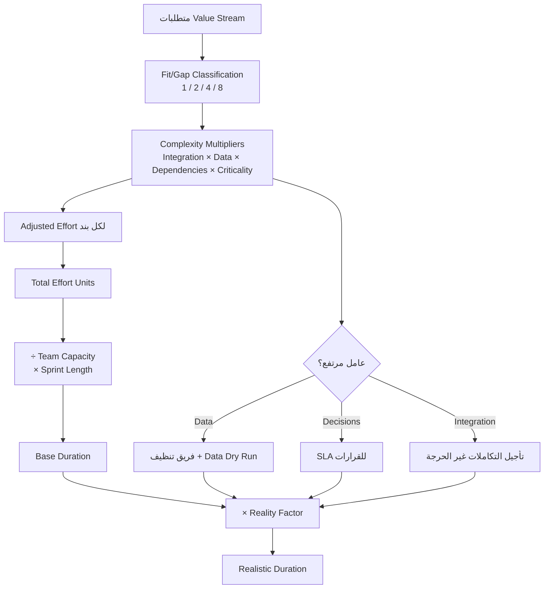

# PFRE — Process Fit-Gap Estimation with Reference Calibration

> [!info] تعريف مختصر
> **PFRE** منهجية تقدير مركّبة لمشاريع الأنظمة المؤسسية (`ERP`/`CRM`) لا تقدّر بالأيام مباشرة، بل تحوّل كل متطلَّب إلى **وحدات جهد (`Effort Units`)** عبر ثلاث طبقات متتالية: **حجم العمل الوظيفي** المشتقّ من [[Fit-Gap Analysis]]، ثم **مضاعِفات التعقيد** (التكامل، البيانات، الاعتماديات، [[Criticality|الحرجية]])، ثم **المعايرة بالواقع** عبر سرعة الفريق الفعلية و[[Reality Factor|معامل الواقعية]]. وقيمتها الحقيقية ليست في دقّة الرقم، بل في أنها تجيب على سؤال **«لماذا سيأخذ هذا الوقت؟»** بدل «كم الوقت؟» — فتصير أداة تفاوض وكشف مخاطر لا مجرّد أداة حساب.

## الشرح العلمي والاحترافي

- **جذر المشكلة**: طرق التقدير الشائعة كلٌّ منها يرى جانباً ويعمى عن آخر:
  | الطريقة | ما تراه | ما تعمى عنه |
  |---|---|---|
  | التقدير بالأيام | الجهد المباشر | الانتظار والتبعيات |
  | `User Stories` فقط | التفاصيل | التدفّق الكامل |
  | `WBS` مبكر | تقسيم العمل | ترتيب القيمة |
  
  و**PFRE** يوازن الأربعة: القيمة (`Process`) · الواقع (`Fit/Gap`) · التعقيد (`Multipliers`) · التنفيذ (`Velocity`).

- **الطبقة الأولى — `Base Work` من نوع الملاءمة**: كل متطلَّب يُصنَّف إلى أربعة أنواع بأوزان **أُسّية لا خطّية**:
  | النوع | الوصف | الوزن |
  |---|---|---|
  | `Standard Fit` | يعمل قياسياً بلا تعديل | **1** |
  | `Config Fit` | إعدادات وصلاحيات و`Workflow` بسيط | **2** |
  | `Light Gap` | تعديل بسيط أو ربط متوسط | **4** |
  | `Heavy Gap` | منطق أعمال خاص يؤثّر على الاختبار والدعم | **8** |
  
  الأُسّية مقصودة: التخصيص الثقيل لا يضاعف زمن البرمجة فحسب، بل يضاعف الاختبار والتوثيق والدعم وخطر الترقية مستقبلاً.

- **الطبقة الثانية — مضاعِفات التعقيد**: أربعة عوامل تُضرب في `Base Work`:
  | العامل | Low | Medium | High | ما يقيسه |
  |---|---|---|---|---|
  | `Integration` | 1.1 | 1.3 | **1.6** | عدد الأنظمة المرتبطة |
  | `Data` | 1.0 | 1.2 | **1.5** | نظافة البيانات وجاهزيتها |
  | `Dependencies` | 1.0 | 1.2 | **1.4** | الاعتماديات بين الفرق والإدارات |
  | `Criticality` | 1.0 | 1.2 | **1.3** | أثر الفشل على التشغيل أو المال أو الإطلاق |
  
  $$\text{Adjusted Effort} = \text{Base Work} \times I \times D \times Dep \times C$$
  
  ولاحظ اتّساع مدى `Integration` (1.1→1.6) وضيق مدى `Criticality` (1.0→1.3): الأول يضاعف **العمل** فعلاً، والثاني يضاعف **الحذر** (اختباراً ومراجعةً) لا العمل نفسه.

- **الطبقة الثالثة — المعايرة بالواقع**:
  ```
  Total Effort Units  = Σ Adjusted Effort
  Base Sprints        = Total Units ÷ Team Capacity
  Base Duration Weeks = Base Sprints × Sprint Length
  Realistic Duration  = Base Duration × Reality Factor
  ```
  و[[Reality Factor]] = `1.2 + سرعة القرارات + جاهزية البيانات + التعقيد` بمدى 1.2 إلى 2.4.

- **لماذا الوحدات لا الأيام؟** لأن الوحدة **مجرّدة عن الفريق**. فريق بسرعة 10 وحدات/سبرنت وآخر بسرعة 6 يقدّران نفس المتطلَّب بنفس الوحدات ويختلفان في الزمن. وهذا يفصل **حجم العمل** (خاصية المتطلَّب) عن **قدرة التنفيذ** (خاصية الفريق) — والخلط بينهما هو أشيع أسباب فشل التقدير.

- **الفائدة المزدوجة — التقدير ككاشف مخاطر**: كل عامل مرتفع يشير إلى رافعة علاجية:
  | العامل المرتفع | ماذا يعني؟ | ماذا تفعل؟ |
  |---|---|---|
  | `Fit/Gap` عالٍ | تخصيصات كثيرة | تأجيل أو استخدام القياسي |
  | `Integration` عالٍ | أنظمة متعدّدة | `Buffer` + تأجيل التكاملات غير الحرجة |
  | `Data` عالٍ | بيانات غير نظيفة | فريق تنظيف مبكر + [[Data Dry Run]] |
  | `Dependencies` عالٍ | تعدّد الجهات | [[RACI]] + مواعيد اعتماد |
  | سرعة قرارات منخفضة | العميل بطيء | [[SLA]] للقرارات + مالك قرار وحيد |

- **الفرق عن `Story Points`**: الـ`Story Point` تقدير نسبي **إجماعي** يعتمد على خبرة الفريق ولا يُفسَّر خارجه. أمّا وحدة PFRE فمُشتقّة من **معادلة معلنة** يمكن الدفاع عنها بنداً بنداً أمام عميل: «لماذا 24.5 وحدة؟ لأن الوزن الأساسي 8 وأربعة مضاعِفات بقيم كذا وكذا». وهذا يجعله أنسب لبيئة **العقود والعروض الفنية** لا لبيئة الفريق الداخلي.

## أين ومتى يُستخدم
- في **مرحلة ما قبل البيع (`Pre-Sales`)** لتحويل قائمة متطلبات إلى نطاق زمني قابل للالتزام تعاقدياً، مع تفسير مكوّناته للعميل.
- بعد رسم [[Value Stream|تدفّقات القيمة]] مباشرة، لأن خطوات التدفّق هي نفسها بنود التقدير — فيصير لكل وحدة جهد خطوة عملية حقيقية تقابلها.
- عند **قرار التقسيم المرحلي**: PFRE يكشف الجهد، ثم يُتّخذ القرار بمنطق `Business Operability` (هل يمنع التشغيل؟ يؤثّر على المال؟ يهدّد الإطلاق؟) لا بحجم الجهد وحده.
- عند **مراجعة عرض مورّد** كأداة تحقّق: اطلب تفكيك التقدير بهذه الطبقات؛ فالمورّد الذي لا يستطيع تفكيك رقمه غالباً لم يفهم النطاق.
- في **إعادة التقدير عند كل بوّابة مرحلية**، لأن المضاعِفات تتغيّر: بيانات تحسّنت تخفض `Data` من 1.5 إلى 1.2 فتقصر الجدول فعلياً.

## مثال وسيناريو تطبيقي
> [!example] تقدير تدفّق `Order to Cash` لشركة توزيع (85 مستخدماً · 3 فروع · 4 مستودعات)
> تسعة متطلبات، وسرعة الفريق 10 وحدات كل سبرنت من أسبوعين:
>
> | المتطلَّب | النوع | `Base` | `Int` | `Data` | `Dep` | `Crit` | **الوحدات** |
> |---|---|---|---|---|---|---|---|
> | `Lead → Opportunity` | Standard | 1 | 1 | 1 | 1 | 1 | 1 |
> | `Opportunity → Quotation` | Config | 2 | 1 | 1 | 1 | 1 | 2 |
> | `Quotation → Sales Order` | Config | 2 | 1 | 1 | 1 | 1 | 2 |
> | `Sales Order → Delivery` | Light Gap | 4 | 1.3 | 1.2 | 1.2 | 1.3 | **9.7** |
> | `Delivery → Invoice` | Config | 2 | 1.3 | 1.1 | 1.2 | 1.3 | 4.5 |
> | `Invoice → Payment` | Config | 2 | 1.3 | 1.2 | 1.2 | 1.3 | 4.9 |
> | `Credit Visibility` | Light Gap | 4 | 1.2 | 1.1 | 1.2 | 1.2 | 7.6 |
> | `Target Discount` | **Heavy Gap** | 8 | 1.3 | 1.3 | 1.3 | 1.2 | **21.1** |
> | `Branch Credit Limit` | **Heavy Gap** | 8 | 1.4 | 1.2 | 1.4 | 1.3 | **24.5** |
> | | | | | | | **الإجمالي** | **77.3** |
>
> **ما كشفه التقدير قبل أن يُعطي الزمن:** بندان من تسعة يستهلكان **45.6 وحدة — أي 59% من الجهد كلّه**. وهذه وحدها أقوى حجّة للتقسيم المرحلي، وأقوى بكثير من عبارة «المشروع كبير».
>
> **ولماذا `Branch Credit Limit` أثقل من `Target Discount` رغم تساوي الوزن الأساسي (8)؟** لأن مضاعِفاته أعلى في ثلاثة عوامل: يمسّ الفروع الثلاثة (`Int` 1.4)، ويعتمد على المالية والفروع معاً (`Dep` 1.4)، ويمنع البيع إن تعطّل (`Crit` 1.3). فرقٌ قدره 16% **مُسمّى الأسباب** ويمكن مناقشته بنداً بنداً.
>
> **من الوحدات إلى الزمن:** `77.3 ÷ 10 = 7.73` سبرنت × أسبوعين = **15.5 أسبوعاً** نظرياً. ولأن قرارات العميل بطيئة (+0.4) وبياناته غير جاهزة (+0.4) والتكامل متوسط (+0.2)، فإن `RF = 2.2` والمدة الواقعية **34 أسبوعاً**.
>
> **الأثر الأهمّ:** حين عُرض التفكيك على الراعي التنفيذي، لم يعد النقاش «لماذا طويل؟» بل «كيف نخفض المعامل؟» — فوُقّع `SLA` للقرارات وشُكّل فريق تنظيف بيانات، وهما يخفضان `RF` من 2.2 إلى 1.4 ويقصّران الجدول اثني عشر أسبوعاً.

## خطوات أو مخطّط
1. اكتب متطلبات كل [[Value Stream|تدفّق قيمة]] كخطوات عملية لا كشاشات.
2. صنّف كل متطلَّب: `Standard` / `Config` / `Light Gap` / `Heavy Gap` — ووثّق سبب التصنيف.
3. اختر المضاعِفات الأربعة لكل بند بأدلّة لا بانطباع (كم نظاماً؟ ما حالة البيانات؟ من يعتمد؟ ماذا يتعطّل بدونه؟).
4. احسب `Adjusted Effort` لكل بند، ثم اجمع للحصول على `Total Effort Units`.
5. افصل `Core` عن `Enhancements` — لكن **لا تقرّر التقسيم بالتسمية** بل بمنطق `Business Operability`.
6. عاير بسرعة الفريق: `Units ÷ Capacity × Sprint Length`.
7. احسب [[Reality Factor]] وطبّقه للحصول على المدّة الواقعية.
8. اقرأ التقدير **تشخيصياً**: أي عامل مرتفع؟ وما الرافعة المقابلة له؟
9. اعرض التفكيك على العميل كأساس تفاوض، وسجّل كل عامل مرتفع مخاطرةً في [[RAID Log]].



## ⚠️ مفاهيم خاطئة شائعة
> [!warning]
> - **الظنّ بأن `Effort Units` أيام**: ليست أياماً ولا ساعات — بل مقياس نسبي مجرّد عن سرعة الفريق. تحويلها إلى زمن يحتاج `Capacity` و`Sprint Length` و[[Reality Factor]].
> - **الاعتقاد بأن الوزن الأُسّي (1-2-4-8) مبالغة**: `Heavy Gap` ليس ضعفَي `Light Gap` بل ضعفيه في البناء وأضعافاً في الاختبار والدعم وخطر الترقية. السلّم يعكس التكلفة الكلّية لا تكلفة البرمجة.
> - **استخدام `Duration Map` على تدفّق كامل**: خرائط تحويل النقاط إلى مدد (4-5 وحدات ← 2-3 أسابيع) مُعدّة لتقدير **متطلَّب واحد**. تطبيقها على `Stream` بأكمله يعطي نتائج تناقض طريقة السبرنتات.
> - **الخلط بين PFRE وقرار التقسيم**: PFRE يكشف الجهد والمخاطر، ولا يقرّر ما يدخل `Phase 1`. القرار مبنيّ على `Business Operability` + `Delivery Risk`.
> - **الظنّ بأن كل ما يُسمّى `Enhancement` يُؤجَّل**: بعض التحسينات `Core Business Logic` تمنع التشغيل المالي — فتدخل المرحلة الأولى مهما كان وزنها.
> - **تطبيق نفس المضاعِفات على كل المشروع**: المضاعِفات **خاصية المتطلَّب** لا خاصية المشروع؛ بند يمسّ نظاماً واحداً ≠ بند يمسّ أربعة.

## ❌ ممارسات خاطئة في المشاريع
> [!failure]
> - **عرض الرقم النهائي دون التفكيك**: يجعل التقدير يبدو تعسفياً ويفقدك أقوى ورقة تفاوض. الحلّ: أرفق جدول البنود والمضاعِفات في العرض الفني نفسه.
> - **حساب PFRE مرّة واحدة في البداية ثم نسيانه**: المضاعِفات تتغيّر — بيانات نُظّفت أو تكامل أُلغي يجب أن يقصّرا الجدول فعلياً. الحلّ: إعادة حساب عند كل بوّابة مرحلية.
> - **اختيار المضاعِفات بالحدس لتصل إلى رقم مُسبَق**: يحوّل الأداة إلى تبرير لا تقدير. الحلّ: اكتب سبب كل مضاعِف في عمود مخصّص قبل حساب النتيجة.
> - **إهمال قراءة التقدير تشخيصياً**: الاكتفاء بالمدّة يهدر نصف قيمة الأداة. الحلّ: أنهِ كل تقدير بقائمة «أعلى ثلاثة عوامل والرافعة المقابلة لكل منها».
> - **الخلط بين وحدات PFRE و[[18 - Velocity|سرعة الفريق]] في تقرير واحد**: يجعل تأخيراً سببه العميل يبدو ضعفاً في الفريق. الحلّ: افصل العمودين صراحةً في تقارير الحالة.
> - **عدم توثيق الوحدات الفعلية بعد التسليم**: يحرم المؤسسة من معايرة تراكمية. الحلّ: سجّل الوحدات المقدَّرة مقابل الفعلية ضمن [[Estimation Variance]] لكل مشروع.

## 🔗 مصطلحات ومفاهيم ذات صلة
[[Fit-Gap Analysis]] | [[Reality Factor]] | [[Effort Units]] | [[Criticality]] | [[Value Stream]] | [[18 - Velocity]] | [[Estimation Variance]] | [[Buffer]] | [[RAID Log]] | [[09 - PFRE Estimation]] | [[10 - PFRE Decision Model]]
