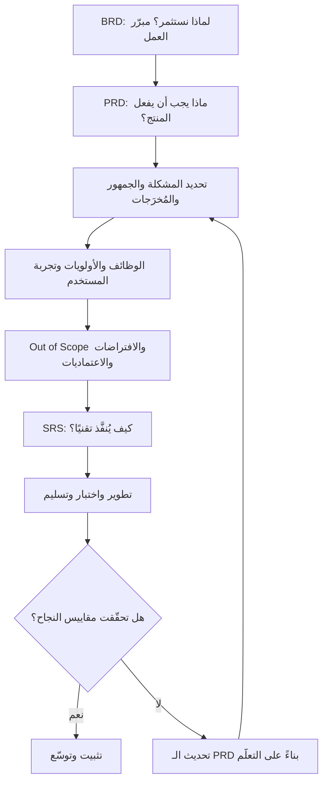

# وثيقة متطلبات المنتج (PRD — Product Requirements Document)

> [!info] تعريف مختصر
> وثيقة متطلبات المنتج (PRD) هي الوثيقة المرجعية التي تصف **ما الذي يجب أن يفعله المنتج ولماذا**: المشكلة التي يحلّها، الجمهور المستهدف، الأهداف والآثار المرجوّة ([[Outcome vs Output]])، الوظائف المطلوبة وأولوياتها، ملامح تجربة المستخدم، وما هو **خارج النطاق** صراحة. هي وثيقة "الماذا والماذا"، لا وثيقة "الكيف" — لا تصف البنية التقنية ولا قاعدة البيانات، بل تحدّد المشكلة والحدود وتترك للفريق التقني حرية اختيار الحل.

## الشرح العلمي والاحترافي
- **الغرض الجوهري من الـ PRD** هو خلق **فهم مشترك واحد** بين مالك المنتج والفريق التقني والتصميم والاختبار وأصحاب المصلحة. أغلب فشل المشاريع لا ينشأ من ضعف التنفيذ بل من اختلاف الأطراف في فهم ما يُبنى أصلًا؛ والـ PRD هو الوثيقة التي تُنهي هذا الاختلاف كتابةً قبل أن يُكلّف اكتشافه ثمنًا باهظًا.
- **المكوّنات القياسية للوثيقة**:
  1. **المشكلة والسياق**: ما الألم القائم؟ ما حجمه؟ ما كلفة بقائه دون حل؟
  2. **الجمهور المستهدف**: من هو المستخدم النهائي (Consumer) ومن الزبون؟ ويُفصَّل عبر شخصيات (Personas) أو شرائح.
  3. **الأهداف والمُخرَجات ومقاييس النجاح**: ما التغيير المطلوب في السلوك أو نتائج العمل، ومؤشرات قياسه ([[KPI]] / [[OKR]]).
  4. **الوظائف المطلوبة وأولوياتها**: قائمة القدرات مرتّبة بأولوية واضحة (مثل MoSCoW)، غالبًا في صيغة [[11 - User Stories]].
  5. **تجربة المستخدم**: التدفقات الرئيسية، الحالات الاستثنائية، الروابط بالنماذج الأولية والتصاميم.
  6. **خارج النطاق ([[Out of Scope]])**: ما لن نبنيه في هذه المرحلة — وهو أهم قسم في الوثيقة عمليًا لأنه يقطع الطريق على تضخّم النطاق (Scope Creep).
  7. **الافتراضات والاعتماديات والقيود**: ما نفترضه صحيحًا، وما نعتمد فيه على فرق أو أنظمة أو جهات خارجية، والقيود التنظيمية والقانونية.
  8. **معايير القبول ([[Acceptance Criteria]])**: شروط اعتبار العمل مُنجزًا وقابلًا للتسليم.
- **موقعها في سلسلة الوثائق** — وهذا هو أكثر ما يُخلط فيه:
  - **[[BRD]] (Business Requirements Document)**: يجيب عن سؤال **لماذا نستثمر؟** — المبرّر التجاري، العائد المتوقع، البدائل، الأثر على المؤسسة. جمهوره الإدارة العليا والممولون، ويرتبط مباشرة بـ[[Business Case]].
  - **PRD**: يجيب عن سؤال **ماذا يجب أن يفعل المنتج؟** — يترجم مبرّر العمل إلى قدرات ملموسة وسلوك مطلوب ومقاييس نجاح. جمهوره فريق المنتج والتطوير والتصميم.
  - **[[Software Requirements Specification]] (SRS)**: يجيب عن سؤال **كيف يُنفَّذ تقنيًا؟** — الواجهات، المتطلبات غير الوظيفية بالتفصيل، نموذج البيانات، القيود المعمارية. جمهوره المهندسون.
  السلسلة إذن: **BRD ← PRD ← SRS**، من مبرّر الاستثمار إلى سلوك المنتج إلى تفصيل التنفيذ. تخطّي حلقة منها يُنتج فجوة مكلفة: بلا BRD نبني منتجًا لا يخدم هدفًا مؤسسيًا، وبلا PRD نقفز من الطموح التجاري إلى الكود مباشرة.
- **من يكتبها ومن يستهلكها**: يكتبها عادة [[05 - Product Owner]] أو مدير المنتج أو محلّل الأعمال، بمشاركة التصميم والهندسة. ويستهلكها المطوّرون (لفهم المطلوب)، المصمّمون (لبناء التجربة)، فريق الاختبار (لاشتقاق حالات الاختبار)، والتسويق والدعم (للاستعداد للإطلاق).
- **وثيقة حيّة لا مُجمَّدة**: خلافًا للفهم الشلالي القديم، الـ PRD الحديث يُحدَّث كلما تعلّمنا شيئًا جديدًا من المستخدم أو السوق. تجميدها يحوّلها إلى وثيقة أرشيفية يتجاهلها الفريق بعد أسبوعين. يُنصح بالاحتفاظ بسجل تغييرات ونسخة واحدة معتمدة (Single Source of Truth).
- **علاقتها بـ[[Value Proposition Canvas]]**: اللوحة هي المصدر الذي يغذّي الـ PRD بالمادة الخام — مهام المستخدم، نقاط ألمه، المكاسب التي يرجوها. الوثيقة التي لا تستند إلى ألم موثّق تتحول إلى قائمة رغبات داخلية بلا دليل.

## أين ومتى يُستخدم
- عند إطلاق منتج جديد أو ميزة كبيرة، بعد اعتماد مبرّر العمل ([[Business Case]]) وقبل بدء التصميم التفصيلي والتطوير.
- عند العمل مع فريق تطوير خارجي أو موزّع، حيث لا يمكن الاعتماد على التواصل الشفوي والسياق المشترك.
- عند تحديد أولويات الـ Backlog: الـ PRD يمنح المرجع الذي تُشتقّ منه القصص وتُبرَّر به الأولويات.
- عند نشوء خلاف حول ما إذا كان طلب ما داخل النطاق أم خارجه: قسم [[Out of Scope]] هو الحكم المكتوب.
- عند إعداد خطة الاختبار و[[UAT]]: تُشتقّ حالات الاختبار من الوظائف ومعايير القبول المذكورة فيها.
- في المشاريع التعاقدية، حيث تُستخدم كمرجع متفق عليه يربط بين [[Delivery Charter]] والتسليم الفعلي.

## مثال وسيناريو تطبيقي
> [!example] **شركة توصيل تريد إضافة تتبّع مباشر للطلب.**
> بدأ الفريق بجملة واحدة من الإدارة: "نريد تتبّعًا مثل التطبيقات العالمية". صاغ مالك المنتج PRD مختصرة من ثلاث صفحات:
> - **المشكلة**: 34% من مكالمات الدعم سؤال واحد متكرر: "أين طلبي؟"، بكلفة تشغيلية شهرية معروفة.
> - **الجمهور**: العميل النهائي المنتظِر، وموظف الدعم الذي يردّ على المكالمات.
> - **المُخرَج ومقياس النجاح**: خفض مكالمات "أين طلبي" من 34% إلى 12% خلال ربع واحد، ورفع رضا ما بعد الطلب.
> - **الوظائف بالأولوية**: خريطة مباشرة لموقع السائق (Must)، إشعار عند كل تغيّر حالة (Must)، وقت وصول تقديري (Should)، محادثة مع السائق (Could).
> - **خارج النطاق صراحة**: مشاركة الموقع بعد التسليم، تتبّع الطلبات الملغاة، دعم الطلبات المجدولة مستقبلًا.
> - **الافتراضات والاعتماديات**: توفّر إحداثيات السائق كل 10 ثوانٍ من تطبيق السائق الحالي، واعتماد على فريق البنية التحتية لبثّ الأحداث.
>
> النتيجة العملية: عندما طلب أحد أصحاب المصلحة لاحقًا إضافة "تقييم السائق داخل شاشة التتبّع"، لم يتحول النقاش إلى صراع آراء — بل رجع الفريق إلى قسم خارج النطاق ومقياس النجاح، وقرّر تأجيل الطلب لأنه لا يخدم مؤشر خفض مكالمات الدعم. الوثيقة هنا لم تكن بيروقراطية، بل كانت **أداة قرار** وفّرت أسابيع عمل.

## خطوات أو مخطّط
1. التأكد من وجود مبرّر عمل معتمد ([[BRD]] / [[Business Case]]) يجيب عن سؤال "لماذا نستثمر".
2. توصيف المشكلة والجمهور استنادًا إلى بحث المستخدم و[[Value Proposition Canvas]] لا إلى الانطباع.
3. صياغة الأهداف كمُخرَجات قابلة للقياس مع مؤشرات نجاح صريحة.
4. اشتقاق الوظائف المطلوبة وترتيبها بأولوية واضحة، وتحويلها إلى [[11 - User Stories]] بمعايير قبول.
5. تحديد **خارج النطاق** بوضوح ونصّ مكتوب، مع سبب الاستبعاد.
6. توثيق الافتراضات والاعتماديات والقيود ومَن يملك رفعها.
7. مراجعة الوثيقة مع الهندسة والتصميم والاختبار واعتمادها كمرجع واحد.
8. تحديثها دوريًا مع كل تعلّم جديد، وتسجيل التغييرات وأسبابها.

## ⚠️ مفاهيم خاطئة شائعة
> [!warning]
> - **الظن بأن الـ PRD وثيقة تقنية**: هي وثيقة سلوك ومشكلة وقيمة؛ لحظة دخولها في تفاصيل قاعدة البيانات والبنية تكون قد تجاوزت دورها إلى دور [[Software Requirements Specification]].
> - **اعتبارها بديلًا عن الحوار**: الوثيقة تُنظّم النقاش ولا تُلغيه؛ الفريق الذي يكتفي بقراءتها دون جلسة تنقيح مشتركة سيفهم منها ثلاث نسخ مختلفة.
> - **الاعتقاد بأن الأجايل يُلغي الـ PRD**: ما يُلغيه الأجايل هو **تجميدها**، لا وجودها. حتى الفرق الرشيقة تحتاج مرجعًا واحدًا يشرح المشكلة والحدود، وإن كان أقصر وأكثر تكرارًا.
> - **الخلط بينها وبين خارطة الطريق ([[15 - Roadmap]])**: خارطة الطريق تقول *متى وبأي ترتيب*، والـ PRD تقول *ماذا ولماذا* لعنصر محدد.
> - **افتراض أن طولها دليل جودتها**: الوثيقة الجيدة هي التي تقرأها الفرق فعلًا وتُنهي بها الخلافات، لا التي تُطبع في أربعين صفحة وتُنسى.

## ❌ ممارسات خاطئة في المشاريع
> [!failure]
> - **كتابة الحلول بدل المشكلات**: صياغة الوثيقة كقائمة شاشات وأزرار محددة سلفًا تُصادر خبرة الفريق التقني وتمنع اقتراح حل أبسط أو أرخص. الحل: وصف المشكلة والمُخرَج المطلوب ومعايير القبول، وترك مساحة تصميم الحل للفريق.
> - **إهمال قسم Out of Scope أو تركه فارغًا**: كل ما لم يُستبعد صراحة سيُفترض أنه مشمول، فيتضخم النطاق دون قرار واعٍ. الحل: جعل [[Out of Scope]] قسمًا إلزاميًا يُراجَع في كل اعتماد، مع تسجيل سبب الاستبعاد.
> - **تجميد الوثيقة بعد التوقيع عليها**: تتحول إلى مرجع ميّت يناقض الواقع، فيهجرها الفريق ويعود إلى الاتفاقات الشفوية. الحل: التعامل معها كوثيقة حيّة بسجل تغييرات ومالك واضح ونسخة واحدة معتمدة.
> - **غياب مقاييس نجاح قابلة للقياس**: بلا مؤشر لا يمكن الحكم على نجاح الميزة، فيُقاس الإنجاز بعدد ما سُلّم لا بأثره. الحل: ربط كل هدف في الوثيقة بمؤشر رقمي وخط أساس وقيمة مستهدفة.
> - **كتابتها منفردًا في عزلة عن الهندسة والتصميم**: تُنتج متطلبات غير قابلة للتنفيذ أو باهظة الكلفة تُكتشف متأخرًا. الحل: جلسة تنقيح مشتركة قبل الاعتماد، وإشراك الهندسة في تقدير الجدوى مبكرًا.
> - **خلطها بمبرّر الاستثمار**: حشر تحليل العائد والبدائل داخلها يُثقلها ويُشوّش جمهورها. الحل: إبقاء المبرّر في [[BRD]] / [[Business Case]] والإحالة إليه برابط.

## 🔗 مصطلحات ومفاهيم ذات صلة
[[BRD]] | [[Software Requirements Specification]] | [[Business Case]] | [[Delivery Charter]] | [[05 - Product Owner]] | [[11 - User Stories]] | [[Acceptance Criteria]] | [[Out of Scope]]
