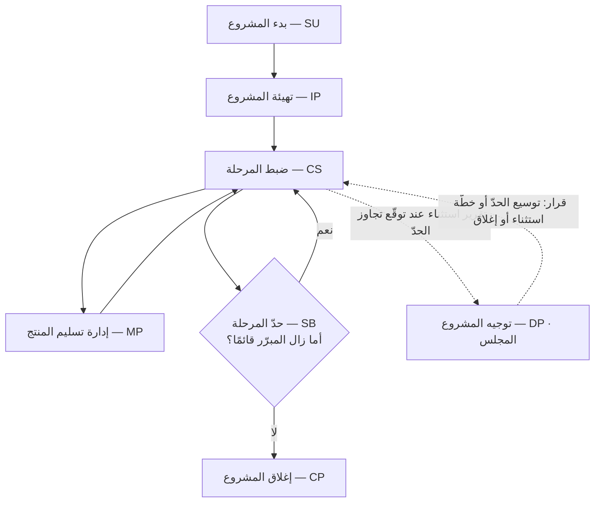

# PRINCE2 — المشاريع في بيئات محكومة

> [!info] تعريف مختصر
> **PRINCE2** اختصار لـ**PRojects IN Controlled Environments**، وهو منهج بريطانيّ الأصل لإدارة المشاريع يقوم على ثلاثة أعمدة: **سبعة مبادئ** لا يُسمّى المشروع بغيرها مجتمعةً «مشروع PRINCE2»، و**سبع ممارسات** هي أبواب ما يُدار (المبرّر · التنظيم · الخطط · الجودة · المخاطر · القضايا · التقدّم)، و**سبع عمليات** ترسم من يفعل ماذا في كل طور. وما يميّزه عن سائر المناهج فكرتان: أنّ **استمرار المشروع مرهون باستمرار مبرّره** فيُغلق متى سقط المبرّر وإن كان التنفيذ ممتازًا، وأنّ الإدارة تجري **بالاستثناء (Management by Exception)** — فلا يُرفع إلى المستوى الأعلى شيء ما دام كل شيء داخل حدود مسموح بها متّفق عليها سلفًا.

## الشرح العلمي والاحترافي

**النشأة.** خرج PRINCE من الجهاز الحكومي البريطاني (CCTA) سنة 1989 معالجةً لسؤال أزعج المشتري الحكومي طويلًا: كيف نضبط مشروعًا ينفّذه **مورّد** لا نملك فرقه ولا نراه يوميًّا؟ ثم عُمِّم سنة 1996 في نسخة PRINCE2 لتخرج من مجال تقنية المعلومات إلى المشاريع كافّة، وتوالت مراجعاته إلى **النسخة السابعة سنة 2023** الصادرة عن PeopleCert.

**وهذا الأصل يفسّر شخصيته كلّها:** فهو منهج **مشترٍ** لا منهج **فريق**. ولهذا كان أقوى ما فيه الحوكمة وحدود الصلاحية والتوثيق، وأضعف ما فيه — بشهادة نصّه نفسه — تفاصيل بناء المنتج، إذ يترك ذلك للمورّد صراحةً.

### المبادئ السبعة

وهي الشرط: من أسقط واحدًا منها فليس مشروعه مشروع PRINCE2 وإن استعمل قوالبه كلّها.

1. **استمرار المبرّر التجاري** — لا يبدأ مشروع بلا [[Business Case|مبرّر عمل]]، **ولا يستمرّ إن سقط مبرّره**. وهو موضع صرامته الأكبر، وأقلّ مبادئه تطبيقًا في الواقع.
2. **التعلّم من التجربة** — يُبحث في [[Lessons Learned|الدروس المستفادة]] عند البدء لا عند الإغلاق وحده.
3. **تحديد الأدوار والمسؤوليات والعلاقات** — يعرف كل طرف ما يقرّره وما لا يقرّره، **ومن يمثّل مصلحته في المجلس**.
4. **الإدارة على مراحل** — يُخطَّط المشروع كلّه على وجه إجماليّ، و**المرحلة القادمة وحدها** بتفصيل. فلا خطّة تفصيلية لسنة كاملة.
5. **الإدارة بالاستثناء** — أدناه.
6. **التركيز على المنتجات** — يُعرَّف **ما سيُسلَّم** ومعايير قبوله قبل جدولة الأنشطة، لا العكس. وهو ما يجعل «الاكتمال» عنده معياريًّا لا رأيًا.
7. **التكييف بحسب المشروع** — يُقاس المنهج على حجم المشروع ومخاطره. والقالب المطبَّق حرفيًّا على مشروع صغير خطأٌ في المنهج نفسه لا التزام به.

### الإدارة بالاستثناء — وهي جوهره العملي

تُوضع لكل مستوًى إداريّ **حدود سماح (Tolerances)** في سبعة أهداف أداء: **الوقت · التكلفة · الجودة · النطاق · المنافع · المخاطر · الاستدامة** (وقد أُضيفت الاستدامة في النسخة السابعة سنة 2023، وكانت الأهداف ستّة قبلها). فما دام التنفيذ داخل الحدود، فالمدير يمضي بلا استئذان ويكتفي بتقرير دوريّ. **وحين يتوقّع تجاوزها** — لا حين يقع التجاوز — يرفع **تقرير استثناء** إلى المستوى الأعلى، فيقرّر: أيُوسِّع الحدّ، أم يعتمد خطّة استثناء، أم يغلق المشروع؟

**وأثر هذا المبدأ عميق:** أن الاجتماع الدوري لا يُعقد ليُطمَئنّ على ما هو جارٍ، بل لا يُعقد أصلًا ما دام كل شيء داخل حدوده. ومن هنا صار المبدأ يُستعار كثيرًا خارج PRINCE2 نفسه — فهو علاج بنيويّ لمرض «تقرير الحالة الأسبوعي الذي لا يغيّر قرارًا».

### الأدوار والمجلس

يقوم عليه **مجلس المشروع** ثلاثيّ التمثيل عمدًا: **التنفيذي (Executive)** يملك المبرّر والمال وله القرار النهائي، و**كبير المستخدمين (Senior User)** يمثّل من سيستعمل المنتج ويتعهّد بتحقّق المنافع، و**كبير المورّدين (Senior Supplier)** يمثّل من يبنيه ويتعهّد بالجدوى الفنّية. ثم **مدير المشروع** يدير اليوميّ داخل الحدود، و**مدير الفريق** ينفّذ حزمة عمل، ويعاونهم **ضمان المشروع** و**دعم المشروع**.

**والحكمة في ثلاثية المجلس** أنها تجعل التوتّر الطبيعي بين المال والاستعمال والتنفيذ **حاضرًا في الغرفة** لا مؤجَّلًا إلى ما بعد التسليم. ولهذا كان أشيع أعطاله: مجلسٌ يجلس فيه ثلاثة عن جهة المشتري وحدها.

### العمليات السبع

1. **بدء المشروع (SU)** — قبل الاعتماد: أثمّة فكرة تستحقّ التهيئة؟
2. **توجيه المشروع (DP)** — عمل المجلس نفسه، ممتدّ على المشروع كلّه.
3. **تهيئة المشروع (IP)** — بناء وثيقة تهيئة المشروع وخططه وحدوده.
4. **ضبط المرحلة (CS)** — عمل مدير المشروع اليوميّ داخل مرحلة.
5. **إدارة تسليم المنتج (MP)** — الواجهة مع فرق التنفيذ عبر حزم عمل.
6. **إدارة حدود المراحل (SB)** — بوّابة بين مرحلتين: يُراجَع المبرّر ويُخطَّط ما يليها.
7. **إغلاق المشروع (CP)** — التسليم، وتحرير الموارد، وتوثيق ما تبقّى من منافع تُقاس لاحقًا.

> [!info] إضافة مرجعية — لماذا يسمّي نفسه «Method»؟
> يصف PRINCE2 نفسه بأنه **method**، وقد اعتمد هذا المستودع مقابل «طريقة» لهذا اللفظ في سياق كانبان، حيث تعني شيئًا يُطبَّق **فوق** عملية قائمة بلا بنية جديدة. **والمعنيان مختلفان اختلافًا بيّنًا**: فكانبان لا تعرّف دورًا ولا حدثًا، وPRINCE2 يعرّف مجلسًا وأدوارًا وعمليات ووثائق إدارية — أي أنه بمعيار القاعدة 6 عندنا أقرب إلى **المنهجية**.
>
> **ولا يُقال إنه يخالف الاصطلاح**، فاللفظ الإنجليزي `method` أوسع من المعنى الذي حصرناه فيه، والمنهج البريطاني استعمله بمعناه اللغوي العامّ قبل أن يستقرّ اصطلاح كانبان بعقود. فيُنقل وصفه لنفسه أمانةً، ويُبيَّن موضعه من تصنيفنا: **بنية كاملة لا طبقة فوق بنية**.

## أين ومتى يُستخدم

- في **مشاريع القطاع العام** والجهات المنظَّمة نظاميًّا، حيث يكون المال عامًّا ويُطلب أثرٌ موثَّق لكل قرار.
- في **علاقة مشترٍ بمورّد**: حيث لا يملك المشتري الفريق المنفِّذ، فتصير حدود السماح وحزم العمل وتقارير الاستثناء بديلًا عن الإشراف اليومي.
- في **المشاريع الطويلة عالية المخاطر** التي يحتمل أن يسقط مبرّرها في الطريق، فتنفع مراجعة المبرّر عند كل حدّ مرحلة.
- **ولا يناسب** فريقًا صغيرًا يبني منتجًا يملكه بنفسه؛ فكلفة وثائقه هناك أعلى من عائدها، وموضعه سكرم أو كانبان.
- **وحضورُه الأوسع** في المملكة المتحدة وأوروبا ودول الكومنولث بحكم أصله الحكومي؛ ويظهر في مناقصات المنطقة حيث دخلت معه بيوت الاستشارات البريطانية، بينما يغلب PMBOK حيث كان التأثير أمريكيًّا.

## مثال وسيناريو تطبيقي

> [!example] سيناريو ملموس
> هيئة حكومية تعاقدت مع مورّد على **منصّة تصاريح إلكترونية** مدّتها 18 شهرًا، وأُقيم المشروع على PRINCE2.
>
> - **المجلس:** التنفيذي وكيل الهيئة، وكبير المستخدمين مدير إدارة التصاريح، وكبير المورّدين مدير الحساب لدى الشركة المنفّذة.
> - **حدود السماح للمرحلة الثالثة:** الوقت **+10 أيام**، والتكلفة **+5%**، والنطاق: لا يُسقَط مطلب إلزاميّ.
> - **في الشهر التاسع** يكتشف مدير المشروع أن ربط بوّابة الدفع سيتأخّر 22 يومًا لتغيّر في مواصفة طرف ثالث. **وهو لا ينتظر وقوع التأخّر**، بل يرفع تقرير استثناء فور توقّعه.
> - **يجتمع المجلس فيقرّر**: تُقدَّم مرحلة أخرى مكانها، ويُوسَّع حدّ الوقت 15 يومًا لا 22، ويُصعَّد الباقي على الطرف الثالث بخطاب رسميّ.
>
> **وفي حدّ المرحلة الخامسة يقع الأهمّ:** تصدر لائحة جديدة تُلغي نوعين من التصاريح كانا يمثّلان **40%** من المنافع المتوقّعة. فيُراجَع [[Business Case|المبرّر]] عند الحدّ كما يوجب المبدأ الأوّل، فيتبيّن أن العائد لم يعد يبرّر ما تبقّى من الإنفاق. **فيُغلق المشروع مبكّرًا وتُسلَّم أجزاؤه المكتملة.**
>
> ولا يُعدّ هذا فشلًا في منطق PRINCE2 بل **نجاحًا لآليّته**: إذ وفّر ما كان سيُنفق على مشروع صار بلا مبرّر. وأكثر المشاريع تُكمل في هذا الموضع إكمالًا مكلفًا لأن إغلاقها يُقرأ هزيمةً لأصحابها.

## خطوات أو مخطّط

1. **قبل الاعتماد:** صُغ المبرّر ابتداءً، وسمِّ التنفيذي، وابحث في الدروس المستفادة من مشاريع شبيهة.
2. **عند التهيئة:** عرِّف المنتجات ومعايير قبولها، وقسّم المشروع مراحل، وضع حدود السماح لكل هدف من الأهداف السبعة.
3. **داخل المرحلة:** أدِر بحزم عمل، وأبلغ دوريًّا، ولا تصعّد ما دمت داخل الحدود.
4. **عند توقّع الخروج عن الحدّ:** ارفع تقرير استثناء **قبل** وقوعه، لا بعده.
5. **عند كل حدّ مرحلة:** راجع المبرّر أوّلًا، ثم خطّط المرحلة التالية. وإن سقط المبرّر فأغلق.
6. **عند الإغلاق:** سلّم رسميًّا، ووثّق الدروس، وحدّد من سيقيس المنافع بعد انتهاء المشروع ومتى.

## ⚠️ مفاهيم خاطئة شائعة

> [!warning]
> - **أنه «الشلّال في ثوب رسميّ».** PRINCE2 يحكم **الحوكمة** لا **أسلوب البناء**؛ ولا يفرض جمع المتطلبات كاملة مقدَّمًا، بل يوجب عكسه: خطّة تفصيلية للمرحلة القادمة وحدها. وتُنفَّذ مراحله بسكرم فعلًا، ولهذا وُضعت نسخة **PRINCE2 Agile**.
> - **الخلط بينه وبين PMBOK.** ذاك **مجموعة معارف** تصف مبادئ ومجالات أداء ولا تُملي أدوارًا ولا تسلسلًا؛ وهذا **منهج** يقول من يقرّر ماذا ومتى يُصعَّد. فلا يتنافسان بالضرورة: تُستعمل معارف الأول داخل حوكمة الثاني.
> - **أنه توثيق ثقيل بطبعه.** الثقل ناتج عن ترك **مبدأ التكييف** لا عن المنهج. ونصّه يوجب معايرة الوثائق على حجم المشروع، ويعدّ القالب المنسوخ حرفيًّا انحرافًا عنه.
> - **أن «الإدارة بالاستثناء» تعني ترك المدير بلا رقابة.** بل تعني رقابة **مضبوطة بحدود مكتوبة**؛ فمن لم يضع الحدود لم يُطبّق المبدأ، إنما ترك الأمر بلا نظام.

## ❌ ممارسات خاطئة في المشاريع

> [!failure]
> - **مبرّر عمل يُكتب مرّة للاعتماد ثم لا يُراجَع**: فيسقط المبدأ الأوّل ويصير المشروع يمشي بقوّة الدفع الأولى وحدها. **التجنّب:** بند ثابت في كل حدّ مرحلة: أما زال العائد يبرّر ما تبقّى من الإنفاق؟
> - **مجلس مشروع بلا كبير مورّدين حقيقيّ**: يُمثَّل المنفّذ بموظّف لا يملك قرارًا، فتُتّخذ قرارات فنّية بلا من يتعهّد بجدواها. **التجنّب:** اشتراط صاحب صلاحية من جهة المنفّذ في وثيقة التهيئة.
> - **حدود سماح غير مكتوبة**: فيصير التصعيد اجتهادًا شخصيًّا — يصعّد المدير الحذر ما لا يستحقّ، ويكتم الجريء ما يستحقّ. **التجنّب:** رقم مكتوب لكل هدف من السبعة في كل مرحلة.
> - **تقرير استثناء يُرفع بعد وقوع التجاوز**: فيفقد المجلس خياراته كلّها إلا الإقرار بالأمر الواقع. **التجنّب:** ثقافة صريحة تكافئ الإنذار المبكر ولا تعاقب عليه.
> - **تطبيق القوالب كلّها على مشروع من ثلاثة أشهر**: فتُستهلك المرحلة الأولى في التوثيق ويكفر الفريق بالمنهج. **التجنّب:** قرار تكييف مكتوب ومعتمَد من المجلس يبيّن ماذا أُسقط ولماذا.

## 🔗 مصطلحات ومفاهيم ذات صلة

[[Business Case]] | [[Governance]] | [[Steering Committee]] | [[Sponsor]] | [[Phasing]] | [[Lessons Learned]] | [[Sign-off]] | [[Change Request]] | [[Risk Register]] | [[RAID Log]] | [[Scope Statement]] | [[23 - Project Program Portfolio]] | [[Delivery Charter]] | [[ITIL 4]]
