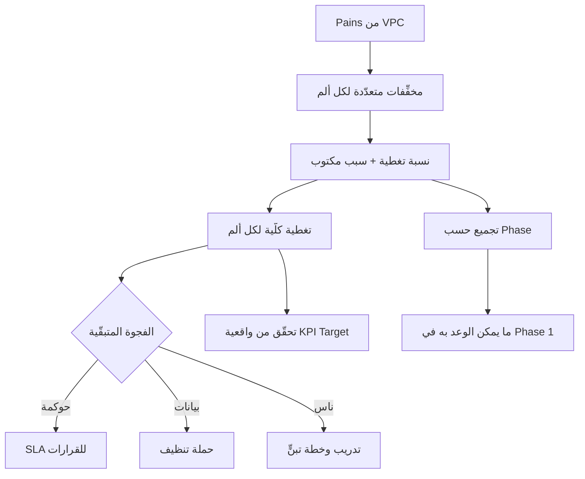

# مصفوفة تغطية الألم (Pain / Gain Coverage Matrix)

> [!info] تعريف مختصر
> **مصفوفة تغطية الألم** أداة تُقدّر **بنسبة مئوية** كم من ألم العميل سيختفي فعلياً بعد تطبيق الحلّ — بدل الإجابة الثنائية «هل النظام يدعم هذا؟». تربط كل ألم بمُخفِّف واحد أو أكثر، وتُسند لكل مُخفِّف نسبة تغطية **بسبب مكتوب**، ثم تجمعها لتصل إلى تغطية كلّية لكل ألم. وقيمتها مزدوجة: **تضبط توقّعات العميل قبل التوقيع** لا بعد الإطلاق، و**تكشف الفجوة التي تحتاج تدخّلاً غير تقني** (حوكمة، تدريب، تغيير عملية).

## الشرح العلمي والاحترافي

- **جذر المشكلة — سؤال «هل يدعم؟» سؤال خاطئ**: معظم أدوات ما قبل البيع تجيب بنعم/لا: «هل النظام يدعم دورة الاعتماد؟ نعم». والعميل يفهم من «نعم» أن الألم سيزول تماماً. ثم يُطلق النظام فيجد أن الاعتمادات ما زالت تتأخّر — لأن سببها الحقيقي أن المدير مشغول لا أن النظام يفتقر إلى الميزة. **النظام غطّى 40% من الألم، والعميل توقّع 100%.**

- **البنية**: كل صفّ يربط ألماً بمُخفِّف واحد:
  | الحقل | ما يحمله |
  |---|---|
  | `Pain / Gain` | الألم أو المكسب من [[Value Proposition Canvas]] |
  | `Reliever / Creator` | العنصر في الحلّ |
  | نوع التأثير | تقليل انتظار / تقليل أخطاء / رفع دقة… |
  | **`Coverage %`** | **نسبة الألم التي يزيلها هذا العنصر** |
  | **سبب التغطية** | **لماذا هذه النسبة تحديداً** ← العمود الذي يمنع الحدس |
  | `KPI Impact` | المؤشّر الذي سيتحرّك |
  | `Phase` | المرحلة التي يُنفَّذ فيها |

- **لماذا لا تصل التغطية إلى 100% أبداً؟** لأن جزءاً من كل ألم **غير تقني بطبيعته**، ويعتمد على: جودة البيانات · سرعة القرارات · التزام المستخدمين · الحوكمة والتدفّق التشغيلي. وادّعاء 100% ليس تفاؤلاً بل **وعد لا يتحقّق** يستهلك رصيد الثقة بعد الإطلاق.

- **الفجوة هي أثمن ما في الجدول**: تغطية 85% تعني أن **15% من الألم سيبقى**. وهذه النسبة ليست فشلاً بل **خارطة عمل**:
  | مصدر الفجوة | التدخّل المطلوب |
  |---|---|
  | الحوكمة | [[SLA]] للقرارات ومالك قرار وحيد |
  | البيانات | حملة تنظيف + [[Data Dry Run]] |
  | الناس | دورة تدريب وخطة تبنٍّ |
  
  **والقاعدة: الفجوة التي لا يقابلها إجراء غير تقني ستظهر شكوى بعد `Go-Live`.**

- **البعد المرحلي — فخّ يُغفل كثيراً**: التغطية الكلّية قد تكون 95% بينما 65% منها في المرحلة الثانية. أي أن المرحلة الأولى لن تحقّق إلا 30%. **اجمع نسب التغطية لكل مرحلة على حدة** قبل الوعد بأي مؤشّر، وإلا وعدت العميل بنتيجة في مرحلة لا تحوي أدواتها.

- **العلاقة بالأهداف**: النسبة هي التي **تُبرّر** الهدف. رفع دقة المخزون من 68% إلى 95% (27 نقطة) هدفٌ واقعي حين تكون التغطية 90%؛ ولو كانت التغطية 50% لكان الهدف نفسه وعداً كاذباً. فالمصفوفة تقف بين [[Value Proposition Canvas|لوحة القيمة]] و**أهداف المؤشّرات** وتضبط واقعيتها.

- **الفرق عن تحليل `Fit/Gap`**: `Fit/Gap` يسأل **هل النظام قادر تقنياً؟** والمصفوفة تسأل **كم سيتغيّر واقع العميل؟**. الأول يقيس النظام، والثانية تقيس الأثر. وقد يكون العنصر `Standard Fit` كامل الملاءمة تقنياً وتغطيته للألم 40% فقط.

## أين ومتى يُستخدم
- في **مرحلة ما قبل البيع** كوثيقة تُعرض على العميل صراحةً — لا كتحليل داخلي.
- عند **صياغة أهداف المؤشّرات**، للتحقّق من واقعية كل `Target` قبل الالتزام به.
- في **تخطيط المراحل**: حساب التغطية لكل مرحلة يحدّد ما يمكن الوعد به ومتى.
- عند **تصميم خطة التبنّي والتدريب**: الفجوات البشرية المكشوفة هنا هي محتوى الخطة.
- في **مراجعة ما بعد الإطلاق**: مقارنة التغطية المتوقّعة بالتحسّن الفعلي تعاير تقديرات المشاريع القادمة.
- عند **مواجهة اعتراض «النظام لم يحلّ مشكلتنا»**: الجدول المُوقَّع مسبقاً هو أفضل ردّ.

## مثال وسيناريو تطبيقي
> [!example] شركة توزيع — لماذا 85% لا 100%؟
> ألم واحد («تأخّر الطلبات») مُفكَّك إلى ثلاثة مخفِّفات:
>
> | المُخفِّف | نوع التأثير | التغطية | السبب |
> |---|---|---|---|
> | `Approval Workflow` | تقليل انتظار | **40%** | تسريع الاعتمادات |
> | `Inventory Automation` | تقليل تأخير | **30%** | تحسين توفّر المنتجات |
> | `Barcode` | تقليل أخطاء | **15%** | تقليل فروق الكميات |
> | **الإجمالي** | | **85%** | **يبقى 15% اعتماديات بشرية** |
>
> **ما فعله هذا الجدول في اجتماع ما قبل التوقيع:**
> - العميل توقّع أن يزول تأخّر الطلبات تماماً؛ فرأى مكتوباً أن 15% سيبقى، **وسبب بقائه**.
> - وسأل: «وكيف نزيل الـ15%؟» — وهذا بالضبط السؤال الذي يفتح باب مشروع التغيير المؤسسي المرافق (سياسة تفويض عند غياب المعتمِد، ومؤشّر أداء على المدراء).
> - وحين وضعنا هدف `Order Cycle Time` من 5 أيام إلى يومين، كان الهدف مسنوداً بنسبة تغطية لا بالتمنّي.
>
> **وفي المقابل، فخّ التقارير:** التغطية الكلّية 95%، لكن `Dashboards` (50%) و`Real-Time Data` (15%) كلاهما في **المرحلة الثانية**. فالمرحلة الأولى لا تحقّق إلا 30% — والوعد بتقارير لحظية عند الإطلاق الأول كان سيكون كذبة غير مقصودة.

## خطوات أو مخطّط
1. استخرج قائمة الآلام والمكاسب من [[Value Proposition Canvas]].
2. لكل ألم، اكتب كل المخفِّفات التي تعالجه (قد تكون ثلاثة أو أربعة).
3. أسند لكل مخفِّف نسبة تغطية **مع كتابة سببها** — لا تكتب النسبة قبل السبب.
4. اجمع نسب كل ألم للحصول على التغطية الكلّية.
5. احسب التغطية **لكل مرحلة على حدة** أيضاً.
6. حدّد مصدر الفجوة المتبقّية: حوكمة؟ بيانات؟ ناس؟
7. أنشئ إجراءً غير تقني لكل فجوة، وأدرجه في خطة المشروع.
8. اربط كل صفّ بالمؤشّر الذي سيتحرّك، وتحقّق من واقعية هدفه.
9. اعرض الجدول على العميل ووقّعه معه.

## ⚠️ مفاهيم خاطئة شائعة
> [!warning]
> - **الظنّ بأن الهدف الوصول إلى 100%**: التغطية الكاملة مستحيلة لأن جزءاً من الألم بشري وحوكمي. الهدف **معرفة النسبة** لا رفعها قسراً.
> - **الخلط بينها وبين [[Fit-Gap Analysis]]**: الأولى تقيس أثر الحلّ على الواقع، والثاني يقيس قدرة النظام تقنياً.
> - **قراءة التغطية الكلّية دون تفكيكها بالمراحل**: أشيع فخّ — يُنتج وعوداً في مرحلة لا تملك أدواتها.
> - **اعتبار النسب دقيقة رياضياً**: هي تقديرات مهنية مُبرَّرة لا قياسات. قيمتها في السبب المكتوب لا في العلامة العشرية.
> - **الظنّ بأنها أداة تسويق**: هي عكس التسويق تماماً — إنها الأداة التي **تخفض** التوقّعات لتحميها.

## ❌ ممارسات خاطئة في المشاريع
> [!failure]
> - **ملء النسب بالحدس ثم تدويرها لتصل إلى 100%**: يحوّل الجدول إلى وعد مموّه. الحلّ: عمود «سبب التغطية» إلزامي، ولا تُكتب نسبة قبل سببها.
> - **إبقاء الجدول داخلياً**: يهدر كل قيمته التفاوضية. الحلّ: يُعرض ويُوقَّع مع العميل قبل التعاقد.
> - **إهمال الفجوة المتبقّية**: تتحوّل إلى شكاوى بعد الإطلاق. الحلّ: كل فجوة يقابلها إجراء غير تقني بمالك وموعد في الخطة.
> - **عدم ربط الصفوف بالمؤشّرات**: يفصل التغطية عن القياس اللاحق. الحلّ: عمود `KPI Impact` إلزامي، ويُستخدم لاحقاً في تتبّع القيمة.
> - **عدم مراجعتها بعد الإطلاق**: يحرم المؤسسة من معايرة تقديراتها. الحلّ: قارن التغطية المتوقّعة بالتحسّن الفعلي في تقرير تحقّق القيمة.

## 🔗 مصطلحات ومفاهيم ذات صلة
[[Value Proposition Canvas]] | [[Fit-Gap Analysis]] | [[Financial Loss Analysis]] | [[Outcome vs Output]] | [[Data Dry Run]] | [[SLA]] | [[04 - Pain Gain Coverage Matrix]]
