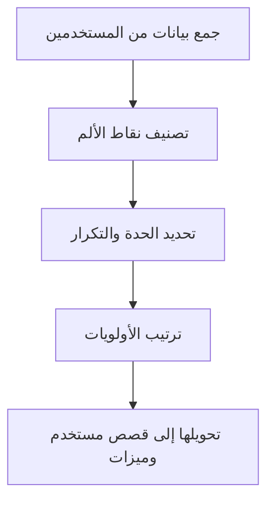

# نقطة الألم (Pain Point)

> [!info] تعريف مختصر
> نقطة الألم (Pain Point) هي مشكلة أو صعوبة حقيقية وملموسة يعاني منها العميل أو المستخدم في حياته اليومية أو عمله، وتشكّل الدافع الأساسي الذي يجعله يبحث عن حل أو منتج يخفف عنه هذه المعاناة.

## الشرح العلمي والاحترافي
- نقطة الألم ليست مجرد "رغبة" أو "ميزة لطيفة" (Nice to Have)، بل هي احتكاك فعلي يكلّف المستخدم وقتاً أو مالاً أو جهداً أو إحباطاً نفسياً متكرراً. كلما كانت نقطة الألم أكثر حدة وتكراراً، زاد استعداد العميل لدفع مقابل حل لها.
- تُصنَّف نقاط الألم عادة إلى أربعة أنواع: مالية (تكلفة مرتفعة)، إنتاجية (إهدار وقت وجهد)، عملية (خطوات معقدة أو بطيئة)، ودعم (صعوبة الحصول على مساعدة أو معلومات).
- اكتشاف نقاط الألم هو حجر الأساس في تصميم أي منتج ناجح؛ فبدون فهم دقيق للألم الحقيقي، يبني الفريق حلاً لمشكلة لا توجد فعلاً، مما يؤدي إلى فشل المنتج في السوق رغم جودته التقنية.
- تُكتشف نقاط الألم عبر مقابلات المستخدمين، الاستبيانات، تحليل الشكاوى، ومراقبة سلوك المستخدم الفعلي ضمن [[User Journey Map]]، حيث تظهر نقاط الألم عادة عند "الاحتكاكات" في رحلة المستخدم.
- ترتبط نقطة الألم مباشرة بمفهوم [[Customer and Market Validation]]؛ فالتحقق من وجود ألم حقيقي وكافٍ لدى شريحة كبيرة من العملاء هو الخطوة الأولى قبل بناء أي [[MVP]].

## أين ومتى يُستخدم
- يُستخدم في مرحلة اكتشاف المنتج (Product Discovery) وبحوث المستخدم، قبل كتابة أي [[11 - User Stories]] أو تصميم أي حل.
- يلجأ إليه فريق المنتج ومصمّمو تجربة المستخدم عند بناء [[User Journey Map]] لتحديد أين تحديداً يعاني المستخدم في رحلته مع المنتج أو الخدمة.
- يُستخدم أيضاً في مقترحات القيمة (Value Proposition) وفي كتابة [[BRD]] لتبرير الحاجة الفعلية للمشروع أمام الجهات الراعية.

## مثال وسيناريو تطبيقي
> [!example] سيناريو ملموس في مشروع برمجي حقيقي
> فريق منتج في شركة توصيل طلبات يجري 15 مقابلة مع سائقي التوصيل. يكتشف الفريق أن نقطة الألم الأكبر ليست سرعة التطبيق، بل أن السائقين يفقدون 10-15 دقيقة يومياً في البحث عن مكان تسجيل الدخول لبدء المناوبة، بسبب واجهة معقدة.
> يوثّق الفريق هذه النقطة في [[User Journey Map]] كمرحلة "بداية المناوبة"، ويحدد أنها تتكرر مع 80% من السائقين يومياً، مما يجعلها ألماً حاداً ومتكرراً يستحق الحل قبل غيره.
> بناءً على ذلك، يُعاد تصميم شاشة تسجيل الدخول لتصبح خطوة واحدة بدلاً من أربع، فتنخفض شكاوى السائقين حول هذه المشكلة بنسبة 60% خلال شهر من الإطلاق.

## خطوات أو مخطّط
1. جمع بيانات من المستخدمين الحقيقيين عبر مقابلات، استبيانات، أو تحليل شكاوى الدعم الفني.
2. تصنيف كل شكوى أو ملاحظة حسب نوعها (مالية، إنتاجية، عملية، دعم).
3. تحديد تكرار كل نقطة ألم وحدّتها (كم عدد المستخدمين المتأثرين، وكم مرة تحدث).
4. ترتيب نقاط الألم حسب الأولوية بناءً على الحدة والتكرار وأثرها على العمل.
5. تحويل أهم نقاط الألم إلى فرص حل تُصاغ لاحقاً كـ [[11 - User Stories]] أو ميزات في [[13 - Backlog]].

## ⚠️ مفاهيم خاطئة شائعة
> [!warning]
> - الخلط بين نقطة الألم و"فكرة ميزة" يقترحها العميل؛ العميل قد يقترح حلاً معيناً، لكن مهمة الفريق فهم الألم الحقيقي خلف الاقتراح وليس تنفيذ الحل حرفياً.
> - الاعتقاد أن أي شكوى هي نقطة ألم مهمة؛ في الحقيقة يجب قياس مدى تكرار وحدة الألم قبل الحكم على أولويته.
> - افتراض أن نقاط الألم واحدة لدى كل العملاء؛ في الواقع تختلف حسب شريحة العميل، فما يزعج مستخدماً مبتدئاً قد لا يزعج مستخدماً محترفاً.

## ❌ ممارسات خاطئة في المشاريع
> [!failure]
> - الاعتماد على افتراضات داخلية للفريق حول ما يزعج العملاء دون التحقق منها ميدانياً. التجنب: إجراء مقابلات ومراقبة سلوك فعلي قبل اتخاذ قرارات التصميم.
> - بناء حلول لنقاط ألم بسيطة الحدة وقليلة التكرار بينما تُهمل نقاط ألم أكبر أثراً. التجنب: ترتيب نقاط الألم كمياً حسب عدد المتأثرين وشدة التأثير قبل التنفيذ.
> - جمع الملاحظات مرة واحدة في بداية المشروع ثم عدم تحديثها لاحقاً، رغم تغيّر سلوك المستخدمين مع الوقت. التجنب: جعل اكتشاف نقاط الألم عملية مستمرة عبر [[Feedback Loop]] دوري.

## 🔗 مصطلحات ومفاهيم ذات صلة
[[User Journey Map]] | [[Customer and Market Validation]] | [[MVP]] | [[11 - User Stories]] | [[BRD]] | [[Feedback Loop]] | [[UX vs CX]] | [[NPS]]
