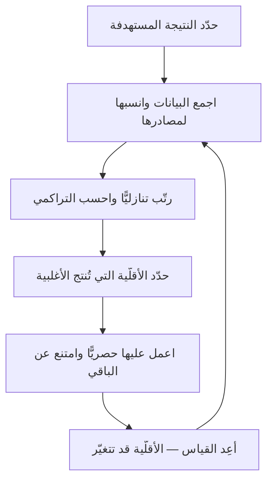

# مبدأ باريتو (Pareto Principle)

> [!info] تعريف مختصر
> مبدأ باريتو ملاحظة تجريبية مفادها أنّ **أقلّية من الأسباب تُنتج أغلبية من النتائج** — وتُختصَر عادةً بنسبة **80/20**. أصله رصد الاقتصادي الإيطالي **فيلفريدو باريتو** لتوزيع ملكية الأراضي، ثمّ عمّمه **جوزيف جوران** في إدارة الجودة تحت اسم **«القلّة الحيوية والكثرة التافهة»**. وقيمته في إدارة المشاريع أنّه أداة **ترتيب أولويات** لا قانون طبيعة.

## الشرح العلمي والاحترافي
- **النسبة ليست مقدّسة**: قد تكون 70/30 أو 90/10 أو 95/5. المهمّ **عدم التماثل** لا الرقم. والمؤسّسة التي تبحث عن «الـ20% بالضبط» تُسيء استخدام الأداة.
- **الأساس الرياضي**: يقترب المبدأ من توزيعات **قانون القوّة (`Power Law`)**، وهي شائعة في الأنظمة التي تتفاعل عناصرها بدل أن تستقلّ. ولهذا يظهر النمط في: توزيع استخدام الميزات، ومصادر العيوب، وتركّز التغيير في الكود، وقيمة العملاء.
- **تطبيقاته العملية في البرمجيات**:

| المجال | الملاحظة النمطية | القرار المترتّب |
|---|---|---|
| **استخدام الميزات** | أقلّية من الميزات تجمع أغلب الاستخدام | ركّز الجودة والأداء عليها |
| **مصادر العيوب** | أقلّية من الوحدات تُنتج أغلب العيوب | أعِد هيكلتها أوّلًا |
| **تركّز التغيير** | أقلّية من الملفّات تتغيّر في أغلب الالتزامات | مرشّحة لدَين تقني |
| **قيمة العملاء** | أقلّية من العملاء تُنتج أغلب الإيراد | صمّم لهم أوّلًا |
| **زمن الانتظار** | أقلّية من المحطّات تُنتج أغلب التأخير | عالجها حصريًّا |
- **علاقته بـ[[Theory of Constraints|نظرية القيود]]**: كلاهما يقول إنّ **التحسين خارج المواضع القليلة الحاسمة يكاد لا يُنتج أثرًا**. والفرق أنّ باريتو ملاحظة توزيعية، ونظرية القيود منهج يحدّد **القيد** بدقّة ويوجّه الجهد إليه.
- **الأداة المرافقة**: **مخطّط باريتو** — أعمدة تنازلية للأسباب مع خطّ تراكمي، يُظهر بصريًّا أين تقع نقطة الـ80%.
- **حدوده**: لا ينطبق حين تكون العناصر **متساوية الأثر بطبيعتها** (متطلّبات امتثال إلزامية مثلًا: لا يمكن تنفيذ 20% منها). ولا ينطبق حين يكون **الأثر تفاعليًّا** — أي حين تكون قيمة العنصر مشروطة بوجود عنصر آخر.

## أين ومتى يُستخدم
- في **إنقاذ نظام غير مستقرّ**: بدل اختبار كلّ الوحدات، تُحدَّد الوحدات الأكثر استخدامًا وتُعالَج أوّلًا.
- عند **ترتيب الباك-لوغ** بمنطق [[Cost of Delay|تكلفة التأخير]]: أقلّية البنود تحمل أغلب القيمة.
- في **تحليل العيوب**: تجميعها حسب الوحدة يكشف عادةً تركّزًا شديدًا.
- عند **تفكيك زمن الانتظار** في [[Value Stream Mapping|خريطة تدفّق القيمة]]: أوّل ثلاثة انتظارات تفسّر غالبًا معظم الضياع.
- في **ترشيد جهد الاختبار**: [[Risk-Based Testing|الاختبار المبنيّ على المخاطر]] تطبيق مباشر للمبدأ.

## مثال وسيناريو تطبيقي
> [!example] نظام ضخم لشركة مستلزمات تجميل — لا ميزة واحدة تعمل باستقرار.
> **الوضع:** المشروع يضمّ نحو **800 إلى 900 وحدة (module)**، والفريق يعمل بالشلّال وبتمويل على النطاق، والنظام كلّه مضطرب.
> **الخيار الساذج:** اختبار شامل لكلّ الوحدات — جهد يستغرق أشهرًا وقد لا ينتهي.
> **الخيار المطبَّق:** تحديد **الوحدات الأكثر استخدامًا فعليًّا في الفترة الحالية** — فكانت نحو **50 وحدة**. خُصِّصت أكبر حصّة من سعة الفريق للعيوب الظاهرة من اختبار تلك الوحدات وحدها.
> **النتيجة:** **استقرّ النظام** ولم تُمَسّ الوحدات الـ850 الباقية إطلاقًا.
> **الدرس:** الاستقرار المُدرَك لدى المستخدم يتحدّد بما **يستخدمه** لا بما هو **موجود**. والقرار الأصعب هنا كان **الامتناع** عن العمل على 94% من النظام.

## خطوات أو مخطّط
1. **حدّد النتيجة** التي تريد تحسينها (عيوب، تأخير، تسرّب عملاء).
2. **اجمع البيانات** ونسبها إلى مصادرها.
3. **رتّب المصادر تنازليًّا** بحسب مساهمتها.
4. **ارسم الخطّ التراكمي** وحدّد أين يبلغ 80%.
5. **اعمل على تلك الأقلّية حصريًّا** — والامتناع عن الباقي جزء من القرار لا إهمال له.
6. **أعِد القياس** بعد فترة، فقد تتغيّر الأقلّية الحيوية نفسها.

## ⚠️ مفاهيم خاطئة شائعة
> [!warning]
> - **التعامل مع 80/20 رقمًا دقيقًا**: النسبة تقريبية، والمهمّ عدم التماثل.
> - **الاستنتاج بأنّ 80% من العمل بلا قيمة**: بعض الـ80% شرط لازم لعمل الـ20% (بنية تحتية، أمن، امتثال).
> - **تطبيقه على ما لا يقبل التجزئة**: لا يمكن تنفيذ 20% من متطلّب تنظيمي إلزامي.
> - **افتراض ثبات الأقلّية الحيوية**: تتغيّر بتغيّر السوق والاستخدام، فتحتاج إعادة قياس.
> - **الخلط بينه وبين نظرية القيود**: باريتو يصف توزيعًا، ونظرية القيود تحدّد القيد وتوجّه إليه الجهد.

## ❌ ممارسات خاطئة في المشاريع
> [!failure]
> - **استخدامه ذريعةً لإهمال الجودة**: «سنغطّي 20% فقط» في نظام حرج للسلامة. الحلّ: يُستخدَم لترتيب الأولوية لا لتخفيض المعيار.
> - **تحديد الأقلّية بالحدس**: تختار الفرق ما تعرفه لا ما يستخدمه الناس. الحلّ: بيانات استخدام حقيقية.
> - **تطبيقه مرّة واحدة**: يتقادم التحليل بتغيّر الاستخدام. الحلّ: إعادة القياس ربعيًّا.
> - **إهمال البند الصغير مرتفع الأثر**: بند تنفيذه دقائق وتكلفة تأخيره غرامة يقع خارج «الـ20% بالحجم». الحلّ: رتّب بـ[[WSJF]] — تكلفة التأخير على الحجم — لا بالحجم وحده.

## 🔗 مصطلحات ومفاهيم ذات صلة
[[Theory of Constraints]] | [[Bottleneck]] | [[Cost of Delay]] | [[WSJF]] | [[Prioritization]] | [[Risk-Based Testing]] | [[Root Cause Analysis]] | [[Value Stream Mapping]]
