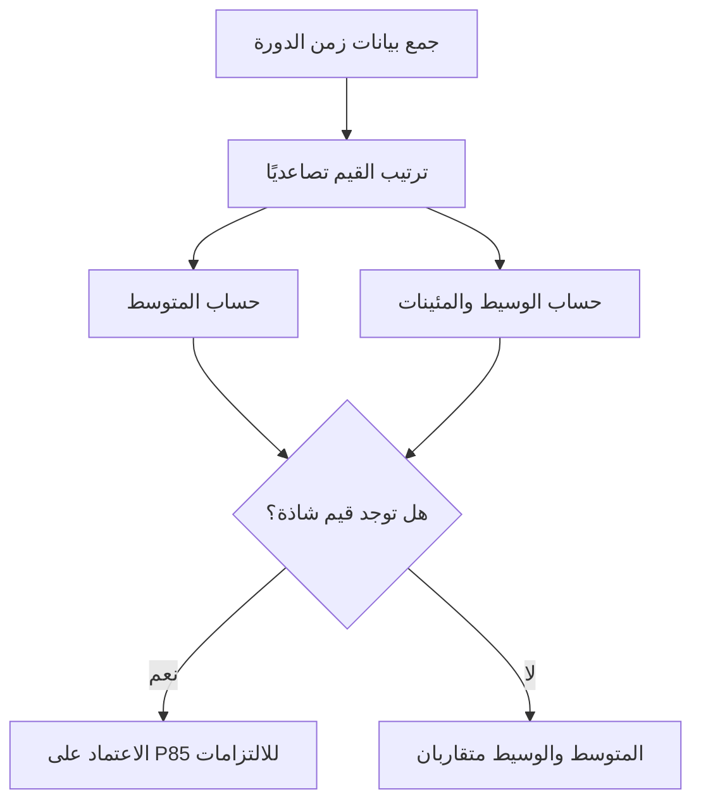

# المئينات والوسيط مقابل المتوسط (Percentiles and Median vs Average)
> [!info] تعريف مختصر
> المتوسط (Average/Mean) هو مجموع القيم مقسومًا على عددها، بينما الوسيط (Median) هو القيمة الوسطى عند ترتيب البيانات. أما المئين (Percentile) فهو القيمة التي تقع تحتها نسبة معينة من البيانات، مثل المئين 85 (P85) الذي يعني أن 85% من الحالات كانت أقل من أو تساوي هذه القيمة. تُستخدم هذه المقاييس لفهم توزيع بيانات مثل زمن الدورة (Cycle Time) بدقة أكبر من المتوسط وحده.

## الشرح العلمي والاحترافي
- **المتوسط (Average)**: يجمع كل القيم ويقسمها على عددها. مشكلته أنه حسّاس جدًا للقيم الشاذة (Outliers)؛ مهمة واحدة استغرقت 90 يومًا بسبب توقف خارجي يمكن أن ترفع المتوسط بشكل مضلل لفريق ينجز معظم مهامه في يومين.
- **الوسيط (Median)**: القيمة التي يقع نصف البيانات فوقها ونصفها تحتها. لا يتأثر بالقيم الشاذة، لذا يعطي صورة أكثر واقعية عن "الحالة النموذجية".
- **المئينات (Percentiles)**: تقسّم البيانات إلى مئة جزء متساوٍ. الأكثر استخدامًا في إدارة المشاريع هي P50 (يعادل الوسيط تقريبًا)، وP85، وP95. مثلًا P85 = 8 أيام يعني أن 85% من المهام أُنجزت خلال 8 أيام أو أقل، بينما 15% استغرقت وقتًا أطول.
- في بيانات زمن الدورة والتسليم غالبًا ما يكون التوزيع "منحرفًا لليمين" (Right-Skewed) — أي وجود عدد قليل من المهام التي استغرقت وقتًا طويلًا جدًا يشد المتوسط لأعلى. لهذا السبب المتوسط يعطي انطباعًا متفائلًا زائفًا، بينما P85 يعطي التزامًا واقعيًا وقابلًا للتحقيق تقريبًا في 85% من الحالات.
- في محاكاة مونت كارلو ([[Monte Carlo Simulation]]) تُستخدم المئينات لتحديد مستوى الثقة في تاريخ انتهاء متوقع، مثل: "هناك احتمال 85% أن ننتهي في 20 أغسطس أو قبله".

## أين ومتى يُستخدم
- في تحليل زمن الدورة (Cycle Time) وزمن التسليم (Lead Time) في كانبان وسكرامبان لبناء التزامات تسليم واقعية (SLE).
- عند حساب مستوى الخدمة المتوقع (SLE) بدلًا من الاعتماد على متوسط بسيط.
- في تقارير الأداء التي تُقدَّم لأصحاب المصلحة، لتفادي التضليل الناتج عن القيم الشاذة.
- في محاكاة مونت كارلو للتنبؤ باحتمالات إنجاز النطاق أو الموعد.

## مثال وسيناريو تطبيقي
> [!example] فريق تطوير في شركة "نور تك" جمع بيانات زمن الدورة لآخر 50 مهمة. المتوسط الحسابي كان 9.4 أيام. لكن عند ترتيب البيانات، تبيّن أن الوسيط (P50) هو 6 أيام فقط، وأن مهمتين فقط استغرقتا 60 و45 يومًا بسبب انتظار موافقة خارجية، وهما اللتان رفعتا المتوسط. عند حساب P85 وُجد أنه 11 يومًا. لذلك قرر مدير المشروع أن يقول لصاحب المصلحة: "85% من ميزاتنا تُسلَّم خلال 11 يومًا أو أقل" بدلًا من الاعتماد على المتوسط المضلل البالغ 9.4 أيام.

## خطوات أو مخطّط
1. اجمع بيانات زمن الدورة لعدد كافٍ من المهام (يُفضّل 30 مهمة فأكثر).
2. رتّب القيم تصاعديًا.
3. احسب الوسيط (القيمة الوسطى، أو متوسط القيمتين الوسطيتين إن كان العدد زوجيًا).
4. احسب P85 بأخذ القيمة التي تقع عندها 85% من البيانات مرتبة تصاعديًا.
5. قارن النتائج مع المتوسط الحسابي البسيط لرصد أي انحراف كبير ناتج عن قيم شاذة.
6. استخدم P85 أو P95 كأساس للالتزامات الخارجية بدلًا من المتوسط.

## ⚠️ مفاهيم خاطئة شائعة
> [!warning]
> - الاعتقاد أن المتوسط يمثل دائمًا "الأداء النموذجي" — في التوزيعات المنحرفة هذا غير صحيح.
> - الخلط بين P50 والمتوسط الحسابي؛ هما غالبًا متقاربان لكن ليسا متطابقين رياضيًا.
> - الظن بأن مئينًا واحدًا كافٍ؛ الأفضل عرض P50 وP85 معًا لإظهار مدى التذبذب.

## ❌ ممارسات خاطئة في المشاريع
> [!failure]
> - الالتزام بموعد تسليم بناءً على المتوسط فقط دون مراعاة القيم الشاذة، مما يؤدي لتجاوز الموعد بشكل متكرر.
> - حذف القيم الشاذة من البيانات لتحسين المتوسط تجميليًا بدل فهم سببها الجذري.
> - عدم تحديث المئينات بشكل دوري رغم تغيّر أداء الفريق مع الوقت.

## 🔗 مصطلحات ومفاهيم ذات صلة
[[Cycle Time]] | [[Lead Time]] | [[SLE]] | [[Monte Carlo Simulation]] | [[Control Chart]] | [[Throughput]] | [[Estimation Variance]]
