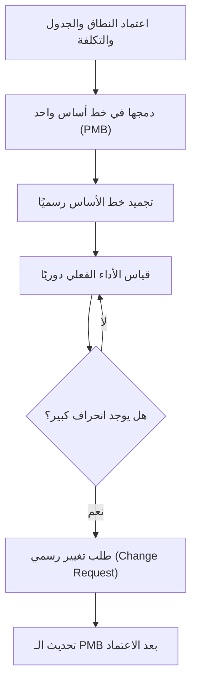

# خط أساس قياس الأداء (Performance Measurement Baseline)
> [!info] تعريف مختصر
> خط أساس قياس الأداء (Performance Measurement Baseline - PMB) هو خطة متكاملة ومعتمدة تجمع بين النطاق والجدول الزمني والتكلفة، وتُستخدم كمرجع ثابت لقياس الأداء الفعلي للمشروع مقارنةً بما كان مخطَّطًا له. يُشتق منه غالبًا "القيمة المكتسبة" (Earned Value) في منهجية EVM.

## الشرح العلمي والاحترافي
- الـ PMB هو دمج ثلاثة خطوط أساس فرعية: خط أساس النطاق ([[Scope Statement]] + هيكل تجزئة العمل WBS)، خط أساس الجدول الزمني (تواريخ البدء والانتهاء المعتمدة)، وخط أساس التكلفة (الميزانية الموزعة عبر الزمن).
- يُستخدم كـ "نقطة صفر" ثابتة لا تتغير إلا عبر إجراء تحكم رسمي في التغييرات ([[Change Request]])؛ أي انحراف عنه بدون هذا الإجراء يُعتبر خللًا في إدارة المشروع.
- في منهجية إدارة القيمة المكتسبة (EVM)، يُقارن الأداء الفعلي (Actual Cost وEarned Value) بخط الأساس هذا لحساب مؤشرات مثل [[CPI and SPI]] ومؤشر الانحراف الزمني والتكلفة.
- الفرق بينه وبين "الخطة" (Plan) العادية أن الـ PMB مُعتمَد رسميًا (Baselined) ومُجمَّد، بينما الخطة قد تكون في طور التحديث المستمر قبل الاعتماد.
- يُستخدم أيضًا خط أساس منفصل يُسمى "خط أساس قياس أداء الجدول الزمني" لمقارنة التقدم الزمني الفعلي مقابل المخطط.

## أين ومتى يُستخدم
- في المشاريع التقليدية (Waterfall) والمشاريع الحكومية والدفاعية والإنشائية التي تتطلب تقارير أداء دقيقة ومحاسبة قيمة مكتسبة (EVM).
- عند توقيع عقود ذات التزامات صارمة بالتكلفة والجدول الزمني، حيث يكون الـ PMB مرجعًا تعاقديًا.
- بعد اعتماد خطة إدارة المشروع رسميًا في بداية مرحلة التنفيذ، وقبل بدء القياس الفعلي للأداء.
- عند إجراء مراجعات دورية (Milestone Reviews) لمقارنة الأداء الفعلي بالمخطط.

## مثال وسيناريو تطبيقي
> [!example] شركة إنشاءات تعمل على مشروع بناء مركز بيانات بميزانية 2,000,000 دولار ومدة 12 شهرًا. بعد اعتماد خطة المشروع، تم تجميد الـ PMB: ميزانية موزعة شهريًا (مثلًا 166,666 دولار/شهر)، وجدول زمني بمعالم واضحة. في الشهر الرابع، أظهرت التقارير أن القيمة المكتسبة (EV) هي 550,000 دولار بينما التكلفة الفعلية (AC) هي 620,000 دولار والتكلفة المخططة (PV) وفق الـ PMB هي 666,664 دولار. هذا يعني أن المشروع متأخر عن الجدول الزمني (SPI < 1) ويتجاوز الميزانية (CPI < 1) مقارنة بخط الأساس، مما استدعى اجتماع تصحيح مسار فوري مع صاحب المشروع.

## خطوات أو مخطّط
1. تحديد النطاق النهائي المعتمد وهيكل تجزئة العمل (WBS).
2. بناء الجدول الزمني المفصّل وربط الأنشطة بالموارد والتكاليف.
3. توزيع الميزانية عبر الزمن (Time-Phased Budget).
4. اعتماد الإدارة العليا وأصحاب المصلحة الرئيسيين للخطة كخط أساس رسمي.
5. تجميد الـ PMB ومنع أي تعديل عليه إلا عبر عملية التحكم بالتغييرات.
6. قياس الأداء الفعلي دوريًا (EV, AC, PV) ومقارنته بالـ PMB.
7. تحديث الـ PMB فقط عند اعتماد تغيير رسمي مؤثر في النطاق أو الجدول أو التكلفة.

## ⚠️ مفاهيم خاطئة شائعة
> [!warning]
> - الاعتقاد أن الـ PMB يتغيّر تلقائيًا مع كل تحديث في الجدول الزمني؛ في الواقع لا يتغيّر إلا بعد موافقة رسمية على تغيير.
> - الخلط بين الـ PMB وميزانية المشروع الإجمالية؛ الـ PMB يشمل النطاق والجدول أيضًا وليس التكلفة فقط.
> - الظن بأنه أداة خاصة بالمشاريع الرشيقة (Agile)؛ هو في الأصل مفهوم من إدارة المشاريع التقليدية وEVM.

## ❌ ممارسات خاطئة في المشاريع
> [!failure]
> - تعديل خط الأساس بشكل غير رسمي كلما تأخر المشروع لإخفاء الانحرافات الحقيقية، مما يفقد التقارير مصداقيتها.
> - عدم تحديث الـ PMB بعد تغيير نطاق كبير معتمد رسميًا، مما يجعل القياسات اللاحقة غير دقيقة.
> - بناء خط أساس غير واقعي منذ البداية (تفاؤل زائد) مما يجعل الانحرافات تظهر بشكل دائم دون أن تعكس مشكلة حقيقية.

## 🔗 مصطلحات ومفاهيم ذات صلة
[[EVM]] | [[CPI and SPI]] | [[Baseline]] | [[Change Request]] | [[Scope Statement]] | [[Gantt Chart]] | [[Original Estimate]]
