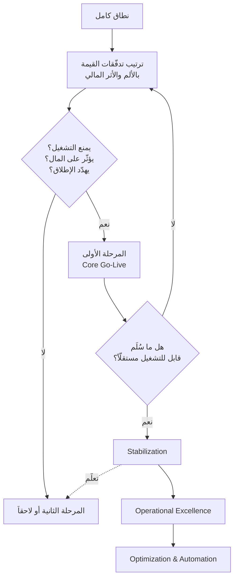

# التقسيم إلى مراحل (Phasing)

> [!info] تعريف مختصر
> **التقسيم إلى مراحل** هو توزيع نطاق المشروع على إطلاقات متتابعة، بحيث **تقدّم كل مرحلة قيمة كاملة تعمل بشكل مستقلّ حتى لو لم تأتِ المرحلة التي بعدها**. وهذا القانون هو الفيصل بين التقسيم الصحيح والتجزئة الوهمية: تقسيمٌ يُنتج مرحلة أولى لا تصلح للتشغيل ليس تقسيماً بل تأجيلاً للمخاطر. والمعيار الحاكم لما يدخل المرحلة الأولى ليس الحجم ولا التكلفة، بل **القدرة التشغيلية** (`Business Operability`).

## الشرح العلمي والاحترافي

- **القانون الأساسي**: كل مرحلة **دورة قيمة كاملة** لا مجموعة وحدات. تقسيمٌ يسلّم «وحدة المبيعات» في المرحلة الأولى و«المخزون» في الثانية يُنتج نظاماً لا يستطيع أحد استخدامه حتى تكتمل المرحلتان. والتقسيم الصحيح يسلّم **دورة `Order to Cash` كاملة مبسّطة** ثم يعمّقها.

- **التقسيم بالدورة لا بالوحدة** — الفرق العملي:
  | تقسيم بالوحدة (خاطئ) | تقسيم بالدورة (صحيح) |
  |---|---|
  | المرحلة 1: المبيعات كاملة | المرحلة 1: من الطلب إلى الفاتورة — مبسّطاً لكن يعمل |
  | المرحلة 2: المخزون كاملاً | المرحلة 2: تعميق الدورة + دقّة المخزون |
  | لا قيمة قبل اكتمال الكلّ | **قيمة قابلة للتشغيل من المرحلة الأولى** |

- **المعيار: `Business Operability` لا حجم الجهد** — والأسئلة الحاسمة:
  1. هل **يمنع التشغيل** بدونه؟
  2. هل **يؤثّر على المال** (بيعاً أو تحصيلاً أو قيداً)؟
  3. هل **يهدّد الإطلاق**؟
  
  «نعم» على أيٍّ منها ⇒ المرحلة الأولى إلزامياً، **مهما كان ثقيلاً**. وهذا يقود إلى الدرس المضادّ للحدس: **ليس كل ما يُسمّى «تحسيناً» يُؤجَّل** — فبعض التحسينات منطق أعمال جوهري ([[Criticality|الحرجية]] تغلب الحجم).

- **المراحل النمطية الأربع** في مشاريع الأنظمة المؤسسية:
  | المرحلة | الهدف |
  |---|---|
  | **1 · `Core Go-Live`** | تشغيل حقيقي مبسّط — [[MVP|أقلّ منتج قابل للتشغيل]] |
  | **2 · `Stabilization`** | تقليل الأخطاء وتثبيت ما سُلِّم |
  | **3 · `Operational Excellence`** | رفع الكفاءة وتقليل الزمن |
  | **4 · `Optimization & Automation`** | الأتمتة ولوحات المعلومات |
  
  ولاحظ أن التقارير ولوحات المعلومات في **آخر** مرحلة لا أولها — لأنك حينها تعرف ما تحتاجه الإدارة فعلاً بعد أن رأت النظام يعمل.

- **الفوائد الخمس**: قيمة مبكّرة · مخاطر أقلّ لكل إطلاق · تعلّم يُغذّي المرحلة التالية · تبنٍّ تدريجي يحتمله المستخدمون · قدرة على التفاوض بالنطاق بدل الزمن أو الجودة.

- **العلاقة بمثلث القيود**: حين يُضغط الجدول، البدائل ثلاثة: زيادة الموارد (تزيد التأخير بمنحنى التعلّم وقنوات التواصل)، أو خفض الجودة (يعود ديناً)، أو **اللعب على النطاق**. والتقسيم إلى مراحل هو الشكل المنضبط للخيار الثالث: **لا تحذف الميزة — أجّلها بموعد معلن.**

- **الفرق عن التسليم التدريجي (`Incremental`) والتكراري (`Iterative`)**: التدريجي يبني الشيء نفسه قطعةً قطعة؛ والتكراري يحسّن نفس القطعة مرّة بعد مرّة؛ و**التقسيم إلى مراحل قرار على مستوى النطاق التعاقدي** يحدّد ما يُسلَّم ومتى ويُعلَن للعميل. وقد تستخدم الثلاثة معاً.

## أين ومتى يُستخدم
- عند **تجاوز التقدير للمدّة المتاحة** — وهو الاستخدام الأشيع.
- في **مشاريع الأنظمة المؤسسية متعدّدة الوحدات**، حيث الإطلاق الكامل دفعة واحدة (`Big Bang`) مرتفع المخاطر.
- عند **ضعف جاهزية العميل**: التقسيم يمنحه وقتاً للتنظيف والتدريب بالتوازي.
- في **التفاوض على [[Change Request|طلبات التغيير]]**: «نعم — في المرحلة الثانية» بدل «لا».
- عند **تعدّد المواقع أو الفروع**: مرحلة لكل موقع مع قرار [[Go or No-Go Decision|جاهزية]] مستقلّ.
- في **بناء [[12 - Scope Baseline|خطّ أساس النطاق]]**: عمود `Phase 2` هو ما يحوّل الرفض إلى تأجيل.

## مثال وسيناريو تطبيقي
> [!example] شركة توزيع — البند الأثقل يدخل أولاً
> ثمانية متطلبات، ومن بينها:
>
> | المتطلَّب | الجهد | [[Criticality\|الحرجية]] | الاعتمادية | القرار |
> |---|---|---|---|---|
> | `Branch Credit Limit` | **25 وحدة (الأثقل)** | شديدة الارتفاع | المالية + الفروع | **المرحلة الأولى** |
> | `Target Discount` | 21 وحدة | متوسطة | التسعير | المرحلة الثانية |
> | `Mobile App` | 18 وحدة | منخفضة | لا شيء | المرحلة الثانية |
>
> **الغريزة الإدارية:** أجّل الأثقل (25 وحدة) واحتفظ بالأخفّ.
> **القرار الصحيح:** الأثقل يدخل أولاً لأنه **يمنع الفروع من البيع والتحصيل** إن تعطّل؛ والأخفّ (`Mobile App`) يُؤجَّل لأن اعتماديته التشغيلية معدومة.
>
> **الأثر لو عُكس القرار:** كان النظام سينطلق «ناجحاً تقنياً» بفروع لا تستطيع البيع — أي `Go-Live` يفشل في يومه الأول.
>
> **وفي الجانب المالي:** بندان من بنود الخسارة (تأخّر الطلبات 90 ألفاً + فروق المخزون 60 ألفاً) = **75% من الخسارة الشهرية** يعالجهما `Phase 1`. وهذه هي حجّة التقسيم الحقيقية أمام الإدارة — لا «تقليل المخاطر» المجرَّد.

## خطوات أو مخطّط
1. ارسم [[Value Stream|تدفّقات القيمة]] كاملةً — لا قائمة وحدات.
2. رتّبها بحسب **الألم والأثر المالي** لا بحسب سهولة التنفيذ.
3. طبّق أسئلة `Business Operability` الثلاثة على كل متطلَّب.
4. كوّن المرحلة الأولى من **دورة كاملة تعمل مستقلّة**.
5. تحقّق من القانون: لو توقّف المشروع هنا، هل ما سُلِّم قابل للتشغيل؟
6. أعلن المؤجَّل صراحةً في [[12 - Scope Baseline|خطّ الأساس]] بموعد لا بوعد مفتوح.
7. اربط كل مرحلة بمؤشّرات تُقاس عند نهايتها.
8. اجعل لكل مرحلة [[Go or No-Go Decision|قرار جاهزية]] مستقلّاً.
9. غذِّ تخطيط المرحلة التالية بما **تعلّمته** من السابقة لا بما افترضته.

## ⚠️ مفاهيم خاطئة شائعة
> [!warning]
> - **الظنّ بأن التقسيم ضعف في التخطيط**: هو فهم عميق لكيفية بناء القيمة وقدرة المؤسسة على استيعاب التغيير.
> - **التقسيم بالوحدات لا بالدورات**: يُنتج مرحلة أولى لا يستطيع أحد استخدامها.
> - **افتراض أن المرحلة الأولى هي «الأسهل»**: هي **الأكثر حرجية**، وقد تكون الأثقل جهداً.
> - **الخلط بينه وبين `MVP`**: الـ`MVP` مفهوم منتَجي لاختبار فرضية؛ والتقسيم قرار تسليم على نطاق متّفق عليه تعاقدياً.
> - **اعتبار التأجيل رفضاً**: «المرحلة الثانية» بموعد معلن مقبول من العملاء؛ و«لاحقاً» بلا موعد هو الذي يُغضبهم.
> - **تجميد خطة المراحل بعد وضعها**: كل مرحلة تُنتج معرفة يجب أن تعدّل ما بعدها.

## ❌ ممارسات خاطئة في المشاريع
> [!failure]
> - **جعل المرحلة الأولى «كل شيء ناقص التقارير»**: تبقى ضخمة وتفقد فائدة التقسيم. الحلّ: طبّق أسئلة `Business Operability` بصرامة.
> - **تأجيل ما يمنع التشغيل لأنه ثقيل**: يُنتج إطلاقاً فاشلاً في يومه الأول. الحلّ: الحرجية تغلب الحجم.
> - **إعلان المرحلة الثانية بلا موعد ولا نطاق**: يفقد العميل الثقة ويعيد الطلب كطلب تغيير. الحلّ: نطاق وموعد مكتوبان في خطّ الأساس.
> - **عدم تخصيص [[23 - Hypercare & SLA|رعاية مكثّفة]] لكل مرحلة**: يُنتج تراكم مشاكل غير مستقرّة على المرحلة التالية. الحلّ: استقرار قبل الانتقال.
> - **تخطيط كل المراحل بالتفصيل مسبقاً**: يهدر الجهد ويتجاهل ما ستتعلّمه. الحلّ: فصّل المرحلة التالية فقط واترك ما بعدها بخطوط عريضة.
> - **إهمال قياس قيمة كل مرحلة**: يجعل التقسيم إجراءً إدارياً بلا إثبات. الحلّ: مؤشّرات تُقاس عند نهاية كل مرحلة.

## 🔗 مصطلحات ومفاهيم ذات صلة
[[MVP]] | [[Criticality]] | [[Value Stream]] | [[Scope Creep]] | [[Iron Triangle]] | [[Go or No-Go Decision]] | [[PFRE]] | [[Estimation]] | [[Quick Wins vs Big Bangs]] | [[12 - Scope Baseline]] | [[10 - PFRE Decision Model]]
