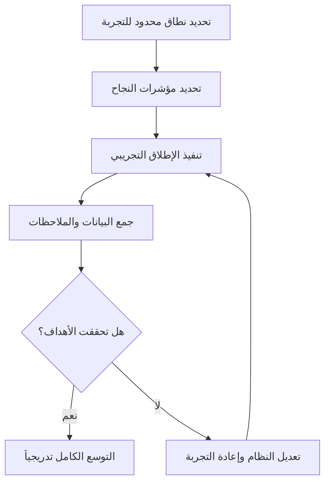

# الإطلاق التجريبي (Pilot Launch)

> [!info] تعريف مختصر
> الإطلاق التجريبي (Pilot Launch) هو إطلاق محدود النطاق لمنتج أو خدمة أو نظام جديد على مجموعة صغيرة ومختارة من المستخدمين أو الفروع، بهدف اختبار الحل في بيئة حقيقية قبل التوسع الكامل، وتقليل المخاطر عبر تعلّم مبكر من نتائج فعلية.

## الشرح العلمي والاحترافي
- يقع الإطلاق التجريبي بين مرحلتي التطوير الداخلي والإطلاق الكامل (Full Rollout)؛ فبدلاً من نشر النظام لكل المستخدمين أو الفروع دفعة واحدة، يُطبَّق أولاً على شريحة محدودة يمكن مراقبتها ومتابعتها عن قرب.
- الهدف الأساسي هو تقليل المخاطر: أي مشكلة تقنية أو تشغيلية تظهر خلال الإطلاق التجريبي يمكن حلّها قبل أن تؤثر على كامل قاعدة المستخدمين أو المؤسسة، مما يحمي السمعة والموارد.
- يختلف الإطلاق التجريبي عن [[MVP]] في أن الـ MVP يختبر عادة "هل تريد السوق هذا المنتج أصلاً؟" بينما الإطلاق التجريبي يفترض أن الحاجة مؤكدة، ويختبر بالأساس "هل يعمل هذا الحل بشكل جيد في بيئة الإنتاج الحقيقية قبل التوسع؟"، وغالباً يكون المنتج فيه أكثر اكتمالاً من الـ MVP.
- يُستخدم غالباً في مشاريع تطبق أنظمة على نطاق واسع (كأنظمة تخطيط الموارد ERP، أو تطبيقات موظفين، أو خدمات حكومية)، حيث يكون الإطلاق الكامل مكلفاً وصعب التراجع عنه.
- ينتج عن الإطلاق التجريبي بيانات وتغذية راجعة حقيقية تُستخدم لتعديل النظام، تدريب الفرق، وتحسين خطة النشر الكاملة قبل تعميمها.

## أين ومتى يُستخدم
- يُستخدم عند إطلاق أنظمة أو خدمات جديدة ذات تأثير واسع، خصوصاً في مشاريع [[04 - Waterfall]] الكبيرة أو المشاريع التي تتضمن تغييراً تنظيمياً كبيراً ([[ADKAR Model]]).
- يُلجأ إليه بعد اجتياز اختبارات القبول ([[UAT]]) وقبل [[Go or No-Go Decision]] الخاص بالإطلاق الكامل، كخطوة وسيطة تقلل مخاطر النشر الشامل.
- شائع في القطاعات التي يصعب فيها التراجع بسهولة بعد الإطلاق، مثل الأنظمة البنكية، الحكومية، أو الصحية، حيث يُختار فرع واحد أو مدينة واحدة لتجربة النظام أولاً.

## مثال وسيناريو تطبيقي
> [!example] سيناريو ملموس في مشروع برمجي حقيقي
> شركة توصيل بضائع لديها 40 فرعاً في المملكة، وتطوّر نظاماً جديداً لإدارة المخزون بديلاً عن النظام القديم. بدلاً من تطبيق النظام في جميع الفروع دفعة واحدة، يُختار فرعان فقط في الرياض للإطلاق التجريبي لمدة ستة أسابيع.
> خلال هذه الفترة، يكتشف الفريق أن عملية "تسوية الجرد" تستغرق ضعف الوقت المتوقع بسبب خطوة يدوية لم تُلاحظ أثناء التطوير، ويتم تعديل النظام لأتمتة هذه الخطوة.
> بعد التأكد من استقرار النظام في الفرعين التجريبيين وتحقيق مؤشرات الأداء المستهدفة، تتخذ الإدارة قرار [[Go or No-Go Decision]] بالإطلاق التدريجي على باقي الـ 38 فرعاً على دفعات، بدلاً من إطلاق واحد قد يعطّل العمل في كل الفروع في حال وجود خلل.

## خطوات أو مخطّط
1. تحديد نطاق الإطلاق التجريبي: عدد محدود من المستخدمين أو الفروع أو المناطق الجغرافية.
2. تحديد مؤشرات نجاح واضحة ([[KPI]]) يُقاس عليها الحكم على نجاح التجربة.
3. تنفيذ الإطلاق ومراقبة الأداء عن قرب مع دعم فني مكثف خلال الفترة التجريبية.
4. جمع الملاحظات وتحليل المشاكل التي ظهرت فعلياً في بيئة التشغيل الحقيقية.
5. اتخاذ قرار: التوسع الكامل، تعديل النظام وإعادة التجربة، أو التوقف عن المشروع.

## ⚠️ مفاهيم خاطئة شائعة
> [!warning]
> - الخلط بين الإطلاق التجريبي والـ [[MVP]]؛ فالـ MVP يختبر جدوى فكرة منتج جديدة، بينما الإطلاق التجريبي يختبر تطبيق حل شبه مكتمل على نطاق محدود قبل التعميم.
> - الاعتقاد أن الإطلاق التجريبي مجرد "اختبار تقني"؛ في الحقيقة هو أيضاً اختبار تشغيلي وتنظيمي، يكشف مشاكل في العمليات وتدريب الموظفين وليس فقط في الكود.
> - الظن أن نجاح التجربة في فرع أو مجموعة واحدة يضمن نجاحها في كل السياقات؛ يجب التأكد من أن العيّنة التجريبية ممثّلة فعلاً لتنوع الفروع أو المستخدمين الآخرين.

## ❌ ممارسات خاطئة في المشاريع
> [!failure]
> - اختيار فرع أو مجموعة مستخدمين "مثالية" وغير ممثّلة للواقع (كأفضل فرع أداءً)، مما يعطي نتائج وردية لا تتكرر عند التوسع. التجنب: اختيار عيّنة متوسطة أو متنوعة تمثّل الحالات الحقيقية المختلفة.
> - عدم تحديد مؤشرات نجاح واضحة قبل بدء التجربة، فيصعب الحكم موضوعياً على نتائجها لاحقاً. التجنب: تحديد [[KPI]] ومعايير قبول محددة رقمياً قبل الإطلاق.
> - التوسع الكامل بسرعة دون معالجة كل المشاكل التي ظهرت في التجربة، بدافع ضغط الوقت أو الإدارة. التجنب: الالتزام بحلقة تعديل كاملة، ومعالجة المشاكل الجوهرية قبل اتخاذ قرار التوسع.

## 🔗 مصطلحات ومفاهيم ذات صلة
[[MVP]] | [[Go or No-Go Decision]] | [[UAT]] | [[KPI]] | [[ADKAR Model]] | [[Risk Register]] | [[Customer and Market Validation]] | [[Quick Wins vs Big Bangs]]
