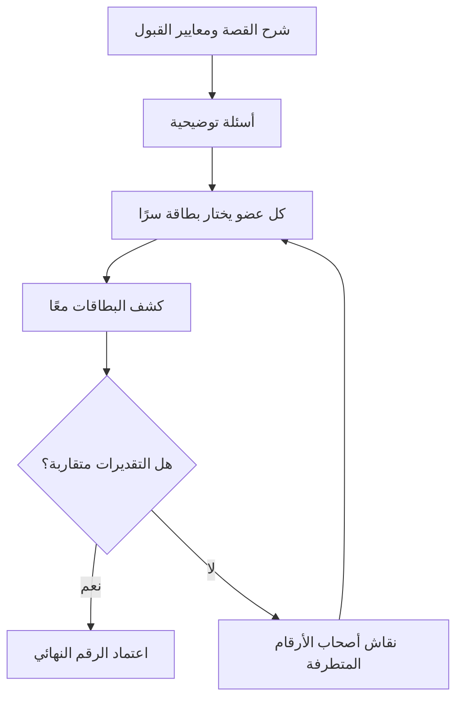

# بوكر التخطيط (Planning Poker)
> [!info] تعريف مختصر
> بوكر التخطيط (Planning Poker) هي تقنية تقدير جماعي تفاعلية يستخدمها فريق تطوير رشيق (Agile) لتقدير حجم قصص المستخدم (User Stories) باستخدام أرقام متتالية فيبوناتشي، بحيث يكشف كل عضو تقديره في نفس اللحظة لتفادي التأثر بآراء الآخرين.

## الشرح العلمي والاحترافي
- كل عضو في الفريق يملك مجموعة بطاقات تحمل أرقامًا من متتالية فيبوناتشي المعدّلة (Fibonacci Estimation Scale): 0, 1, 2, 3, 5, 8, 13, 20, 40, 100، بالإضافة إلى بطاقتَي "؟" (غير معروف) و"☕" (استراحة/توقف).
- الفجوات المتزايدة بين الأرقام (خصوصًا بعد الرقم 8) تعكس حقيقة أن التقدير الدقيق يصبح أصعب كلما كبر حجم المهمة، فتُجبر الفريق على تقسيم القصص الكبيرة (انظر [[Task and Story Slicing]]).
- الهدف الأساسي ليس الوصول إلى رقم "صحيح" مطلق، بل الوصول إلى تقدير نسبي متفق عليه (انظر [[Relative Estimation]]) يعكس التعقيد والمجهود والمخاطرة، وليس الزمن الفعلي بالساعات.
- الكشف المتزامن للبطاقات يمنع "تأثير المرساة" (Anchoring Bias)، حيث يتجنب الأعضاء الأقل خبرة تقليد رقم أول شخص يتحدث.
- عند اختلاف التقديرات بشكل كبير (مثلًا شخص يختار 3 وآخر يختار 13)، يناقش صاحبا الرقمين المتطرفين سبب اختلافهما، وغالبًا يكشف ذلك عن معلومات ناقصة أو افتراضات مختلفة حول القصة.

## أين ومتى يُستخدم
- يُستخدم غالبًا في اجتماعات تنقيح قائمة المهام (Backlog Refinement) وفي بداية تخطيط السبرنت (Sprint Planning) ضمن منهجية Scrum.
- مناسب عند تقدير قصص مستخدم جديدة قبل إدخالها في السبرنت، أو عند إعادة تقييم قصص قديمة تغيّر فهمها.
- يُستخدم أيضًا في فرق Scrum-ban أو أي فريق رشيق يعتمد نقاط القصة (Story Points) كوحدة تقدير.
- لا يُنصح باستخدامه لتقدير مهام تشغيلية دقيقة زمنيًا (مثل حوادث الدعم الفني)، حيث تصلح تقنيات أخرى.

## مثال وسيناريو تطبيقي
> [!example] فريق من 6 مطورين يراجع قصة مستخدم بعنوان "كمستخدم، أريد تسجيل الدخول عبر حساب جوجل". يشرح مالك المنتج (Product Owner) القصة، ثم يختار كل عضو بطاقة بشكل سري ذهنيًا. عند العد التنازلي "1، 2، 3"، يكشف الجميع بطاقاتهم: أربعة أعضاء يختارون 5، وعضوان يختاران 13. يسأل الميسّر (Facilitator) صاحبَي الرقم 13 عن سبب التقدير الأعلى، فيوضحان أن التكامل مع Google OAuth يتطلب أيضًا تعديل قاعدة البيانات لدعم تسجيل دخول متعدد المزودين، وهو ما لم يلاحظه الآخرون. بعد النقاش، يعيد الفريق التصويت ويتفق الجميع على 8 نقاط.

## خطوات أو مخطّط
1. يشرح مالك المنتج أو صاحب القصة تفاصيل القصة ومعايير القبول.
2. يطرح الأعضاء أسئلة توضيحية قبل التقدير.
3. يختار كل عضو بطاقة تعكس تقديره الشخصي دون إظهارها.
4. يكشف الجميع بطاقاتهم في نفس اللحظة.
5. إذا تطابقت أو تقاربت التقديرات، يُعتمد الرقم (غالبًا الأعلى تكرارًا أو المتوسط).
6. إذا تباعدت التقديرات، يناقش أصحاب الأرقام المتطرفة أسبابهم، ثم يُعاد التصويت.
7. يُكرَّر حتى الوصول إلى توافق، وتُسجَّل نقاط القصة النهائية.

## ⚠️ مفاهيم خاطئة شائعة
> [!warning]
> - الاعتقاد بأن أرقام فيبوناتشي تمثل ساعات عمل فعلية، بينما هي تعبّر عن الحجم النسبي والتعقيد فقط.
> - الظن بأن الهدف هو الوصول لإجماع تام سريع، بينما الهدف الحقيقي هو كشف الاختلافات في الفهم ومناقشتها.
> - الاعتقاد بأن رقم التقدير ثابت للأبد؛ في الواقع قد يُعاد تقييمه إذا تغيّرت المتطلبات.

## ❌ ممارسات خاطئة في المشاريع
> [!failure]
> - السماح للأعضاء الأكثر خبرة أو الأعلى منصبًا بالتصويت أولًا بصوت مسموع، مما يخلق تأثير مرساة على البقية.
> - تحويل الجلسة إلى نقاش طويل حول كل قصة دون تحديد وقت (Timeboxing)، مما يهدر وقت الفريق.
> - تقدير قصص كبيرة جدًا وغامضة دون تقسيمها أولًا (انظر [[Task and Story Slicing]])، مما ينتج تقديرات غير موثوقة.

## 🔗 مصطلحات ومفاهيم ذات صلة
[[Relative Estimation]] | [[Estimation Variance]] | [[Task and Story Slicing]] | [[Backlog Refinement]] | [[INVEST Criteria]] | [[Facilitator]] | [[12 - Story Points]] | [[08 - Sprint Planning]] | [[11 - User Stories]]
