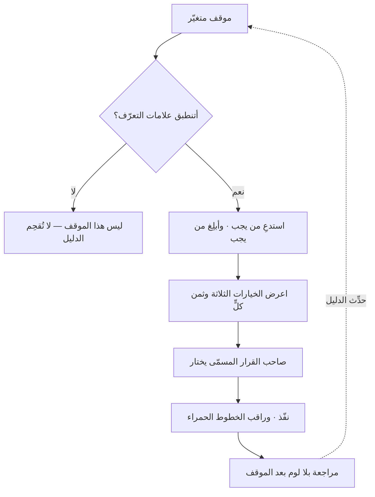

# دليل المواقف (Playbook)

> [!info] تعريف مختصر
> **دليل المواقف** مجموعةُ استجابات مُعدّة لمواقف **متغيّرة تحتاج حكمًا**: تسرّب بيانات، أو مورّد يتعثّر، أو عميل كبير يهدّد بالانسحاب، أو منافس يُطلق فجأة. يعطي لكل موقف: **علامات معرفته** · **من يُستدعى** · **الخيارات المتاحة وثمن كلٍّ** · **من يملك القرار** · **ما لا يُفعل**.
> **وهو لا يُلغي الحكم بل يُسرّعه.** فليس فيه خطوة واحدة صحيحة كما في [[Runbook|دليل التشغيل]]، وإنّما **خياراتٌ درست في وقت الهدوء** — فحين يقع الموقف لا يُنفَق الوقت في اكتشاف البدائل، بل في اختيار أحدها.

## الشرح العلمي والاحترافي

**وعلّته أن جودة القرار تنهار تحت الضغط**، لا لنقص كفاءة بل لطبيعة الموقف: الوقت ضيّق، والمعلومة ناقصة، والأصوات كثيرة، ومن يقرّر غالبًا هو من يتصرّف في اللحظة نفسها. **فما يفعله الدليل أنه ينقل التفكير من وقت الأزمة إلى وقت الهدوء** — ويترك للأزمة الاختيار وحده.

**والموقف الواحد فيه خمسة عناصر:**

1. **علامات التعرّف:** بأيّ شيء نعرف أننا في هذا الموقف؟ **وهذا أوّل ما يُغفَل**، فالدليل الذي لا يُعرف متى يُفتح لا يُفتح.
2. **من يُستدعى وفي أيّ دقيقة**، ومن يُبلَّغ ولا يُستدعى — وهما مختلفان.
3. **الخيارات وثمن كلٍّ:** لا خيار واحد. والقيمة في **الثمن** لا في القائمة: أن يكون معروفًا سلفًا أن هذا الخيار يكلّف يومًا، وذاك يحرق علاقة.
4. **من يملك القرار**، صراحةً وباسم الدور. **وأكثر ما يُهدَر في الأزمات وقتُ البحث عن صاحب القرار.**
5. **ما لا يُفعل:** الخطوط الحمراء — ما لا يُقال للإعلام قبل التحقّق، وما لا يُحذف، وما لا يُوعَد به.

**وحدُّه أنه يُسرّع القرار ولا يصنعه.** فالدليل الذي يقول «إن وقع كذا فافعل كذا» في موقفٍ متغيّر **ادّعاءٌ بأنه دليل تشغيل**، وسيُطبَّق على حالة لا تشبه ما تُخيّل. **فالصياغة الصحيحة: «إن وقع كذا فهذه خياراتك الثلاثة، وهذا ثمن كلٍّ، والقرار لفلان.»**

### جدول التمييز: كتيّب العمليات · دليل التشغيل · دليل المواقف

الثلاثة يُخلط بينها كثيرًا، والفارق بينها **مقدار الحكم المطلوب من المنفّذ**:

| ما يفعله المنفّذ | **[[SOP\|كتيّب العمليات]]** | **[[Runbook\|دليل التشغيل]]** | **دليل المواقف** |
|---|---|---|---|
| يواجه | عملًا معتادًا متكرّرًا | حدثًا معروفًا محدّدًا | موقفًا متغيّرًا |
| يتّبع | إجراءً معياريًّا موحّدًا | خطوات حاسمة بترتيبها | خيارات يفاضل بينها |
| يقرّر | لا — ينفّذ الإجراء | لا — ينفّذ الخطوة | **نعم — يختار** |
| يستعمله | في العمل اليومي | عند التنبيه أو الموعد | عند الأزمة أو المنعطف |
| يُقاس نجاحه بـ | ثبات الجودة | زمن الاستعادة | جودة القرار وسرعته |
| ومصيره | يُوثَّق ويُدرَّب عليه | **يُؤتمت متى استقرّ** | **يُدرَّب عليه ولا يُؤتمت** |

> **السؤال الفارق:** كتيّب العمليات يسأل: **كيف نؤدّي هذا بالجودة نفسها في كل مرّة؟** ودليل التشغيل يسأل: **ماذا أفعل الآن بالضبط؟** ودليل المواقف يسأل: **ما خياراتي، وبأيّ ثمن، ومن يقرّر؟** — **فالأوّلان يُلغيان الاجتهاد، والثالث يُنظّمه.**
>
> **وأثر ذلك عمليّ:** ما استقرّ من دليل التشغيل يُؤتمت حتى يزول، **وما في دليل المواقف لا يُؤتمت أبدًا** — إنّما يُدرَّب عليه، لأن الحكم نفسه هو المطلوب.

## أين ومتى يُستخدم

- **في الأزمات ذات الأثر الخارجي**: تسرّب بيانات ([[PDPL]])، أو انقطاع طويل، أو خطأ يمسّ عميلًا كبيرًا.
- **في المنعطفات التجارية**: منافس يُطلق، أو مورّد رئيس يتعثّر، أو عقد كبير يُهدَّد.
- **في المواقف المتكرّرة التي تُدار كل مرّة من الصفر**: تصعيدٌ من عميل، أو طلب تغيير كبير متأخّر.
- **في تهيئة القيادة الجديدة**، فهو ينقل إليها خبرة المؤسّسة في مواقف لم تعشها بعد.
- **في التمارين الجماعية** ([[Pre-mortem|تشريح ما قبل الوفاة]] وتمارين المحاكاة)، فهي التي تُثبت أنه صالح.

> [!warning] متى لا يُستخدَم؟
> - **في إجراء حاسم لا اجتهاد فيه** — موضعه [[Runbook|دليل التشغيل]].
> - **بديلًا عن صلاحية.** الدليل الذي يقول «يقرّر مدير المنتج» في مؤسّسة لا يقرّر فيها مدير المنتج شيئًا **وثيقةٌ عن مؤسّسة أخرى**.
> - **في موقف لم يقع ولا يُشبهه شيء.** فالكتابة عن كل مُتخيَّل تُنتج مجلّدًا لا يُقرأ؛ والقاعدة: **ما وقع مرّة أو ما ثمنه فادح**.
> - **وثيقةً تُكتب ولا يُتدرَّب عليها.** فبخلاف دليل التشغيل الذي يُختبر بالتنفيذ، هذا لا يُختبر إلا بمحاكاة.

## مثال وسيناريو تطبيقي

> [!example] «منصّة عافية» — تسرّب محتمل، وسبع ساعات ضاعت في السؤال عن صاحب القرار
> **الموقف:** بلاغٌ من باحث أمنيّ بثغرة قد تكون كشفت بيانات مرضى.
> **ما وقع في المرّة الأولى:** سبع ساعات قبل أوّل قرار. لا لأن أحدًا لم يعرف ماذا يفعل تقنيًّا — **بل لأن ثلاثة أسئلة لم يكن لها جواب معدّ**: أنُغلق الخدمة أم نُبقيها؟ ومن يقرّر — التقنية أم القانونية أم الرئيس التنفيذي؟ ومتى يبدأ عدّ المهلة النظامية للإبلاغ؟
> **ما كُتب بعدها في دليل المواقف** — في صفحتين:
> - **علامات التعرّف:** بلاغ خارجيّ · نمط وصول شاذّ · تنبيه تسرّب بيانات اعتماد.
> - **الاستدعاء:** مسؤول الأمن (فورًا) · المستشار القانوني (خلال 30 دقيقة) · الرئيس التنفيذي (يُبلَّغ لا يُستدعى، إلا إن ثبت التسرّب).
> - **الخيارات الثلاثة وثمنها:** إغلاق الخدمة (انقطاع كامل · يوقف النزيف يقينًا) · تقييد الوصول للفئة المتأثّرة (انقطاع جزئي · لا يقين) · المراقبة والإصلاح الساخن (لا انقطاع · أعلى مخاطرة).
> - **صاحب القرار:** مسؤول الأمن، وله أن يُغلق دون إذن. **وهذا البند وحده هو الذي وفّر السبع ساعات.**
> - **ما لا يُفعل:** لا يُحذف سجلّ، ولا يُخاطَب المبلِّغ بالتهديد، ولا يُصرَّح للإعلام قبل التحقّق.
> **وفي الحادث التالي:** أوّل قرار بعد **خمس وأربعين دقيقة**.
> **والدرس:** لم يتغيّر ما يعرفه الفريق تقنيًّا. تغيّر **أن الخيارات وأثمانها وصاحب القرار صارت معلومة قبل الحاجة إليها** — والوقت الذي كان يُنفق في اكتشافها انتقل إلى الاختيار.

## خطوات أو مخطّط

1. **اختر المواقف التي وقعت فعلًا أو التي ثمنها فادح** — ولا تكتب عن كل مُتخيَّل.
2. **اكتب علامات التعرّف أوّلًا**، فبها يُعرف متى يُفتح الدليل.
3. **حدّد من يُستدعى ومن يُبلَّغ**، ومتى كلٌّ منهما.
4. **اذكر ثلاثة خيارات لا واحدًا**، ومع كلٍّ **ثمنه** لا مزاياه.
5. **سمِّ صاحب القرار بالدور**، وتحقّق أن الصلاحية موجودة فعلًا لا في الوثيقة وحدها.
6. **اكتب ما لا يُفعل** — الخطوط الحمراء.
7. **تدرَّب عليه محاكاةً كل نصف سنة**، وحدِّثه بما كشفته المحاكاة وبما كشفته الحوادث الحقيقية.

## ⚠️ مفاهيم خاطئة شائعة

> [!warning]
> - **الخلط بينه وبين دليل التشغيل.** انظر جدول التمييز أعلاه؛ والفارق أن هذا **يفترض الحكم** وذاك **يلغيه**.
> - **الظنّ بأنه يجعل القرار آليًّا.** بل يجعله **أسرع وأوعى**؛ ومن أراد قرارًا آليًّا في موقف متغيّر أراد ما لا يكون.
> - **حسبانه وثيقةً للأزمات الكبرى وحدها.** أنفعه في المواقف المتكرّرة المتوسّطة التي تُدار كل مرّة من الصفر.
> - **الظنّ بأنه يُغني عن التمرين.** بخلاف دليل التشغيل، لا يُختبر هذا إلا بالمحاكاة؛ والذي لم يُتدرَّب عليه يُقرأ لأوّل مرّة وقت الأزمة.
> - **كتابته بأسماء أشخاص لا بأدوار** — فيبلى بأوّل تغيير في الفريق.

## ❌ ممارسات خاطئة في المشاريع

> [!failure]
> - **خيار واحد بلا بدائل** — فيصير دليل تشغيل مموّهًا يُطبَّق على حالة لا تشبهه. **الحلّ:** ثلاثة خيارات وثمن كلٍّ.
> - **إغفال صاحب القرار** — وهو أكثر ما يُهدر الوقت في الأزمات. **الحلّ:** دورٌ مسمّى، وصلاحية متحقّقة.
> - **إغفال علامات التعرّف** — فلا يُعرف متى يُفتح، فلا يُفتح. **الحلّ:** علامات مرصودة مربوطة بتنبيهات حيث أمكن.
> - **كتابته بلا محاكاة** — فتُكتشف ثغراته في أسوأ لحظة. **الحلّ:** تمرين نصف سنويّ، ولو على الورق.
> - **حشوه بكل موقف متخيَّل** — فيصير مجلّدًا لا يُقرأ. **الحلّ:** ما وقع، أو ما ثمنه فادح.
> - **عدم تحديثه بعد الحوادث** — فتُهدر أثمن مادّة يملكها. **الحلّ:** تحديثه بندٌ في [[Blameless Postmortem|المراجعة بلا لوم]].

## 🔗 مصطلحات ومفاهيم ذات صلة

[[Runbook]] | [[SOP]] | [[Operational Resilience]] | [[Blameless Postmortem]] | [[Pre-mortem]] | [[Escalation Path]] | [[Decision Log]] | [[RAID Log]] | [[Risk Register]] | [[PDPL]] | [[Data Residency]] | [[Cynefin]]
