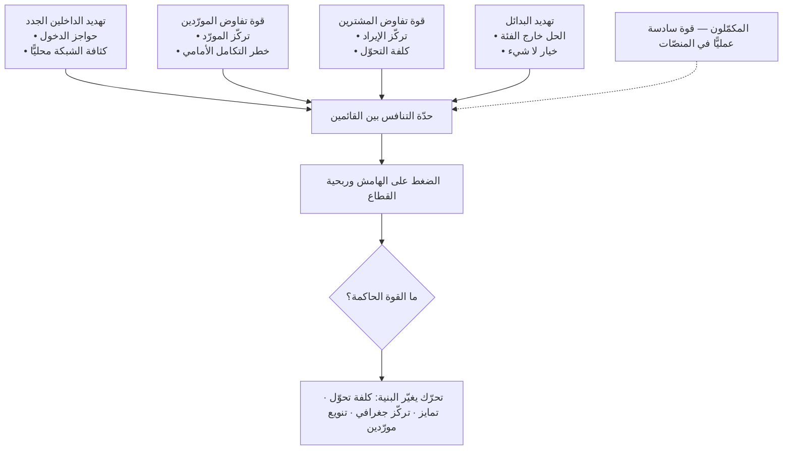

# قوى بورتر الخمس (Porter's Five Forces)

> [!info] تعريف مختصر
> إطار تحليلي يفسّر **لماذا تختلف ربحية الصناعات اختلافًا مزمنًا**، لا بجودة إدارة الشركات فيها بل ببنية الصناعة نفسها. يردّ الإطار الضغط على هوامش الربح إلى خمس قوى: **تهديد الداخلين الجدد**، و**قوة تفاوض المورّدين**، و**قوة تفاوض المشترين**، و**تهديد البدائل**، و**حدّة التنافس بين القائمين**. كلما اشتدّت القوى، انتُزع فائض القيمة من الشركات وذهب إلى المورّدين أو المشترين أو تبدّد في حرب أسعار. والاستعمال الرشيد للإطار ليس تصنيف كل قوة بـ«مرتفعة/منخفضة»، بل **تحديد أي قوة هي القيد الحاكم على ربحيتك، وأي تحرّك يغيّر بنيتها لصالحك**.

## الشرح العلمي والاحترافي
- **الأصل**: صاغه **مايكل بورتر (Michael E. Porter)** من كلية هارفارد للأعمال، ونشره في مقالة *Harvard Business Review* عام **١٩٧٩** بعنوان «كيف تشكّل القوى التنافسية الاستراتيجية» (How Competitive Forces Shape Strategy)، ثم بسطه في كتابه *Competitive Strategy* عام ١٩٨٠. وقد نشر بورتر مراجعة موسّعة للإطار في *HBR* عام ٢٠٠٨ ردًّا على النقد وتوضيحًا لسوء الاستعمال. جذوره الفكرية في اقتصاد التنظيم الصناعي، لكن بورتر قلب زاوية النظر: من زاوية المنظِّم الحكومي الذي يريد كبح الاحتكار، إلى زاوية الشركة التي تبحث عن موقع محمي.
- **الأطروحة المركزية**: المنافسة أوسع من «المنافسين». الشركة تتنازع على فائض القيمة مع خمسة أطراف لا مع طرف واحد؛ وقد تُسحق شركة ممتازة الإدارة لأن مورّدًا واحدًا يحتكر مدخلًا حرجًا، أو لأن مشتريًا واحدًا يمثّل نصف إيرادها.
- **القوى الخمس بتفصيل تشغيلي**:
  1. **تهديد الداخلين الجدد**: تحدّده **حواجز الدخول** — وفورات الحجم، وتكلفة التحوّل عند العميل، والوصول إلى قنوات التوزيع، والمتطلّبات التنظيمية والتراخيص، ورأس المال المطلوب، والمزايا المستقلّة عن الحجم (براءة، أو بيانات متراكمة، أو موقع). المهم أن **التهديد** لا الدخول الفعلي هو ما يكبح الأسعار: حاجز منخفض يُبقي الهوامش مضغوطة حتى لو لم يدخل أحد بعد.
  2. **قوة تفاوض المورّدين**: ترتفع حين يكون المورّدون قلّة، أو حين يكون مدخلهم متمايزًا يصعب استبداله، أو حين تكون كلفة التحوّل عالية ([[Vendor Lock-in]])، أو حين يستطيع المورّد التكامل الأمامي ودخول سوقك. في المنتجات الرقمية يشمل المورّدون مزوّدي السحابة، وبوّابات الدفع، وموفّري النماذج والواجهات البرمجية، وحتى سوق المواهب الهندسية.
  3. **قوة تفاوض المشترين**: ترتفع حين يكون المشترون مركَّزين، أو حين يكون المنتج نمطيًّا غير متمايز، أو حين تكون كلفة تحوّلهم منخفضة، أو حين يملكون معلومات كاملة عن الأسعار. تركّز الإيراد في عدد قليل من العملاء أوضح مقياس تشغيلي لهذه القوة.
  4. **تهديد البدائل**: أخطر القوى وأكثرها إغفالًا، لأن البديل يأتي **من خارج الفئة**. البديل ليس منافسًا يقدّم الخدمة نفسها بل شيئًا يؤدّي المهمّة نفسها بطريقة أخرى ([[Jobs to be Done]]) — بما في ذلك «ألّا يفعل العميل شيئًا» أو «أن يحلّها بجدول بيانات».
  5. **حدّة التنافس بين القائمين**: تشتدّ مع تقارب أحجام المتنافسين، وبطء نمو السوق، وارتفاع التكاليف الثابتة، وضعف التمايز، وارتفاع حواجز الخروج. **والحاسم هو أساس التنافس**: التنافس على السعر وحده يدمّر ربحية الصناعة كلها، والتنافس على أبعاد متمايزة قد يوسّع القيمة للجميع.
- **تطبيقه على منصّة رقمية متعدّدة الأطراف لا على مصنع**: صيغ الإطار في عالم المصانع، وتطبيقه على منصّة (سوق يجمع بائعًا ومشتريًا مثلًا) يتطلّب إعادة قراءة لكل قوة:
  — **يوجد للمنصّة أكثر من «مشترٍ» واحد**: كل جانب من جوانب المنصّة له قوة تفاوض مستقلّة، وقد تكون معاكسة الاتجاه. منصّة توصيل مثلًا تواجه مطاعم مركَّزة قوية من جهة، ومستهلكين مشتّتين ضعافًا من جهة، وسائقين قابلين للتنظيم الجماعي من ثالثة.
  — **حاجز الدخول ليس رأس المال بل السيولة والشبكة**: يستطيع منافس نسخ البرمجيات في أشهر، لكن لا يستطيع نسخ **الطرفين معًا**. الحاجز الفعلي هو أثر الشبكة وكثافة العرض والطلب في نطاق جغرافي محدّد.
  — **التعدّد على الجانب الواحد (Multi-homing) يبطل الحاجز**: حين يكون السائق مسجّلًا في ثلاث منصّات والمستهلك مثبِّتًا لثلاثة تطبيقات، ينهار أثر الشبكة كحاجز وتتحوّل المنافسة إلى حرب حوافز وخصومات. لذلك يصير قياس نسبة التعدّد على كل جانب مؤشّرًا استراتيجيًّا أهم من الحصة السوقية.
  — **المورّد قد يصبح منافسًا بضغطة زر**: من يزوّدك بواجهة برمجية أو نموذج ذكاء اصطناعي يستطيع إطلاق المنتج الذي بنيته فوقه. وهذا يجعل قوة المورّد في المنتجات الرقمية أعلى بكثير مما توحي به علاقة تعاقدية ظاهرها متكافئ.
  — **قوة سادسة عمليًّا: المكمّلات**: المنصّات تعيش على المكمّلين (المطوّرين، والتجّار، وصانعي المحتوى). وقد أضاف **آدم برانديربرجر (Adam Brandenburger)** و**باري نيلبوف (Barry Nalebuff)** في كتابهما *Co-opetition* عام ١٩٩٦ «المكمّلين» بوصفهم قوة سادسة غائبة عن نموذج بورتر الأصلي، والمكمّل هو من يزيد استعداد العميل للدفع لك حين ينمو هو — وليس علاقة بورتر بينكما لا تنافسية ولا توريدية.
- **نقده في أسواق الشبكات — نقد جادّ ومنشور**:
  1. **الطابع الساكن**: الإطار لقطة لحظية لبنية صناعة، وقد افترض ضمنًا بنية مستقرّة نسبيًّا. في الأسواق الرقمية تتغيّر البنية في دورات أقصر من دورة التخطيط نفسها، فيصبح التحليل صالحًا لماضٍ قريب. وأدوات مثل [[Wardley Mapping]] وُضعت تحديدًا لمعالجة هذا القصور بإظهار **الحركة** لا الحالة.
  2. **افتراض حدود واضحة للصناعة**: يتطلّب الإطار تعريف «الصناعة» قبل التحليل، وهو ما صار متعذّرًا حين تعمل الشركة الواحدة في تجارة وسحابة وإعلان ومحتوى في آن. تعريف الصناعة يحدّد النتيجة سلفًا، فيتحوّل التحليل إلى مصادرة على المطلوب.
  3. **إغفال التعاون والمنظومات**: الإطار مبني على منطق تنازعي صرف، بينما أغلب القيمة في الاقتصاد الرقمي تُخلق في منظومات تعاونية بين شركات تتنافس وتتكامل في آن.
  4. **إهمال أثر الشبكة والعوائد المتزايدة**: يفترض الاقتصاد التقليدي عوائد متناقصة على الحجم؛ وأسواق الشبكات تعمل بعوائد متزايدة تنتج تركّزًا شديدًا يصعب على الإطار تفسيره أو التنبّؤ به.
  5. **الحطّ من أثر الشركة نفسها**: يرى منظّرو المدرسة القائمة على الموارد أن التباين في الربحية **داخل** الصناعة الواحدة أكبر من التباين **بين** الصناعات، أي أن ما تملكه الشركة من قدرات نادرة يفوق في تفسير الأداء موقعَها في بنية الصناعة.
  والموقف المهني المتّزن: الإطار يبقى **قائمة فحص ممتازة لمصادر ضغط الهامش**، وقد سقط منه ما يخصّ الديناميكية والتعاون والشبكات، فيُستكمل بأدوات أخرى ولا يُستعمل وحده.

## أين ومتى يُستخدم
- **في تغذية خانتَي الفرص والتهديدات في [[SWOT]]**: هو المصدر المنهجي الصحيح لهما بدل التخمين.
- **قبل دخول سوق أو قطاع جديد**: مع [[Market Entry Modes]] و[[CAGE Framework]]، لتقدير ما إذا كانت الربحية البنيوية للقطاع تحتمل تكلفة الدخول أصلًا.
- **في بناء [[Business Case]] لخط منتج جديد**: لفحص هل الهامش المفترض في النموذج المالي قابل للاستدامة أم سيُسحق خلال دورتين.
- **في التسعير وتصميم العقود**: تشخيص قوة المشتري يفسّر لماذا يفشل رفع السعر، ويوجّه نحو التمايز أو تغيير شريحة العملاء.
- **في قرارات البناء مقابل الشراء ومخاطر التبعية**: مع [[Vendor Lock-in]] و[[TCO]] و[[Vendor Management]]، لتقييم قوة المورّد على المدى الطويل لا في العقد الأول.
- **في تحديث [[Product Strategy]] السنوي**: بوصفه فحصًا دوريًّا لأي القوى تغيّرت بما يستوجب تحوّلًا في أساس التنافس.

## مثال وسيناريو تطبيقي
> [!example] منصّة خليجية تربط عيادات الأسنان بالمرضى: يحجز المريض موعده عبر التطبيق، وتدفع العيادة عمولة ١٢٪ على الموعد المكتمل. بعد سنتين: ١٤٠٠ عيادة مسجّلة، و٢١٠ آلاف مستخدم نشط شهريًّا، وإيراد سنوي ٣٤ مليون ريال، لكن **هامش المساهمة سالب** بعد احتساب الحوافز التسويقية، والفريق مقتنع بأن المشكلة «التنفيذ».
> تحليل القوى الخمس بمنطق المنصّات كشف أن المشكلة بنيوية لا تنفيذية:
> — **قوة المشتري (جانب العيادات)**: مرتفعة جدًّا وغير متوقّعة. تبيّن أن ٣٤٪ من حجم الحجوزات يمرّ عبر **٩ مجموعات عيادات** فقط، وأن هذه المجموعات تفاوض على عمولة ٤٪ بدل ١٢٪ وتهدّد بالانسحاب. أي أن الجانب الذي يدفع مركَّز والجانب الذي لا يدفع مشتّت.
> — **التعدّد على الجانبين (Multi-homing)**: ٧٨٪ من العيادات مسجّلة أيضًا في منصّتين منافستين على الأقل، و٤١٪ من المرضى لديهم أكثر من تطبيق. النتيجة أن أثر الشبكة **لا يعمل كحاجز دخول**، والمنافسة تنزلق إلى حرب خصومات.
> — **تهديد البدائل**: البديل الأقوى ليس منصّة منافسة بل **مكالمة هاتفية مباشرة للعيادة**؛ ورصد الفريق أن ٢٩٪ من المرضى الذين يكتشفون العيادة عبر التطبيق يحجزون في المرة التالية هاتفيًّا مباشرة — أي أن المنصّة تدفع كلفة الاكتشاف ولا تحصّل قيمته المتكرّرة (تسرّب خارج القناة).
> — **قوة المورّد**: مرتفعة وخفيّة. ٦٨٪ من الحجوزات تعتمد على تكامل مع مزوّد واحد لأنظمة إدارة العيادات، وهو مزوّد يستطيع إطلاق خدمة حجز خاصة به فوق قاعدة عملائه نفسها.
> — **تهديد الداخلين**: حاجز الدخول التقني شبه معدوم؛ الحاجز الوحيد كثافة العرض في نطاق جغرافي محدّد.
> القرارات التي انبثقت لم تكن تحسينات تشغيلية بل **تغييرات بنيوية**: (١) تحويل نموذج الدخل جزئيًّا من عمولة على الموعد إلى اشتراك شهري مقابل أدوات جدولة وتذكير تنشئ كلفة تحوّل حقيقية عند العيادة؛ (٢) التركّز جغرافيًّا في ثلاث مدن لبناء كثافة تجعل التعدّد غير مجدٍ للعيادة، بدل التوسّع الجغرافي الرقيق؛ (٣) إغلاق التسرّب خارج القناة بجعل الحجز المتكرّر والتذكير والملف الطبّي داخل المنصّة؛ (٤) بناء تكامل مباشر مع ثلاثة أنظمة عيادات إضافية لكسر اعتماد الـ٦٨٪ على مورّد واحد. النتيجة بعد أربعة أرباع: تحوّل هامش المساهمة إلى موجب بنسبة ٩٪ مع انخفاض الإيراد الإجمالي ٦٪ — وهي مقايضة اختِيرت عمدًا.

## خطوات أو مخطّط
1. عرّف وحدة التحليل بدقّة: **قطاع محدّد وسوق جغرافي محدّد**، لا «القطاع الرقمي». تغيير التعريف يغيّر النتيجة كلها.
2. حدّد لكل قوة **من هم الأطراف بالاسم**: أكبر خمسة مورّدين، وأكبر خمسة مشترين، والبدائل الفعلية بما فيها «لا شيء».
3. قِس كل قوة بمؤشّر رقمي لا بوصف: نسبة تركّز الإيراد في أكبر العملاء، ونسبة الاعتماد على مورّد واحد، ونسبة التعدّد على كل جانب، وكلفة التحوّل بالأيام أو الريالات.
4. في المنصّات: كرّر تحليل قوة المشتري **لكل جانب على حدة**، وأضف تحليلًا للمكمّلين.
5. حدّد **القوة الحاكمة** — التي لو تغيّرت وحدها لتغيّر الهامش تغيّرًا ملموسًا — ولا تعالج الخمس معًا.
6. اسأل السؤال الاستراتيجي: ما التحرّك الذي **يغيّر بنية** هذه القوة، لا الذي يتكيّف معها فقط؟
7. حوّل التحرّك إلى مبادرات ممولة بمالك ومقياس، ورتّبها عبر [[Weighted Scoring]].
8. أعد التحليل عند حدث بنيوي (دخول منافس ممول، أو تغيّر تنظيمي، أو تحوّل في المورّد)، لا سنويًّا فحسب.

## ⚠️ مفاهيم خاطئة شائعة
> [!warning]
> - **الظنّ بأنه أداة لتحليل المنافسين**: ليس كذلك. المنافسون قوة واحدة من خمس. الإطار يحلّل **بنية الصناعة** وأين يذهب فائض القيمة، لا سلوك شركة بعينها. تحليل المنافس أداة أخرى مستقلّة.
> - **الاكتفاء بتقييم كل قوة بـ«مرتفعة/متوسّطة/منخفضة»**: هذا الاستعمال الشائع يُنتج جدولًا لا قرارًا. القيمة في تحديد القوة الحاكمة وفي التحرّك الذي يغيّر بنيتها، لا في التصنيف الثلاثي.
> - **إغفال البدائل لأنها ليست في الفئة**: أكثر القوى فتكًا وأقلّها رصدًا. من يحلّل سوق «برامج إدارة المشاريع» ولا يحسب جداول البيانات ومجموعات المحادثة و«طريقتنا الحالية» يكون قد أسقط أكبر منافسيه.
> - **افتراض أن الحكومة أو التقنية قوة سادسة في النموذج الأصلي**: بورتر يعتبرهما **مؤثّرين على القوى الخمس** لا قوّتين مستقلّتين؛ فالتنظيم يرفع حواجز الدخول أو يخفضها، والتقنية تخلق بدائل أو تضعف موقع المورّد. أمّا الإضافة التي راجت أكاديميًّا فهي المكمّلون.
> - **الظنّ بأنه يصلح لكل مستوى تحليل**: الإطار مصمّم لمستوى **الصناعة**، لا للمنتج الواحد ولا للسوق العالمي كله. تطبيقه على وحدة تحليل خاطئة ينتج استنتاجات لا تُترجَم إلى فعل.
> - **معاملته كتحليل صالح لسنوات**: في أسواق الشبكات قد تتغيّر بنية قوة كاملة خلال ربع واحد بدخول لاعب ممول أو تغيّر في شروط مورّد رئيسي. التحليل الجامد يورث ثقة زائفة أخطر من غياب التحليل.

## ❌ ممارسات خاطئة في المشاريع
> [!failure]
> - **إجراء التحليل مرة واحدة عند التأسيس**: الخطأ → شريحة في عرض المستثمرين تُنسخ سنويًّا بلا تحديث. لماذا يضرّ → القرارات تُبنى على بنية سوق لم تعد قائمة. الحل → اربط إعادة التحليل بأحداث محدّدة مسبقًا، وسجّلها في [[Decision Log]].
> - **تحليل المنصّة كأنها شركة أحادية الجانب**: الخطأ → خانة واحدة اسمها «المشترون» في سوق ذي ثلاثة أطراف. لماذا يضرّ → يخفي أن الاختلال في جانب واحد هو ما يأكل الهامش، فتُوجَّه المعالجة إلى الجانب الخطأ. الحل → حلّل كل جانب على حدة، وقِس نسبة التعدّد لكل جانب.
> - **الاكتفاء بأثر الشبكة كحاجز دخول مفترض**: الخطأ → «شبكتنا تحمينا» بلا قياس. لماذا يضرّ → أثر الشبكة ينهار عمليًّا مع ارتفاع التعدّد وانخفاض كلفة التحوّل، فيُكتشف انعدام الحاجز متأخّرًا وسط حرب أسعار. الحل → قِس التعدّد وكلفة التحوّل ربعيًّا واعتبرهما مؤشّرين رئيسيين.
> - **تجاهل تركّز الإيراد في عملاء قلائل**: الخطأ → الاحتفاء بصفقة كبيرة ترفع الإيراد ٣٠٪. لماذا يضرّ → ترفع قوة المشتري بنيويًّا، فتتحوّل خارطة الطريق إلى تنفيذ طلبات عميل واحد، ويصبح فقده خطرًا وجوديًّا. الحل → اضبط سقفًا لنسبة أكبر عميل من الإيراد وارصده بوصفه مخاطرة في [[Risk Register]].
> - **بناء المنتج فوق مورّد وحيد بلا خطة بديلة**: الخطأ → الاعتماد الكامل على واجهة برمجية أو نموذج من مزوّد واحد. لماذا يضرّ → المورّد يستطيع رفع السعر أو تغيير الشروط أو منافستك مباشرة ([[Vendor Lock-in]]). الحل → طبقة تجريد داخلية، ومورّد بديل مُختبَر فعليًّا لا مذكور في وثيقة.
> - **الانجرار إلى المنافسة السعرية بوصفها ردًّا افتراضيًّا**: الخطأ → مطابقة كل خصم يعلنه المنافس. لماذا يضرّ → التنافس على البعد نفسه يدمّر ربحية الصناعة كلها ويستنزف الأضعف رأس مال أولًا. الحل → غيّر أساس التنافس إلى بعد تملك فيه ميزة يصعب تقليدها، أو انسحب من الشريحة الحسّاسة للسعر صراحةً ([[Non-Goals]]).
> - **استخدام التحليل لتبرير خطة موضوعة سلفًا**: الخطأ → ملء الخانات الخمس بما يدعم قرار الإدارة. لماذا يضرّ → يمنح غطاءً استراتيجيًّا لقرار غير مختبَر ويعزّز [[Confirmation Bias]]. الحل → كلّف فريقًا مستقلًّا ببناء الحجّة المضادّة، واشترط عرضها في اللجنة قبل الاعتماد.

## 🔗 مصطلحات ومفاهيم ذات صلة
[[SWOT]] | [[PESTEL]] | [[Wardley Mapping]] | [[Business Model Canvas]] | [[Product Strategy]] | [[Market Entry Modes]] | [[CAGE Framework]] | [[Vendor Lock-in]] | [[Jobs to be Done]] | [[Business Case]] | [[TCO]]
